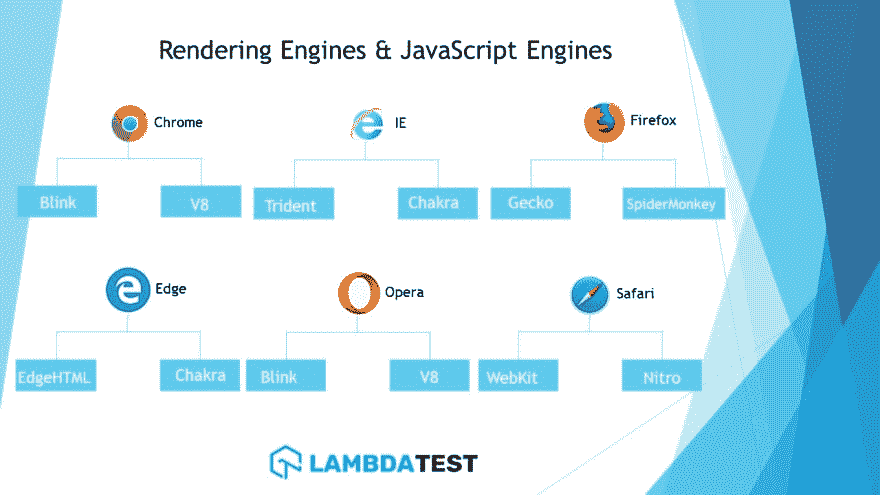
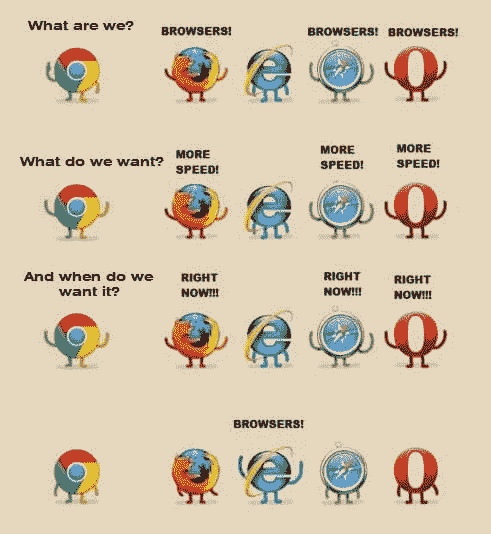
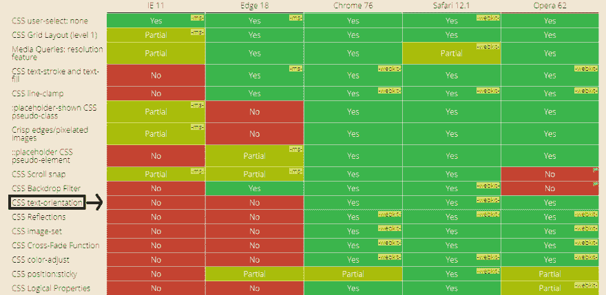

# 浏览器引擎:跨浏览器兼容性的关键

> 原文：<https://dev.to/aboywithscar/browser-engines-the-crux-of-cross-browser-compatibility-45n4>

所以你一直在进行跨浏览器测试，以帮助消除围绕[跨浏览器兼容性](https://www.lambdatest.com/feature?utm_source=dev&utm_medium=Blog&utm_campaign=Praveen-02092019&utm_term=Praveen)的任何差异，但是你有没有思考过它的原因？为什么你的网站从一个浏览器到另一个浏览器看起来不一样？这些浏览器不兼容问题的核心是什么？

我的朋友，答案是浏览器引擎。如果你是一名开发人员或网站测试人员，你可能对这个术语很熟悉。浏览器引擎解释网站的 HTML、CSS 和 JavaScript 代码，并呈现在观众面前。你能看到这篇文章是因为你的浏览器引擎。也就是说，它负责你的网站在互联网上的外观的整洁表现，这使得它成为一个非常重要的话题。

如果你意识到了这一点，那就值得快速回顾一下。如果没有，也不用担心！这篇文章将围绕浏览器引擎展开。你将了解浏览器引擎的历史以及它的重要性。我们还将看到今天可用的浏览器引擎和最有效的浏览器引擎主宰市场。我们还会谈到[跨浏览器测试](https://www.lambdatest.com/?utm_source=dev&utm_medium=Blog&utm_campaign=Praveen-02092019&utm_term=Praveen)对于不同浏览器引擎的作用。让我们立即开始对术语浏览器引擎有一个基本的了解。

## 什么是浏览器引擎？

浏览器引擎可以被认为是浏览器的心脏，它有助于在你点击你想访问的网址的 URL 后呈现网站的内容。它通过理解网页上的 HTML、CSS 和 JavaScript 来做到这一点。听起来很简单，不是吗？不尽然，因为浏览器引擎是为每一个浏览器而设计的。这就是为什么每个浏览器引擎都有自己解释网络的方式，导致了[跨浏览器兼容性问题](https://www.lambdatest.com/blog/fixing-javascript-cross-browser-compatibility-issues/?utm_source=dev&utm_medium=Blog&utm_campaign=Praveen-02092019&utm_term=Praveen)。

浏览器引擎由什么组成？

现在，浏览器引擎不应该被渲染引擎所混淆。浏览器引擎负责从 HTML 代码中看到的文本到该代码在浏览器上的图形表示的所有事情。在 Javascript 引擎和渲染引擎的帮助下，它能够完成自己的工作。也就是说，一个浏览器引擎由另外两个引擎组成:

1.  渲染引擎
2.  JavaScript 引擎

## JavaScript&渲染引擎是怎么进图的？

互联网第一次问世时，很少有人能接触到它。用户和开发者的数量都很少，开发的网站都是静态和简单的。它不像今天这样。没人知道网站的动态功能。实际上，他们怎么会有呢？Javascript 还没有诞生，当时也不需要。浏览器引擎的发明始于网景公司和微软公司开始相互竞争其浏览器的流行程度。

最初，为了与微软竞争，Netscape 开发人员在考虑用户体验的基础上决定实现一些功能，并最终确定了 Scheme 语言作为他们的语言类别。目标是修改编码体验，并为网站世界引入灵活性。请记住，那是互联网刚刚起步的时候，正如马云曾经说过的，当他向他的朋友介绍互联网时，加载一个页面需要 20 分钟。就在网景公司开始这个项目的时候，网景公司与太阳微系统公司合作，使用他们更静态的语言 Java，以及他们的 scheme 语言思想。这就诞生了 Javascript。

Javascript 为 web 开发人员在他们的网站上使用提供了无限的机会，因为它不仅仅是在 web 上设计样式或放置标签。这让浏览器引擎承担了巨大的责任，因为它不仅仅是将标签转换成视觉元素。它也必须在后端工作。浏览器引擎之前所做的工作被分为新的引擎，称为渲染引擎和 JavaScript 引擎。

从那时起，Javascript、网站和浏览器引擎都在飞速发展。这两个组件相互依赖，需要彼此工作。哪怕其中一个掉了，浏览器也会崩溃呈现一个网站。

## 它们有什么不同？渲染引擎和 JavaScript 引擎

早期的一切都是由浏览器引擎完成的，但现代网络继续以浏览器引擎独自处理变得很麻烦的速度发展。因此，它引入了两种类型的引擎 JavaScript 引擎和渲染引擎。让我们了解一下这些引擎如何对浏览器的整体渲染体验做出贡献。

### 1。渲染引擎

渲染引擎通常与浏览器引擎互换使用。它负责你的网站在观众屏幕上的布局。由于渲染引擎的原因，您可以阅读灰色字体。渲染引擎负责网站上使用的绘画和动画。它在屏幕上创造视觉效果，或者将像素精确地变亮，给人一种网站本来的感觉。因此，当我们说页面在屏幕上正确呈现时，我们实际上是在欣赏呈现引擎的能力。以下是各大网络浏览器厂商生产的渲染引擎列表。

1.  闪烁-用于谷歌浏览器和 Opera 浏览器。
2.  WebKit–用于 Safari 浏览器。
3.  gecko——用于 Mozilla Firefox 浏览器。
4.  trident–用于 Internet Explorer 浏览器。
5.  Edge html–用于 Edge 浏览器。
6.  presto-Opera 的传统渲染引擎。

### 2。JavaScript 引擎

JavaScript 引擎，顾名思义，在将网站呈现给观众之前，帮助解释网站的 JavaScript 代码。JavaScript 引擎的引入是为了充当解释器。然而，每一个现代的浏览器引擎都将它们作为编译器来使用，以更快的速度获得更好的性能。这里列出了主要 web 浏览器供应商生产的 JavaScript 引擎。

1.  V8–与闪烁一起使用
2.  nitro–与 Webkit 一起使用
3.  蜘蛛猴-与壁虎一起使用
4.  脉轮-与 Trident & EdgeHTML 一起使用

**注意:**渲染引擎和 JavaScript 引擎的主要区别在于对浏览器的依赖性。渲染引擎与浏览器引擎紧密耦合，另一方面，JavaScript 引擎甚至可以在没有浏览器的情况下工作。

主要的浏览器引擎包括苹果 Safari 中使用的 **WebKit** ，Mozilla Firefox 中使用的 **Gecko** ，Chrome、Opera 中使用的 **Blink** 。**微软 Edge 的 EdgeHTML** ，ie 浏览器的 **Trident** 。然而，微软 Edge 即将推出基于 Chromium 的版本。

这里有一张图片可以帮助您理解不同的渲染引擎对&适用于主流现代 web 浏览器的 JavaScript 引擎。你会发现左边是**渲染引擎，右边是& JavaScript 引擎。**

## 为什么要关心浏览器引擎？

浏览器引擎不仅仅是翻译文本并在渲染部分的帮助下在显示器上运行。让我们来看看浏览器引擎的特点:

**处理浏览器特性:**不同的浏览器包含不同的特性。这就是他们在用户心中创造空间的方式。对于一个非技术人员来说，这些特性吸引他安装并成为浏览器的忠实用户。有些浏览器以不同的方式显示弹出窗口和执行标签管理，有些包含一些吸引观众的功能。用户在浏览器中看到的功能由于浏览器引擎而工作。不管这个功能有多大或多小，如果它在你的浏览器中，它只能通过浏览器引擎工作。浏览器引擎具有启用这些功能的代码，使用户喜欢浏览器。

**渲染问题:**如果你已经建立了一个[跨浏览器测试环境](https://www.lambdatest.com/blog/here-is-how-you-setup-perfect-cross-browser-testing-environment/)，那么你就会理解不同浏览器由于与你的网站源代码不兼容而带来的复杂性。正如我之前所说的，浏览器引擎会以一种独特的方式呈现你的网站。如果您的代码与任何浏览器呈现引擎都不兼容，您可能会看到不同的呈现问题。你可以在网站的 CTA、注册表格、图片、排版等方面看到差异。

你的观众可能会使用不同的浏览器，因为我们并不是生活在一个所有用户都使用同一个浏览器访问互联网的理想世界里。这就是为什么，现在有必要在你的网站上进行跨浏览器测试，因为一些浏览器的功能可能无法在另一个上工作。我们确实意识到 Chrome 是最受欢迎的网络浏览器，但它不是唯一的。想知道基于不同地理位置的第二大首选浏览器吗？

浏览器的安全性:浏览器是用来在你的机器上访问互联网的东西。浏览器是将一个人暴露给整个世界的最常见的软件。由于这种通信包含您的个人信息(如您正在访问哪些网站)，这些软件需要得到保护。浏览器越安全，对用户越好。这个责任在浏览器引擎的肩上。浏览器引擎保护并执行一些操作，通过这些操作，用户和服务器之间的通信保持安全。浏览器引擎确保浏览器是安全的，因为最终浏览器的声誉取决于安全性。如果这个浏览器会泄露信息，谁会使用。除了通信部分，浏览器引擎还处理其他安全功能。

**速度:**速度是我们大多数人在选择浏览器时所期待的。如果我问一个人他最喜欢浏览器的哪些功能，其中一个会是速度。即使今天几乎所有的主流浏览器都呈现出相似的速度，用户仍然把它包括在他的收藏夹列表中。用专业术语来说，速度是指按下回车键后，你在浏览器上看到一个网站的速度。这意味着指令在浏览器中的执行速度有多快，这部分由浏览器引擎负责。浏览器引擎越好，浏览器的速度越快。速度也是导致 IE 的[死亡的因素之一。](https://www.lambdatest.com/blog/death-of-ie/)

[阅读更多:IE 之死；它对跨浏览器兼容性的影响](https://www.lambdatest.com/blog/death-of-ie/?utm_source=dev&utm_medium=Blog&utm_campaign=Praveen-02092019&utm_term=Praveen)

**超链接和网页形式:**超链接是嵌入到一个单词中的链接，按下它会将你重定向到另一个网站。web 表单是您通过互联网在网站上填写的表单。表单和超链接包含敏感信息，应该是安全的，以防止任何人的数据泄露。超链接和 web 表单完全由浏览器引擎处理。

**JS 引擎转换成 DOM:**Javascript 引擎执行并显示所有的 Javascript 代码。如果您已经用 JavaScript 编写了一个脚本，可以改变您点击的文本，那么这个功能将由 JavaScript 引擎来实现。但是，只有当 HTML 页面及其页面上的元素被转换为 DOM 时，JavaScript 才能工作。只有当 JavaScript 接收的结构是 DOM 时，它才能创造奇迹。DOM 或文档对象模型将由浏览器引擎在接收到页面的文本后进行设计。这是浏览器引擎负责的许多事情之一。

所以，你一定猜到了一个浏览器引擎有多重要。它是任何浏览器的核心。既然我们现在已经了解了什么是浏览器引擎，以及它对浏览器有多重要，那么首先有必要了解一下它是如何开始的。通过下一部分，我们将看到浏览器引擎的历史。

## 浏览器渲染引擎是如何工作的？

浏览器呈现引擎的主要功能是在交互式视图中可视化用户请求的内容。例如，如果用户请求 HTML 脚本内容，呈现引擎的工作就是解析 CSS 和 HTML。此后，内容在通过呈现引擎解析后显示。可缩放的基于维度的格式确保呈现的显示显著地恢复了从其原始形式解释的原始页面布局，同时允许在实时环境中缩放和平移 web 内容的特征。浏览器引擎促进了最终用户通过界面和渲染引擎的交互。它促进了用户界面和渲染引擎之间的高级接口。

网络层向浏览器呈现引擎提供用户请求的文档。然后，这种文档中可用的内容以每个 8 千字节大小的部分进行传输。按照这一顺序，进一步推进以下要点以完成如下所述的过程:

*   HTML 元素被解析，然后在内容树形成后被转换成 DOM 节点。在内部和外部 CSS 中样式化的数据也被解析，视觉信息的利用和样式化纵容了渲染树的形成。
*   用特定颜色排列的矩形在渲染树中可管理地排序。
*   在创建渲染树之后，遵循布局过程，其中节点由一组精确的坐标定义，这使得它们在用户屏幕上可视化。
*   考虑到“绘制”过程的最后阶段，渲染树的每个节点都是按照用户界面后端层中编写的代码来定义的。
*   浏览器引擎负责启动 URL 的加载，并考虑重新加载、后退和前进浏览动作的处理。
*   当用户应该在地址空间中插入一个 URL 时，UI 将该地址带到浏览器引擎，在那里从 URL 中搜索域名，并确认它在浏览器和操作系统缓存中的存在。如果在浏览器和操作系统缓存中都没有找到该域名，那么它会请求互联网服务提供商(ISP)从域名系统(DNS)中提取 IP 地址。因此，网站从浏览器接收检索其内容的请求。

## 市面上顶级的浏览器渲染引擎

一个概念或软件的知识是不完整的，直到你不知道用同样的技术开发的例子或产品。在本节中，我们将查看市场上的顶级浏览器引擎列表，以及使用这些浏览器引擎开发的浏览器。

### Webkit 浏览器渲染引擎(Safari)

Webkit 浏览器引擎用于开发苹果操作系统中使用的浏览器 Safari 和苹果在其应用程序中使用的其他浏览器。Webkit 是 1998 年推出的老浏览器引擎，至今仍是市场上顶尖的浏览器引擎之一。Webkit 是用 C++语言写的。2013 年，谷歌还宣布将在其浏览器引擎的未来版本中使用 Webkit 的一个组件 WebCore。

### 眨眼浏览器渲染引擎(谷歌 Chrome & Opera)

Blink 浏览器引擎用于谷歌 Chrome 和其他谷歌项目的开发。我们在上述 Webkit 浏览器引擎中提到的关于 WebCore 的组件与开发 Blink 时使用的组件相同。Blink 的开发得到了三星、谷歌、脸书、微软、Adobe 等各大巨头的巨大贡献。自 2013 年以来，Blink 仅用于 chrome，即从版本 28 开始。在 Blink 之前，谷歌使用 Webkit 开发 chrome。Blink 是用 C++语言写的。

### Gecko 浏览器渲染引擎(Mozilla Firefox)

Gecko 浏览器引擎是由 Mozilla 公司开发的，正如您所猜测的，它与其他项目一起用于 Firefox 浏览器。Gecko 于 1997 年在 Netscape 启动时是一个雄心勃勃的项目。这种需求来自于网站日益增加的复杂性和网景公司以前的慢速引擎。如果您正在开发一个需要显示网页的应用程序，Gecko 仍然是首选之一。Gecko 是用 C++和 JavaScript 开始的。自 2016 年以来，Rust 也被纳入了用于其开发的编程语言中。

### 三叉戟浏览器渲染引擎(Internet Explorer)

Trident 的发布是为了在微软的 Internet Explorer 中用作浏览器引擎。它是作为 Windows 应用程序中的一个基本软件组件开发的。除了 Internet Explorer，它还被用于网络浏览应用程序，如 Avant Browser、Maxathon，以及应用程序，如 AOL Instant Messenger、Google Talk、Valve Steam、Pandion 和许多其他应用程序。虽然，微软的一些产品不再使用 Trident 作为他们的浏览器引擎，这使得微软为这个 11 岁的软件开发了一个最先进的替代品。有传闻说三叉戟将被塔斯曼取代，但三叉戟仍然是微软在 Internet Explorer 8 Beta 中作为浏览器引擎的首选。

### EdgeHTML 浏览器渲染引擎(Edge)

众所周知，Edge 是微软推出的一款现代网络浏览器。很自然，它是从 Trident 派生出来的，正如我们现在所知，Trident 是 Internet Explorer 的渲染引擎。EdgeHTML 于 2014 年首次推出，用于 Windows 10。现在，微软正致力于推出基于 Chromium 的 Edge 浏览器。由于基于 Chromium，新的 Edge 浏览器将使用 Blink 引擎。这是否意味着我们可以告别 EdgeHTML ？

不，EdgeHTML 仍然可以用于使用 UWP API(通用 Windows 平台)开发的应用程序。

### Presto 浏览器渲染引擎(Opera 版本 7–15)

Presto 浏览器引擎如果你刚开始了解浏览器引擎，你是不会听说的。最近，当 Opera 浏览器开始使用 Blink 浏览器引擎并停止在 Presto 中开发时，Presto 已经成为历史的一部分。现在必须清楚的是，Presto 归 Opera 所有，用于 Opera 网络浏览器和 Opera 的其他应用。因为它是专门为 Opera 应用程序设计的，不像 Blink，Presto 不是开源的，是组织内部的。在 Opera 浏览器版本 7 到 15 中观察到了 Presto。从 2013 年开始，Blink 诞生后，就停止了使用 Presto 的开发。

还有很多像三叉戟一样已经成为历史的一部分，但是谈论它们是没有用的。几乎所有主流浏览器现在都采用了 Blink，并在浏览器和应用程序开发中使用它。现在，我们已经讨论了浏览器引擎的过去和现在，让我们看看浏览器引擎的未来。

## 浏览器引擎的未来

浏览器引擎已经走过了漫长的道路，老实说，并不是所有的引擎都能在这场战争中幸存下来。许多人死亡，许多人受伤。引发这场战争的浏览器引擎 Trident 如今已被弃用，但另一个 Gecko 仍在使用。

随着时间的推移，浏览器引擎已经减少，今天，几乎所有的主流浏览器都在为他们的浏览器技术开发 Blink，这让人们对[跨浏览器兼容性测试](https://www.lambdatest.com/feature?utm_source=dev&utm_medium=Blog&utm_campaign=Praveen-02092019&utm_term=Praveen)感到如释重负。你如何分析这种浏览器引擎较少的情况？有些人可能会说，最好只使用一个或两个浏览器引擎，这样浏览器就可以正确地呈现网站，只是功能有所不同。另一方面，有些人可能会认为越来越少的浏览器引擎会减少竞争，这将影响浏览器的整体创新和开发过程。

嗯，在某种程度上两者都是正确的，在这两者之间选择一条道路是非常困难的。壁虎还活着，火狐还在为它而战，这很好。Firefox 不仅保持了自己的地位，还在技术上与时俱进，并试图与使用 Blink 的浏览器相匹配。速度和执行在两种浏览器中都不明显，可以说 Firefox 并没有落后太多，它非常接近所有的浏览器。

从未来的角度来看，当所有的浏览器开发者都转向 Blink 时，很难说是否会出现另一个浏览器引擎。即便如此，它能否在市场上扬名也非常值得怀疑。现在，如果我们继续以 Blink 为焦点占据 Chromium 的主导地位，我们可以认为由于一个浏览器引擎和没有竞争，进展将会缓慢。我们也可以认为，既然这么多的公司和这么多的开发商都在为一个项目工作，那么它一定会取得空前的成功。会发生什么，只有时间会告诉我们。但是，就浏览器引擎的未来而言，Blink 无疑非常光明。当然，祝壁虎一切顺利！

## 为什么跨浏览器测试对于不同的浏览器引擎至关重要？

到目前为止，我们确信两件事。第一，每个浏览器都有一个独特的方式来呈现一个网站。第二，不是所有的网站访问者都使用同一个浏览器。这会给我们带来什么？

是的，你是对的。这给我们带来了跨浏览器兼容性问题。出现这些问题是由于每个浏览器的呈现过程存在差异。现在，您围绕 HTML、JavaScript 和 CSS 定义了许多属性，以便在您的受众面前呈现一个有吸引力的动态网站。不幸的是，有些 CSS 属性可能并不与每个浏览器引擎兼容。下图显示了主流网络浏览器(即 IE11、Chrome 76、Edge 18、Safari 12.1 和 Opera 62)的最新版本在浏览器兼容性方面的差异。

这个列表实际上非常广泛，你可以从[原始资料](https://caniuse.com/#compare=ie+11,edge+18,chrome+76,safari+12.1,opera+62&compare_cats=CSS,HTML5,JS,SVG)中找到。

在上图中，我突出显示了一个名为 CSS text-orientation 的属性，以帮助您浏览一个用例。

**用户故事:**克里斯有一个老年人护理网站，该网站遵循垂直文本方向的网页设计。现在，Chris 碰巧使用的是谷歌 Chrome 76 浏览器，他对自己整个网站的表现非常满意。然而，当从谷歌分析或任何其他网络检查员工具检查时，观众的人口统计数据显示，大多数访问者属于 40-60 岁的年龄组。可悲的是，他们坚持 IE11 或更老的版本。

现在，网站主页的内容使用 CSS 文本方向进行样式化，这在不同的浏览器之间是不兼容的(如上图所示)。在意识到跨浏览器兼容性问题之前，Chris 已经运营该网站一年了。他感到失望的是，他未能给所有从 IE 访问网站的人，甚至是使用 Edge 浏览器访问网站的年轻人群留下深刻印象，甚至没有向他们传达他网站的目的。

Chris 现在必须使用 LambdaTest 进行跨浏览器测试，这是一个基于云的跨浏览器测试工具，它在云上提供了 2000 多个真实的浏览器，以确保他的网站没有由于各种浏览器引擎之间的差异而导致的 UI 错误。一旦缺陷被识别出来，Chris 就通过回退来纠正它们，现在他很高兴他的网站能够为来自任何网络浏览器的所有年龄组的观众提供服务。

[**阅读更多:为什么垂直文本方向是跨浏览器兼容性的噩梦？**T3】](https://www.lambdatest.com/blog/why-developers-still-hate-vertical-text-orientation-in-css/?utm_source=dev&utm_medium=Blog&utm_campaign=Praveen-02092019&utm_term=Praveen)

我希望这能让你明白跨浏览器测试的任务有多重要。在上面的用例中，我们只考虑了一个不兼容的 CSS 属性。想想如果你的网站运行着大量相似的不兼容的网页元素会发生什么？

不要像克里斯那样迟到！现在就进行跨浏览器测试，确保你所有的观众都可以看到一个没有错误的网站。LambdaTest 为 2000+真实浏览器上的跨浏览器兼容性提供了基于云的测试体验。您可以使用在线 Selenium 网格执行手动和[自动跨浏览器测试](https://www.lambdatest.com/selenium-automation?utm_source=dev&utm_medium=Blog&utm_campaign=Praveen-02092019&utm_term=Praveen)。提供免费注册，并享受终身访问我们的平台。

