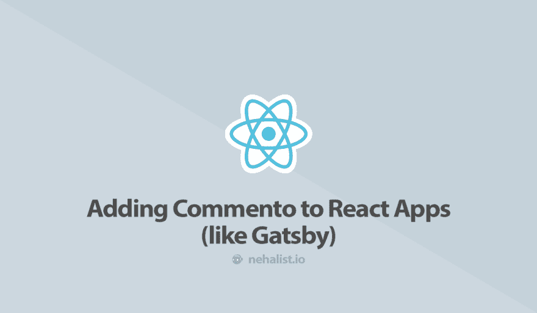

# 将 Commento 添加到 React 应用程序(如 Gatsby)

> 原文：<https://dev.to/nehalist/adding-commento-to-react-apps-like-gatsby-2g55>

[](https://res.cloudinary.com/practicaldev/image/fetch/s--9zlR4nkJ--/c_limit%2Cf_auto%2Cfl_progressive%2Cq_auto%2Cw_880/https://ghost.nehalist.io/conteimg/2019/09/commento-guide-1.png)

因为我最近用 Commento 替换了 [Disqus，所以我认为分享如何将一个不同的评论系统——在我们的例子中是 Commento——嵌入到你的 Gatsby 站点(或一般的 React 应用程序)是一个好主意。](https://nehalist.io/no-more-disqus-hello-commento)

## 零依赖组件

Disqus 有一个[官方包](https://github.com/disqus/disqus-react)用于将它嵌入到 React 应用程序中，我曾用它将 Disqus 添加到我的博客中。对于 Commento，我想摆脱额外的依赖；额外的依赖增加了维护，并且总是伴随着[一定的风险](https://blog.npmjs.org/post/180565383195/details-about-the-event-stream-incident)。这并不是说依赖开源是个坏主意——只是有时候给[加一个小东西](https://www.npmjs.com/package/isarray)的包只是过度夸张，不值这个价。

所以我自己实现了一个*非常*小的组件，负责用不到 40 行代码嵌入 Commento。

> 由于大多数评论系统都以同样的方式工作(通过在你的页面中嵌入一个简单的 JavaScript 文件)，这种方法应该适用于其他系统，比如 [Isso](https://posativ.org/isso/) 、 [Schnack](https://schnack.cool/) 、 [Remark42](https://remark42.com/) 等。也是(有小调整)。

这是一个功能组件，它利用`useEffect`钩子将 Commento 嵌入到想要的页面上。此外，它还使用了两个助手函数(借用了 [disqus-react](https://github.com/disqus/disqus-react/blob/master/src/utils.js#L3) )来添加和删除页面中的脚本。

整个实现相当简单:

```
import React, {useEffect} from 'react';

// Helper to add scripts to our page
const insertScript = (src, id, parentElement) => {
  const script = window.document.createElement('script');
  script.async = true;
  script.src = src;
  script.id = id;
  parentElement.appendChild(script);

  return script;
};

// Helper to remove scripts from our page
const removeScript = (id, parentElement) => {
  const script = window.document.getElementById(id);
  if (script) {
    parentElement.removeChild(script);
  }
};

// The actual component
const Commento = ({id}) => {
  useEffect(() => {
    // If there's no window there's nothing to do for us
    if (! window) {
      return;
    }
    const document = window.document;
    // In case our #commento container exists we can add our commento script
    if (document.getElementById('commento')) {
      insertScript(`<your commento url>/js/commento.js`, `commento-script`, document.body);
    }

    // Cleanup; remove the script from the page
    return () => removeScript(`commento-script`, document.body);
  }, [id]);

  return <div id={`commento`} />
};

export default Commento; 
```

不要忘记用正确的 URL 替换`your commento url`。

**搞定**。*那很容易*。

一旦找到相关联的容器(其 id 等于`commento`)Commento 脚本就会被添加到我们的页面中，并且一旦`id`属性(应该是文章或页面 id)发生变化就会被重新呈现(更多信息，请参见[通过跳过效果优化性能](https://reactjs.org/docs/hooks-effect.html#tip-optimizing-performance-by-skipping-effects))。

我们现在可以通过简单地将`<Commento id={uniquePostId} />`组件添加到我们想要添加评论的地方来为所有页面添加评论。

* * *

如果你喜欢这篇文章，请留下❤，在 Twitter 上关注我，订阅我的时事通讯。本帖原载于 2019 年 9 月 2 日 [nehalist.io](https://nehalist.io/adding-commento-to-react-apps-like-gatsby) 。