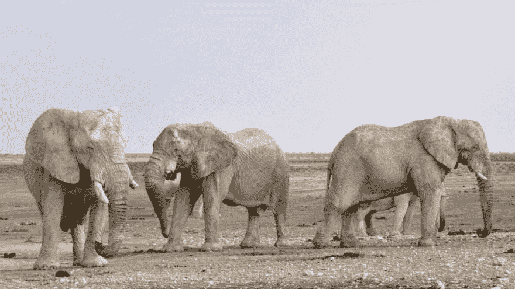
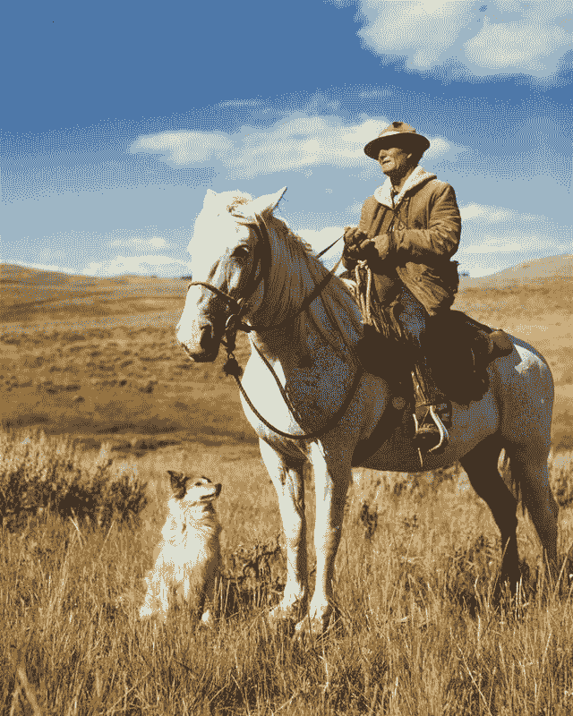
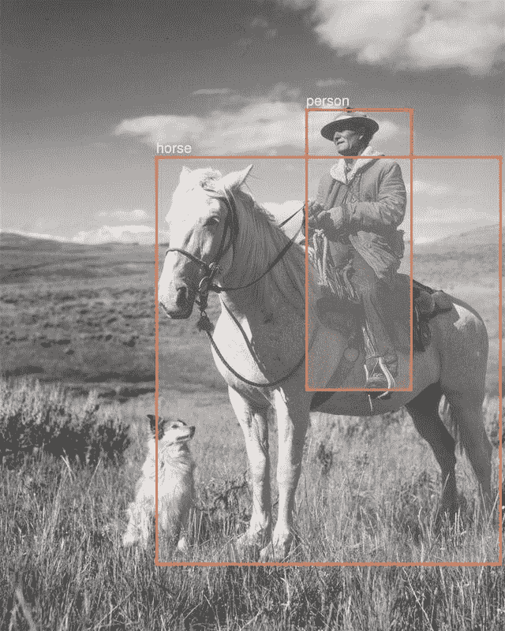
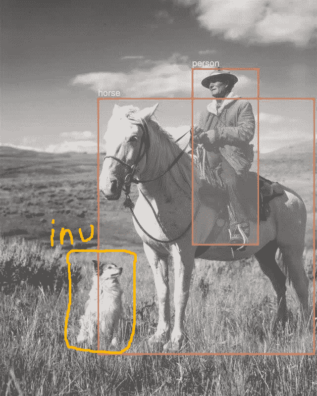
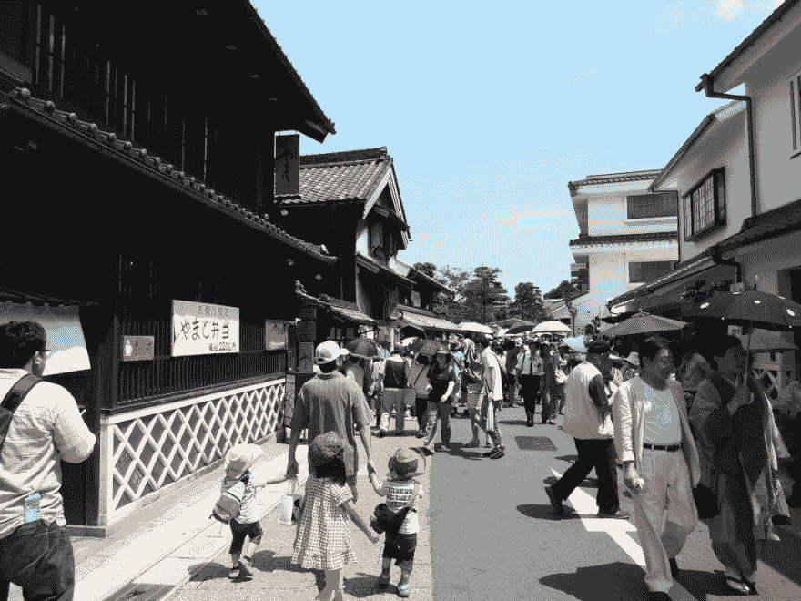
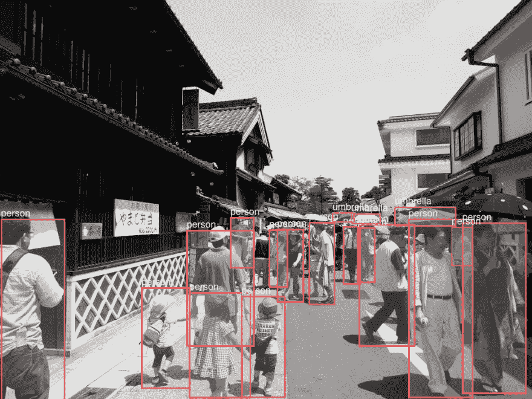

# 使用 ONNXRuntime 和 Ruby 进行 YOLO 对象检测

> 原文：<https://dev.to/kojix2/yolo-object-detection-using-onnxruntime-with-ruby-1ap0>

## ONNXRuntime

ML 模型的评分引擎。

*   微软公司（全球知名 PC 软件厂商）
    *   [https://github.com/microsoft/onnxruntime](https://github.com/microsoft/onnxruntime)
*   Andrew Kane 创建的 ONNXRuntime 的 Ruby 绑定
    *   [https://github.com/ankane/onnxruntime](https://github.com/ankane/onnxruntime)

## YOLOv3

*   ONNX 模型动物园
    *   [https://github . com/onnx/models/tree/master/vision/object _ detection _ segmentation/yolov 3](https://github.com/onnx/models/tree/master/vision/object_detection_segmentation/yolov3)
*   YOLOv3
    *   [https://pjreddie.com/darknet/yolo/](https://pjreddie.com/darknet/yolo/)

## 下载

```
# model
wget https://onnxzoo.blob.core.windows.net/models/opset_10/yolov3/yolov3.onnx
# coco-labels
wget https://raw.githubusercontent.com/amikelive/coco-labels/master/coco-labels-2014_2017.txt
# gems
gem instal numo-narray mini_magick 
```

Enter fullscreen mode Exit fullscreen mode

yolov3.rb

```
require 'mini_magick'
require 'numo/narray'
require 'onnxruntime'

SFloat = Numo::SFloat

input_path = ARGV[0]
output_path = ARGV[1]

model = OnnxRuntime::Model.new('yolov3.onnx')
labels = File.readlines('coco-labels-2014_2017.txt')

# preprocessing
img = MiniMagick::Image.open(input_path)
image_size = [[img.height, img.width]]
img.combine_options do |b|
  b.resize '416x416'
  b.gravity 'center'
  b.background 'transparent'
  b.extent '416x416'
end
img_data = SFloat.cast(img.get_pixels)
img_data /= 255.0
image_data = img_data.transpose(2, 0, 1)
                     .expand_dims(0)
                     .to_a # NArray -> Array

# inference
output = model.predict(input_1: image_data, image_shape: image_size)

# postprocessing
boxes, scores, indices = output.values
results = indices.map do |idx|
  { class: idx[1],
    score: scores[idx[0]][idx[1]][idx[2]],
    box: boxes[idx[0]][idx[2]] }
end

# visualization
img = MiniMagick::Image.open(input_path)
img.colorspace 'gray'
results.each do |r|
  hue = r[:class] * 100 / 80.0
  label = labels[r[:class]]
  score = r[:score]
  # draw box
  y1, x1, y2, x2 = r[:box].map(&:round)
  img.combine_options do |c|
    c.draw        "rectangle #{x1}, #{y1}, #{x2}, #{y2}"
    c.fill        "hsla(#{hue}%, 20%, 80%, 0.25)"
    c.stroke      "hsla(#{hue}%, 70%, 60%, 1.0)"
    c.strokewidth (score * 3).to_s
  end
  # draw text
  img.combine_options do |c|
    c.draw "text #{x1}, #{y1 - 5}  \"#{label}\""
    c.fill 'white'
    c.pointsize 18
  end
end

img.write output_path 
```

Enter fullscreen mode Exit fullscreen mode

## 运行

```
ruby yolov3.rb a.jpg b.jpg 
```

Enter fullscreen mode Exit fullscreen mode

大象。
[](https://res.cloudinary.com/practicaldev/image/fetch/s--6K7_0bkj--/c_limit%2Cf_auto%2Cfl_progressive%2Cq_auto%2Cw_880/https://thepracticaldev.s3.amazonaws.com/i/hjfco4tcztv67p1h8fz8.png) 
还好。简单。
[T8】](https://res.cloudinary.com/practicaldev/image/fetch/s--vPdliNNk--/c_limit%2Cf_auto%2Cfl_progressive%2Cq_auto%2Cw_880/https://thepracticaldev.s3.amazonaws.com/i/tysphvmk8v9r1fnu53rc.png)

人，马，狗。
[](https://res.cloudinary.com/practicaldev/image/fetch/s--Ube7_mHN--/c_limit%2Cf_auto%2Cfl_progressive%2Cq_auto%2Cw_880/https://thepracticaldev.s3.amazonaws.com/i/6ygeuvvsyl4pyl513iax.jpeg) 
[](https://res.cloudinary.com/practicaldev/image/fetch/s--lI91PbJY--/c_limit%2Cf_auto%2Cfl_progressive%2Cq_auto%2Cw_880/https://thepracticaldev.s3.amazonaws.com/i/xzbmmncjnlft8uvug5f1.jpeg)

一只狗在哪里？很遗憾，我的电脑不能识别这只狗。

[](https://res.cloudinary.com/practicaldev/image/fetch/s--DEpyElsH--/c_limit%2Cf_auto%2Cfl_progressive%2Cq_auto%2Cw_880/https://thepracticaldev.s3.amazonaws.com/i/grqkuedodjtlkc6n99h1.png)

现在是人类做点什么的时候了。

[](https://res.cloudinary.com/practicaldev/image/fetch/s--X1e4lTHY--/c_limit%2Cf_auto%2Cfl_progressive%2Cq_auto%2Cw_880/https://thepracticaldev.s3.amazonaws.com/i/fqk0nsuvu8swff9x69hq.jpeg)

就是这样！
( *inu* 在人类语言的日语方言中是狗的意思。)

即使在 AI 时代，我也不想失去人类的心智。

## 图像

*   [https://www.pexels.com/](https://www.pexels.com/)
*   [https://commons . wikimedia . org/wiki/file:ari 松下 bori。JPG](https://commons.wikimedia.org/wiki/File:Arimatsushibori.JPG)  

感谢您的阅读。祝你有愉快的一天！