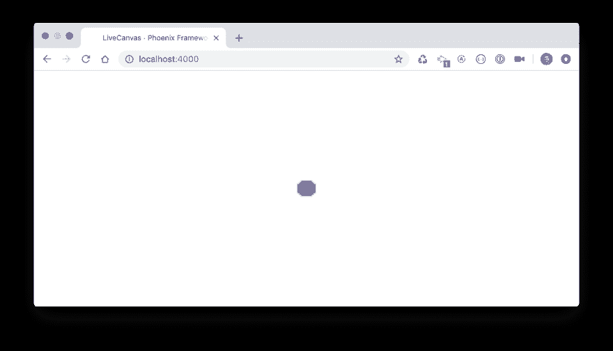
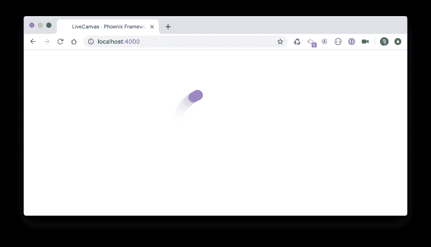
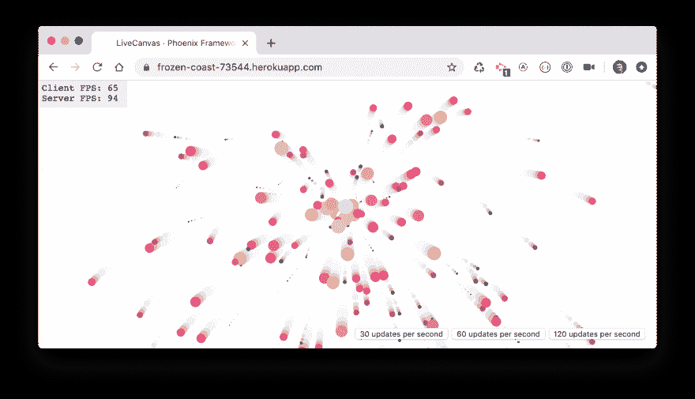

# 用 Phoenix LiveView 制作画布动画

> 原文：<https://dev.to/petecorey/animating-a-canvas-with-phoenix-liveview-1m8i>

凤凰城 LiveView 最近发布了一个名为“钩子”的新功能，将 [Javascript 互操作性引入 LiveView 生命周期](https://hexdocs.pm/phoenix_live_view/Phoenix.LiveView.html#module-js-interop-and-client-controlled-dom)。简而言之，我们现在可以在每次 LiveView 更改 DOM 节点时运行任意 Javascript 了！ **LiveView hooks 是一个完全的游戏改变者**，它打开了一个全新的应用世界的大门，这个世界可以用这种令人惊叹的技术来构建。

作为概念验证，让我们使用服务器提供的数据，使用 LiveView 钩子来实时制作 HTML5 画布的动画！

## 开始设置

为了使本文简短，我们将跳过配置您的应用程序以使用 LiveView 的繁琐过程。如果你在这一步需要帮助，我强烈推荐你[看看 Sophie DeBenedetto 的完整演练](https://elixirschool.com/blog/phoenix-live-view/)。一定要交叉参考[的官方文件](https://hexdocs.pm/phoenix_live_view/Phoenix.LiveView.html)，因为在 LiveView 世界里事情发展得很快。

接下来，让我们假设您有一个附加到某条路线的基本 LiveView 组件，如下所示:

```
defmodule LiveCanvasWeb.PageLive do
  use Phoenix.LiveView

  def render(assigns) do
    ~L"""
    <canvas>
      Canvas is not supported!
    </canvas>
    """
  end

  def mount(_session, socket) do
    {:ok, socket}
  end
end 
```

我们还假设您的`assets/js/app.js`文件正在创建一个 LiveView 连接:

```
import LiveSocket from "phoenix_live_view";

let liveSocket = new LiveSocket("/live");

liveSocket.connect(); 
```

既然我们意见一致，那就开始吧！

## 生成数据动画

在我们开始在客户端制作动画之前，我们应该有一些数据来制作动画。我们将首先在我们的 LiveView 进程'`assigns` :
中存储一个名为`i`的数值

```
def mount(_session, socket) do
  {:ok, assign(socket, :i, 0)}
end 
```

接下来，我们将通过指示我们的 LiveView 进程在`16`毫秒:
的延迟之后向自身发送一条`:update`消息来增加`i`

```
def mount(_session, socket) do
  Process.send_after(self(), :update, 16)
  {:ok, assign(socket, :i, 0)}
end 
```

当我们在流程中处理`:udpate`消息时，我们将调度另一个对`:update`的递归调用，并增加套接字`assigns` :
中`i`的值

```
def handle_info(:update, %{assigns: %{i: i}} = socket) do
  Process.send_after(self(), :update, 16)
  {:noreply, assign(socket, :i, i + 0.05)}
end 
```

我们的 LiveView 进程现在有一个以大约每秒六十次的速度缓慢增加的`0.05`值。

现在我们已经有了一些动画数据，让我们添加一个`canvas`到我们的 LiveView 模板来保存我们的动画:

```
def render(assigns) do
  ~L"""
  <canvas data-i="<%= @i %>">
    Canvas is not supported!
  </canvas>
  """
end 
```

注意，我们将`i`的值与画布相关联，方法是将它赋给 DOM 元素上的一个数据属性。每次`i`改变我们的进程状态，LiveView 都会更新我们的`canvas`，并将`data-i`的值设置为`i`的新值。

这很好，但是为了在我们的`canvas`中呈现动画，我们需要在每次我们的`canvas`更新时执行客户端 Javascript 的某种方式。谢天谢地，LiveView 的新钩子功能让我们做到了这一点！

## 挂接 LiveView

LiveView hooks 允许我们在 DOM 节点生命周期的不同点执行 Javascript [，比如节点第一次`mounted`的时候，节点被 live view`updated`的时候，节点被`destroyed`并从 DOM 中移除的时候，以及节点成为凤凰服务器的`disconnected`或`reconnected`的时候。](https://hexdocs.pm/phoenix_live_view/Phoenix.LiveView.html#module-js-interop-and-client-controlled-dom)

为了挂钩到 LiveView 的客户端生命周期，我们需要创建一组`hooks`并将它们传递给我们的`LiveSocket`构造函数。让我们创建一个钩子，它在元素挂载时初始化我们的`canvas`渲染上下文，并在元素每次更新时渲染一个静态的圆圈:

```
let hooks = {
  canvas: {
    mounted() {
      let canvas = this.el;
      let context = canvas.getContext("2d");

      Object.assign(this, { canvas, context });
    },
    updated() {
      let { canvas, context } = this;

      let halfHeight = canvas.height / 2;
      let halfWidth = canvas.width / 2;
      let smallerHalf = Math.min(halfHeight, halfWidth);

      context.clearRect(0, 0, canvas.width, canvas.height);
      context.fillStyle = "rgba(128, 0, 255, 1)";
      context.beginPath();
      context.arc(
        halfWidth,
        halfHeight,
        smallerHalf / 16,
        0,
        2 * Math.PI
      );
      context.fill();
    }
  }
};

let liveSocket = new LiveSocket("/live", { hooks });

liveSocket.connect(); 
```

注意，我们在`this`上存储了对我们的`canvas`和我们新创建的渲染`context`的引用。当 LiveView 调用我们的生命周期回调时， [`this`指向一个`ViewHook`类](https://github.com/phoenixframework/phoenix_live_view/blob/140cfb3f2924cb6595b9bb2979a1963ac0de6eb8/assets/js/phoenix_live_view.js#L904-L906)的实例。一个`ViewHook`实例包含对我们提供的生命周期方法的引用，一个对`el`、[中当前 DOM 节点的引用，以及与当前钩子集](https://github.com/phoenixframework/phoenix_live_view/blob/140cfb3f2924cb6595b9bb2979a1963ac0de6eb8/assets/js/phoenix_live_view.js#L1100-L1104)相关的各种其他数据。只要我们小心，不覆盖这些字段，我们就可以安全地将自己的数据存储在`this`中。

接下来，我们需要指示 LiveView 将这组新的`canvas`挂钩附加到我们的`canvas` DOM 元素上。我们可以用`phx-hook`属性:
来实现

```
<canvas
  data-i="<%= @i %>"
  phx-hook="canvas"
>
  Canvas is not supported!
</canvas> 
```

当我们的页面重新加载时，我们应该会看到我们的圆形在画布的中心被渲染得非常漂亮。

## 调整画布大小

在某些显示器上，我们的光荣圈可能会显得模糊或扭曲。这可以通过缩放画布以匹配显示器的像素密度来解决。当我们这样做的时候，我们可能想要调整画布的大小来填充整个可用的窗口空间。

[](https://res.cloudinary.com/practicaldev/image/fetch/s--zAnh2OwT--/c_limit%2Cf_auto%2Cfl_progressive%2Cq_auto%2Cw_880/http://www.petecorey.com/img/2019-09-02-animating-a-canvas-with-phoenix-liveview/blurry.png)

我们可以在我们的`mounted`回调:
中完成这两个任务

```
mounted() {
  let canvas = this.el;
  let context = canvas.getContext("2d");
  let ratio = getPixelRatio(context);

  resize(canvas, ratio);

  Object.assign(this, { canvas, context });
} 
```

其中`getPixelRatio`是一个助手函数，它决定当前设备屏幕上的物理像素与“CSS 像素”的比率，这些像素在我们的`canvas` :
的渲染上下文中使用

```
const getPixelRatio = context => {
  var backingStore =
    context.backingStorePixelRatio ||
    context.webkitBackingStorePixelRatio ||
    context.mozBackingStorePixelRatio ||
    context.msBackingStorePixelRatio ||
    context.oBackingStorePixelRatio ||
    context.backingStorePixelRatio ||
    1;

  return (window.devicePixelRatio || 1) / backingStore;
}; 
```

`resize`是一个帮助函数，它修改`canvas`的宽度和高度属性，以调整我们的画布大小来适应当前窗口，同时修复我们可能遇到的任何像素密度问题:

```
const resize = (canvas, ratio) => {
  canvas.width = window.innerWidth * ratio;
  canvas.height = window.innerHeight * ratio;
  canvas.style.width = `${window.innerWidth}px`;
  canvas.style.height = `${window.innerHeight}px`;
}; 
```

不幸的是，我们的`canvas`似乎无法抓住这些变化。对我们的`updated`回调的后续调用似乎会丢失我们的`resize`更改，画布恢复到原来模糊的样子。这是因为当 LiveView 更新我们的`canvas` DOM 节点时，它会重置我们的`width`和`height`属性。这不仅恢复了我们的像素密度修复，还强制清除了画布的渲染上下文。

LiveView 有一个快速解决这个问题的方法。通过在我们的`canvas`元素上设置`phx-update`到`"ignore"`,我们可以指示 LiveView 在我们的`canvas`元素初始挂载后不去管它。

```
<canvas
  data-i="<%= @i %>"
  phx-hook="canvas" 
  phx-update="ignore"
>
  Canvas is not supported!
</canvas> 
```

现在，我们的圆应该清晰地呈现在屏幕中央。

[](https://res.cloudinary.com/practicaldev/image/fetch/s--iHiJOFEo--/c_limit%2Cf_auto%2Cfl_progressive%2Cq_auto%2Cw_880/http://www.petecorey.com/img/2019-09-02-animating-a-canvas-with-phoenix-liveview/crisp.png)

## 制作我们的圆形动画

我们并不是为了在我们的`canvas`中渲染一个静态的圆。让我们根据服务器提供的不断变化的`i`值，将所有东西连接在一起，并为我们的圆制作动画！

我们需要做的第一件事是更新我们的`updated`回调以获取`data-i`属性的当前值:

```
let i = JSON.parse(canvas.dataset.i); 
```

`canvas.dataset.i`的值将反映我们的`data-i`属性的内容。所有的数据属性都存储为字符串，所以对`JSON.parse`的调用会将`"0.05"`的值转换为对应的数值。

接下来，我们可以更新渲染代码，根据`i` :
的值移动我们的圆

```
context.arc(
  halfWidth + (Math.cos(i) * smallerHalf) / 2,
  halfHeight + (Math.sin(i) * smallerHalf) / 2,
  smallerHalf / 16,
  0,
  2 * Math.PI
); 
```

就是这样！有了这两个变化，我们的圆圈将完全基于服务器提供的实时数据围绕画布中心旋转！

[](https://res.cloudinary.com/practicaldev/image/fetch/s--QaRMi2Pr--/c_limit%2Cf_auto%2Cfl_progressive%2Cq_auto%2Cw_880/http://www.petecorey.com/img/2019-09-02-animating-a-canvas-with-phoenix-liveview/spinning.png)

## 请求动画帧

我们的解决方案是可行的，但是通过强制在浏览器上重新渲染，我们成了不良网民。我们的客户端可能会在标签不在焦点上时强制重新呈现，或者每秒钟重新呈现超过 60 次，浪费 CPU 周期。

我们不应该告诉浏览器在每次 LiveView 更新时重新渲染我们的`canvas`,而是应该颠倒我们对渲染的控制，并在每次更新时从浏览器请求一个动画帧。

```
 <p>I find myself producing lots of ranging content from books and articles, like the one you're reading now, to open source software projects. If you like what I'm doing, <strong>nothing shows your support more than signing up for <a href="#newsletter">my mailing list</a></strong>.</p> 
```

这个过程很简单。在我们的`updated`回调中，我们将把我们的渲染代码包装在传递给`requestAnimationFrame`的 lambda 中。我们将把产生的请求引用保存到`this.animationFrameRequest` :

```
this.animationFrameRequest = requestAnimationFrame(() => {
  context.clearRect(0, 0, canvas.width, canvas.height);
  context.beginPath();
  context.arc(
    halfWidth + (Math.cos(i) * smallerHalf) / 2,
    halfHeight + (Math.sin(i) * smallerHalf) / 2,
    smallerHalf / 16,
    0,
    2 * Math.PI
  );
  context.fill();
}); 
```

可以想象，在我们的浏览器准备好重新呈现我们的`canvas`之前，我们的 LiveView 组件可能会更新多次。在这些情况下，我们需要取消任何先前请求的动画帧，并重新请求一个新的帧。我们可以通过在我们对`requestAnimationFrame` :
的调用上方放置一个守卫来做到这一点

```
if (this.animationFrameRequest) {
  cancelAnimationFrame(this.animationFrameRequest);
} 
```

有了这两个变化，我们的 LiveView 挂钩现在可以礼貌地从浏览器请求动画帧，从而为所有相关人员带来更流畅的体验。

## 更进一步

使用画布来制作由服务器上运行的 LiveView 进程实时更新的数值动画，展示了 LiveView 钩子的巨大潜在能力，但这并不值得关注。

我们可以通过在服务器上生成更大的数据集并制作动画来更进一步。[看看这个示例项目](https://frozen-coast-73544.herokuapp.com/)，它模拟了 200 多个简单粒子，并以大约每秒 60 帧的速度在客户端上渲染它们:

[](https://res.cloudinary.com/practicaldev/image/fetch/s--DRVmN8tM--/c_limit%2Cf_auto%2Cfl_progressive%2Cq_auto%2Cw_880/http://www.petecorey.com/img/2019-09-02-animating-a-canvas-with-phoenix-liveview/particles.png)

如果你的目标是在客户端制作一堆粒子的动画，那么采用这种方法是不是一个好主意？大概不会。live view 给了我们这样做的工具，是不是很神奇？**绝对的，是的！**请务必[在 Github](https://github.com/pcorey/live_canvas) 上查看该示例的完整源代码！

Hooks 为基于 LiveView 的应用程序打开了一扇新的可能性之门。我希望这个演示已经让你尝到了这些可能性，我希望你和我一样渴望探索我们可以用 LiveView 做些什么。