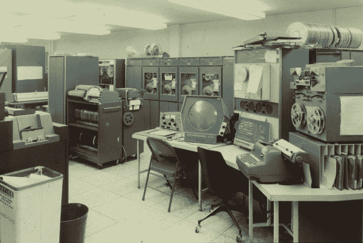
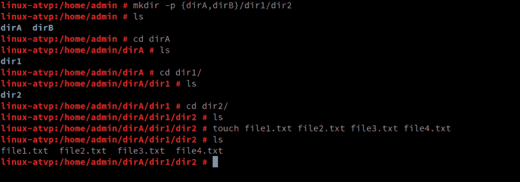
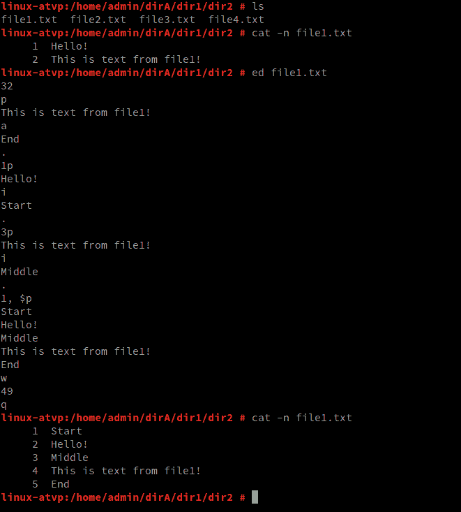
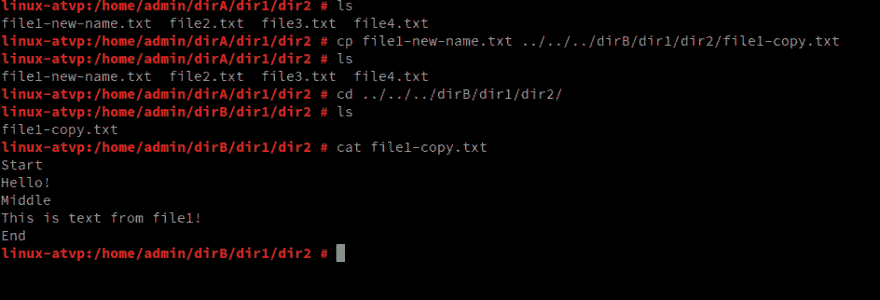
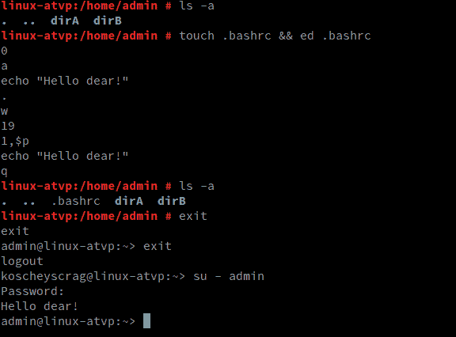
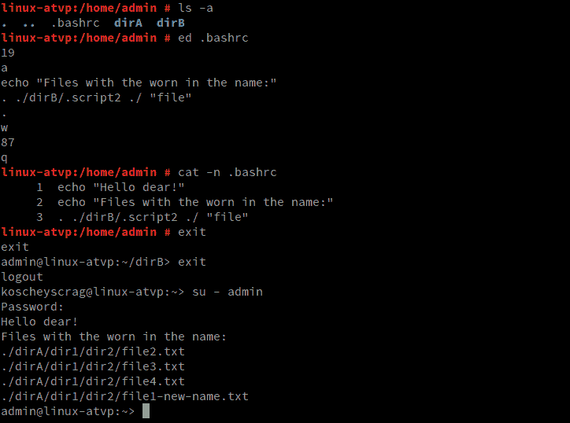

# 回到 1969 年或介绍教育-老派文本编辑器

> 原文：<https://dev.to/andreisfedotov/back-to-1969-or-introduction-to-ed-old-school-text-editor-ffo>

**1969 年**
1969 年发生的重大新闻故事包括甲壳虫乐队最后一次公开演出，在苹果唱片公司的屋顶上，协和式飞机在法国首次试飞，波音 747 大型喷气式飞机首次亮相，庞蒂亚克火鸟 Trans Am 美国肌肉车的缩影推出，伍德斯托克吸引了 35 万多摇滚歌迷，查尔斯·曼森领导的邪教成员谋杀 5 人，查帕奎迪克事件参议员爱德华·肯尼迪，PBS 成立， 美国阿波罗 11 号是第一个登上月球的人，尼尔·阿姆斯特朗和埃德温·巴兹·奥尔德林成为第一个登上月球的人。
但是还有一件事...令人敬畏的字符串文本编辑器:编辑。让我们沉浸在 60 年代末的氛围中，触摸历史。

**历史**
早在 1969 年，第一个汇编语言版本的 [ed](http://www.gnu.org/software/ed/ed.html) 就问世了。虽然后来用 [C](https://en.wikipedia.org/wiki/C_(programming_language)) 重写了，但是编辑器基本上还是那个时候使用的程序。正如 [Kernighan](https://en.wikipedia.org/wiki/Brian_Kernighan) 和 [Plauger](https://en.wikipedia.org/wiki/P._J._Plauger) 在 1976 年所写的，这里呈现的编辑器的最早可追溯版本是 [TECO](https://en.wikipedia.org/wiki/TECO_(text_editor)) ，为麻省理工学院的第一个 [PDP-1](https://history-computer.com/ModernComputer/Electronic/PDP-1.html) 分时系统而写。

PDP-1:
[](https://res.cloudinary.com/practicaldev/image/fetch/s--vsH60ruw--/c_limit%2Cf_auto%2Cfl_progressive%2Cq_auto%2Cw_880/https://thepracticaldev.s3.amazonaws.com/i/ra4ogyb5vnl5x8b1bkr2.jpg)

随后由 [L. P .多伊奇](https://en.wikipedia.org/wiki/L._Peter_Deutsch)和 [B. W .兰普森](https://en.wikipedia.org/wiki/Butler_Lampson)在 [SDS-940](https://en.wikipedia.org/wiki/SDS_940) 上实现为“快速编辑器” [QED](https://www.bell-labs.com/usr/dmr/www/qed.html) 。

SDS-940:
[T3】](https://res.cloudinary.com/practicaldev/image/fetch/s--lgacKaMX--/c_limit%2Cf_auto%2Cfl_progressive%2Cq_auto%2Cw_880/https://thepracticaldev.s3.amazonaws.com/i/pr1o6vyacuuxipjq3eb4.jpg)

K. L. Thompson 在 [MIT](https://en.wikipedia.org/wiki/Massachusetts_Institute_of_Technology) 为 [IBM 7090](https://en.wikipedia.org/wiki/IBM_7090) 上的 [CTSS](https://en.wikipedia.org/wiki/Compatible_Time-Sharing_System) 改编了 QED。

IBM 7090:
[T3】](https://res.cloudinary.com/practicaldev/image/fetch/s--QAjpfErd--/c_limit%2Cf_auto%2Cfl_progressive%2Cq_auto%2Cw_880/https://thepracticaldev.s3.amazonaws.com/i/7obw9gg0jgzw6y7ygicb.jpg)

后来 D. M .里奇在[贝尔实验室](https://en.wikipedia.org/wiki/Bell_Labs)为 [GE-635](http://www.computinghistory.org.uk/det/15671/GE-635-System-Manual/) 写了一个版本。最新版本是 ed，是 PDP-11 QED 的简化形式，由 Ritchie 和 Thompson 编写。

PDP-11:
[](https://res.cloudinary.com/practicaldev/image/fetch/s--FZRzi90s--/c_limit%2Cf_auto%2Cfl_progressive%2Cq_auto%2Cw_880/https://thepracticaldev.s3.amazonaws.com/i/tfloo7ansx85hhlc0e0i.jpg)

这并不是说 ed 和一些 DEC 电脑上的 TECO 是一样的。首先，TECO 是以人物为导向的，而艾德是以台词为导向的。这似乎是一个“共同祖先”的例子。在 20 世纪 70 年代，编辑经历了无数次修改。几乎每所大学都有自己修改过的 ed 和 qed 版本；有些有几个修改版本。贝尔实验室的杰伊·米林(用 IBM 汇编语言)为 IBM 的大型机 [TSO](https://en.wikipedia.org/wiki/Time_Sharing_Option) 写了一个 QED 这是在 70 年代中期发布给各大学的。
当然，埃德会访问伯克利，在那里，变异成 [ex](https://en.wikipedia.org/wiki/Ex_(text_editor)) 和 [vi](https://en.wikipedia.org/wiki/Vi) 。
来尝尝吧。在我们今天的旅程中，我们将考虑使用 Ed 的简单操作，之后我们将开发执行以下操作的脚本:显示给定目录的“子”文件列表，这些文件的名称中具有给定的字符集，并销毁给定目录的所有其他文件。最后，我们将创建一个初始化脚本，在登录后向用户问好，并运行另一个脚本来搜索文件。

**Ed**的简单操作
让我们为我们的实验创建两个三级目录。
`mkdir -p {dirA,dirB}/dir1/dir2`
现在我们有如下结构(可以借助[树](https://www.ostechnix.com/view-directory-tree-structure-linux/)命令输出到控制台):

```
.
├── dirA
│   └── dir1
│       └── dir2
└── dirB
    └── dir1
        └── dir2 
```

<svg width="20px" height="20px" viewBox="0 0 24 24" class="highlight-action crayons-icon highlight-action--fullscreen-on"><title>Enter fullscreen mode</title></svg> <svg width="20px" height="20px" viewBox="0 0 24 24" class="highlight-action crayons-icon highlight-action--fullscreen-off"><title>Exit fullscreen mode</title></svg>

在其中一个目录中创建四个文本文件。
 `cd dirA
cd dir1
cd dir2
touch file1.txt file2.txt file3.txt file4.txt` 

[](https://res.cloudinary.com/practicaldev/image/fetch/s--zYiBap12--/c_limit%2Cf_auto%2Cfl_progressive%2Cq_auto%2Cw_880/https://thepracticaldev.s3.amazonaws.com/i/hvqzzmrs52iwwnhp3fch.png)

**用 ed 将文本添加到文件中。**
让我们用 ed 编辑文件。以文件名作为参数启动它:
`ed file1.txt`
如果文件不存在，ed 会创建一个新文件。如果它已经存在，那么 ed 告诉我们文件的长度。在我们的例子中，长度为零。为了给文件添加文本，我们必须通过“a”命令切换到添加模式。
它将文本追加到缓冲区中被寻址的行之后。当前地址设置为输入的最后一行。
地址代表缓冲区中一行的编号。ed 维护当前地址，当没有指定地址时，该地址通常作为默认地址提供给命令。第一次读取文件时，当前地址被设置为文件的最后一行。通常，当前地址被设置为受命令影响的最后一行。
那么，让我们切换到添加模式:
`a`
并键入一些字:
`Hello!`
`This is text form file1!`
从添加模式中退出键入新行:
`.`
写修改类型:
`w`
它打印新大小的文件。为了从 ed 中退出:
`q`

[](https://res.cloudinary.com/practicaldev/image/fetch/s--Q19t529W--/c_limit%2Cf_auto%2Cfl_progressive%2Cq_auto%2Cw_880/https://thepracticaldev.s3.amazonaws.com/i/otxoyl1t4fvtblvcyo1h.png)

**在文件的开头、中间和结尾添加文本。**
让我们稍微复杂一点，在文件的开头、中间和结尾添加文本。
再次打开文件。让我们通过“p”命令来打印被寻址的行。它打印出‘这是来自文件 1 的文本！’。现在很容易将文本添加到文件的末尾。只需通过“a”命令切换到添加模式，并打印“End”即可。
搞定！现在通过打印“.”退出添加模式。打印文档类型“1p”的第一行。它还将当前地址设置为第一行的编号。现在我们可以打印‘I’命令来切换到‘插入模式’。这个神奇的命令在当前行之前插入文本，当前地址被设置为输入的最后一行。所以，切换到插入模式后，让我们键入‘Start’。然后，在新的一行键入“.”退出插入模式。让我们将当前地址设置为第 3 行。为此，只需键入“3p”。现在我们可以再次切换到插入模式，并在文档中间添加文本。
为了从文件中打印整个文本，键入以下内容:
`1, $p`
进一步保存文件并退出编辑。下图显示了一步一步的方法。

[](https://res.cloudinary.com/practicaldev/image/fetch/s--aHF8yck0--/c_limit%2Cf_auto%2Cfl_progressive%2Cq_auto%2Cw_880/https://thepracticaldev.s3.amazonaws.com/i/ilerllq86sgaucfkj2bt.png)

让我们借助“cp”命令复制文件。

[](https://res.cloudinary.com/practicaldev/image/fetch/s--_4Cw5ICC--/c_limit%2Cf_auto%2Cfl_progressive%2Cq_auto%2Cw_880/https://thepracticaldev.s3.amazonaws.com/i/9hshjjjzsrpe8301xdwz.png)

**超级查找器脚本**
让我们把这个挑战变得更复杂，开发搜索文件的脚本，这些文件位于当前目录的所有子目录中，它们的名称中有一个给定的字符集。然后显示这些文件并销毁给定目录中的所有其他文件。这个脚本会用两个参数放屁。第一个参数是目录名，第二个是符号集(掩码)。为了测试，让我们在目录中创建文件。

[](https://res.cloudinary.com/practicaldev/image/fetch/s--JqrYxSdl--/c_limit%2Cf_auto%2Cfl_progressive%2Cq_auto%2Cw_880/https://thepracticaldev.s3.amazonaws.com/i/5bpfu9b5iow6q48ndlyg.png)

运行要执行的脚本。检查目录的内容后。

[](https://res.cloudinary.com/practicaldev/image/fetch/s--5iJVrzZu--/c_limit%2Cf_auto%2Cfl_progressive%2Cq_auto%2Cw_880/https://thepracticaldev.s3.amazonaws.com/i/ex1aj51l33ndz2duczul.png)

**初始化脚本**
让我们开发我们的初始化脚本，它通过重写 shell 邀请来打招呼。
创建文件”。bashsrc”并在 ED 编辑器中编辑它。

[](https://res.cloudinary.com/practicaldev/image/fetch/s--cnnzib9Z--/c_limit%2Cf_auto%2Cfl_progressive%2Cq_auto%2Cw_880/https://thepracticaldev.s3.amazonaws.com/i/jc1vpa30atmkg0pubxvh.png)

为了检查，请注销并重新登录系统。

[](https://res.cloudinary.com/practicaldev/image/fetch/s--d3l9gLwn--/c_limit%2Cf_auto%2Cfl_progressive%2Cq_auto%2Cw_880/https://thepracticaldev.s3.amazonaws.com/i/t6noe2er3ql1uxgjkjpl.png)

让我们完善我们的脚本，使它也运行前面创建的嵌套脚本，并将目录名和部分文件名作为参数传递给它。检查他的工作。

[](https://res.cloudinary.com/practicaldev/image/fetch/s--PU1Gb8sL--/c_limit%2Cf_auto%2Cfl_progressive%2Cq_auto%2Cw_880/https://thepracticaldev.s3.amazonaws.com/i/kfoe92kvbqcloa3mjr49.png)

于是，我们一头扎进了 60 年代的氛围中，我希望这很有趣。就是这样。谢谢大家！
**干杯！**