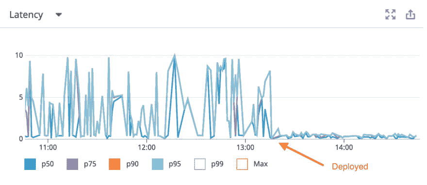
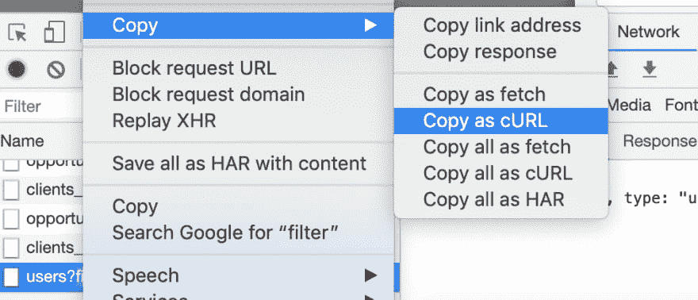

# 调查有问题的 Rails API 端点的性能

> 原文：<https://dev.to/mculp/investigating-the-performance-of-a-problematic-rails-api-endpoint-3a65>

最近我注意到，我们的一个 API 端点占用了大量资源，每个请求需要 3 秒钟才能完成。我能够将平均内存使用量从 85mb 减少到 7mb，并将平均请求持续时间从 3000 毫秒减少到 150 毫秒。我将在这篇文章中详细介绍这个过程。

[](https://res.cloudinary.com/practicaldev/image/fetch/s--XqXldkz7--/c_limit%2Cf_auto%2Cfl_progressive%2Cq_auto%2Cw_880/https://thepracticaldev.s3.amazonaws.com/i/s696d3znldxme6fcb241.png)

让我们从安装我们将要使用的工具开始。

# 设置子弹

[bullet](https://github.com/flyerhzm/bullet) 是一块宝石，可以帮助您识别和纠正 N+1 个查询。

我们将把它添加到我们的 Gemfile:

```
group :development do
  gem 'bullet'
end 
```

<svg width="20px" height="20px" viewBox="0 0 24 24" class="highlight-action crayons-icon highlight-action--fullscreen-on"><title>Enter fullscreen mode</title></svg> <svg width="20px" height="20px" viewBox="0 0 24 24" class="highlight-action crayons-icon highlight-action--fullscreen-off"><title>Exit fullscreen mode</title></svg>

这是给我们的`config/application.rb` :

```
 config.after_initialize do
    Bullet.enable = true
    Bullet.rails_logger = true
  end 
```

<svg width="20px" height="20px" viewBox="0 0 24 24" class="highlight-action crayons-icon highlight-action--fullscreen-on"><title>Enter fullscreen mode</title></svg> <svg width="20px" height="20px" viewBox="0 0 24 24" class="highlight-action crayons-icon highlight-action--fullscreen-off"><title>Exit fullscreen mode</title></svg>

# 设置机架微型剖面仪

[rack-mini-profiler](https://github.com/MiniProfiler/rack-mini-profiler) 是一个提供数据库和内存分析的中间件。让我们设置一下，这样我们就可以更深入地了解是什么导致了我们的问题。

我们需要将`rack-mini-profiler`和`memory_profiler`添加到数据库 gem 下面的 Gemfile **中，并运行`bundle`来安装它。** 

```
gem 'pg'
gem 'rack-mini-profiler'
gem 'memory_profiler' 
```

<svg width="20px" height="20px" viewBox="0 0 24 24" class="highlight-action crayons-icon highlight-action--fullscreen-on"><title>Enter fullscreen mode</title></svg> <svg width="20px" height="20px" viewBox="0 0 24 24" class="highlight-action crayons-icon highlight-action--fullscreen-off"><title>Exit fullscreen mode</title></svg>

接下来，我们将把它添加到`config/initializers/mini_profiler.rb` :

```
Rack::MiniProfiler.config.authorization_mode = :allow_all 
```

<svg width="20px" height="20px" viewBox="0 0 24 24" class="highlight-action crayons-icon highlight-action--fullscreen-on"><title>Enter fullscreen mode</title></svg> <svg width="20px" height="20px" viewBox="0 0 24 24" class="highlight-action crayons-icon highlight-action--fullscreen-off"><title>Exit fullscreen mode</title></svg>

启用 rack-mini-profiler 后，它会保存以前请求的分析器输出，并在下一个加载的 HTML 页面中插入一个标记。但我们在一个只有 API 的应用程序中，所以为了看到徽章，我们必须提供一个 HTML 页面。

注意:如果您计划将这个代码签入到您的回购协议中，您将希望在`authorize_request` 周围添加某种[授权。](https://github.com/MiniProfiler/rack-mini-profiler#access-control-in-non-development-environments)

这是我的`PerformanceTestsController` :

```
class PerformanceTestsController < ActionController::Base
  before_action do
    Rack::MiniProfiler.authorize_request
  end

  def index
  end
end 
```

<svg width="20px" height="20px" viewBox="0 0 24 24" class="highlight-action crayons-icon highlight-action--fullscreen-on"><title>Enter fullscreen mode</title></svg> <svg width="20px" height="20px" viewBox="0 0 24 24" class="highlight-action crayons-icon highlight-action--fullscreen-off"><title>Exit fullscreen mode</title></svg>

`app/views/performance_tests/index.html` :

```
<body></body> 
```

<svg width="20px" height="20px" viewBox="0 0 24 24" class="highlight-action crayons-icon highlight-action--fullscreen-on"><title>Enter fullscreen mode</title></svg> <svg width="20px" height="20px" viewBox="0 0 24 24" class="highlight-action crayons-icon highlight-action--fullscreen-off"><title>Exit fullscreen mode</title></svg>

`config/routes.rb` :

```
 get '/performance_tests', to: 'performance_tests#index' 
```

<svg width="20px" height="20px" viewBox="0 0 24 24" class="highlight-action crayons-icon highlight-action--fullscreen-on"><title>Enter fullscreen mode</title></svg> <svg width="20px" height="20px" viewBox="0 0 24 24" class="highlight-action crayons-icon highlight-action--fullscreen-off"><title>Exit fullscreen mode</title></svg>

设置好之后，如果你在浏览器中打开`/performance_tests`，你应该会在左上角看到这个徽章。

[](https://res.cloudinary.com/practicaldev/image/fetch/s--3dGD5cNz--/c_limit%2Cf_auto%2Cfl_progressive%2Cq_auto%2Cw_880/https://thepracticaldev.s3.amazonaws.com/i/9aygp42wje3h2whm7w3g.png)

# 再现环境

当您在调查生产性能问题时，您希望测试环境尽可能与生产环境相似。在 Rails 的开发模式中，类缓存是禁用的，因此完成请求所需的时间可能会有很大差异。我在本地机器上以生产模式运行这些测试，使用的数据集与 prod db 中的相似。

# 隔离

我们使用 Ember 作为我们的前端框架，它可以在页面加载时多次调用 API。我想隔离有问题的 API 调用，这样我就可以尽可能快地重复它。端点需要一个认证头，所以我只是使用 Chrome 的 Copy as cURL 函数，在一个命令中获取我需要的一切。

[](https://res.cloudinary.com/practicaldev/image/fetch/s--ByUagWuu--/c_limit%2Cf_auto%2Cfl_progressive%2Cq_auto%2Cw_880/https://thepracticaldev.s3.amazonaws.com/i/t58p4g7uf14rs2qsq0y2.png)

# 基准

现在我们已经设置好了环境和工具，是时候动手了，试着弄清楚到底发生了什么。所讨论的端点是`UsersController#index` :

```
def index
  users = User.joins(:roles).where(roles: { title: params[:roles] })          

  respond_with users, include: %w[roles groups]
end 
```

<svg width="20px" height="20px" viewBox="0 0 24 24" class="highlight-action crayons-icon highlight-action--fullscreen-on"><title>Enter fullscreen mode</title></svg> <svg width="20px" height="20px" viewBox="0 0 24 24" class="highlight-action crayons-icon highlight-action--fullscreen-off"><title>Exit fullscreen mode</title></svg>

在我们开始进行更改之前，我们首先要做的是获得一个基准控件，其代码处于当前状态。这样我们就能确保我们要做的改变是真正的改进。

rack-mini-profiler 有[几个选项](https://github.com/MiniProfiler/rack-mini-profiler#flamegraphs)可以通过`pp=`查询参数传递，但是我们将要使用的两个选项是`pp=profile-memory`和`pp=enable`。

第一个请求似乎总是比后续请求占用更多的资源，所以我总是触发请求两次，并从第二个请求中获取基准。

好了，让我们来控制一下我们的记忆:

```
# All Users (`/users?pp=profile-memory`)
Total allocated: 60047355 bytes (744989 objects)
Total retained:  1356020 bytes (8851 objects) 
```

<svg width="20px" height="20px" viewBox="0 0 24 24" class="highlight-action crayons-icon highlight-action--fullscreen-on"><title>Enter fullscreen mode</title></svg> <svg width="20px" height="20px" viewBox="0 0 24 24" class="highlight-action crayons-icon highlight-action--fullscreen-off"><title>Exit fullscreen mode</title></svg>

除了内存使用情况之外，我们还需要检查 rack-mini-profiler 标记，它显示关于响应时间和 SQL 查询的信息。我们通过使用`pp=enable`查询参数然后打开`/performance_tests`来实现这一点，如上面 rack-mini-profiler 设置部分所述。

```
# All Users (`/users?pp=enable`)
Total Duration: 7795ms
SQL Duration: 373ms
SQL Queries: 1139 
```

<svg width="20px" height="20px" viewBox="0 0 24 24" class="highlight-action crayons-icon highlight-action--fullscreen-on"><title>Enter fullscreen mode</title></svg> <svg width="20px" height="20px" viewBox="0 0 24 24" class="highlight-action crayons-icon highlight-action--fullscreen-off"><title>Exit fullscreen mode</title></svg>

😱

这太糟糕了！让我们修理它。

# 消除 N+1 个查询

每个请求执行的 SQL 查询的数量表明我们有一些 N+1 问题，所以让我们先来看一下。我们将进行一项更改，然后再次运行基准测试。

让我们将`joins(:roles)`更改为`includes(:roles, :groups)`,这样我们的角色和组将会很快加载。

```
def index
  users = User.includes(:roles, :groups).where(roles: { title: params[:roles] })

  respond_with users, include: %w[roles groups]
end 
```

<svg width="20px" height="20px" viewBox="0 0 24 24" class="highlight-action crayons-icon highlight-action--fullscreen-on"><title>Enter fullscreen mode</title></svg> <svg width="20px" height="20px" viewBox="0 0 24 24" class="highlight-action crayons-icon highlight-action--fullscreen-off"><title>Exit fullscreen mode</title></svg>

以下是带有`includes` :
的基准测试

```
Total allocated: 436705757 bytes (4119179 objects)
Total retained:  4646110 bytes (33480 objects)

Total Duration: 7209ms
SQL Duration: 355ms
SQL Queries: 1130 
```

<svg width="20px" height="20px" viewBox="0 0 24 24" class="highlight-action crayons-icon highlight-action--fullscreen-on"><title>Enter fullscreen mode</title></svg> <svg width="20px" height="20px" viewBox="0 0 24 24" class="highlight-action crayons-icon highlight-action--fullscreen-off"><title>Exit fullscreen mode</title></svg>

急切地加载所有这些角色实际上导致内存使用量增加了 7 倍！持续时间和查询有所减少，但这显然不是我们希望的解决方案。

让我们使用 rack-mini-profiler HTML 标记来查看正在执行的查询。

[](https://res.cloudinary.com/practicaldev/image/fetch/s--W1NgsMyo--/c_limit%2Cf_auto%2Cfl_progressive%2Cq_auto%2Cw_880/https://thepracticaldev.s3.amazonaws.com/i/3aracu0rx0m71mabf2pz.png)

当我展开`1130 sql`链接的时候，我看到了很多类似这样的条目:

```
app/serializers/user_serializer.rb:72:in `employee_id'
app/controllers/v1/users_controller.rb:53:in `index'
app/controllers/application_controller.rb:48:in `set_current_attrs'
SELECT  "employees".* FROM "employees" WHERE "employees"."user_id" = $1 LIMIT $2; 
```

<svg width="20px" height="20px" viewBox="0 0 24 24" class="highlight-action crayons-icon highlight-action--fullscreen-on"><title>Enter fullscreen mode</title></svg> <svg width="20px" height="20px" viewBox="0 0 24 24" class="highlight-action crayons-icon highlight-action--fullscreen-off"><title>Exit fullscreen mode</title></svg>

在这一点上，我认为问题主要出在序列化器内部，所以让我们看看那里发生了什么。

```
class UserSerializer < ActiveModel::Serializer
  attributes :id,
             :email,
             :first_name,
             :last_name,
             :last_login_at,
             :employee_id

  has_one :employee
  has_many :assignments
  has_many :direct_roles
  has_many :roles, through: :assignments
  has_many :group_assignments
  has_many :groups, through: :group_assignments

  def employee_id
    object.employee&.id
  end
end 
```

<svg width="20px" height="20px" viewBox="0 0 24 24" class="highlight-action crayons-icon highlight-action--fullscreen-on"><title>Enter fullscreen mode</title></svg> <svg width="20px" height="20px" viewBox="0 0 24 24" class="highlight-action crayons-icon highlight-action--fullscreen-off"><title>Exit fullscreen mode</title></svg>

现在我们有所发现了！每当一个`User`对象被序列化时，我们就对这里列出的每个关联发出查询。我们可以尝试用`includes`加载这些关联中的每一个，但是如果对于`index`动作我们根本不需要这些关联呢？

很快的，让我们看看`UsersController`中`index`旁边的`show`动作。

```
 def index
    users = User.includes(:roles, :groups).where(roles: { title: params[:roles] })

    respond_with users, include: %w[roles groups]
  end

  def show
    respond_with @user, include: %i[roles roles_tags assignments groups group_assignments groups.roles]
  end 
```

<svg width="20px" height="20px" viewBox="0 0 24 24" class="highlight-action crayons-icon highlight-action--fullscreen-on"><title>Enter fullscreen mode</title></svg> <svg width="20px" height="20px" viewBox="0 0 24 24" class="highlight-action crayons-icon highlight-action--fullscreen-off"><title>Exit fullscreen mode</title></svg>

`show`通过同一个`UserSerializer`类序列化。看起来这些关联开始被添加到序列化程序中，因此它们将被包含在`show`端点中。

目前，我只对`index`进行了优化，所以`show`和其他任何使用`UserSerializer`的动作都不会受到影响。我认为前进的道路是创建一个具有稀疏字段集的特定于`index`的序列化程序——我们将只在响应中包含我们需要的数据。

```
# app/controllers/users_controller.rb
def index
  users = User.includes(:roles, :groups).where(roles: { title: params[:roles] })

  respond_with users, include: [:roles, :groups], each_serializer: Users::Index::UserSerializer
end

# app/serializers/users/index/user_serializer.rb
class Users::Index::UserSerializer < ActiveModel::Serializer
  attributes :id,
             :email,
             :first_name,
             :last_name,
             :last_login_at,
             :employee_id

  has_many :roles, through: :assignments
  has_many :groups, through: :group_assignments

  def employee_id
    object.employee&.id
  end
end 
```

<svg width="20px" height="20px" viewBox="0 0 24 24" class="highlight-action crayons-icon highlight-action--fullscreen-on"><title>Enter fullscreen mode</title></svg> <svg width="20px" height="20px" viewBox="0 0 24 24" class="highlight-action crayons-icon highlight-action--fullscreen-off"><title>Exit fullscreen mode</title></svg>

我删除了所有关联，除了我们想要加载的关联，`roles`和`groups`。让我们检查我们的数字。

```
Total allocated: 242932074 bytes (2392253 objects)
Total retained:  2511484 bytes (18008 objects)

Total Duration: 3650ms
SQL Duration: 202ms
SQL Queries: 571 
```

<svg width="20px" height="20px" viewBox="0 0 24 24" class="highlight-action crayons-icon highlight-action--fullscreen-on"><title>Enter fullscreen mode</title></svg> <svg width="20px" height="20px" viewBox="0 0 24 24" class="highlight-action crayons-icon highlight-action--fullscreen-off"><title>Exit fullscreen mode</title></svg>

我们的第一个重大改进！此时，我检查了这个端点在我们的前端应用程序中被调用的位置，并验证了我们不需要被移除的关联。

但是，571 个查询。让我们检查 Rails 日志的输出，看看它是否识别了任何 N+1 个查询。

```
USE eager loading detected
  User => [:employee]
  Add to your finder: :includes => [:employee]
Call stack
  /Users/mculp/sf/cs/app/serializers/users/index/user_serializer.rb:66:in `employee_id'

USE eager loading detected
  User => [:group_assignments]
  Add to your finder: :includes => [:group_assignments]
Call stack
  /Users/mculp/sf/cs/app/models/user.rb:229:in `roles'

USE eager loading detected
  User => [:assignments]
  Add to your finder: :includes => [:assignments]
Call stack
  /Users/mculp/sf/cs/app/controllers/v1/users_controller.rb:49:in `index' 
```

<svg width="20px" height="20px" viewBox="0 0 24 24" class="highlight-action crayons-icon highlight-action--fullscreen-on"><title>Enter fullscreen mode</title></svg> <svg width="20px" height="20px" viewBox="0 0 24 24" class="highlight-action crayons-icon highlight-action--fullscreen-off"><title>Exit fullscreen mode</title></svg>

没错。让我们开始加载`employee`、`group_assignments`和`assignments`。

```
 def index
    users = User
              .includes(:roles, :groups, :employee, :group_assignments, :assignments)
              .where(roles: { title: params[:roles] })

    respond_with users, each_serializer: Users::Index::UserSerializer, include: [:roles, :groups]
  end 
```

<svg width="20px" height="20px" viewBox="0 0 24 24" class="highlight-action crayons-icon highlight-action--fullscreen-on"><title>Enter fullscreen mode</title></svg> <svg width="20px" height="20px" viewBox="0 0 24 24" class="highlight-action crayons-icon highlight-action--fullscreen-off"><title>Exit fullscreen mode</title></svg>

数字:

```
Total allocated: 80137296 bytes (825840 objects)
Total retained:  761444 bytes (5371 objects)

Total Duration: 1580ms
SQL Duration: 58ms
SQL Queries: 124 
```

<svg width="20px" height="20px" viewBox="0 0 24 24" class="highlight-action crayons-icon highlight-action--fullscreen-on"><title>Enter fullscreen mode</title></svg> <svg width="20px" height="20px" viewBox="0 0 24 24" class="highlight-action crayons-icon highlight-action--fullscreen-off"><title>Exit fullscreen mode</title></svg>

又一大进步。在铁路日志中，子弹不再向我们尖叫。

在检查 rack-mini profiler 之后，我看到我们仍然有一个 N+1:

```
app/models/user.rb:476:in `last_login_at'
app/controllers/v1/users_controller.rb:49:in `index'
app/controllers/application_controller.rb:48:in `set_current_attrs'
SELECT  "authentication_tokens".* FROM "authentication_tokens" WHERE "authentication_tokens"."user_id" = $1 AND "authentication_tokens"."on_behalf" = $2 ORDER BY "authentication_tokens"."id" DESC LIMIT $3; 
```

<svg width="20px" height="20px" viewBox="0 0 24 24" class="highlight-action crayons-icon highlight-action--fullscreen-on"><title>Enter fullscreen mode</title></svg> <svg width="20px" height="20px" viewBox="0 0 24 24" class="highlight-action crayons-icon highlight-action--fullscreen-off"><title>Exit fullscreen mode</title></svg>

下面是`last_login_at` :
的代码

```
 def last_login_at
    token = authentication_tokens.where(on_behalf: false).last
    token&.last_used_at
  end 
```

<svg width="20px" height="20px" viewBox="0 0 24 24" class="highlight-action crayons-icon highlight-action--fullscreen-on"><title>Enter fullscreen mode</title></svg> <svg width="20px" height="20px" viewBox="0 0 24 24" class="highlight-action crayons-icon highlight-action--fullscreen-off"><title>Exit fullscreen mode</title></svg>

这个问题更难解决。我们不能简单地急切加载`authentication_tokens`,因为这个方法在每次被调用时都会发出一个查询。

然而，我们能做的是创建一个新的作用域关联并加载它。

```
 # app/models/user.rb
  has_one :last_login_authentication_token,
    -> { where(on_behalf: false) },
    class_name: 'AuthenticationToken'

  def last_login_at
    last_login_authentication_token&.last_used_at
  end 
```

<svg width="20px" height="20px" viewBox="0 0 24 24" class="highlight-action crayons-icon highlight-action--fullscreen-on"><title>Enter fullscreen mode</title></svg> <svg width="20px" height="20px" viewBox="0 0 24 24" class="highlight-action crayons-icon highlight-action--fullscreen-off"><title>Exit fullscreen mode</title></svg>

```
 # app/controllers/users_controller.rb
  def index
    eager_load_associations = [
      :roles, :groups, :employee, :group_assignments,
      :assignments, :last_login_authentication_token
    ]

    users = User.includes(eager_load_associations).where(roles: { title: params[:roles] })

    respond_with users, each_serializer: Users::Index::UserSerializer, include: [:roles, :groups]
  end 
```

<svg width="20px" height="20px" viewBox="0 0 24 24" class="highlight-action crayons-icon highlight-action--fullscreen-on"><title>Enter fullscreen mode</title></svg> <svg width="20px" height="20px" viewBox="0 0 24 24" class="highlight-action crayons-icon highlight-action--fullscreen-off"><title>Exit fullscreen mode</title></svg>

这应该可以解决我们最后的 N+1 问题。我们来确认一下:

```
Total allocated: 69663419 bytes (872929 objects)
Total retained:  302956 bytes (1818 objects)

Total Duration: 1250ms
SQL Duration: 26ms
SQL Queries: 12 
```

<svg width="20px" height="20px" viewBox="0 0 24 24" class="highlight-action crayons-icon highlight-action--fullscreen-on"><title>Enter fullscreen mode</title></svg> <svg width="20px" height="20px" viewBox="0 0 24 24" class="highlight-action crayons-icon highlight-action--fullscreen-off"><title>Exit fullscreen mode</title></svg>

从 SQL 的角度来看，它看起来不错！其余的时间用于实例化和序列化对象。

让我们来看看在这方面我们能做些什么来改进。

# 进一步优化

### 固定 _jsonapi

[`fast_jsonapi`](https://github.com/Netflix/fast_jsonapi) 是由网飞的工程团队开发的宝石，它承诺比`ActiveModel::Serializers`快 25 倍的序列化速度。

> 我们希望确保该库中的每一项更改，在当前 1000 条记录的基准测试中，序列化时间至少比主动模型序列化程序快 25 倍。

那听起来好得不像真的，但是试一试也无妨！

```
 # app/controllers/users_controller.rb
  def index
    eager_load_associations = [
      :roles, :groups, :employee, :group_assignments,
      :assignments, :last_login_authentication_token
    ]

    users = User.includes(eager_load_associations).where(roles: { title: params[:roles] })

    respond_with users, 
      each_serializer: Fast::Users::Index::UserSerializer,
      include: [:roles, :groups]
  end 
```

<svg width="20px" height="20px" viewBox="0 0 24 24" class="highlight-action crayons-icon highlight-action--fullscreen-on"><title>Enter fullscreen mode</title></svg> <svg width="20px" height="20px" viewBox="0 0 24 24" class="highlight-action crayons-icon highlight-action--fullscreen-off"><title>Exit fullscreen mode</title></svg>

```
# app/serializers/fast/users/index/user_serializer.rb
class Fast::Users::Index::UserSerializer
  include FastJsonapi::ObjectSerializer

  attributes :id,
             :email,
             :first_name,
             :last_name,
             :employee_id,
             :last_login_at

  has_many :roles, through: :assignments, serializer: Fast::Users::Index::RoleSerializer
  has_many :groups, through: :group_assignments, serializer: Fast::Users::Index::GroupSerializer

  attribute :employee_id do |object|
    object.employee&.id
  end
end 
```

<svg width="20px" height="20px" viewBox="0 0 24 24" class="highlight-action crayons-icon highlight-action--fullscreen-on"><title>Enter fullscreen mode</title></svg> <svg width="20px" height="20px" viewBox="0 0 24 24" class="highlight-action crayons-icon highlight-action--fullscreen-off"><title>Exit fullscreen mode</title></svg>

```
# app/serializers/fast/users/index/role_serializer.rb
class Fast::Users::Index::RoleSerializer
  include FastJsonapi::ObjectSerializer

  attributes :id, :title, :description
end 
```

<svg width="20px" height="20px" viewBox="0 0 24 24" class="highlight-action crayons-icon highlight-action--fullscreen-on"><title>Enter fullscreen mode</title></svg> <svg width="20px" height="20px" viewBox="0 0 24 24" class="highlight-action crayons-icon highlight-action--fullscreen-off"><title>Exit fullscreen mode</title></svg>

```
# app/serializers/fast/users/index/group_serializer.rb
class Fast::Users::Index::GroupSerializer
  include FastJsonapi::ObjectSerializer

  attributes :title, :description, :archived
end 
```

<svg width="20px" height="20px" viewBox="0 0 24 24" class="highlight-action crayons-icon highlight-action--fullscreen-on"><title>Enter fullscreen mode</title></svg> <svg width="20px" height="20px" viewBox="0 0 24 24" class="highlight-action crayons-icon highlight-action--fullscreen-off"><title>Exit fullscreen mode</title></svg>

数字:

```
Total allocated: 54130985 bytes (698850 objects)
Total retained:  189166 bytes (935 objects)

Total Duration: 707ms
SQL Duration: 21ms
SQL Queries: 6 
```

<svg width="20px" height="20px" viewBox="0 0 24 24" class="highlight-action crayons-icon highlight-action--fullscreen-on"><title>Enter fullscreen mode</title></svg> <svg width="20px" height="20px" viewBox="0 0 24 24" class="highlight-action crayons-icon highlight-action--fullscreen-off"><title>Exit fullscreen mode</title></svg>

虽然不是 25 倍，但这仍然是一个相当可观的进步。我们要顺其自然。

### 缓存

`fast_jsonapi`还内置了对象缓存，它使用 Rails 的`cache_key`来实现缓存失效。我认为它很适合我们的用例，所以让我们试试吧。

我们使用 Redis 作为缓存存储，它是在`config/environments/production.rb` :
中设置的

```
 if ENV['REDIS_URL']
    config.cache_store = :redis_store, ENV['REDIS_URL'], { expires_in: 12.hours }
  end 
```

<svg width="20px" height="20px" viewBox="0 0 24 24" class="highlight-action crayons-icon highlight-action--fullscreen-on"><title>Enter fullscreen mode</title></svg> <svg width="20px" height="20px" viewBox="0 0 24 24" class="highlight-action crayons-icon highlight-action--fullscreen-off"><title>Exit fullscreen mode</title></svg>

现在我们所要做的就是将这个`cache_options`行添加到我们的序列化程序中，以缓存每个`User`对象:

```
# app/serializers/fast/users/index/user_serializer.rb
class Fast::Users::Index::UserSerializer
  include FastJsonapi::ObjectSerializer

  cache_options enabled: true, cache_length: 12.hours

  attributes :id,
             :email,
             :first_name,
             :last_name,
             :employee_id,
             :last_login_at

  has_many :roles, through: :assignments, serializer: Fast::Users::Index::RoleSerializer
  has_many :groups, through: :group_assignments, serializer: Fast::Users::Index::GroupSerializer

  attribute :employee_id do |object|
    object.employee&.id
  end
end 
```

<svg width="20px" height="20px" viewBox="0 0 24 24" class="highlight-action crayons-icon highlight-action--fullscreen-on"><title>Enter fullscreen mode</title></svg> <svg width="20px" height="20px" viewBox="0 0 24 24" class="highlight-action crayons-icon highlight-action--fullscreen-off"><title>Exit fullscreen mode</title></svg>

现在，让我们来算一下数字。

```
Total allocated: 10239567 bytes (92500 objects)
Total retained:  413751 bytes (2609 objects)

Total Duration: 165ms
SQL Duration: 17ms
SQL Queries: 6 
```

<svg width="20px" height="20px" viewBox="0 0 24 24" class="highlight-action crayons-icon highlight-action--fullscreen-on"><title>Enter fullscreen mode</title></svg> <svg width="20px" height="20px" viewBox="0 0 24 24" class="highlight-action crayons-icon highlight-action--fullscreen-off"><title>Exit fullscreen mode</title></svg>

🥳🎉