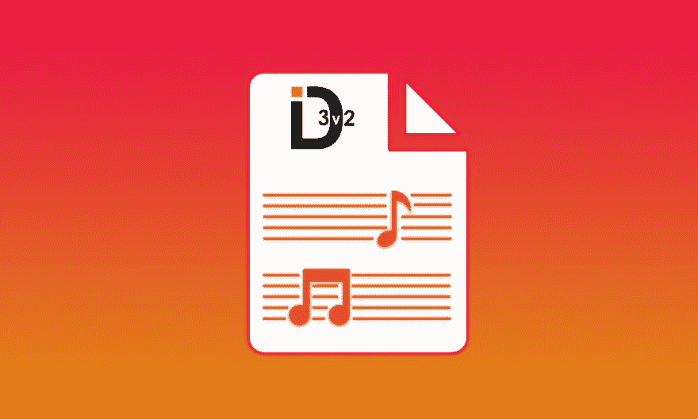
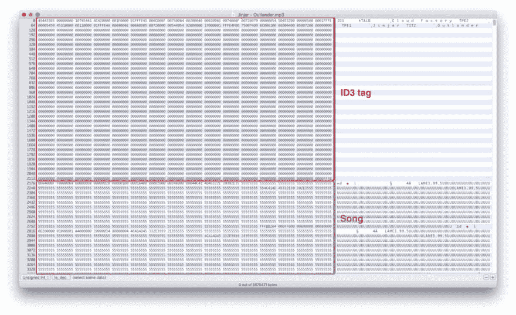
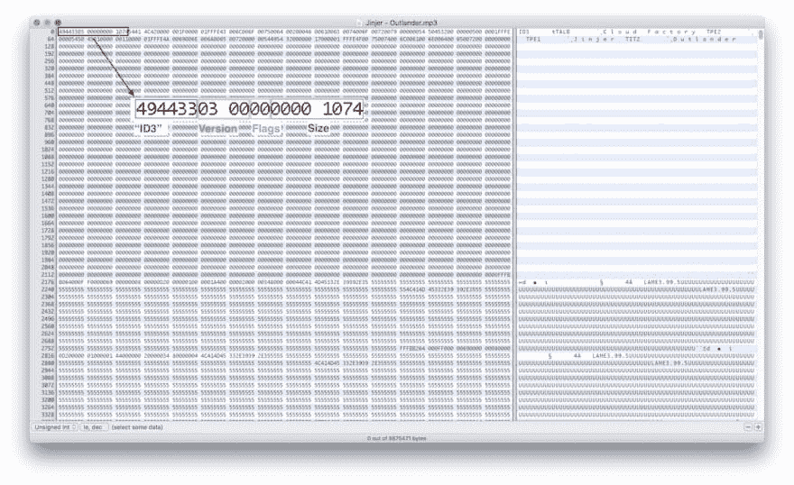
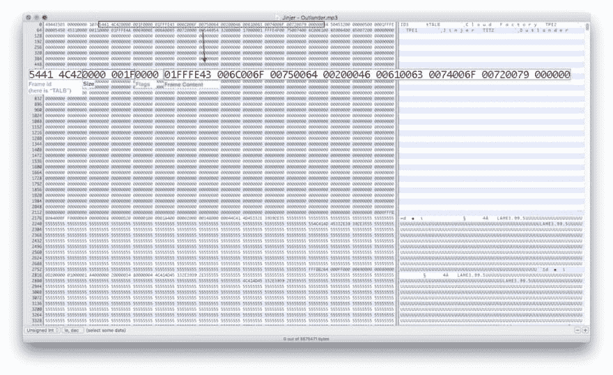

# ID3TagEditor:一个 Swift 框架，可以为 macOS、iOS、tvOS、watchOS 和 Linux 读写 mp3 文件的 ID3 标签

> 原文：<https://dev.to/chicio/id3tageditor-a-swift-framework-to-read-and-write-id3-tag-of-your-mp3-files-for-macos-ios-tvos-and-watchos-127p>

我描述了我的两个最新项目:ID3TagEditor 和 MP 3 id tag ger。在这篇文章中，我将描述我是如何创建 ID3TagEditor 的。

在[这篇之前的文章](https://dev.to/chicio/the-birth-of-id3tageditor-and-mp3id3tagger-and-my-journey-into-the-id3-tag-standard-2ob6)中，我描述了我开发 [ID3TagEditor](https://github.com/chicio/ID3TagEditor) 的原因，这是一个 swift 库，用于编辑 mp3 文件的 ID3 标签，支持 macOS、iOS、watchOS 和 tvOS。
在这篇文章中，我将描述我是如何开发它的。下面你可以找到图书馆的标志。

[](https://res.cloudinary.com/practicaldev/image/fetch/s--py0K5agv--/c_limit%2Cf_auto%2Cfl_progressive%2Cq_auto%2Cw_880/https://www.fabrizioduroni.it/asseimg/posts/id3tageditor-logo.jpg)

但是在深入了解 ID3TagEditor 的细节之前，了解一下 ID3 标签标准是如何工作的是很有用的(你可以在官方网站上找到完整的参考资料)。它对 ID3 标准的定义是:

> ID3 标签是以规定格式存储的 MP3 音频文件内的数据容器

这个定义意味着 ID3 标签基本上是存储在 mp3 文件开头的信息块。该标准定义了任何开发人员都可以用来读写这些信息的格式。让我们看一个使用十六进制编辑器的 ID3 标签的例子。

[](https://res.cloudinary.com/practicaldev/image/fetch/s--lGZDU5sH--/c_limit%2Cf_auto%2Cfl_progressive%2Cq_auto%2Cw_880/https://www.fabrizioduroni.it/asseimg/posts/id3-tag-example.jpg)

标签由一个标题和一系列帧组成。标签报头的大小为 10 字节，包含以下信息(针对 v2 和 v3):

*   ID3 标签文件标识符，3 字节，通常表示为“ID3”
*   标签版本，2 个字节，代表主版本和修订版本的一对数字(如`0x03 0x00`)
*   标志，1 字节，包含三个配置标志，表示为`%abc00000`(位为 1)
*   大小，4 字节。引用 ID3 标准，尺寸为:

> 不同步后完整标签的大小，包括填充，不包括头但不包括扩展头。ID3v2 标签大小用四个字节编码，其中每个字节的最高有效位(位 7)都设置为零，总共 28 位。置零的位被忽略，所以一个 257 字节长的标签被表示为$00 00 02 01。....在大小描述中仅使用了 28 位(代表高达 256MB)...

[](https://res.cloudinary.com/practicaldev/image/fetch/s--eOMUDtyz--/c_limit%2Cf_auto%2Cfl_progressive%2Cq_auto%2Cw_880/https://www.fabrizioduroni.it/asseimg/posts/id3-tag-header.jpg)

框架由标题和自定义内容组成。帧头包含以下信息，这些信息的大小会因版本而异:

*   帧 id，版本 2 中 3 个字节，版本 3 中 4 个字节
*   大小，版本 2 中为 3 个字节，版本 3 中为 4 个字节，用于描述帧的总大小，不包括报头
*   选项标志，2 字节仅在版本 3 中可用

因此，帧头大小在版本 3 中为 10 字节，在版本 2 中为 6 字节。在标题之后是定制的特定框架标志/选项和框架内容。以下是第 3 版标签中的框架示例。

[](https://res.cloudinary.com/practicaldev/image/fetch/s--sCyfWcF3--/c_limit%2Cf_auto%2Cfl_progressive%2Cq_auto%2Cw_880/https://www.fabrizioduroni.it/asseimg/posts/id3-frame-example.jpg)

最后但并非最不重要的是，在 ID3 标记的末尾还有 2 KB 的偏移量(你可以在前面的图片中看到，在标记的末尾有一系列无尽的`0x00`😌).ID3TagEditor 是如何读写所有这些信息的？框架的主要 api 是两个简单的方法:

```
/**
 Read the ID3 tag contained in the mp3 file.

 - parameter path: path of the mp3 file to be parsed.

 - throws: Could throw `InvalidFileFormat` if an mp3 file doesn't exists at the specified path.

 - returns: an ID3 tag or nil, if a tag doesn't exists in the file.
 */
public func read(from path: String) throws -> ID3Tag?

/**
 Writes the mp3 to a new file or overwrite it with the new ID3 tag.

 - parameter tag: the ID3 tag that written in the mp3 file.
 - parameter path: path of the mp3 file where we will write the tag.
 - parameter newPath: path where the file with the new tag will be written. **If nil, the mp3 file will be overwritten**.
 If nothing is passed, the file will be overwritten at its current location.

 - throws: Could throw `TagTooBig` (tag size > 256 MB) or `InvalidTagData` (no data set to be written in the
 ID3 tag).
 */
public func write(tag: ID3Tag, to path: String, andSaveTo newPath: String? = nil) throws 
```

<svg width="20px" height="20px" viewBox="0 0 24 24" class="highlight-action crayons-icon highlight-action--fullscreen-on"><title>Enter fullscreen mode</title></svg> <svg width="20px" height="20px" viewBox="0 0 24 24" class="highlight-action crayons-icon highlight-action--fullscreen-off"><title>Exit fullscreen mode</title></svg>

因此，ID3TagEditor 框架有两个主要部分:一个用于读取/解析 mp3 文件，另一个用于将 ID3 标签写入 mp3 文件。

让我们从阅读/解析部分开始。库的主要入口点是从一个`ID3TagParserFactory`实例化的类`ID3TagParser`。它的主要功能是被称为`parse`。顾名思义，它解析各种帧。在此之前有三个操作:

*   标签的版本由名为`ID3TagVersionParser`的合作者提取
*   检查标签是否在加载的 mp3 文件中可用。这项检查由名为`ID3TagPresence`的合作者完成
*   标签的大小由一个叫做`ID3TagSizeParser`的合作者提取

```
....

func parse(mp3: Data) -> ID3Tag? {
    let version = tagVersionParser.parse(mp3: mp3 as Data)
    if (tagPresence.isTagPresentIn(mp3: mp3 as Data, version: version)) {
        let id3Tag = ID3Tag(version: version, size: 0)
        parseTagSizeFor(mp3: mp3 as NSData, andSaveInId3Tag: id3Tag)
        parseFramesFor(mp3: mp3 as NSData, id3Tag: id3Tag)
        return id3Tag
    }
    return nil
}

.... 
```

<svg width="20px" height="20px" viewBox="0 0 24 24" class="highlight-action crayons-icon highlight-action--fullscreen-on"><title>Enter fullscreen mode</title></svg> <svg width="20px" height="20px" viewBox="0 0 24 24" class="highlight-action crayons-icon highlight-action--fullscreen-off"><title>Exit fullscreen mode</title></svg>

每个帧的解析在函数`parseFramesFor`中完成。

```
....
private func parseFramesFor(mp3: NSData, id3Tag: ID3Tag) {
    var currentFramePosition = id3TagConfiguration.headerSize();
    while currentFramePosition < id3Tag.properties.size {
        let frame = getFrameFrom(mp3: mp3, position: currentFramePosition, version: id3Tag.properties.version)
        frameContentParser.parse(frame: frame, id3Tag: id3Tag)
        currentFramePosition += frame.count;
    }
}

private func getFrameFrom(mp3: NSData, position: Int, version: ID3Version) -> Data {
    let frameSize = frameSizeParser.parse(mp3: mp3, framePosition: position, version: version)
    let frame = mp3.subdata(with: NSMakeRange(position, frameSize))
    return frame
}
.... 
```

<svg width="20px" height="20px" viewBox="0 0 24 24" class="highlight-action crayons-icon highlight-action--fullscreen-on"><title>Enter fullscreen mode</title></svg> <svg width="20px" height="20px" viewBox="0 0 24 24" class="highlight-action crayons-icon highlight-action--fullscreen-off"><title>Exit fullscreen mode</title></svg>

对每个帧的解析是如何进行的？ID3TagEditor 如何识别正确的帧并根据帧类型执行正确的解析？答案在`ID3FrameContentParser`类内部，在`parseFramesFor(mp3: NSData, id3Tag: ID3Tag)`函数内部使用。该类使用 [**命令模式**](https://en.wikipedia.org/wiki/Command_pattern) 为当前帧类型启动正确的
解析操作。帧解析操作列表存储在一个字典中，其中的关键字是`FrameType`枚举。该枚举一般标识帧类型，并在`ID3FrameConfiguration`函数`frameTypeFor(identifier: frameIdentifier, version: version)`中映射到每个版本的正确 ID3 帧标识符。如下图所示，帧标识符的提取是在`getFrameTypeFrom(frame: Data, version: ID3Version) -> FrameType`中完成的。

```
 class ID3FrameContentParser: FrameContentParser {
     private let frameContentParsingOperations: [FrameType : FrameContentParsingOperation]
     private var id3FrameConfiguration: ID3FrameConfiguration

     init(frameContentParsingOperations: [FrameType : FrameContentParsingOperation],
          id3FrameConfiguration: ID3FrameConfiguration) {
         self.frameContentParsingOperations = frameContentParsingOperations
         self.id3FrameConfiguration = id3FrameConfiguration
     }

     func parse(frame: Data, id3Tag: ID3Tag) {
         let frameType = getFrameTypeFrom(frame: frame, version: id3Tag.properties.version)
         if (isAValid(frameType: frameType)) {
             frameContentParsingOperations[frameType]?.parse(frame: frame, id3Tag: id3Tag)
         }
     }

     private func getFrameTypeFrom(frame: Data, version: ID3Version) -> FrameType {
         let frameIdentifierSize = id3FrameConfiguration.identifierSizeFor(version: version)
         let frameIdentifierData = [UInt8](frame.subdata(in: Range(0...frameIdentifierSize - 1)))
         let frameIdentifier = toString(frameIdentifier: frameIdentifierData)
         let frameType = id3FrameConfiguration.frameTypeFor(identifier: frameIdentifier, version: version)
         return frameType
     }

     private func isAValid(frameType: FrameType) -> Bool {
         return frameType != .Invalid
     }

     private func toString(frameIdentifier: [UInt8]) -> String {
         return frameIdentifier.reduce("") { (convertedString, byte) -> String in
             return convertedString + String(Character(UnicodeScalar(byte)))
         }
     }
 } 
```

<svg width="20px" height="20px" viewBox="0 0 24 24" class="highlight-action crayons-icon highlight-action--fullscreen-on"><title>Enter fullscreen mode</title></svg> <svg width="20px" height="20px" viewBox="0 0 24 24" class="highlight-action crayons-icon highlight-action--fullscreen-off"><title>Exit fullscreen mode</title></svg>

如果我们想更深入，我们可以看看`ID3FrameContentParsingOperationFactory`。这个类初始化作为命令使用的类来分析各种类型的帧。我将在其他帖子中讨论它们的实现细节(因为这个类包含了很多很酷的 swift 东西，我可以用它们来写很多其他帖子😏).

```
class ID3FrameContentParsingOperationFactory {
    static func make() -> [FrameType : FrameContentParsingOperation] {
        let paddingRemover = PaddingRemoverUsingTrimming()
        let id3FrameConfiguration = ID3FrameConfiguration()
        return [
            .Artist: ID3FrameStringContentParsingOperation(
                    paddingRemover: paddingRemover, 
                    id3FrameConfiguration: id3FrameConfiguration
            ) { (id3Tag: ID3Tag, frameContentWithoutPadding: String) in
                id3Tag.artist = frameContentWithoutPadding
            },
            .AlbumArtist: ID3FrameStringContentParsingOperation(
                    paddingRemover: paddingRemover,
                    id3FrameConfiguration: id3FrameConfiguration
            ) { (id3Tag: ID3Tag, frameContentWithoutPadding: String) in
                id3Tag.albumArtist = frameContentWithoutPadding
            },
            .Album: ID3FrameStringContentParsingOperation(
                    paddingRemover: paddingRemover,
                    id3FrameConfiguration: id3FrameConfiguration
            ) { (id3Tag: ID3Tag, frameContentWithoutPadding: String) in
                id3Tag.album = frameContentWithoutPadding
            },
            .Title: ID3FrameStringContentParsingOperation(
                    paddingRemover: paddingRemover,
                    id3FrameConfiguration: id3FrameConfiguration
            ) { (id3Tag: ID3Tag, frameContentWithoutPadding: String) in
                id3Tag.title = frameContentWithoutPadding
            },
            .AttachedPicture: AttachedPictureFrameContentParsingOperation(
                    id3FrameConfiguration: id3FrameConfiguration,
                    pictureTypeAdapter: ID3PictureTypeAdapter(
                            id3FrameConfiguration: ID3FrameConfiguration(),
                            id3AttachedPictureFrameConfiguration: ID3AttachedPictureFrameConfiguration()
                    )
            ),
            .Year: ID3FrameStringContentParsingOperation(
                    paddingRemover: paddingRemover,
                    id3FrameConfiguration: id3FrameConfiguration
            ) { (id3Tag: ID3Tag, frameContentWithoutPadding: String) in
                id3Tag.year = frameContentWithoutPadding
            },
            .Genre: ID3FrameStringContentParsingOperation(
                    paddingRemover: paddingRemover,
                    id3FrameConfiguration: id3FrameConfiguration
            ) { (id3Tag: ID3Tag, frameContentWithoutPadding: String) in
                id3Tag.genre = ID3GenreStringAdapter().adapt(genre: frameContentWithoutPadding)
            },
            .TrackPosition : ID3FrameStringContentParsingOperation(
                    paddingRemover: paddingRemover,
                    id3FrameConfiguration: id3FrameConfiguration
            ) { (id3Tag: ID3Tag, frameContentWithoutPadding: String) in
                id3Tag.trackPosition = ID3TrackPositionStringAdapter().adapt(trackPosition: frameContentWithoutPadding)
            }
        ]
    }
} 
```

<svg width="20px" height="20px" viewBox="0 0 24 24" class="highlight-action crayons-icon highlight-action--fullscreen-on"><title>Enter fullscreen mode</title></svg> <svg width="20px" height="20px" viewBox="0 0 24 24" class="highlight-action crayons-icon highlight-action--fullscreen-off"><title>Exit fullscreen mode</title></svg>

让我们看看 ID3TagEditor 如何向 mp3 文件写入一个新标签。标签的创建是由在`Mp3WithID3TagBuilder`类中使用的`ID3TagCreator`类完成的，这个类使用磁盘上的新标签对 mp3 文件执行真正的写操作。`ID3TagCreator`类的主要功能是`create(id3Tag: ID3Tag) throws -> Data`。
在这个函数中，框架是由作为`ID3Tag`类传递给框架的数据创建的。如果所有的帧验证都顺利，则创建一个新的标签头，同样，如果标签头有效(标签的大小有效)，则新的`Data`对象返回到`Mp3WithID3TagBuilder`类并写入 mp3 文件。

```
class ID3TagCreator {
    private let id3FrameCreatorsChain: ID3FrameCreatorsChain
    private let uInt32ToByteArrayAdapter: UInt32ToByteArrayAdapter
    private let id3TagConfiguration: ID3TagConfiguration

    ....

    func create(id3Tag: ID3Tag) throws -> Data {
        var frames = id3FrameCreatorsChain.createFrames(id3Tag: id3Tag, tag: [UInt8]())
        if thereIsNotValidDataIn(frames: frames) {
            throw ID3TagEditorError.InvalidTagData
        }
        frames.append(contentsOf: createFramesEnd())
        let header = createTagHeader(contentSize: frames.count, id3Tag: id3Tag);
        let tag = header + frames
        if (isTooBig(tag: tag)) {
            throw ID3TagEditorError.TagTooBig
        }
        return Data(bytes: tag)
    }

    ....
} 
```

<svg width="20px" height="20px" viewBox="0 0 24 24" class="highlight-action crayons-icon highlight-action--fullscreen-on"><title>Enter fullscreen mode</title></svg> <svg width="20px" height="20px" viewBox="0 0 24 24" class="highlight-action crayons-icon highlight-action--fullscreen-off"><title>Exit fullscreen mode</title></svg>

帧数据是如何创建的？答案在`ID3FrameCreatorsChain`和`ID3FrameCreatorsChainFactory`类中。工厂类创建了一个 [**责任链**](https://en.wikipedia.org/wiki/Chain-of-responsibility_pattern) ，其中`ID3FrameCreatorsChain`类的每个子类都是一个专门化，负责编写特定的帧类型。在链的末尾，返回一个`[Uint8]`数组。这基本上是一个字节数组，然后在`ID3TagCreator`类的`create(id3Tag: ID3Tag) throws -> Data`末尾被转换成一个`Data`对象(这里也添加了标签头，正如我们之前看到的)。下面您可以找到包含在`ID3FrameCreatorsChainFactory`类中的链创建(同样，我们将在以后的其他帖子中看到链中包含的各种类的详细信息😜这个框架包含了太多很酷的 swift 东西😳).需要注意的一件重要事情是:`ID3AttachedPicturesFramesCreator`类能够创建附加的图片框架，将封面的类型设置为 ID3 标准中定义的列表中的一种。这样，我就可以使用我的 [ID3TagEditor 框架用正确的数据来标记 mp3，我需要这些数据来在我的 clio](///2018/05/07/born-id3tageditor-mp3id3tagger.html) 的媒体导航系统上显示 mp3 文件封面！！！😌

```
class ID3FrameCreatorsChainFactory {
    static func make() -> ID3FrameCreatorsChain {
        let paddingAdder = PaddingAdderToEndOfContentUsingNullChar()
        let frameConfiguration = ID3FrameConfiguration()
        let uInt32ToByteArrayAdapter = UInt32ToByteArrayAdapterUsingUnsafePointer()
        let frameContentSizeCalculator = ID3FrameContentSizeCalculator(
                uInt32ToByteArrayAdapter: uInt32ToByteArrayAdapter
        )
        let frameFlagsCreator = ID3FrameFlagsCreator()
        let frameFromStringUTF16ContentCreator = ID3FrameFromStringContentCreator(
                frameContentSizeCalculator: frameContentSizeCalculator,
                frameFlagsCreator: frameFlagsCreator,
                stringToBytesAdapter: ID3UTF16StringToByteAdapter(paddingAdder: paddingAdder,
                                                                  frameConfiguration: frameConfiguration)
        )
        let frameFromStringISO88591ContentCreator = ID3FrameFromStringContentCreator(
            frameContentSizeCalculator: frameContentSizeCalculator,
            frameFlagsCreator: frameFlagsCreator,
            stringToBytesAdapter: ID3ISO88591StringToByteAdapter(paddingAdder: paddingAdder,
                                                                 frameConfiguration: frameConfiguration)
        )
        let albumFrameCreator = ID3AlbumFrameCreator(
                frameCreator: frameFromStringUTF16ContentCreator,
                id3FrameConfiguration: frameConfiguration
        )
        let albumArtistCreator = ID3AlbumArtistFrameCreator(
                frameCreator: frameFromStringUTF16ContentCreator,
                id3FrameConfiguration: frameConfiguration
        )
        let artistFrameCreator = ID3ArtistFrameCreator(
                frameCreator: frameFromStringUTF16ContentCreator,
                id3FrameConfiguration: frameConfiguration
        )
        let titleFrameCreator = ID3TitleFrameCreator(
                frameCreator: frameFromStringUTF16ContentCreator,
                id3FrameConfiguration: frameConfiguration
        )
        let attachedPictureFrameCreator = ID3AttachedPicturesFramesCreator(
                attachedPictureFrameCreator: ID3AttachedPictureFrameCreator(
                        id3FrameConfiguration: frameConfiguration,
                        id3AttachedPictureFrameConfiguration: ID3AttachedPictureFrameConfiguration(),
                        frameContentSizeCalculator: frameContentSizeCalculator,
                        frameFlagsCreator: frameFlagsCreator
                )
        )
        let yearFrameCreator = ID3YearFrameCreator(
                frameCreator: frameFromStringISO88591ContentCreator,
                id3FrameConfiguration: frameConfiguration
        )
        let genreFrameCreator = ID3GenreFrameCreator(
                frameCreator: frameFromStringISO88591ContentCreator,
                id3FrameConfiguration: frameConfiguration
        )
        let trackPositionFrameCreator = ID3TrackPositionFrameCreator(
                frameCreator: frameFromStringISO88591ContentCreator,
                id3FrameConfiguration: frameConfiguration
        )
        albumFrameCreator.nextCreator = albumArtistCreator
        albumArtistCreator.nextCreator = artistFrameCreator
        artistFrameCreator.nextCreator = titleFrameCreator
        titleFrameCreator.nextCreator = yearFrameCreator
        yearFrameCreator.nextCreator = genreFrameCreator
        genreFrameCreator.nextCreator = trackPositionFrameCreator
        trackPositionFrameCreator.nextCreator = attachedPictureFrameCreator
        return albumFrameCreator
    }
} 
```

<svg width="20px" height="20px" viewBox="0 0 24 24" class="highlight-action crayons-icon highlight-action--fullscreen-on"><title>Enter fullscreen mode</title></svg> <svg width="20px" height="20px" viewBox="0 0 24 24" class="highlight-action crayons-icon highlight-action--fullscreen-off"><title>Exit fullscreen mode</title></svg>

就是这样！！！这是 ID3TagEditor 框架的一般结构。如果你想更多地了解这个框架，你可以看看[我的 github repo](https://github.com/chicio/ID3TagEditor) 并开始为❤️做些贡献💜。显然，你也必须继续阅读我的博客，并等待我在上面承诺的关于其他实现细节的其他帖子(如果你懒得自己去看的话😘😆).

*原载于[https://www . fabrizioduroni . it](https://www.fabrizioduroni.it/2018/05/08/id3tageditor-swift-read-write-id3-tag-mp3.html)2018 年 5 月 8 日。*