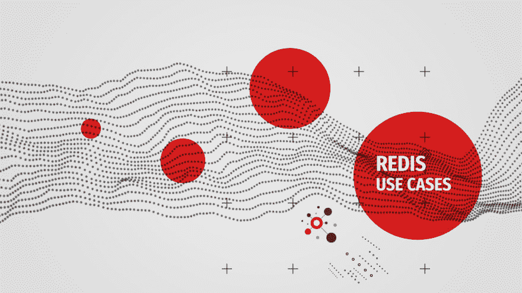

# 按核心数据结构类型划分的主要 Redis 用例

> 原文：<https://dev.to/scalegrid/top-redis-use-cases-by-core-data-structure-types-10ed>

[Redis](https://scalegrid.io/redis.html) ，Remote Dictionary Server 的简称，是由 Salvatore Sanfillipo 用 C 语言编写的 BSD 许可、开源的内存中键值数据结构存储，于 2009 年 5 月 10 日首次发布。根据配置的不同，Redis 可以充当数据库、缓存或[消息代理](https://github.com/antirez/disque)。值得注意的是，Redis 是一个 NoSQL 数据库系统。这意味着与 SQL(结构化查询语言)驱动的数据库系统(如 MySQL、PostgreSQL 和 Oracle)不同，Redis 不将数据存储在定义明确的数据库模式中，这些模式由表、行和列组成。相反，Redis 将数据存储在数据结构中，这使得它的使用非常灵活。在这篇博客中，我们按照不同的核心数据结构类型概述了[顶级 Redis 用例](https://scalegrid.io/blog/top-redis-use-cases-by-core-data-structure-types/)。

## Redis 中的数据结构

让我们看看 Redis 支持的一些数据类型。在 Redis 中，我们有字符串、列表、集合、排序集合和散列，这些我们将在本文中介绍。此外，我们还有其他数据类型，如[位图](https://scalegrid.io/blog/introduction-to-redis-data-structure-bitmaps/)、超级日志和带有 radius 查询和流的地理空间索引。虽然 Redis 社区编写了一些 Redis GUI 工具，但命令行是迄今为止最重要的客户端，不像流行的 SQL 数据库用户通常[更喜欢 GUI 管理系统](https://www.eurovps.com/blog/best-mysql-gui-tools-roundup/)，例如，MySQL 的 phpMyAdmin 和 PostgreSQL 的 PgAdmin。

让我们仔细看看 Redis 中存在的数据类型。

### redis string 重编字串

Redis 字符串是所有其他数据结构类型利用的最基本的 Redis 值类型，与 Java 或 Python 等其他编程语言中的字符串非常相似。字符串可以包含任何数据类型，被认为是二进制安全的，最大长度为 512MB。以下是几个对 Redis 字符串有用的命令:

要在 Redis 中的关键字下存储字符串' **john** ，例如' **student'** ，请运行以下命令:

设置“学生”“约翰”

要检索字符串，请使用 GET 命令，如下所示:

获取“学生”

要删除密钥中包含的字符串，请使用 DEL 命令:

德尔“学生”

#### 重复字符串使用 cases

1.  **会话缓存:**许多网站利用 Redis 字符串创建一个[会话缓存](https://redis.io/topics/data-types-intro)，通过缓存 HTML 片段或页面来加快网站体验。由于数据临时存储在 RAM 中，这个属性使 Redis 成为会话缓存的完美选择。它能够临时存储用户特定的数据，例如，在线商店购物车中存储的商品，这一点至关重要，因为用户在注销或失去连接时不会丢失数据。
2.  **队列:**任何处理流量拥塞、消息传递、数据收集、作业管理或打包路由的应用程序都应该考虑使用 [Redis 队列](https://www.infoworld.com/article/3230455/how-to-use-redis-for-real-time-metering-applications.html)，因为这可以帮助您根据资源分配的到达率和离开率来管理队列大小。
3.  **用途&计量计费:【Redis 字符串的一个鲜为人知的用例是[基于消费的定价模型的实时计量](https://www.infoworld.com/article/3230455/how-to-use-redis-for-real-time-metering-applications.html)。这使得基于实际使用计费的 SaaS 平台能够计量其客户的活动，例如在电信行业，他们可能对短信或分钟收费。**

### 重复列表

列表包含按插入顺序排序的字符串。使用 Redis 列表，您可以将项目添加到列表的头部或尾部，这对于排队作业非常有用。如果您需要执行更紧急的作业，这些作业可以被推到队列中其他优先级较低的作业之前。我们将使用 [LPUSH](https://redis.io/commands/lpush) 命令在字符串的头部或左侧插入一个元素，使用 [RPUSH](https://redis.io/commands/rpush) 命令在字符串的尾部或右侧插入一个元素。让我们看一个例子:

LPUSH list x #现在列表是“x”

LPUSH 列表 y #现在列表是“y”，“x”

RPUSH list z #现在列表是“y”，“x”，“z”(注意 RPUSH 命令是如何将“z”元素添加到列表末尾的)

#### 重复列表使用框

1.  社交网站:像 Twitter 这样的社交平台使用 Redis 列表来填充他们的时间表或主页订阅源，并可以用热门推文或故事定制他们的订阅源顶部。
2.  **RSS 提要:**从自定义来源创建新闻提要，您可以从中获取最新更新，并允许感兴趣的关注者订阅您的 RSS 提要。
3.  **排行榜:**像 Reddit 和其他投票平台这样的论坛利用 Redis 列表向排行榜添加文章，并根据投票最多的条目进行排序。

在我们使用 Node.js、Redis 和 Socket.io 的博客文章[中，了解如何构建自己的 Twitter feed。](https://scalegrid.io/blog/caching-tweets-using-node-js-redis-and-socket-io-2/)

### 重复一遍

Redis 集合是强大的数据类型，支持强大的运算，如交集和并集。它们没有任何顺序，通常在您想要执行审计并查看各种变量之间的关系时使用。集合的速度相当快，无论存储了多少个元素，在集合中添加或删除项目都需要相同的时间。此外，集合不允许重复的键或重复的成员，因此在集合中多次添加的键将被忽略。这是由一个叫做 [SADD](https://redis.io/commands/sadd) 的函数驱动的，它可以避免多个相似条目的重复。 [SADD 属性](https://scaleyourcode.com/blog/article/25)可以在检查唯一值时使用，也可以用于调度后台运行的作业，包括 cron 作业，它们是自动化脚本。

这些特别有助于为你的在线购物网站分析实时客户行为。例如，如果你在经营一家网上服装店，Redis 排序集合使用关系匹配技术，如并、交和减(通常应用于维恩图)来给出客户行为的准确描述。您可以检索不同性别之间购物模式的数据，哪些衣服产品卖得最多，哪些时间的销售额最高。

#### 「重复集」「使用方块」

1.  **分析电子商务销售:**许多[在线商店](https://scalegrid.io/blog/introduction-to-redis-data-structures-sets/)使用 Redis 数据集来分析客户行为，例如对特定产品类别或子类别的搜索或购买。例如，一个在线书店老板可以找到多少客户购买了心理学方面的医学书籍。
2.  **IP 地址跟踪:** Redis Sets 是一款非常棒的工具，它可以帮助开发人员分析所有访问过特定网站页面或博客帖子的 IP 地址，并通过其 SADD 功能忽略所有重复的唯一访问者。
3.  **不适当的内容过滤:**对于任何收集用户输入的应用程序，对不适当的词语实施[内容过滤](https://dzone.com/articles/how-to-use-redis-for-content-filtering)是一个好主意，你可以通过将你想要过滤的词语添加到设置键和 SADD 命令来使用 Redis 设置来实现这一点。

### 排序集合

顾名思义， [Redis 有序集](https://scalegrid.io/blog/introduction-to-redis-data-structures-sorted-sets/)是一个字符串集合，它为你的元素分配一个顺序，是 Redis 中最高级的数据结构之一。这些类似于 Redis 集合，只是集合没有顺序，而排序集合将每个成员与一个[分数](https://developpaper.com/tips-for-using-redis-to-rank/)相关联。众所周知，有序集合非常快，因为您可以在尽可能短的时间内返回有序列表和访问元素。

#### Redis 排序集用例

1.  **Q & A 平台:**许多 Q & A 平台，如 [Stack Overflow](https://redis.io/topics/whos-using-redis) 和 Quora 使用 Redis 排序集对每个提议问题的最高投票答案进行排名，以确保最佳质量的内容列在页面顶部。
2.  **游戏应用计分板:** [在线游戏应用](https://www.ionos.com/community/hosting/redis/how-to-implement-a-simple-redis-leaderboard/)利用 Redis 排序集维护其高分列表，因为分数可以重复，但包含唯一用户详细信息的字符串不能重复。
3.  **任务调度服务:** Redis 排序集对于[任务调度服务](https://medium.com/@ApsOps/migrating-redis-sorted-sets-without-losing-data-f9e85f6549c5)来说是一个很棒的工具，因为你可以关联一个分数来排列你队列中任务的优先级。对于任何没有标注分数的任务，可以使用权重选项，默认值为 1。
4.  **地理哈希:**Redis 地理索引 API 为[地理哈希](https://redis.io/topics/indexes)技术使用一个排序集，它允许您基于纬度和经度索引位置，将多维数据转换为线性数据。

### 再说一遍

[Redis Hashes](https://scalegrid.io/blog/introduction-to-redis-data-structures-hashes/) 是字符串字段和字符串值之间的映射。如果您需要创建一个包含唯一字段及其值的容器来表示对象，这是一种常用的数据类型。散列允许你存储相当多的字段，多达 [232 - 1 个字段-值对](https://redis.io/topics/data-types)(超过 40 亿)，而只占用很少的空间。您应该尽可能使用 Redis 散列，因为您可以使用一个小型 Redis 实例来存储数百万个对象。除了许多高级操作之外，您还可以使用基本的[散列命令](https://redis.io/commands#hash)操作，例如 get、set、exists。

#### 重复使用 hashes use cases

1.  **用户配置文件:**许多 web 应用程序使用 Redis 散列作为它们的用户配置文件，因为它们可以对所有用户字段使用单个散列，例如姓名、电子邮件、密码等。
2.  **用户帖子:**像 [Instagram](https://instagram-engineering.com/storing-hundreds-of-millions-of-simple-key-value-pairs-in-redis-1091ae80f74c) 这样的社交平台利用 Redis 散列将所有存档的用户照片或帖子映射回单个用户。哈希机制允许他们非常快速地查找和返回值，将数据存储在内存中，并在其中一台服务器出现故障时利用数据持久性。
3.  **存储多租户指标:** [多租户应用](https://divinglaravel.com/introduction-to-redis-hashes)可以利用 Redis 散列来记录和存储他们的产品和销售指标，以保证每个租户之间的可靠分离，因为散列可以在非常小的内存空间中有效地编码。

### 谁使用 Redis？

Redis 在旅游和酒店、社区论坛、社交媒体、SaaS 和电子商务等行业占据了巨大的市场份额。使用 Redis 的一些领先公司[包括 Pinterest、优步、Slack、Airbnb、Twitter 和 Stack Overflow。以下是 Redis 目前受欢迎程度的一些统计数据:](https://stackshare.io/redis)

*   4，107 家公司报告在 [StackShare](https://stackshare.io/redis) 上使用 Redis
*   8，759 名开发人员在 [StackShare](https://stackshare.io/redis) 上声明使用 Redis
*   38，094 名 GitHub 用户在 Redis 上加了星
*   数据库在[数据库引擎](https://db-engines.com/en/ranking)中排名第 8，得分为 144.08