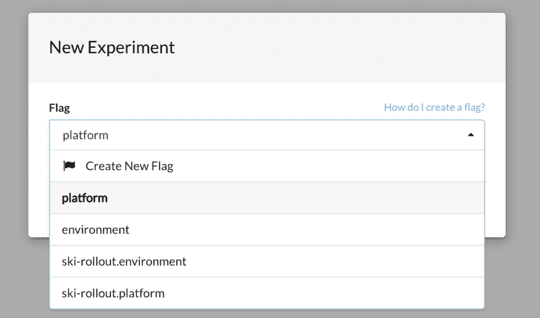
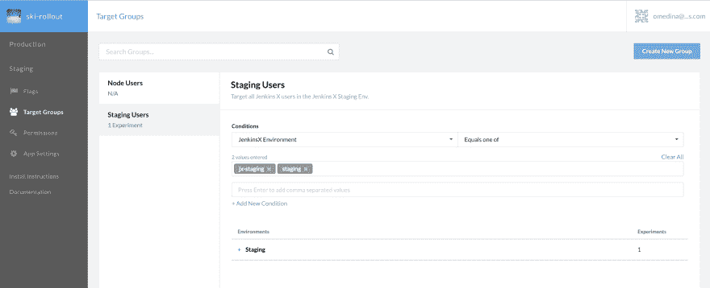
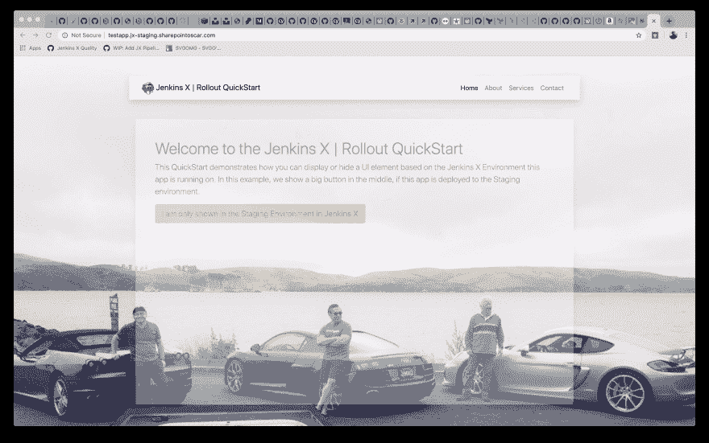

# 对通过 Jenkins X CI/CD 部署的应用程序使用 Rollout.io 功能标志

> 原文：<https://dev.to/devopsoscar/using-rollout-io-feature-flags-for-apps-deployed-via-jenkins-x-ci-cd-54j1>

# 概述

我相信任何生产软件的公司，总是需要测试一个新的特性是否适合它的目标用户。我们知道像脸书这样的巨人会这样做，而且做得很好。

如何提升您的特性部署游戏？使用功能标志针对具有特定功能的一组用户，获得反馈并改进所述功能，同时利用 Jenkins X CI/CD 和环境！

什么是功能标志？这是直接来自 rollout.io 的

> 功能标志是 Rollout.io 的核心。使用功能标志，您可以轻松启用和禁用应用程序中的功能，从而完全控制用户与应用程序的交互方式。
> - rollout.io

# 先决条件

要开始，您需要执行以下操作:

1.  注册一个 [rollout.io](http://rollout.io) 账户。
2.  确保您必须部署环境(生产、试运行)
3.  例如，您已经安装了和一个在 GKE 运行的集群。
4.  这篇文章基于我创建的 [Jenkins X QuickStart](https://jenkins-x.io/developing/create-quickstart/) ，你已经可以看到了。它叫做`rollout-app`。要跟进，只需使用`jx create quickstart`创建它，然后选择它。

# 场景

我们的场景很简单。我们有一个 NodeJS 应用程序，我们想测试 UI 上的按钮放置是否有意义。因此，我们将使用 Rollout.io 特性标志来相应地配置 NodeJS 应用程序。

该应用程序将在 Jenkins X 中通过 CI/CD 发布。 **Staging** 环境是我们的目标受众查看新功能的地方，在这种情况下，它只是一个按钮。没有其他环境会显示该按钮。

# 卷展栏仪表板配置

1.  创建一个自定义属性，进入左侧导航**应用设置** > **自定义属性**将其命名为`string`类型的`JenkinsX Environment`，点击*添加新的自定义属性*

2.  通过点击 Staging > Experiments 下的左侧导航，在 Rollout `Staging`环境中创建一个**标志**，然后点击**新实验**并选择`Create Flag1`混淆右侧，但这应该可以工作。

[](https://res.cloudinary.com/practicaldev/image/fetch/s--ggiEwqVH--/c_limit%2Cf_auto%2Cfl_progressive%2Cq_auto%2Cw_880/https://thepracticaldev.s3.amazonaws.com/i/9xsde66i7ugqal12jycl.png)

调用标志`jenkinsx environment`，这将映射到我们通过代码创建的内部名称`ski-rollout.jenkinsx_environment`。

1.  创建一个**目标组**，并按如下所示进行配置

[](https://res.cloudinary.com/practicaldev/image/fetch/s--UyBM0zXO--/c_limit%2Cf_auto%2Cfl_progressive%2Cq_auto%2Cw_880/https://thepracticaldev.s3.amazonaws.com/i/6rj5w9uwn0jpr1zw4whm.png)

我们正在创建一个**目标群体**，即*针对*Jenkins x 中的暂存环境

**注意:**输入字符串形式的值(多个)，确保您添加了您的环境的确切名称`namespace`，您可以通过执行`jx get env`获得该名称，并查看**名称空间**列。

1.  创建一个**实验**，并将其配置为针对您在上一步中创建的组。它应该配置如下:

[](https://res.cloudinary.com/practicaldev/image/fetch/s--aBM5Bjfe--/c_limit%2Cf_auto%2Cfl_progressive%2Cq_auto%2Cw_880/https://thepracticaldev.s3.amazonaws.com/i/e0jazmvj4a2qtt5ap0ow.png)

确保下拉菜单设置为`true`。

# App 代码

将 Rollout 集成到我们的 NodeJS 应用程序中实际上非常简单。对于这个例子，我已经将必要的代码添加到了`server.js`文件中，理想情况下，您可以根据需要组织文件以避免文件混乱。

```
 var http = require('http');
var fileSystem = require('fs');
var Rox = require('rox-node');
var express = require('express');
var app = express();
var context= {};

//setup Rollout app settings container and flag
const appSettingsContainer = {
    jenkinsx_environment: new Rox.Flag()
  };

// this property must exist in the Rollout Dashboard.
Rox.setCustomStringProperty('JenkinsX Environment', function(context){
    return context.jenkinsx_environment;
  });

// change the name accordingly
Rox.register('ski-rollout', appSettingsContainer);

// Rollout Staging Env
async function setupRox() {
    console.log('calling Rox.setup for Staging...');

    // the parameter for setup, is the ID of the Staging Environment in the Rollout Dashboard.
    // you can use other environment IDs but those must be defined in the Rollout Dashboard.
    var _result =  await Rox.setup('5d016c4223864938a85c1d33', {

      });

    await sleep (2000);
    return _result;
 }

 setupRox().then((value) => {

    if (appSettingsContainer.jenkinsx_environment.isEnabled(context)) {
        console.log('----- We are in Staging Jenkins X environment! --------');
     }
     else {
        console.log('------ What Jenkins X environment? : '+ context.jenkinsx_environment+' ---------');
     }

 });

function getJXEnvironment() {
    var _env = '';
    _env = fileSystem.readFileSync('/var/run/secrets/kubernetes.io/serviceaccount/namespace', 'utf8');

    return _env;
}

// Routes - we pass two variables to the HTML to preform approrpiate actions based on conditions.
app.get('/', function(req, res) {

    // first ensure we have our file contents, which contains the k8s namespace we are in.
    context = { jenkinsx_environment: getJXEnvironment() };
    console.log('----------- app.get() - called getJXEnvironment() and got: '+ context.jenkinsx_environment+' so rendering ---------------------');
    res.render('pages/index',{env:context.jenkinsx_environment,renderButton:appSettingsContainer.jenkinsx_environment.isEnabled(context)});
});

app.listen(8080);

console.log('------ Ok your app is listening on port 8080! -------- '); 
```

Enter fullscreen mode Exit fullscreen mode

这是最终的结果。请注意为该环境显示的 URL 和按钮。

[](https://res.cloudinary.com/practicaldev/image/fetch/s--PU5DGFV9--/c_limit%2Cf_auto%2Cfl_progressive%2Cq_auto%2Cw_880/https://thepracticaldev.s3.amazonaws.com/i/9exwgs9cxvx4d6pt9uhe.png)

# 结论

有了这个基本的配置。我们的按钮现在只会显示应用程序在暂存环境中运行的时间。这篇文章仅仅触及了特性标志的皮毛。我鼓励你以这种方式探索发布特性。

我期待尝试的一些不错的功能是:

*   目标规则
*   逐步展示和回滚
*   多元检验

在 [rollout.io](https://rollout.io/product/) 了解更多信息

干杯，

[@SharePointOscar](https://twitter.com/SharePointOscar)

注:这篇文章最初发表于[sharepointoscar.com](https://sharepointoscar.com)