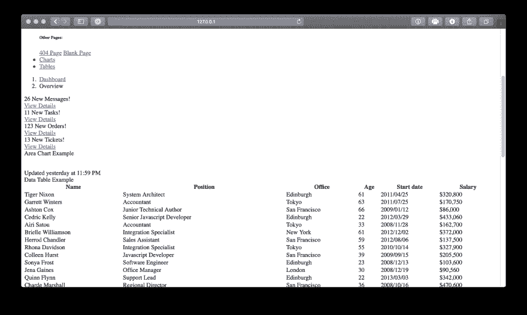
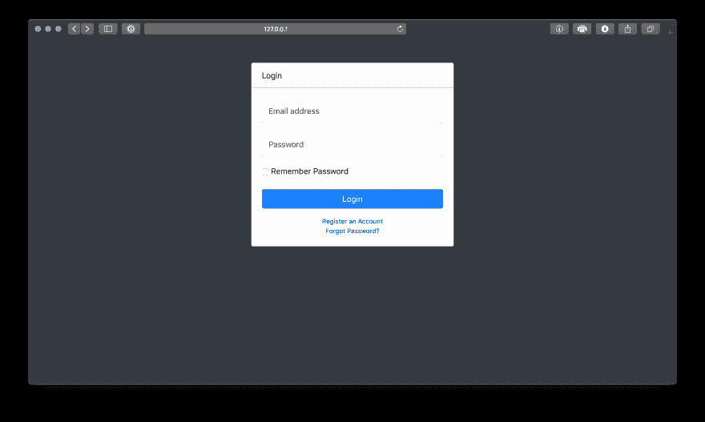
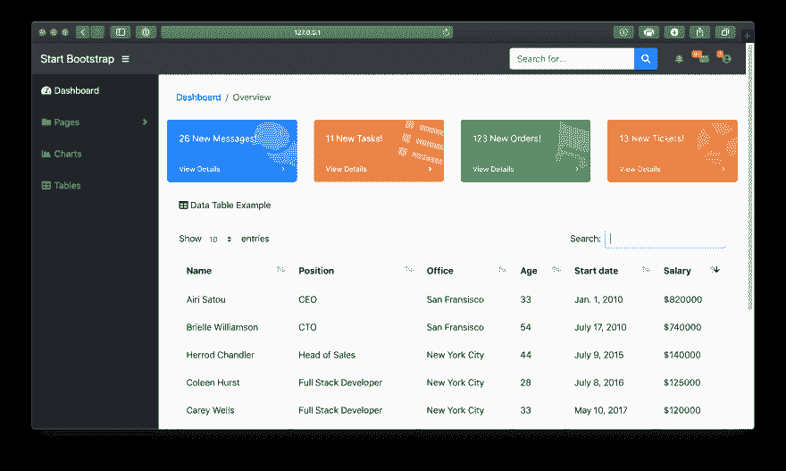

# 前端 Django 的基础知识

> 原文：<https://dev.to/mkdev/fundamentals-of-front-end-django-b2k>

虽然 Django 对于编写 API 很有用，但它的主要用途是作为创建完整网站的框架。呈现 HTML 是 Django 的基本能力之一，它使用 Jinja 模板使编写灵活、可重用的网页变得简单明了。本文将教你如何用 Django 制作一个基本的网站；我们将创建一个受登录保护的销售仪表板。这个项目将展示用 Django 进行 web 开发的基本技术:为 HTML 编写视图，用表单验证，显示来自数据库的数据，以及包含静态资产。

本文将采用迭代的方法来开发网页。您可以从安装 Python 3 和 Django 2.2 开始，然后继续学习，或者您可以跳过这一步，从 GitHub 克隆最终版本。如果你和我一起建立，从跑`django-admin startproject dashboard`开始。`cd dashboard`进入目录，然后`python manage.py startapp core`将创建应用程序。确保将`'core.apps.CoreConfig'`添加到 settings.py 中的`INSTALLED_APPS`中。从那里，您将能够通过修改单个文件来继续操作。

无论您是从克隆项目还是创建自己的项目开始，都要确保运行`python manage.py migrate`和`python manage.py createsuperuser`来完成设置。运行`python manage.py runserver`来启动 Django 站点。

我们将从编写一个在浏览器中呈现 HTML 的简单视图开始。Django 支持基于函数的视图和基于类的视图。在这些例子中，我们将使用基于类的视图，但这取决于个人偏好，因为两者都提供了相同的功能，但语法不同。当您希望支持单个 URL 的多种交互时，基于类的视图是最有用的，例如，如果您需要支持几种 HTTP 方法。

在本文中，我们练习的是 Django，而不是 HTML 或 CSS。因此，我们将使用 Start Bootstrap 中的[奇妙的开源模板。该模板将为我们提供本练习所需的所有 HTML、CSS 和 JS，使我们能够专注于 Django。如果您是从零开始，下载模板，并将 index.html 和 login.html 文件复制到/core/templates 中。虽然我们将这些模板中的许多功能作为占位符，但它们将帮助我们编写一个交互式网站。](https://startbootstrap.com/templates/sb-admin/)

将模板保存到“/core/templates/index.html”后，我们可以使用“/core/views.py”中的以下视图来呈现页面。

```
from django.shortcuts import render
from django.views import View

class Index(View):
    template = 'index.html'

    def get(self, request):
        return render(request, self.template) 
```

<svg width="20px" height="20px" viewBox="0 0 24 24" class="highlight-action crayons-icon highlight-action--fullscreen-on"><title>Enter fullscreen mode</title></svg> <svg width="20px" height="20px" viewBox="0 0 24 24" class="highlight-action crayons-icon highlight-action--fullscreen-off"><title>Exit fullscreen mode</title></svg>

然后，将路线添加到“/dashboard/urls.py”，如下所示:

```
from django.contrib import admin
from django.urls import path
from core import views

urlpatterns = [
    path('admin/', admin.site.urls),
    path('', views.Index.as_view(), name='index')
] 
```

<svg width="20px" height="20px" viewBox="0 0 24 24" class="highlight-action crayons-icon highlight-action--fullscreen-on"><title>Enter fullscreen mode</title></svg> <svg width="20px" height="20px" viewBox="0 0 24 24" class="highlight-action crayons-icon highlight-action--fullscreen-off"><title>Exit fullscreen mode</title></svg>

写好视图后，当我们运行服务器并导航到 [http://127.0.0.1:8000](http://127.0.0.1:8000) 时，我们会看到页面。

[](https://res.cloudinary.com/practicaldev/image/fetch/s--d6ZiVL4x--/c_limit%2Cf_auto%2Cfl_progressive%2Cq_auto%2Cw_880/https://assets-mkdev.s3.eu-central-1.amazonaws.com/posts/misc/FrontendDj-nocssdashboard.png)

现在，页面看起来不是很好。幸运的是，该模板包含了一些静态资产(CSS、JavaScript 和其他文件),我们可以用它们来改进站点。为此，首先在“core”下创建一个“static”文件夹，然后将文件夹“css”、“js”和“vendor”复制到 static 中。最后，在 html 页面中，您需要在页眉中的三个 CSS 导入和页脚中的九个 JavaScript 导入的路径前面加上“/static/”。之后，页面看起来好多了。

[](https://res.cloudinary.com/practicaldev/image/fetch/s--ya2hW78T--/c_limit%2Cf_auto%2Cfl_progressive%2Cq_auto%2Cw_880/https://assets-mkdev.s3.eu-central-1.amazonaws.com/posts/misc/FrontendDj-cssdashboard.png)

一旦我们可以正确地看到页面的内容，原来这里有很多(伪造的)敏感数据！让我们通过实现一个登录页面来限制访问，这将是在 Django 中使用网页中的表单的一个很好的介绍。

首先将“login.html”模板复制到与“index.html”相同的“core/templates/”文件夹中。我们将添加一个路由和视图来支持这个新页面。

在 urls.py:

```
path('login', views.Login.as_view(), name='login'), 
```

<svg width="20px" height="20px" viewBox="0 0 24 24" class="highlight-action crayons-icon highlight-action--fullscreen-on"><title>Enter fullscreen mode</title></svg> <svg width="20px" height="20px" viewBox="0 0 24 24" class="highlight-action crayons-icon highlight-action--fullscreen-off"><title>Exit fullscreen mode</title></svg>

在 views.py:

```
class Login(View):
    template = 'login.html'

    def get(self, request):
        return render(request, self.template) 
```

<svg width="20px" height="20px" viewBox="0 0 24 24" class="highlight-action crayons-icon highlight-action--fullscreen-on"><title>Enter fullscreen mode</title></svg> <svg width="20px" height="20px" viewBox="0 0 24 24" class="highlight-action crayons-icon highlight-action--fullscreen-off"><title>Exit fullscreen mode</title></svg>

您会注意到，目前我们的登录视图与索引视图几乎相同。这将很快改变以支持实际的页面。让我们在 [http://127.0.0.1/login/](http://127.0.0.1/login/) 访问登录页面。尝试使用您之前创建的超级用户凭据登录。

[](https://res.cloudinary.com/practicaldev/image/fetch/s--E7sDTRCo--/c_limit%2Cf_auto%2Cfl_progressive%2Cq_auto%2Cw_880/https://assets-mkdev.s3.eu-central-1.amazonaws.com/posts/misc/FrontendDj-loginpage.png)

虽然页面看起来很棒，但是它还没有做任何事情。为此，我们需要使用一个表单。幸运的是，Django 提供了一个很好的默认值`AuthenticationForm`,接受用户名和密码。我们可以将它添加到视图中，如下所示:

```
from django.contrib.auth.forms import AuthenticationForm
from django.contrib.auth import login, authenticate

class Login(View):
    template = 'login.html'

    def get(self, request):
        form = AuthenticationForm()
        return render(request, self.template, {'form': form})

    def post(self, request):
        form = AuthenticationForm(request.POST)
        username = request.POST['username']
        password = request.POST['password']
        user = authenticate(request, username=username, password=password)
        if user is not None:
            login(request, user)
            return HttpResponseRedirect('/')
        else:
            return render(request, self.template, {'form': form}) 
```

<svg width="20px" height="20px" viewBox="0 0 24 24" class="highlight-action crayons-icon highlight-action--fullscreen-on"><title>Enter fullscreen mode</title></svg> <svg width="20px" height="20px" viewBox="0 0 24 24" class="highlight-action crayons-icon highlight-action--fullscreen-off"><title>Exit fullscreen mode</title></svg>

这也需要对登录页面的 HTML 进行一些修改。Django 支持 Jinja 现成的模板。Jinja 模板是 HTML 的一个扩展，它允许你用一个双括号`{{ data }}`包含数据，用相似的语法``包含表达式。我们将使用 Jinja 标签将表单合并到 HTML 页面中。

```
<form method="post" action="/login/">
    
  <div class="form-group">
    <div class="form-label-group">
      {{ form.username }}
    </div>
  </div>
  <div class="form-group">
    <div class="form-label-group">
      {{ form.password }}
    </div>
  </div>
  <button class="btn btn-primary btn-block" type="submit">Login</button>
</form> 
```

<svg width="20px" height="20px" viewBox="0 0 24 24" class="highlight-action crayons-icon highlight-action--fullscreen-on"><title>Enter fullscreen mode</title></svg> <svg width="20px" height="20px" viewBox="0 0 24 24" class="highlight-action crayons-icon highlight-action--fullscreen-off"><title>Exit fullscreen mode</title></svg>

之后我们可以通过包含这个脚本添加一些 css。因为 Jinja 元素被呈现在 HTML 服务器端，所以当这个脚本在客户机上运行时，我们可以依赖 DOM 中存在的元素 id。

```
<script>
  document.getElementById("id_username").classList.add("form-control");
  document.getElementById("id_password").classList.add("form-control");
  document.getElementById("id_username").placeholder = "Username";
  document.getElementById("id_password").placeholder = "Password";
  document.getElementById("id_username").type = "text";
  document.getElementById("id_password").type = "password";
  document.getElementById("id_username").required = "required";
  document.getElementById("id_password").required = "required";
  document.getElementById("id_username").autofocus = "autofocus";
</script> 
```

<svg width="20px" height="20px" viewBox="0 0 24 24" class="highlight-action crayons-icon highlight-action--fullscreen-on"><title>Enter fullscreen mode</title></svg> <svg width="20px" height="20px" viewBox="0 0 24 24" class="highlight-action crayons-icon highlight-action--fullscreen-off"><title>Exit fullscreen mode</title></svg>

经过这些更改后，访问登录页面将允许我们登录并查看主控制面板。然而，眼尖的读者会注意到，我们还没有为仪表板实现任何保护。事实上，任何人都可以访问该索引，查看其中的所有敏感信息。因此，我们必须在`Index`视图中继承另一个类。

```
from django.contrib.auth.mixins import LoginRequiredMixin

class Index(LoginRequiredMixin, View):
    template = 'index.html'
    login_url = '/login/'

    def get(self, request):
        return render(request, self.template) 
```

<svg width="20px" height="20px" viewBox="0 0 24 24" class="highlight-action crayons-icon highlight-action--fullscreen-on"><title>Enter fullscreen mode</title></svg> <svg width="20px" height="20px" viewBox="0 0 24 24" class="highlight-action crayons-icon highlight-action--fullscreen-off"><title>Exit fullscreen mode</title></svg>

`LoginRequiredMixin`类防止除了认证用户之外的任何人访问它保护的页面。如果有人试图在登录前进入索引，它会方便地将他们重定向到登录页面以验证他们自己。

我们用 Jinja 合并了一个表单；我们也可以用它来避免重复的代码。现在，我们只有两个 html 页面，但这个应用程序的完整实现将有几十个。我们可以从一个基本模板中继承头部，而不是复制和粘贴公共元素。

我们首先在“core/templates”中创建一个新文件“base.html”该文件将包括两个页面之间的公共标题信息。

```
<!DOCTYPE html>
<html lang="en">

<head>

  <meta charset="utf-8">
  <meta http-equiv="X-UA-Compatible" content="IE=edge">
  <meta name="viewport" content="width=device-width, initial-scale=1, shrink-to-fit=no">
  <meta name="description" content="">
  <meta name="author" content="">

  <title></title>

  <!-- Custom fonts for this template-->
  <link href="/static/vendor/fontawesome-free/css/all.min.css" rel="stylesheet" type="text/css">

  <!-- Page level plugin CSS-->
  <link href="/static/vendor/datatables/dataTables.bootstrap4.css" rel="stylesheet">

  
  

</head>




</html> 
```

<svg width="20px" height="20px" viewBox="0 0 24 24" class="highlight-action crayons-icon highlight-action--fullscreen-on"><title>Enter fullscreen mode</title></svg> <svg width="20px" height="20px" viewBox="0 0 24 24" class="highlight-action crayons-icon highlight-action--fullscreen-off"><title>Exit fullscreen mode</title></svg>

然后，将来的页面可以使用修改后的“index.html .”中的以下语法

```


Employee Dashboard


  <!-- Custom styles for this template-->
  <link href="/static/css/sb-admin.css" rel="stylesheet">


<!--html goes here-->
 
```

<svg width="20px" height="20px" viewBox="0 0 24 24" class="highlight-action crayons-icon highlight-action--fullscreen-on"><title>Enter fullscreen mode</title></svg> <svg width="20px" height="20px" viewBox="0 0 24 24" class="highlight-action crayons-icon highlight-action--fullscreen-off"><title>Exit fullscreen mode</title></svg>

在主页中，我们还有一个地方可以应用 Jinja 模板。目前，表格中的所有数字都被硬编码到 HTML 中，只要数据发生变化，就需要编辑网页本身。相反，我们可以将数据存储在数据库中，并将其传递给视图。这也将为我们节省近 500 行包含当前数据的手动 HTML。

首先，我们需要一个模型来表示数据库中的雇员。在“core/models.py”中，我们将员工定义如下。

```
from django.db import models

class Employee(models.Model):
    name = models.CharField(max_length=150)
    position = models.CharField(max_length=150)
    office = models.CharField(max_length=150)
    age = models.PositiveIntegerField()
    start_date = models.DateField()
    salary = models.PositiveIntegerField()

    def __str__(self):
        return self.name 
```

<svg width="20px" height="20px" viewBox="0 0 24 24" class="highlight-action crayons-icon highlight-action--fullscreen-on"><title>Enter fullscreen mode</title></svg> <svg width="20px" height="20px" viewBox="0 0 24 24" class="highlight-action crayons-icon highlight-action--fullscreen-off"><title>Exit fullscreen mode</title></svg>

确保在“core/admin.py .”中注册模型

```
from django.contrib import admin
from .models import Employee

class EmployeeAdmin(admin.ModelAdmin):
    list_display = [f.name for f in Employee._meta.fields]

admin.site.register(Employee, EmployeeAdmin) 
```

<svg width="20px" height="20px" viewBox="0 0 24 24" class="highlight-action crayons-icon highlight-action--fullscreen-on"><title>Enter fullscreen mode</title></svg> <svg width="20px" height="20px" viewBox="0 0 24 24" class="highlight-action crayons-icon highlight-action--fullscreen-off"><title>Exit fullscreen mode</title></svg>

有了编写和注册的模型，我们可以进行并运行迁移(退出服务器、`python manage.py makemigrations`、`python manage.py migrate`、`python manage.py runserver`)。导航到/admin 并单击 employees 表。单击右上角的“添加员工”,在表单中输入您想要的任何数据。

[](https://res.cloudinary.com/practicaldev/image/fetch/s--4yZOsXip--/c_limit%2Cf_auto%2Cfl_progressive%2Cq_auto%2Cw_880/https://assets-mkdev.s3.eu-central-1.amazonaws.com/posts/misc/FrontendDj-addemployeeadmin.png)

这样多做几次，直到你有一个小的假公司。然后，返回到我们的“views.py ”,修改`Index`,将雇员数据库作为 QuerySet 传递到 HTML 文件中。

```
def get(self, request):
    employees = Employee.objects.all()
    return render(request, self.template, {'employees': employees}) 
```

<svg width="20px" height="20px" viewBox="0 0 24 24" class="highlight-action crayons-icon highlight-action--fullscreen-on"><title>Enter fullscreen mode</title></svg> <svg width="20px" height="20px" viewBox="0 0 24 24" class="highlight-action crayons-icon highlight-action--fullscreen-off"><title>Exit fullscreen mode</title></svg>

最后，删除“index.html”中的整个假表，并用一个针对我们输入到数据库中的数据的 for 循环来替换它。

```
<tbody>
  
  <tr>
    <td>{{ employee.name }}</td>
    <td>{{ employee.position }}</td>
    <td>{{ employee.office }}</td>
    <td>{{ employee.age }}</td>
    <td>{{ employee.start_date }}</td>
    <td>${{ employee.salary }}</td>
  </tr>
  
</tbody> 
```

<svg width="20px" height="20px" viewBox="0 0 24 24" class="highlight-action crayons-icon highlight-action--fullscreen-on"><title>Enter fullscreen mode</title></svg> <svg width="20px" height="20px" viewBox="0 0 24 24" class="highlight-action crayons-icon highlight-action--fullscreen-off"><title>Exit fullscreen mode</title></svg>

Django 通过从我们的数据库渲染来创建索引，而不是简单地返回填充数据。所有的搜索和排序功能仍然像以前一样工作，唯一的区别是 html 是在服务器端从数据库生成的，而不是硬编码的。

[](https://res.cloudinary.com/practicaldev/image/fetch/s--k5JgiQO1--/c_limit%2Cf_auto%2Cfl_progressive%2Cq_auto%2Cw_880/https://assets-mkdev.s3.eu-central-1.amazonaws.com/posts/misc/FrontendDj-dashboardfromdb.png)

我们已经看到了用 Django 和 Jinja 创建网页的几种强大模式。使用模板和扩展允许我们在页面之间重用公共代码。表单允许我们安全地收集和传输用户数据(当网站通过 HTTPS 提供服务时)。我们可以使用服务器端呈现将数据包含在 HTML 中并发送给客户端。这些基本模式是让你在 Django 中创建大量网页的基本技能。

* * *

这是 Philip Kiely 写的一篇 mkdev 文章。你可以聘请我们的 Python 导师亲自学习 Python & Django。