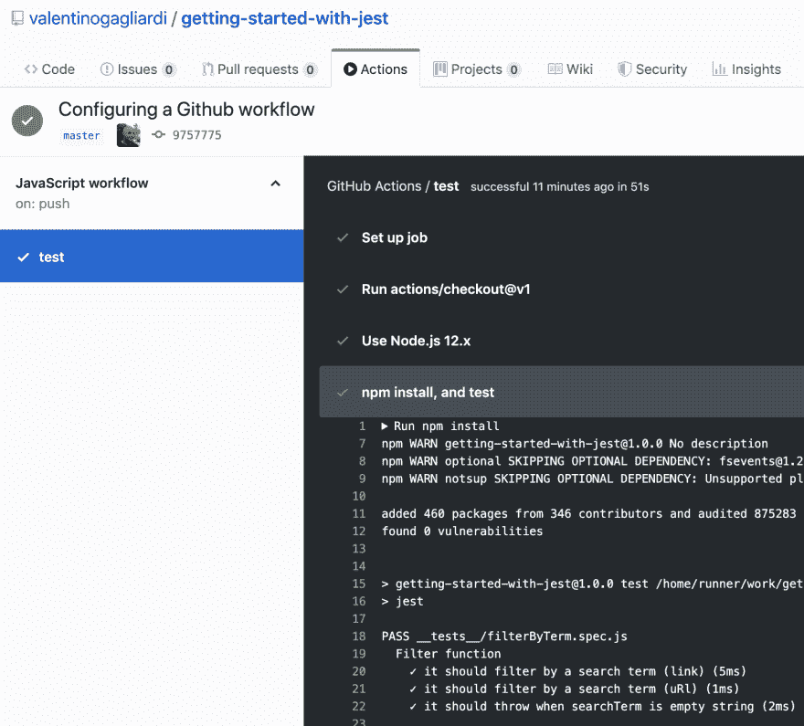

# JavaScript 中的持续集成:指南。Github 操作)

> 原文：<https://dev.to/valentinogagliardi/continuous-integration-in-javascript-a-guide-ft-github-actions-237j>

**刚刚越过 dev.to 上的 5k follower！谢谢大家！多么神奇的社区啊！谁也在推特上？下面连线= > [我在这里](https://twitter.com/gagliardi_vale)** 。

有没有一种方法可以在代码离开你的电脑后自动测试？通过这本易于阅读的指南，学习 JavaScript 的持续集成。(特色 Github 动作！).

## JavaScript 中的自动化测试和持续集成:你将学到什么

***注**:即使你不喜欢 JavaScript，我也建议你阅读一下指南，持续集成并不特别依赖于任何编程语言。您将在这里学到的概念适用于任何其他语言或平台。*

在本指南中，您将了解到:

*   **什么是自动化测试**
*   **什么是持续集成**
*   如何将自动化单元测试和持续集成应用到一个简单的 JavaScript 项目中

## 本指南面向谁

如果你知道你的 JavaScript 测试方法，并且想要**学习持续集成**，那么这个指南就是为你准备的。如果你还是测试新手，请务必查看【JavaScript 测试 Jest 入门，然后回到这里。

本指南假设读者对版本控制、Git 及其术语(如提交和推送)有很好的了解。我建议浏览一下 [Git 书](https://git-scm.com/book/en/v2)的前几页，如果你是 Git 和版本控制的新手，再回来看看这篇文章。

尽情享受吧！

## 什么是自动化测试？

测试你的代码是至关重要的，我们都同意这一点。如今，在本地工作站上进行测试就像在您最喜欢的 IDE 中按一个按钮一样简单，但是当代码离开您的计算机时，您如何**执行测试呢？当一个新成员加入团队，而他/她不再是专家时，也很容易让一些单元测试溜走，毕竟我们是人。**

那又怎样？正如你所看到的，需要一个工具来自动运行你的测试。

**自动化测试**是**在没有人工干预的情况下运行测试的能力**，在一个大多数时候不再是你的本地工作站的环境中。

自动化测试是在所谓的**持续集成服务中运行的特定工具的帮助下实现的。**在看一下工具之前，让我们澄清一下**什么是持续集成**。

## 什么是持续集成？

自从软件和 web 开发开始以来，就一直需要解决一些特定的问题:

*   **在发布到生产之前强制测试**
*   **在**产品发货前发现漏洞
*   获得关于产品的快速反馈

从早期开始，就有人尝试将所有这些步骤整合成一个所谓的**流水线**。一个**管道**由一组明确定义的**步骤**组成，一个接一个(或并行)运行。下面是管道的样子:

**文件变更** - >触发**自动化测试** - > **发布到生产**

随着时间的推移，所有这些技术都被“标准化”了，命名为**持续集成**。更广泛地说，**持续集成是一种实践**，它规定持续地将**新代码**和新特性集成到一个共享的代码库中。

理论是，如果所有的开发人员每天多次将变更集成到同一个代码库中，那么团队可以获得快速的反馈，更快地调整错误和修复 bug。持续集成的基本前提是**版本控制**。每一行代码，每一行配置，都应该在**版本控制**之下。

说起来容易做起来难？持续集成不是一只容易驯服的野兽，但是现在有了在一堆代码行中创建**管道**的简洁工具。所以让我们来看看这个现代化的工具。

## JavaScript 中的自动化测试和持续集成:选择 CI/CD 服务

在持续集成(CI 从现在开始)系统的核心有一个**管道**。

一个**管道**是在一个特定动作之后发生的一组步骤**。通过**动作，我指的是代码库**的变化，它理想地托管在版本控制服务器上。从前“有”SVN，但最终 Git 成为最流行的版本控制系统。**

一旦开发人员**修改了某行代码**，提交**提交**，并且**将**推送到**存储库**中，那么**管道就会启动**。接下来会发生什么取决于您如何配置您的 **CI 服务**。作为管道的一部分，您可以:

*   测试您的代码/软件/用户界面
*   构建生产版本并部署它

但是到底什么是 CI 服务呢？它是**，一个运行你的管道的工具**。您可以将它安装在服务器上(在本地)或从外部提供商处租用(作为服务)。如今有许多 CI 服务，有些是免费的，有些是付费的:我可以说出 **TravisCI** 、 **CircleCI** 和 **GitLab CI** 。自己挑！

如今，您可能还想摆脱 FTP 来进行“部署”。大多数 CI 服务都配备了某种 **CD 能力**，是**连续交付**的简称。这就是为什么我们称这些工具为“CI/CD 服务”。

持续交付意味着一旦测试通过就发布软件。持续交付类似于持续集成:在自动化测试通过之后，我们可以构建一个生产工件，然后自动部署到生产中。

请抓紧时间，在接下来的部分中，您将最终对 CI 进行一些练习。

## JavaScript 中的自动化测试和持续集成:配置 CI/CD 服务，工作流

让我们回顾一下到目前为止我们所学的内容。**持续集成是一种实践**。核心原则规定一切都必须在版本控制之下，开发人员必须每天将代码集成到共享的代码库中。

今天，持续集成是在 CI/CD 服务上实践的，其中您创建了一个所谓的管道，每次开发人员进行更改时都会触发该管道。

**管道负责构建您的代码，并针对它运行自动化测试**。但是**CI/CD 服务在实践中是如何工作的**？嗯，大多数时候**你应该用一个**配置文件**来配置服务**。

在我写这篇指南的时候，我获得了对 Github actions 的测试权限，这是一个新的 Github 功能，它还包括一个 T2 CI/CD 服务。Actions 直接与 Github repos 集成，这是一个很好的实践 CI 的方式，不需要依赖除 Github 之外的外部服务。

大多数 CI/CD 服务是通过一个 [YAML 文件](https://en.wikipedia.org/wiki/YAML)配置的，该文件通常需要:

*   管道的名称(Github 称之为“工作流”)
*   要做的工作清单
*   每项工作的步骤列表

如果我们希望将配置转化为实际工作，我们可以为以下项目配置 CI 服务:

*   设置 JavaScript 环境(主要是 Node.js)
*   安装项目的依赖项
*   可选地构建项目
*   运行自动化测试

在下一节中，我们将**配置一个 Github 工作流来自动化一些单元测试**。在进入下一节之前，花点时间看看 GitHub 动作的[工作流语法](https://help.github.com/en/articles/workflow-syntax-for-github-actions)，让自己熟悉语法。

## JavaScript 中的自动化测试和持续集成:自动化单元测试

在[JavaScript 测试 Jest 入门](https://www.valentinog.com/blog/jest/)中，我介绍了测试的基础知识，并留给读者一个简单的 JavaScript 项目。它对一个名为 filterByTerm 的函数进行了一系列单元测试。

现在让我们用 Github 工作流:
克隆 repo 来添加一个测试管道

```
git clone git@github.com:valentinogagliardi/getting-started-with-jest.git 
```

<svg width="20px" height="20px" viewBox="0 0 24 24" class="highlight-action crayons-icon highlight-action--fullscreen-on"><title>Enter fullscreen mode</title></svg> <svg width="20px" height="20px" viewBox="0 0 24 24" class="highlight-action crayons-icon highlight-action--fullscreen-off"><title>Exit fullscreen mode</title></svg>

进入项目文件夹，安装依赖项并运行一个快速测试:

```
cd getting-started-with-jest
npm i
npm test 
```

<svg width="20px" height="20px" viewBox="0 0 24 24" class="highlight-action crayons-icon highlight-action--fullscreen-on"><title>Enter fullscreen mode</title></svg> <svg width="20px" height="20px" viewBox="0 0 24 24" class="highlight-action crayons-icon highlight-action--fullscreen-off"><title>Exit fullscreen mode</title></svg>

这些正是我们要自动化的步骤。注意**第一次测试应该总是发生在你的本地工作站上，不要提交失败的代码**。在推送到回购之前测试代码是你的责任。现在还在回购创建一个新文件夹，命名为**。github/workflows/** :

```
mkdir -p .github/workflows/ 
```

<svg width="20px" height="20px" viewBox="0 0 24 24" class="highlight-action crayons-icon highlight-action--fullscreen-on"><title>Enter fullscreen mode</title></svg> <svg width="20px" height="20px" viewBox="0 0 24 24" class="highlight-action crayons-icon highlight-action--fullscreen-off"><title>Exit fullscreen mode</title></svg>

Github 希望在这个文件夹中找到您的工作流(管道)。现在我们需要 YAML 的工作流的**配置文件。在**中新建一个名为 **javascript.yml** 的文件。github/workflows/** 。**

我不会去每一个通过线，配置应该很容易 grok。按照我们之前概述的步骤:

*   设置 JavaScript 环境(主要是 Node.js)
*   安装项目的依赖项
*   可选地构建项目
*   运行自动化测试

我们可以这样配置我们的第一个工作流:

```
name: JavaScript workflow

on: [push]

jobs:
  test:
    runs-on: ubuntu-latest

    steps:
    - uses: actions/checkout@v1
    - name: Use Node.js 12.x
      uses: actions/setup-node@v1
      with:
        node-version: "12.x"
    - name: npm install, and test
      run: |
        npm install
        npm test
      env:
        CI: true 
```

<svg width="20px" height="20px" viewBox="0 0 24 24" class="highlight-action crayons-icon highlight-action--fullscreen-on"><title>Enter fullscreen mode</title></svg> <svg width="20px" height="20px" viewBox="0 0 24 24" class="highlight-action crayons-icon highlight-action--fullscreen-off"><title>Exit fullscreen mode</title></svg>

该工作流有一个名字“JavaScript workflow”，在每次**推送**时运行，结果它用 Node.js 12.x 创建了一个虚拟的 Ubuntu 环境(见上面的步骤)。

不是让我们做一个提交，注意工作流文件要推送到 repo:

```
git add .github/
git commit -m  "Configuring a Github workflow"
git push origin HEAD 
```

<svg width="20px" height="20px" viewBox="0 0 24 24" class="highlight-action crayons-icon highlight-action--fullscreen-on"><title>Enter fullscreen mode</title></svg> <svg width="20px" height="20px" viewBox="0 0 24 24" class="highlight-action crayons-icon highlight-action--fullscreen-off"><title>Exit fullscreen mode</title></svg>

现在**工作流应该运行**了，我可以通过 Github 上的标签**动作**来确认它运行顺利:

[](https://res.cloudinary.com/practicaldev/image/fetch/s--lbw9oq8g--/c_limit%2Cf_auto%2Cfl_progressive%2Cq_auto%2Cw_880/https://thepracticaldev.s3.amazonaws.com/i/ocnw9y04jqyi3fmno1rk.png)

测试通过！信不信由你，在 Github 的一点帮助下，这就是从 JavaScript 的自动化测试和持续集成开始所需要的一切。

当然，现实世界的项目会有不同的需求，并使用**更复杂的工作流配置**。但是我的观点是**有了我们今天拥有的工具，不应该再有借口不实践持续集成和自动化测试**。

我建议浏览一下 Github 上的文档，看看工作流能提供什么。

## 结论又将何去何从

持续集成在 1991 年首次被理论化，后来被全世界越来越多的团队和软件开发人员所采用。

持续集成是一门学科，不仅仅是一种实践，它需要你对软件和 web 开发方法的彻底转变。但是随着采用 CI/CD 的牺牲而来的是许多额外的好处。

持续集成建立在以下核心原则之上:

*   代码和配置必须处于版本控制之下
*   一切都应该是可自动测试的
*   如果测试中断，那么我们必须停下来修复错误

如今，不断增加的 CI/CD 服务(如 Gitlab CI、Bitbucket pipelines、CircleCI 和 Github workflow)使持续集成变得非常简单。

但是持续集成真的值得吗？考虑到今天建立一个构建/测试管道是多么简单不应该有更多的借口来避免 CI/CD，即使项目的生命周期很短。

那么，我们该何去何从呢？在通过这个简单的例子了解了自动化单元测试之后，尝试在 Github 工作流中自动化一些 UI 测试。(或者在您选择的工具中)。你的 YAML 档案应该采取什么步骤？对于 UI 测试，我强烈推荐使用 [Cypress](https://www.valentinog.com/blog/cypress/) ，你会很开心的。

感谢阅读，敬请关注！