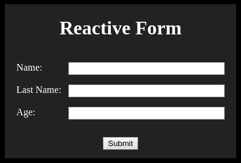

# 反应型:不要死尝试。

> 原文：<https://dev.to/thisdotmedia/reactiveforms-don-t-die-trying-pt-1-1mgo>

# [T1】简介](#intro)

本文是关于反应式表单及其在复杂场景中的用法的 3 部分系列的第 1 部分。

*从现在开始，“AngularJs”指 Angular 版本 1，“Angular”指 Angular v2+。*

这篇文章包括三个要点:

*   AngularJs 形式介绍。
*   过渡到角度模板驱动的形式。
*   反应形式的构建模块。

[](https://res.cloudinary.com/practicaldev/image/fetch/s--BMa0Hk-q--/c_limit%2Cf_auto%2Cfl_progressive%2Cq_auto%2Cw_880/https://thepracticaldev.s3.amazonaws.com/i/h69p20oqbwri5ur96mh5.png) 

<figure>

<figcaption>这是你的第一个反应式的样子。</figcaption>

</figure>

没有深入讨论 AngularJs 中表单如何工作的细节，您在模板中使用了`ngModel`来构建表单。虽然成功了，但是它是简单的、*可测试的*和*可扩展的*吗？

## 模板驱动表单

在 Angular 到来之前，每个人都很害怕，因为有许多突破性的变化。作为回应，Angular 团队创造了与 AngularJs 相似的策略。模板驱动表单就是一个很好的例子。

尽管许多事情发生了变化，但您可以用几乎相同的方式使用表单。你只需要在你的模板中使用`ngModel`来构建一个表单。

让我们使用模板驱动的表单构建上面显示的表单。您将从`name`字段开始，但是您将对每个字段重复相同的步骤。

在组件中声明`name`属性。

```
// app.component.ts
import { Component } from '@angular/core';

@Component({
  selector: 'my-app',
  templateUrl: './app.component.html',
  styleUrls: [ './app.component.scss' ]
})
export class AppComponent {
  name: string
} 
```

Enter fullscreen mode Exit fullscreen mode

将`name`加到`ngModel`上。

```
<!--app.component.html -->
<div class="form-control">
  <label>Name: </label>
  <input name="name" type="text" [(ngModel)]="name">
</div> 
```

Enter fullscreen mode Exit fullscreen mode

既然第一个输入已经准备好了，那么为其他字段做同样的事情。

现在，您应该已经准备好了您的表单。现在，让我们试着在您更改表单时打印出来。您将使用来自`ngModel`的`ngModelChanges`，它在输入改变时调用一个方法。让我们看看这个例子是如何工作的。

创建一个`nameChanged`方法。

```
// app.component.ts
nameChanged(name) {
  this.person = { ...this.person, name };
  console.log(this.person);
} 
```

Enter fullscreen mode Exit fullscreen mode

将`nameChanged`加到`ngModelChanges`上。

```
<!-- app.component.html -->

<div class="form-control">
  <label>Name: </label>
  <input name="name" 
         type="text" 
         [ngModel]="name" 
         (ngModelChange)="nameChanged($event)">
</div> 
```

Enter fullscreen mode Exit fullscreen mode

搞定了！在对每个输入都这样做之后，您应该会看到类似这样的内容。

[](https://res.cloudinary.com/practicaldev/image/fetch/s--lwn-lfRa--/c_limit%2Cf_auto%2Cfl_progressive%2Cq_66%2Cw_880/https://thepracticaldev.s3.amazonaws.com/i/fzsbqars8vk12cbobxbp.gif) 

<figure>

<figcaption>包装好后。</figcaption>

</figure>

## 反应形式

> ReactiveForm 提供了一种模型驱动的方法来处理值随时间变化的表单输入。
> *棱角分明的文档*

需要注意的是，它基于 RxJs 流，并以不可变的方式管理其内部状态。通过允许您以编程方式定义表单，您能够对它进行单元测试。它附带了一套助手方法，让你的生活更轻松。

AbstractControl:这是 FormControl、FormArray 和 FormGroup 的基本抽象类。得益于此，您可以用这些元素的任意组合来构建表单。

FormControl:这是反应式表单的主要构件。如果你还没有看过这些，你会看到很多。

```
name = new FormControl(''); 
```

Enter fullscreen mode Exit fullscreen mode

在`name`中有许多可用的属性和方法，允许您使用 FormControl。

[](https://res.cloudinary.com/practicaldev/image/fetch/s--al8FAh1m--/c_limit%2Cf_auto%2Cfl_progressive%2Cq_66%2Cw_880/https://thepracticaldev.s3.amazonaws.com/i/x32ryq17hezkum14r1wa.gif) 

<figure>

<figcaption>使用启用和禁用方法。</figcaption>

</figure>

格式:如果你需要一个数值列表，它会对你有很大帮助。

```
phones = new FormArray([
  new FormControl('')
]); 
```

Enter fullscreen mode Exit fullscreen mode

FormGroup:如果你有复杂的数据结构，你会需要这个。

```
car = new FormGroup({
  brand: new FormControl(''),
  model: new FormControl(''),
  year: new FormControl(null)
}); 
```

Enter fullscreen mode Exit fullscreen mode

FormBuilder: FormBuilder 是一个允许你更优雅地创建反应式表单的服务。在复杂的情况下，这几乎总是最佳选择。

使用哪种替代方案完全取决于你。这是两种情况下的外观。 *car 和 carFb 表现相同*T2】

```
import { FormGroup, FormControl, FormArray, FormBuilder } from '@angular/forms'

@Component({...})
class ExampleComponent {
// Using Controls directly 
  car = new FormGroup({
    brand: new FormControl(''),
    model: new FormControl(''),
    year: new FormControl(null),
    availableColors: new FormArray([])
  });

  // Using FormBuilder
  carFb = this.fb.group({
    brand: [''],
    model: [''],
    year: [null],
    availableColors: this.fb.array([])
  });

  constructor(private fb: FormBuilder) {}
} 
```

Enter fullscreen mode Exit fullscreen mode

主要区别在于，您必须注入 FormBuilder 服务。此外，不直接使用构造函数，而是使用 FormBuilder。

现在，你在等待的时刻:如何使用它。您将构建与模板驱动表单相同的表单，但使用的是反应式表单。

注入`FormBuilder`，用它创建`personForm`。

```
// app.component.ts
import { Component } from '@angular/core';
import { FormGroup, FormBuilder } from '@angular/forms';

interface Person {
  name: string;
}

@Component({
  selector: 'my-app',
  templateUrl: './app.component.html',
  styleUrls: [ './app.component.scss' ]
})
export class AppComponent {
  personForm = this.fb.group({
    name: ''
  });

  constructor(private fb: FormBuilder) {}

  submit(form: FormGroup) {
    console.log(form.value);
  }
} 
```

Enter fullscreen mode Exit fullscreen mode

将`personForm`添加到`formGroup`，将`name`添加到`formControlName`。

```
<!-- app.component.html -->
<div class="container" [formGroup]="personForm">
  <h1>Reactive Form</h1>

  <div class="form-control">
    <label>Name: </label>
    <input type="text" formControlName="name">
  </div>

  <div id="submit-control">
    <button (click)="submit(personForm)">Submit</button>
  </div>
</div> 
```

Enter fullscreen mode Exit fullscreen mode

使用`valueChanges` observable 记录表格变化。

```
ngOnInit() {
  this.personForm.valueChanges.subscribe(
    (person: Person) => console.log(person)
  );
} 
```

Enter fullscreen mode Exit fullscreen mode

你做到了！你的两个解决方案应该做完全相同的事情。继续并完成添加缺少的表单控件。

# 结论

现在，你应该对反应型的力量深信不疑了。在本系列的后续部分中，您将学习如何测试和验证它们，这是它的亮点所在。不管你是否喜欢这种形式的实现，它已经存在了，如果你还不喜欢，作为一个现代 Web 开发人员，你应该开始在日常生活中使用它。

# 代码片段:

*   [Stackblitz -模板驱动表单](https://stackblitz.com/edit/angular-tdf-example)
*   [Stackblitz -反应形式](https://stackblitz.com/edit/angular-rf-example)

# 参考文献:

*   [角度模板驱动表单](https://angular.io/guide/forms)
*   [角反作用形式](https://angular.io/guide/reactive-forms)

这篇文章是丹尼尔·马林写的，他是[这个点](https://thisdot.co)的软件开发人员。

*你可以通过@danm_t 在 Twitter 上关注他*

需要 JavaScript 咨询、指导或培训帮助吗？在 [This Dot Labs](https://thisdot.co) 查看我们的服务列表。