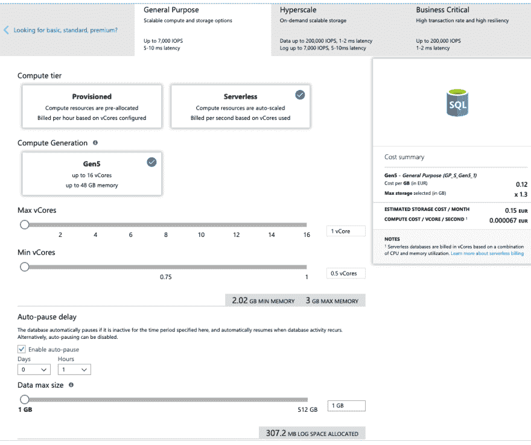

# 用 R2DBC 和一个无服务器数据库构建一个完全反应性和可伸缩的 Spring 应用程序

> 原文：<https://dev.to/azure/building-a-fully-reactive-and-scalable-spring-application-with-r2dbc-and-a-serverless-database-1jke>

## 利用关系数据库构建真正反应式微服务的挑战

2011 年，当反应式应用开始在 Java 中变得更加常见时，我经常开玩笑说，用 JDBC 访问 SQL 数据库是一种完全阻塞的机制。当然，当时人们认为 SQL 数据库已经过时，无模式的 NoSQL 解决方案将是未来 5 年的标准。春天死了！SQL 数据库将是下一个死亡！

奇怪的是，多年以后，Spring 和 SQL 数据库仍然统治着世界...但现在它们都在一个反应式、云原生和无服务器架构中完美地工作！

在这篇博文中，我们将看到如何使用以下技术构建这样一个应用程序:

*   Spring Webflux，所以我们有反应式 REST 端点
*   [R2DBC](https://github.com/r2dbc) ，因此我们使用新的反应式 SQL 驱动程序，使我们的应用程序从数据库到 REST 端点完全反应
*   SQL Server 的无服务器版本，因此我们可以根据需要扩展数据库

**警告**我们在这里使用的许多技术，包括 R2DBC，都是非常新的技术，尚未投入生产。我们正在构建一个工作应用程序，我们希望这篇文章将有助于传播和稳定这些技术，但使用它们要自担风险！

## 示例应用

我们正在开发一个简单的 Spring Webflux 微服务，它可以与 SQL 数据库对话。最终代码可在 https://github.com/jdubois/spring-reactive-sql-server 的 GitHub 上获得。

## 无服务器 SQL Server

并非所有数据库都有 R2DBC 的反应式驱动程序，这就是我们在这里选择 SQL Server 的原因。另一个原因是，它有一个“无服务器”选项，只需很少的钱。事实上，SQL Server 的可扩展性选项令人印象深刻，因为它是唯一具有以下三个选项的云数据库:

*   极高的性能、可用性和存储(高达 100 To！)，带有[超大规模选项](https://docs.microsoft.com/en-us/azure/sql-database/sql-database-service-tier-hyperscale/?WT.mc_id=devto-blog-judubois)
*   使用[弹性数据库池](https://docs.microsoft.com/en-us/azure/sql-database/sql-database-elastic-pool/?WT.mc_id=devto-blog-judubois)优化性价比和可扩展性
*   成本非常低，并且按需定价，使用(我的最爱！)[无服务器数据库实例](https://docs.microsoft.com/en-us/azure/sql-database/sql-database-serverless/?WT.mc_id=devto-blog-judubois)

我们将在这里使用“无服务器”选项，因此我们可以以极低的价格构建一切:转到[Azure 门户](https://portal.azure.com/?WT.mc_id=devto-blog-judubois)并选择“SQL 数据库”:

[](https://res.cloudinary.com/practicaldev/image/fetch/s--84WahPVm--/c_limit%2Cf_auto%2Cfl_progressive%2Cq_auto%2Cw_880/https://thepracticaldev.s3.amazonaws.com/i/feaoqb4ksbcf0oiokleg.png)

我们选择了最便宜的选项:我们的数据库每月花费 0.15 欧元，外加每秒 0.000067 欧元(因此一个小时大约是 0.24 欧元)。这对开发或测试环境来说非常好，因为只有在使用时才计费。

为了创建数据库模式，我们在这里有一个简单的脚本:

```
CREATE TABLE person (
    id BIGINT NOT NULL IDENTITY PRIMARY KEY,
    first_name VARCHAR(100),
    last_name VARCHAR(100),
    company VARCHAR(100)
) 
```

在数据库上运行这个脚本有很多选择，但最简单的是使用在线编辑器，它可以通过 Azure 门户网站获得:

[](https://res.cloudinary.com/practicaldev/image/fetch/s--FA9UgSMm--/c_limit%2Cf_auto%2Cfl_progressive%2Cq_auto%2Cw_880/https://thepracticaldev.s3.amazonaws.com/i/9v13odbx7uqydxdj9ck6.png)

## R2DBC 的用法和配置

R2DBC 是 Java 反应式驱动的规范。更具体地说，我们将使用 [RD2BC SQL Server](https://github.com/r2dbc/r2dbc-mssql) ，它是微软 SQL Server 的实现。

我们在使用它时遇到了相当多的问题，例如[这个恼人的 SSL bug](https://github.com/r2dbc/r2dbc-mssql/issues/77) ，这就是为什么我们在这里使用快照发布:

```
<dependency>
    <groupId>io.r2dbc</groupId>
    <artifactId>r2dbc-mssql</artifactId>
    <version>0.8.0.BUILD-20190819.142517-35</version>
</dependency>
<dependency>
    <groupId>org.springframework.data</groupId>
    <artifactId>spring-data-r2dbc</artifactId>
    <version>1.0.0.gh-151-SNAPSHOT</version>
</dependency> 
```

这些问题目前正在由 Spring 团队解决，一旦有稳定的发布，我们将尽快更新示例项目。

## 弹簧配置为 R2DBC

有一个 [Spring Boot 启动器](https://spring.io/blog/2019/05/15/spring-data-r2dbc-1-0-m2-and-spring-boot-starter-released)自动配置 R2DBC 与 Spring Boot，或者你当然可以手动配置 R2DBC，就像我们在这里做的:

```
 @Bean
    public MssqlConnectionFactory connectionFactory() {
        log.info("Connecting to database '{}'...", host);
        return new MssqlConnectionFactory(MssqlConnectionConfiguration.builder()
                .host(host)
                .port(1433)
                .database(database)
                .username(username)
                .password(password)
                .build());
    } 
```

## 数据访问代码有 Spring 数据和 R2DBC

好消息是，Spring Data 部分地与 R2DBC 一起工作:您不会拥有像动态 SQL 查询生成这样的所有特性，但是大部分框架都可以工作，这意味着我们可以拥有非常简单的存储库，如下所示:

```
@Repository
public interface PersonRepository extends ReactiveCrudRepository<Person, Long> {
} 
```

因此，这个存储库可以在我们的 REST 端点中使用，作为一个普通的 Spring JDBC 或 Spring JPA 存储库:

```
@RestController
public class PersonController {

    private final PersonRepository personRepository;

    public PersonController(PersonRepository personRepository) {
        this.personRepository = personRepository;
    }

    @GetMapping("/persons")
    public Flux<Person> list() {
        return personRepository.findAll();
    }
} 
```

## 结论和最终想法

我们在这里开发的示例项目可以在[https://github.com/jdubois/spring-reactive-sql-server](https://github.com/jdubois/spring-reactive-sql-server)上获得。将来，这个项目应该使用 R2DBC 的稳定版本，以及它的 starter 和[连接池](https://github.com/r2dbc/r2dbc-pool)项目，但是它已经完全可用了。

好消息是，尽管使用了一些非常前沿的特性，我们的代码看起来仍然像一个普通的 Spring Boot 应用程序:使用的大多数配置和 API 应该是 Spring 用户熟悉的，并且它像任何普通的 Spring Boot 应用程序一样运行。

这种设置的杀手锏是，由于 SQL Server 的“无服务器”版本，以及 R2DBC 和 Spring Webflux，我们能够拥有一个非常可伸缩的应用程序，其成本将根据使用情况而变化。在应用程序方面，使用 Spring Webflux 意味着我们的应用程序启动非常快(在 MacBook Pro 上只需 1 秒多一点)，并且内存使用有限。因此，我们的最终结果是高度可伸缩和高效的！