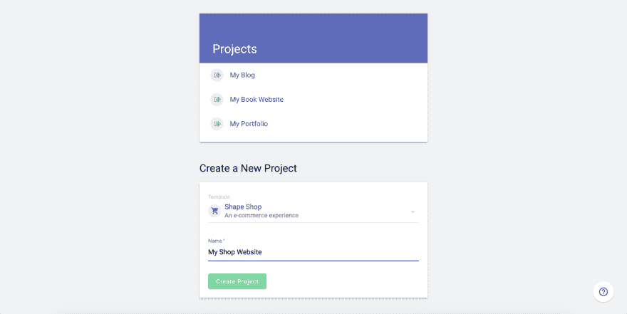
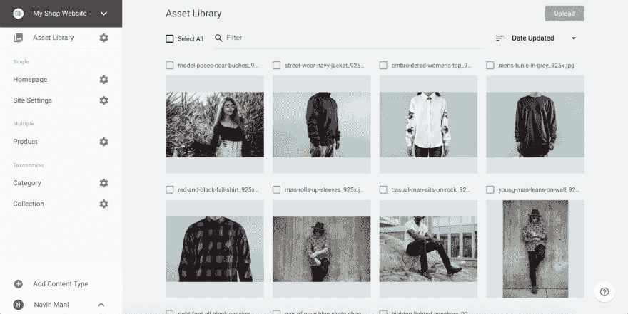
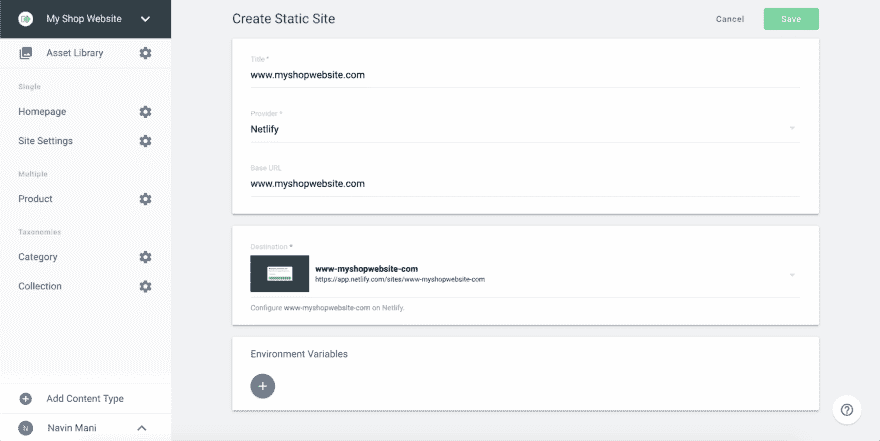
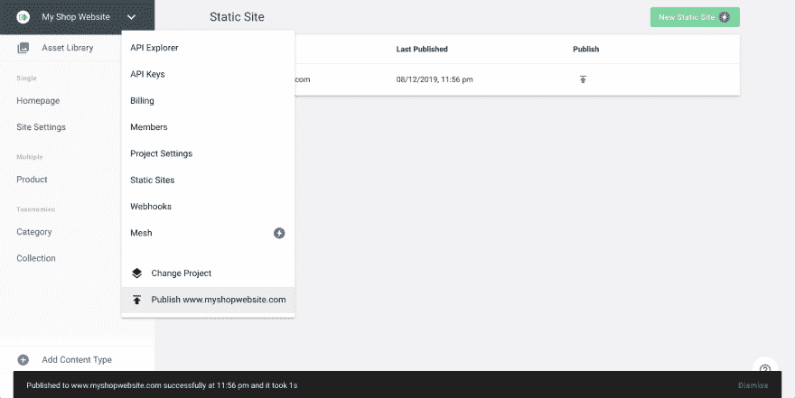
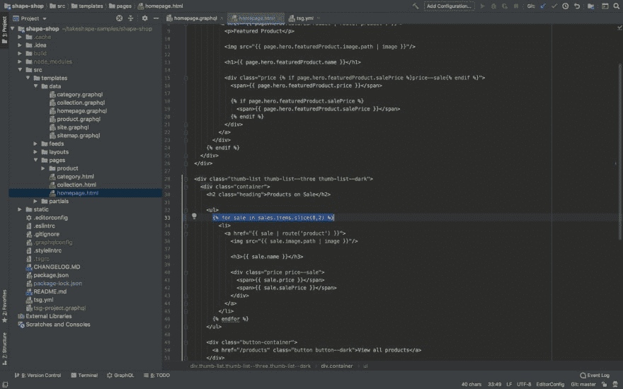
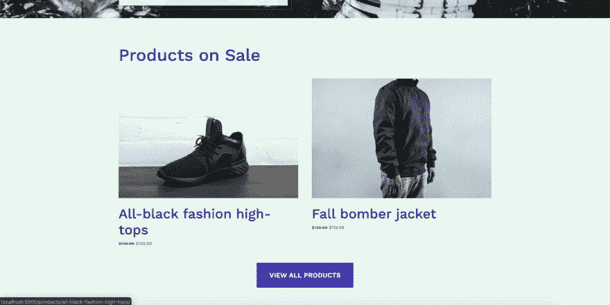

# 使用商店模板开始构建电子商务网站！

> 原文：<https://dev.to/takeshape/getting-started-building-an-e-commerce-site-with-the-shop-template-5ea>

### 让我们来看看用 TakeShape 为你的店铺快速创建一个[网页。这个模板可以用来分类你卖的任何东西，从自制的珠宝💎敬鞋子👠👞到家居装修用品🔧。](https://shape-shop.takeshapesampleproject.com/)

1.  在[app.takeshape.io/signup](//app.takeshape.io/signup)注册账户。通过 TakeShape 的 G-Suite 集成，这一过程只需点击两次鼠标即可完成。
    T3T5】

2.  有许多模板可以帮助你设计网页，我们很快就会用到它们。在这个例子中，让我们点击“造型店”然后我们可以命名我们的项目，并单击“创建项目”
    [T3】](https://res.cloudinary.com/practicaldev/image/fetch/s--5Zi4KrlH--/c_limit%2Cf_auto%2Cfl_progressive%2Cq_auto%2Cw_880/https://thepracticaldev.s3.amazonaws.com/i/9mkhgfdc2fstzzh6qqkq.png)

3.  如果我们转到左侧的导航栏，我们可以单击“Product”并浏览已经与模板集成的产品。您也可以通过点击右上角的“新产品”来添加更多产品。
    [T3】](https://res.cloudinary.com/practicaldev/image/fetch/s--wBe3hyDf--/c_limit%2Cf_auto%2Cfl_progressive%2Cq_auto%2Cw_880/https://thepracticaldev.s3.amazonaws.com/i/jkyc9p5qo5aaj6kv244g.png)

4.  我们还可以通过单击导航栏顶部的“资源库”来浏览图片、视频和其他资源。我们可以通过简单地从桌面拖动或点击右上角的“上传”来上传更多资产。
    [T3】](https://res.cloudinary.com/practicaldev/image/fetch/s--w8d6tZx6--/c_limit%2Cf_auto%2Cfl_progressive%2Cq_auto%2Cw_880/https://thepracticaldev.s3.amazonaws.com/i/9h1b2eg8ohcltbdftbx2.png)

5.  我们有一个好看的网站，让我们让世界看到它。TakeShape 可以将你的网站部署到亚马逊 S3、谷歌云存储、FTP 和 Netlify。对于本例，我们将使用一键式集成部署到 [Netlify](https://www.netlify.com/) 。让我们导航到左上方的项目名称下拉菜单→“静态站点”→“新静态站点”。在这里，我们可以将我们的 TakeShape 项目链接到 Netlify。
    T3T5】

6.  这是它与 Netlify 连接时的样子。
    [T3】](https://res.cloudinary.com/practicaldev/image/fetch/s--aZaxpD7W--/c_limit%2Cf_auto%2Cfl_progressive%2Cq_auto%2Cw_880/https://thepracticaldev.s3.amazonaws.com/i/a93qwa0pt3hku4o3plc3.png)

7.  现在让我们点击“保存”并发布！
    [T3】](https://res.cloudinary.com/practicaldev/image/fetch/s--CNj9jLb1--/c_limit%2Cf_auto%2Cfl_progressive%2Cq_auto%2Cw_880/https://thepracticaldev.s3.amazonaws.com/i/3tsts2i1kmy1os94hxy3.png)

8.  看看你的超赞网站！

9.  既然模板已经建立并运行了，是时候进行定制了。让我们克隆 Github 库，这样我们就可以个性化它了！

    ```
    git clone https://github.com/takeshape/takeshape-samples.git takeshape-samples && cd takeshape-samples/shape-shop 
    ```

10.  要安装所有依赖项，让我们运行

    `npm install`

    。仔细检查您的节点版本`node -v`，确保您使用的是`v10.16.2`。

11.  运行`npx tsg init`并按照命令提示设置本地环境和 TakeShape 之间的通信。

12.  运行`npm start`启动服务器。它将默认运行在 [http://localhost:5000](http://localhost:5000) 上。

13.  现在我们可以进行大量的定制来使用这个模板。我只想在主页上展示两个销售项目。我们可以很容易地在`homepage.html`文件中模拟它的样子。这些变化可以立即在本地站点上看到！
    [](https://res.cloudinary.com/practicaldev/image/fetch/s--rJHgIMmR--/c_limit%2Cf_auto%2Cfl_progressive%2Cq_auto%2Cw_880/https://thepracticaldev.s3.amazonaws.com/i/id10btt2oylykm5mbql6.png)

14.  运行“npx tsg deploy”将您的更改部署到 Netlify 上托管的站点。

15.  导航到该网站并实时查看您的更新！
    [T3】](https://res.cloudinary.com/practicaldev/image/fetch/s--ebyTczoO--/c_limit%2Cf_auto%2Cfl_progressive%2Cq_auto%2Cw_880/https://thepracticaldev.s3.amazonaws.com/i/vmp36cq0g2r6k399guqk.png)

在这几个步骤中，我们建立了一个初具规模的网站🆙和跑步🏃‍♀️and:我们做了一些改动，可以在网站上看到。从这里开始，♾.的可能性是无限的我们很想看看你们用这个模板创建的网站！🤩