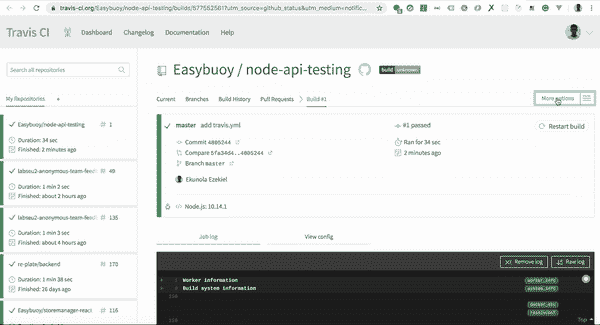
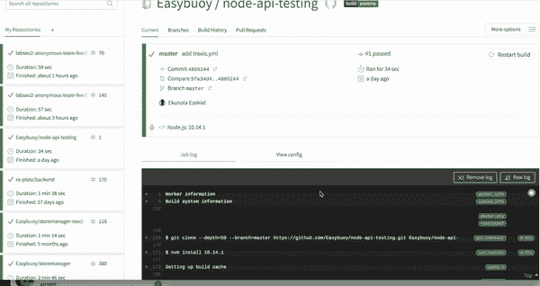
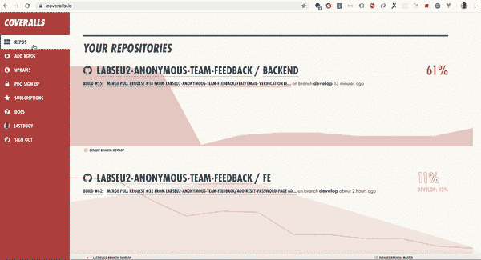
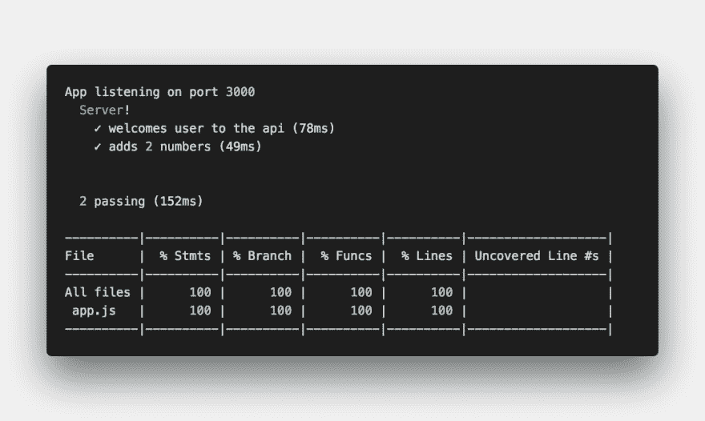
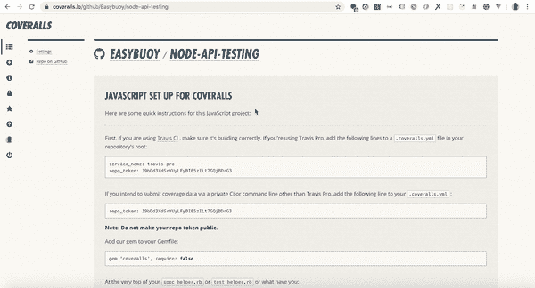

# 将持续集成工具集成到节点 api

> 原文：<https://dev.to/easybuoy/integrating-continous-integration-tools-to-node-api-3cc5>

在本文中，我将把持续集成(CI)工具集成到节点 API 中。

在我以前的文章中，我谈到了用 Mocha 和 Chai 编写节点 API 的测试，我将在那篇文章中使用的项目上进行构建。找到下面这篇文章的链接。

[](/easybuoy) [## 用 Mocha & Chai 测试节点 API

### eku nola Ezekiel 1919 年 8 月 22 日 3 分钟阅读

#testing #javascript #node #tutorial](/easybuoy/testing-node-api-with-mocha-chai-248b)

## **什么是绵集成**

持续集成(CI)是一种软件开发实践，它通过版本控制将常规的变更集成到项目中，然后运行自动化测试构建。每次提交都会触发一个构建过程，在此过程中会运行测试来确定项目中是否有任何问题。

## **为什么有这个必要**

CI 工具对于一个项目来说是必要的，因为它可以帮助快速找出哪里存在 bug，还可以确保交付/部署高质量的代码。

## **集成特拉维斯词**

如果您尚未创建帐户，请在 [Travis CI](https://travis-ci.org) 上创建一个帐户。

创建 Travis CI 帐户后，将您的 Github 连接到您的 Travis CI 帐户。

然后选择要连接到 Travis CI 的存储库。

[](https://res.cloudinary.com/practicaldev/image/fetch/s--gf8AEHeN--/c_limit%2Cf_auto%2Cfl_progressive%2Cq_66%2Cw_880/https://thepracticaldev.s3.amazonaws.com/i/1pwxp1wawu8ot0dnj5t6.gif)

下一步是在项目的根目录下创建一个`.travis.yml`文件。

然后添加下面的配置

```
language: node_js

node_js:
  - 10.14.1 
```

> 注意:在上面的配置中，我们将语言指定为 nodejs，并指定了我们希望 Travis CI 在运行测试时安装和使用的 nodejs 版本。此外，可以基于所使用的语言指定不同的配置。

将上面的配置添加到创建的`.travis.yml`文件后，将更改推送到 Github。推送之后，Travis CI 会创建一个构建并自动运行您的测试。下图显示了一个构建示例。

[](https://res.cloudinary.com/practicaldev/image/fetch/s--sHZEthCl--/c_limit%2Cf_auto%2Cfl_progressive%2Cq_66%2Cw_880/https://thepracticaldev.s3.amazonaws.com/i/4rma2w1xtsc6w5iwaha3.gif)

#### 环境变量

如果您已经在项目中使用了环境变量，也可以按照下图所示的步骤将它们添加到 Travis CI 中

[](https://res.cloudinary.com/practicaldev/image/fetch/s--j67jvXrI--/c_limit%2Cf_auto%2Cfl_progressive%2Cq_66%2Cw_880/https://thepracticaldev.s3.amazonaws.com/i/f4y12guon350d4do5w0b.gif)

#### 特拉维斯 CI 徽章

通过将 Travis 的降价信息复制到项目自述文件中，您可以将 Travis CI 状态徽章添加到项目自述文件中。下面是一个例子。

[](https://res.cloudinary.com/practicaldev/image/fetch/s--C28h4khR--/c_limit%2Cf_auto%2Cfl_progressive%2Cq_66%2Cw_880/https://thepracticaldev.s3.amazonaws.com/i/zwmoo45do3hl5kgz98f3.gif)

## **连体工作服**

在[工作服](https://coveralls.io)上创建一个帐户，如果您还没有创建帐户的话。

创建工作服帐户后，将 Github 连接到您的工作服帐户。

然后选择要连接到连体工作服的储存库。下图显示了一个示例

[](https://res.cloudinary.com/practicaldev/image/fetch/s--SLPth-fz--/c_limit%2Cf_auto%2Cfl_progressive%2Cq_66%2Cw_880/https://thepracticaldev.s3.amazonaws.com/i/6qgd0eec9x2budrnsz0v.gif)

回到我们的项目，安装下面的依赖项

```
npm i nyc coveralls --save-dev 
```

安装完依赖项后，将下面的脚本添加到`package.json`文件中。

```
"coverage":  "nyc npm test && nyc report --reporter=text-lcov | coveralls" 
```

> 注意:您可以通过在您的终端上运行命令`npm run coverage`来本地运行覆盖率。下面是覆盖率报告的示例

[](https://res.cloudinary.com/practicaldev/image/fetch/s--xnefKAVy--/c_limit%2Cf_auto%2Cfl_progressive%2Cq_auto%2Cw_880/https://thepracticaldev.s3.amazonaws.com/i/55oy1hxm0c2vkvrrdcgj.png)

然后通过在
下面添加命令来编辑`.travis.yml`文件

```
after_success:
  - npm run coverage 
```

添加上面的配置后，将更改推送到 Github。推送之后，Travis CI 会在运行测试之后创建并运行覆盖率。此流程完成后，您的工作服仪表盘将会更新。

> 注意:如果覆盖率没有反映在您的工作服仪表板上，请在您的项目根目录下创建一个`.coveralls.yml`文件，并添加下面的配置，然后将更改推送到 Github。

```
repo_token: as8dgas87dgadasdasd // repo_token is gotten from your coveralls dashboard. 
```

#### 工作服徽章

通过将 Travis 的降价信息复制到您的项目自述文件中，您可以将覆盖状态徽章添加到您的项目自述文件中。下面是一个例子。

[](https://res.cloudinary.com/practicaldev/image/fetch/s--0CzD0mKr--/c_limit%2Cf_auto%2Cfl_progressive%2Cq_66%2Cw_880/https://thepracticaldev.s3.amazonaws.com/i/pbsmtvy7ay8fmooucumz.gif)

## **结论**

在本文中，我们已经能够了解如何在我们的项目中集成 CI 工具，以及为什么需要在我们的项目中使用它们。

> 了解更多关于持续集成的信息[此处](https://www.thoughtworks.com/continuous-integration)
> 了解更多关于 Travis CI 的信息[此处](https://docs.travis-ci.com/)T5】了解更多关于工作服的信息[此处](https://docs.coveralls.io/)

如果您对本文有任何问题或反馈，请随时发表评论。

感谢阅读。

这篇文章最初发布在我的[博客](https://blog.ezekielekunola.com)