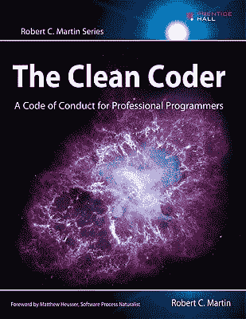
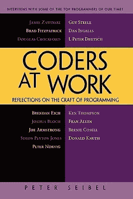
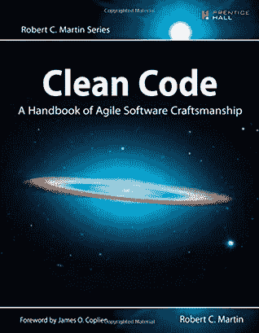
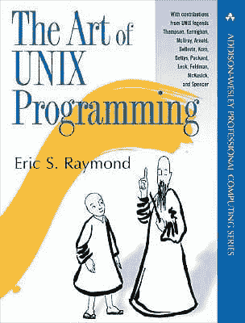
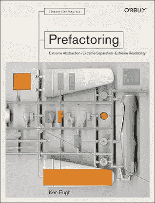

# 7 本基本编程书籍

> 原文：<https://dev.to/x-team/7-essential-programming-books-2mnm>

阅读书籍是学习或提高技能的最佳方式之一📚。如果你是小说家、数学老师、房地产投资者或开发商，这没什么不同。

这里列出了 7 本编程书籍，推荐给开发新手或想成为更好的开发人员的人。这些书都广受好评，无论你用什么语言编程都可以阅读。

### 1。务实的程序员(a .亨特& D .托马斯)

安迪·亨特和戴维·托马斯的《实用程序员》是这一领域的经典之作，经常被用作大学课程的教科书，这本书提供了实用而合理的编程建议，你可以在任何开发项目中使用。

它本质上是一系列文章，每一篇都包含一个“最佳实践”的教训，通常用一个比喻来解释。如果你是编程新手，这本书将有助于确保你从项目一开始就走在正确的轨道上。如果你是一个有经验的程序员，这本书将会强化你在编码过程中建立起来的一些信念。

### 2。干净的编码者(r .马丁)

罗伯特·塞西尔·马丁(Robert Cecil Martin)，也被称为鲍勃大叔，是《敏捷软件开发宣言》(Manifesto for Agile Software Development)的合著者，该文本推出了流行的软件开发框架 Agile，该框架现在支撑着诸如 Scrum 和 Kanban 之类的框架。

Clean Coder 并没有解释如何写出好的代码。相反，它解释了你如何成为一名更好的程序员，或者仅仅是一名优秀的专业人士。它会带你了解如何在紧迫的时间期限下表现得最好，如何创造一个良好的环境，如何对某些要求说不，等等。

### 3。工作中的编码员(p .塞贝尔)

彼得·赛贝尔在《工作中的程序员》中采访了 16 位有趣的计算机程序员。这包括道格拉斯·克洛克福特(JSON 的创始人)、彼得·诺维格(谷歌的研究总监)、弗朗西斯·艾伦(第一位获得图灵奖的女性)和肯·汤普森(UNIX 的发明者)。

这本书关注的是这些程序员如何工作，以及他们如何看待自己。它很好地展示了他们通常与其他程序员没有任何不同，并与我们这些凡人一样面临同样的问题。

### 4。干净代码(R. Martin)

这是罗伯特·马丁的第二部经典作品。《干净的代码》分为三个部分，着重于编写干净的代码的实践，给出了越来越复杂的案例研究，并以一个如果你想编写干净的代码可以遵循的启发式列表作为结论。

例如，它强调了正确命名事物的重要性，以及构建代码以反映它实际做什么的重要性。总而言之，干净的代码将帮助你区分好代码和坏代码，并有可能深刻地改变你自己编写代码的方式。

### 5。Unix 编程的艺术(e .雷蒙德)

通过 Unix 名人 Brian Kernighan、David Korn 和 Henry 斯潘塞的贡献,《Unix 编程的艺术》提供了对原始 Unix 程序员的软件设计秘密的深刻见解。

这本书里没有真正的代码。相反，它关注的是 Unix 及其社区背后的文化、历史和哲学，尽管它也讲授了关于开放源码及其软件开发过程的重要性的有价值的课程。

### 6。预制(K. Pugh)

Ken Pugh 的预因子化涵盖了编写高质量代码的编程基础。它被认为是新开发人员的必读之作，也是有经验的开发人员的必读之作。

预因子化是“重构”的一种变形。它希望它的读者从项目开始就实施好的设计技术，而不是在事后。因此，它是有用的最佳实践的集合。

### 7。好到他们不能忽视你(c .纽波特)

这本来自加州新港的非常受欢迎的书不是一本编程书，但是仍然被欣然推荐。它的主要观点是，你不应该“追随你的激情”。相反，你应该做一些有价值的事情，并真正擅长于此。激情随之而来。

这是一个有争议的观点，但这也是它成为如此受欢迎的书的原因。即使你不同意，理解纽波特的观点以及你将如何反驳它们也是值得一读的。

这是我的必读编程书籍清单。你最喜欢的编程书籍有哪些？他们在这个名单上吗？