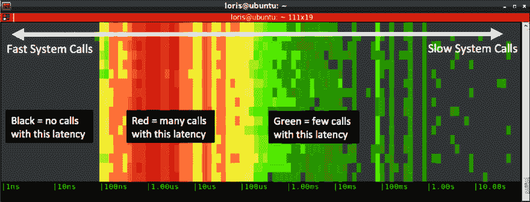

# 今天的三件事- 8/28

> 原文：<https://dev.to/goatmale/three-things-from-today-8-28-33h5>

# [8/28·T1](#828)

### 生命中的又一天。

我想养成与社区分享的习惯，所以我开始了一周一天的帖子，在那里我分享了三件我在喝下午茶时学到或发现的有趣的事情。

##### 1。 [Kubernetes。学院](https://kubernetes.academy/)

*来源:*同事
*我喜欢它的原因:*这是最近推出的，似乎是开始使用 Kubernetes 的一个很好的方式。在 Octant 和 this 之间，他们似乎正在 VMWare 中大开杀戒。

##### 2。Csysdig 工具

*来源:* [我偶然发现的 Csysdig 博文。](https://sysdig.com/blog/csysdig-explained-visually/)
我一直在使用标准的 Sysdig 命令行工具来捕获跟踪信息，供其他工程师查看，但是今天我发现了可以与 csysdig 一起使用的交互式 ncurses 接口。
你可以很容易地使用`F2`跳到容器上，然后像平常一样使用`F6`来挖掘，但是现在有很多其他的东西可以玩。

还有，漂亮的颜色:
[](https://res.cloudinary.com/practicaldev/image/fetch/s--PXFstptf--/c_limit%2Cf_auto%2Cfl_progressive%2Cq_auto%2Cw_880/https://478h5m1yrfsa3bbe262u7muv-wpengine.netdna-ssl.com/wp-content/uploads/2016/01/Spectrogram-picture-1.png)

##### 3。Python 中的“负”子流程错误代码。

*来源:* [这个 Stackoverflow 页面是我在对一个问题进行故障诊断时发现的。](https://stackoverflow.com/questions/24139389/unable-to-find-out-what-return-code-of-11-means)

我经常对退出代码进行故障诊断，以此来确定失败的原因。今天的问题是关于 Python 退出代码`-11`。隐藏在注释中的是，这些负的返回代码对应于典型的 Linux 信号。这尤其是在使用 Python 子流程模块时，不过记下这些信号以便进行故障排除还是很方便的。

```
Signal    Name    Description
SIGHUP    1    Hangup (POSIX)
SIGINT    2    Terminal interrupt (ANSI)
SIGQUIT    3    Terminal quit (POSIX)
SIGILL    4    Illegal instruction (ANSI)
SIGTRAP    5    Trace trap (POSIX)
SIGIOT    6    IOT Trap (4.2 BSD)
SIGBUS    7    BUS error (4.2 BSD)
SIGFPE    8    Floating point exception (ANSI)
SIGKILL    9    Kill(can't be caught or ignored) (POSIX)
SIGUSR1    10    User defined signal 1 (POSIX)
SIGSEGV    11    Invalid memory segment access (ANSI)
SIGUSR2    12    User defined signal 2 (POSIX)
SIGPIPE    13    Write on a pipe with no reader, Broken pipe (POSIX)
SIGALRM    14    Alarm clock (POSIX)
SIGTERM    15    Termination (ANSI)
SIGSTKFLT    16    Stack fault
SIGCHLD    17    Child process has stopped or exited, changed (POSIX)
SIGCONTv    18    Continue executing, if stopped (POSIX)
SIGSTOP    19    Stop executing(can't be caught or ignored) (POSIX)
SIGTSTP    20    Terminal stop signal (POSIX)
SIGTTIN    21    Background process trying to read, from TTY (POSIX)
SIGTTOU    22    Background process trying to write, to TTY (POSIX)
SIGURG    23    Urgent condition on socket (4.2 BSD)
SIGXCPU    24    CPU limit exceeded (4.2 BSD)
SIGXFSZ    25    File size limit exceeded (4.2 BSD)
SIGVTALRM    26    Virtual alarm clock (4.2 BSD)
SIGPROF    27    Profiling alarm clock (4.2 BSD)
SIGWINCH    28    Window size change (4.3 BSD, Sun)
SIGIO    29    I/O now possible (4.2 BSD)
SIGPWR    30    Power failure restart (System V) 
```

<svg width="20px" height="20px" viewBox="0 0 24 24" class="highlight-action crayons-icon highlight-action--fullscreen-on"><title>Enter fullscreen mode</title></svg> <svg width="20px" height="20px" viewBox="0 0 24 24" class="highlight-action crayons-icon highlight-action--fullscreen-off"><title>Exit fullscreen mode</title></svg>

##### 4。奖金！- Kubectl 描述 pod

这有点傻，但我发现当使用“描述 pod”时，我不需要输入完整的 pod 名称，它似乎是:D 的缩写

不管用。

```
kubectl get pod kubernetes-dashboard
Error from server (NotFound): pods "kubernetes-dashboard" not found 
```

<svg width="20px" height="20px" viewBox="0 0 24 24" class="highlight-action crayons-icon highlight-action--fullscreen-on"><title>Enter fullscreen mode</title></svg> <svg width="20px" height="20px" viewBox="0 0 24 24" class="highlight-action crayons-icon highlight-action--fullscreen-off"><title>Exit fullscreen mode</title></svg>

作品！

```
Name:               kubernetes-dashboard-7947fffdf5-f9vz5
Namespace:          kube-system 
```

<svg width="20px" height="20px" viewBox="0 0 24 24" class="highlight-action crayons-icon highlight-action--fullscreen-on"><title>Enter fullscreen mode</title></svg> <svg width="20px" height="20px" viewBox="0 0 24 24" class="highlight-action crayons-icon highlight-action--fullscreen-off"><title>Exit fullscreen mode</title></svg>