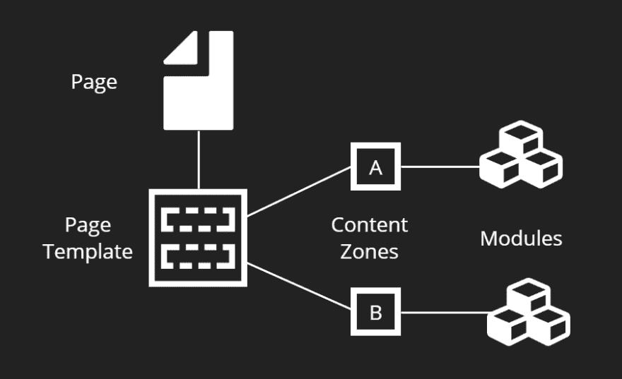
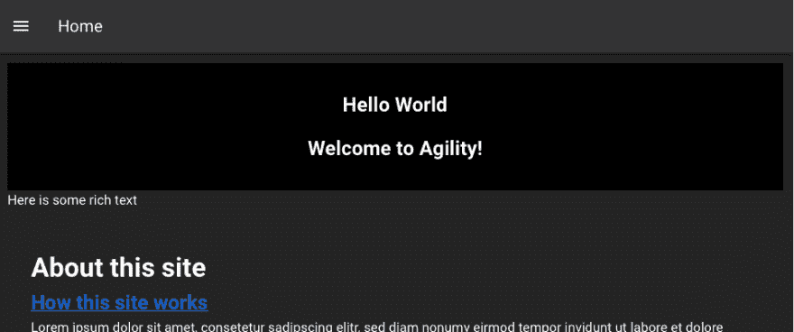
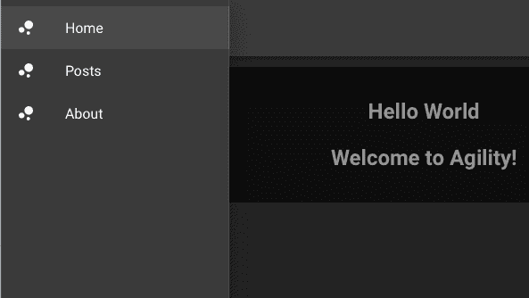

# 如何在无头 CMS 上使用 Nuxt.js

> 原文：<https://dev.to/joelvarty/how-to-use-nuxt-js-with-a-headless-cms-5el7>

Nuxt.js 是一个建立在 [Vue.js](https://vuejs.org) 之上的框架，允许静态站点生成、单页面应用和服务器端渲染。令人惊讶的是，你可以以所有这些不同的方式运行相同的代码，如果我们将它连接到 CMS，我们可以从那里为所有内容供电(包括页面路由- [因为我相信这很重要](https://agilitycms.com/resources/guide/why-agility-includes-page-management-with-its-headless-apis))。

> 声明:本教程使用的是 Agility CMS，我很喜欢，但我也在这家公司工作。如果这困扰着你，请理解你可以将本教程应用于许多其他的无头 CMS 供应商。

如果你只是想在你的应用程序中使用 Vue.js，并且不需要 Nuxt 提供的所有东西，看看我之前的帖子吧，它告诉你必须这么做。

# 动态页面路由

我们将告诉 Nuxt 如何从我们的 CMS 渲染动态页面路径。我们将能够以静态和 SPA 模式导航这些路线。

大多数无头 CMS 系统不允许在 CMS 本身中定义页面路由，但是 Agility CMS 能够以平面或嵌套格式生成 Sitemap JSON，这允许您在“区域”中呈现包含模块的页面。[参见敏捷文档](https://help.agilitycms.com/hc/en-us/articles/360032554331-Page-Management-in-a-Headless-CMS)了解更多相关信息。

[](https://res.cloudinary.com/practicaldev/image/fetch/s--JwBHxw5C--/c_limit%2Cf_auto%2Cfl_progressive%2Cq_auto%2Cw_880/https://help.agilitycms.com/hc/article_attachments/360036409251/mceclip1.png)

作为一名开发人员，允许内容编辑在站点地图中的任何地方创建页面听起来可能有些吓人。然而在现实中，这让你的生活更容易。Agility 允许您的编辑人员向内容管理器中的树添加页面，还允许您定义动态页面，这些页面是从列表中呈现的，比如博客帖子或文章。这个例子将处理这两种情况。

## 获取代码

我将带您浏览的代码可以在 GitHub 中找到。克隆此回购开始:[https://github.com/joelvarty/agility-nuxt-app](https://github.com/joelvarty/agility-nuxt-app)

运行该应用程序时，您将看到的内容来自我创建的 Agility CMS 实例——在这篇文章的底部，我将向您展示如何创建您自己的免费实例，并将您的 API 键连接到该代码。

## 本地运行

正如我上面所说，Nuxt 很棒，因为你可以在服务器端渲染的“通用”模式下运行它，或者在客户端渲染的“SPA”模式下运行它。

我已经创建了几个不同的脚本来运行这个网站。

```
# run the site in SPA mode with client rendering only
> npm run spa

# run the site in Universal mode with server rendering
> npm run dev 
```

<svg width="20px" height="20px" viewBox="0 0 24 24" class="highlight-action crayons-icon highlight-action--fullscreen-on"><title>Enter fullscreen mode</title></svg> <svg width="20px" height="20px" viewBox="0 0 24 24" class="highlight-action crayons-icon highlight-action--fullscreen-off"><title>Exit fullscreen mode</title></svg>

[](https://res.cloudinary.com/practicaldev/image/fetch/s--SvATEVC5--/c_limit%2Cf_auto%2Cfl_progressive%2Cq_auto%2Cw_880/https://thepracticaldev.s3.amazonaws.com/i/kbzkhexsvpt8wek750it.png)

当你运行这个站点时，你会注意到我已经在我的 Nuxt 安装中包含了 Vuetify。这增加了一些开销，但看起来很漂亮。如果你点击左上角的汉堡菜单，你会看到一个导航菜单飞出，映射到 CMS 的顶层页面。

[](https://res.cloudinary.com/practicaldev/image/fetch/s--1Zt1w4Ko--/c_limit%2Cf_auto%2Cfl_progressive%2Cq_auto%2Cw_880/https://thepracticaldev.s3.amazonaws.com/i/nliax8zwlzaswt48741l.png)

如果你点击“文章”页面，你会看到一个列表中的项目列表。点击其中一个，你就会看到这篇文章的“详细信息”。超级简单，却显示了潜力。

[](https://res.cloudinary.com/practicaldev/image/fetch/s--QAHIotIn--/c_limit%2Cf_auto%2Cfl_progressive%2Cq_auto%2Cw_880/https://thepracticaldev.s3.amazonaws.com/i/g4lxjtpn31w4vz39c1ts.png)

## 静态站点生成

Nuxt 提供了一个“generate”命令，可以遍历我们所有的路径，并为它们生成静态 html 文件。下面我将向您展示我们如何利用这一点。

# 引擎盖下

让我们深入了解这里实际发生了什么，这样您就可以看到我们是如何利用 CMS API 来构建这个站点的。

### 配置

Agility CMS 要求我们输入 GUID 和 API 键，以及一些其他值。我把这些放在一个名为 **agility.config.js** 的文件中

我还指定了共享内容列表的引用名，我们需要从这些列表中获取内容来静态呈现站点。

#### [T1】agility . config . js](#agilityconfigjs)

```
export default {
    guid: '---', //Set your guid here
    fetchAPIKey: '---', // Set your fetch apikey here
    previewAPIKey: '---', // set your preview apikey
    languageCode: 'en-us',
    channelName: 'website',
    isPreview: false,
    caching: {
        maxAge: 0
    },
    sharedContent: ["posts"]
} 
```

<svg width="20px" height="20px" viewBox="0 0 24 24" class="highlight-action crayons-icon highlight-action--fullscreen-on"><title>Enter fullscreen mode</title></svg> <svg width="20px" height="20px" viewBox="0 0 24 24" class="highlight-action crayons-icon highlight-action--fullscreen-off"><title>Exit fullscreen mode</title></svg>

### 动态路由

Nuxt 的所有路由通常存储在 **pages** 文件夹中，但是我们也可以使用 *extendRoutes* 方法从我们的 API 生成动态路由。这里我们有一个 catch-all 将所有路线发送到一个名为 **AgilityPage.vue** 的页面组件。

您还可以看到，我们已经注册了一个中间件组件，它完成了对 CMS 的大部分 API 访问。这是在 **next.config.js**
中设置的

```
router: {
    middleware: 'agility-middleware',
    extendRoutes(routes, resolve) {
        routes.push({
            name: 'custom',
            path: '*',
            component: resolve(__dirname, 'agility/AgilityPage.vue')
        })
    }
}, 
```

<svg width="20px" height="20px" viewBox="0 0 24 24" class="highlight-action crayons-icon highlight-action--fullscreen-on"><title>Enter fullscreen mode</title></svg> <svg width="20px" height="20px" viewBox="0 0 24 24" class="highlight-action crayons-icon highlight-action--fullscreen-off"><title>Exit fullscreen mode</title></svg>

### 静态页面路线

除了我们的动态路由，我们还可以使用我们的 **next.config.js**
的 **generate** 属性从我们的 API 生成动态路由

```
generate: {
    fallback: true,
    routes: function () {

        //generate all the routes from the sitemap API
        const agilityClient = new AgilityClient();
        const api = agilityClient.client;

        return api.getSitemapFlat({
            channelName: agilityClient.config.channelName,
            languageCode: agilityClient.config.languageCode
        }).then((sitemapFlat) => {

            return Object.keys(sitemapFlat).map((path, index) => {
                const retPath = index == 0 ? "/" : path;
                return {
                    route: retPath,
                    payload: sitemapFlat
                }
            })
        })
    }
} 
```

<svg width="20px" height="20px" viewBox="0 0 24 24" class="highlight-action crayons-icon highlight-action--fullscreen-on"><title>Enter fullscreen mode</title></svg> <svg width="20px" height="20px" viewBox="0 0 24 24" class="highlight-action crayons-icon highlight-action--fullscreen-off"><title>Exit fullscreen mode</title></svg>

## 使用敏捷页面模板和模块

Agility CMS 使用页面模板来定义如何呈现页面。我们可以使用组件来呈现这些，以及可以由 Agility 的内容编辑器添加到页面的模块。

我已经把它们放在了**组件/模板**和**组件/模块**文件夹中，我们把它们注册在一个名为 **agility.components.js** 的文件中。

你可以看到我已经注册了 4 个模块和 1 个页面模板。

```
// Our Agility Modules 
import RichTextArea from './components/modules/RichTextArea'
import PostsListing from './components/modules/PostListing'
import PostDetails from './components/modules/PostDetails'
import Jumbotron from './components/modules/Jumbotron'

// Our Agility PageTemplates 
import OneColumnTemplate from './components/templates/OneColumnTemplate'

export default {
    moduleComponents: {
        RichTextArea,
        PostsListing,
        Jumbotron,
        PostDetails
    },
    pageTemplateComponents: {
        OneColumnTemplate
    }
} 
```

<svg width="20px" height="20px" viewBox="0 0 24 24" class="highlight-action crayons-icon highlight-action--fullscreen-on"><title>Enter fullscreen mode</title></svg> <svg width="20px" height="20px" viewBox="0 0 24 24" class="highlight-action crayons-icon highlight-action--fullscreen-off"><title>Exit fullscreen mode</title></svg>

### 页面模板组件

页面模板由一个或多个 ContentZone 模块组成，这些模块有一个在 Agility 中定义的名称，我们可以传递从 AgilityPage.vue 组件获得的属性，以便我们的模块可以使用它。

```
<template>
  <div class="one-column-template">
    <ContentZone
      name="MainContentZone"
      :page="page"
      :pageInSitemap="pageInSitemap"
      :dynamicPageItem="dynamicPageItem"
      :sharedContent="sharedContent"
      :sitemapFlat="sitemapFlat"
      :sitemapNested="sitemapNested"
    />
  </div>
</template>

<script>
import ContentZone from '../../agility/AgilityContentZone'
export default {
  props: {
    page: Object,
    pageInSitemap: Object,
    dynamicPageItem: Object,
    sharedContent: Object,
    sitemapFlat: Object,
    sitemapNested: Array
  },
  components: {
    ContentZone
  }
}
</script> 
```

<svg width="20px" height="20px" viewBox="0 0 24 24" class="highlight-action crayons-icon highlight-action--fullscreen-on"><title>Enter fullscreen mode</title></svg> <svg width="20px" height="20px" viewBox="0 0 24 24" class="highlight-action crayons-icon highlight-action--fullscreen-off"><title>Exit fullscreen mode</title></svg>

### 模块组件

模块也是由组件定义的，它们构建起来非常简单快速，因为所有来自 Agility 的强类型内容数据都作为道具传递给了它。

这里是超简单的大屏幕模块:

```
<template>
  <section class="jumbotron">
    <h1>{{item.fields.title}}</h1>
    <h2>{{item.fields.subTitle}}</h2>
  </section>
</template>

<script>
export default {
  props: {
    contentID: Number,
    item: Object,
    page: Object,
    pageInSitemap: Object,
    dynamicPageItem: Object
  }
};
</script> 
```

<svg width="20px" height="20px" viewBox="0 0 24 24" class="highlight-action crayons-icon highlight-action--fullscreen-on"><title>Enter fullscreen mode</title></svg> <svg width="20px" height="20px" viewBox="0 0 24 24" class="highlight-action crayons-icon highlight-action--fullscreen-off"><title>Exit fullscreen mode</title></svg>

## 部署

我们实际上希望部署该站点两次:我们希望能够在 SPA 模式下使用它来预览 CMS 中的内容更改，然后再进行实时发布，我们希望为生产进行静态模式部署。

我设置了两个不同的 Netlify 站点来处理这些情况，我们只需在部署命令中指定站点 ID，就可以将不同的输出发送到每个位置。您可能需要首先安装 netlify cli。

```
npm install netlify-cli -g 
```

<svg width="20px" height="20px" viewBox="0 0 24 24" class="highlight-action crayons-icon highlight-action--fullscreen-on"><title>Enter fullscreen mode</title></svg> <svg width="20px" height="20px" viewBox="0 0 24 24" class="highlight-action crayons-icon highlight-action--fullscreen-off"><title>Exit fullscreen mode</title></svg>

#### SPA 模式进行预览

```
#BUILD SPA / PREVIEW SITE
> npm run build-spa

#DEPLOY SPA / PREVIEW SITE
> netlify deploy --dir=dist --prod --site=SITEID123XYZ 
```

<svg width="20px" height="20px" viewBox="0 0 24 24" class="highlight-action crayons-icon highlight-action--fullscreen-on"><title>Enter fullscreen mode</title></svg> <svg width="20px" height="20px" viewBox="0 0 24 24" class="highlight-action crayons-icon highlight-action--fullscreen-off"><title>Exit fullscreen mode</title></svg>

看它在这里运行:[[https://nuxt-preview.netlify.com](https://nuxt-preview.netlify.com)

#### 静态生产模式

```
#GENERATE STATIC SITE
npm run generate

#DEPLOY PRODUCTION STATIC SITE
netlify deploy --dir=dist --open --prod --site=SITEID456ABC 
```

<svg width="20px" height="20px" viewBox="0 0 24 24" class="highlight-action crayons-icon highlight-action--fullscreen-on"><title>Enter fullscreen mode</title></svg> <svg width="20px" height="20px" viewBox="0 0 24 24" class="highlight-action crayons-icon highlight-action--fullscreen-off"><title>Exit fullscreen mode</title></svg>

点击这里查看:[[https://nuxt-prod.netlify.com](https://nuxt-prod.netlify.com)

# 自己动手

如果你想开始在 CMS 中使用你自己的内容，我推荐免费的 Agility CMS，你可以在这里注册。

## 敏捷 CMS 文档

Agility 有一个文档，专门让您从其内容获取 API 中获取内容。[点击这里查看](https://help.agilitycms.com/hc/en-us/sections/360006070691-Content-Fetch-API)。