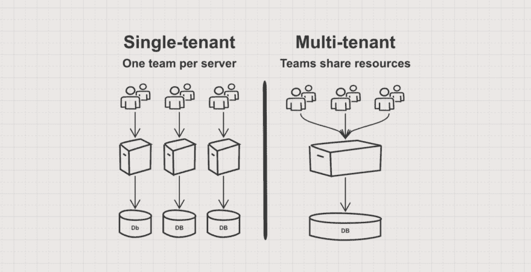
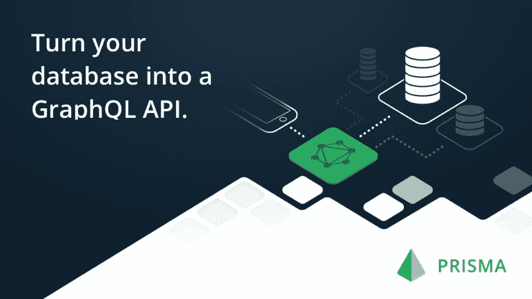

# 用 Prisma 构建多租户应用程序

> 原文：<https://dev.to/errorname/building-a-multi-tenant-application-with-prisma-37b8>

## “等等，什么是多租户应用？”

很高兴你问了，下面是维基百科的定义:

> *术语“**软件多租户**”指的是一种软件架构，其中一个软件实例运行在一台服务器上，为多个租户服务。*

[](https://res.cloudinary.com/practicaldev/image/fetch/s--gBsdKLag--/c_limit%2Cf_auto%2Cfl_progressive%2Cq_auto%2Cw_880/https://thepracticaldev.s3.amazonaws.com/i/fqhcine1vwbhg9qx21df.png)

例如，Slack 是一个多租户应用程序，[prisma.slack.com](https://prisma.slack.com)是它的租户之一。

“好吧，我知道了。但是我为什么要做多租户应用呢？”

打个比方，你的应用是一栋楼，给每一组用户一套公寓。因此，所有这些租户共享相同的墙壁、水电网络、废物处理等。:你们在共同承担成本！

在我们的软件世界中，它甚至更进一步:由于每个“公寓”都是由相同的“计划”(即相同的一段代码)组成的，您可以部署一次您的更改，它们将应用于每个租户！

*“好吧，就基础架构复杂性和部署时间而言，多租户是我降低成本的好方法……听起来很有趣！我该怎么做呢？”*

嗯，你可以使用 **[Prisma](https://prisma.io) 服务功能**。遵循指南:

* * *

# 使用 Prisma 进行多租户

[](https://res.cloudinary.com/practicaldev/image/fetch/s--u7S9sDLp--/c_limit%2Cf_auto%2Cfl_progressive%2Cq_auto%2Cw_880/https://thepracticaldev.s3.amazonaws.com/i/bche5bz0kbjvei528u0i.jpeg)

对于本文的其余部分，我将假设您已经了解 Prisma 及其工作原理。如果你不知道，Prisma 是一个非常棒的库**，它取代了传统的 ORM**。我强烈建议你[发现它](https://www.prisma.io/)并跟随[入门教程](https://www.prisma.io/docs/get-started/01-setting-up-prisma-new-database-JAVASCRIPT-a002/)。

## 棱镜服务

Prisma 服务由一个 **GraphQL 数据模型**和一个**名称/阶段**标识来定义。Prisma 服务器可以配置为托管多个 Prisma 服务。
每个 Prisma 服务正好有一个端点，由**服务器主机**、**服务名**和**服务阶段**组成。

[](https://res.cloudinary.com/practicaldev/image/fetch/s--dtzsY5fV--/c_limit%2Cf_auto%2Cfl_progressive%2Cq_auto%2Cw_880/https://thepracticaldev.s3.amazonaws.com/i/h12ytzpi3ndf1j93e10d.png)

> *如果您不提供服务名称或阶段，它们都将被赋予值“default”。*

为了将 Prisma 服务用于多租户应用程序，我们可以将**相同的 GraphQL 数据模型部署到多个服务**。

## 使用单租户启动我们的应用

作为一个例子，我们将采用我们之前的例子:Slack。然后让我们从数据模型开始，创建一个用户和一个帖子:

```
#datamodel.graphql  type  User  {  id:  ID!  name:  String!  posts:  [Post!]!  }  type  Post  {  id:  ID!  title:  "String!"  content:  String!  author:  User!  } 
```

Enter fullscreen mode Exit fullscreen mode

然后，将您的数据模型部署到`https://localhost:4466/company_a/dev`。

我们现在应该为我们的应用程序准备好了一个服务。我们来写服务器:

```
// server.js

const { Prisma } = require('./generated/prisma-client')
const { ApolloServer } = require('apollo-server')
const resolvers = require('./resolvers')

const prisma = new Prisma({
  endpoint: 'https://localhost:4466/company_a/dev'
})

const server = new ApolloServer({
  resolvers: resolvers,
  context: ctx => ({
    ...ctx,
    prisma
  })
})

/*------------------------*/
/* In your resolvers file */
module.exports = {
  Query: {
    users: (_, args, ctx) => ctx.prisma.users(args)
  }
} 
```

Enter fullscreen mode Exit fullscreen mode

如果您运行您的服务器，您应该能够从`company_a/dev`服务中查询用户。这是一个很好的开始，但是由于我们已经将客户的服务硬编码在我们的服务器中，添加新的租户并不容易。

## 演变成多租户应用

为了使我们的服务器成为多租户，我们将使用[prisma-多租户](https://www.npmjs.com/package/prisma-multi-tenant)包。

[](https://www.npmjs.com/package/prisma-multi-tenant)T3】

```
npm install prisma-multi-tenant 
```

Enter fullscreen mode Exit fullscreen mode

然后，将您的数据模型重新部署到另外两个服务:

*   `https://localhost:4466/company_a/prod`
*   `https://localhost:4466/company_b/dev`

最后，我们将把我们的服务器文件改为如下:

```
// server.js

const { MultiTenant } = require('prisma-multi-tenant')
const { Prisma } = require('./generated/prisma-client')
const { ApolloServer } = require('apollo-server')
const resolvers = require('./resolvers')

const multiTenant = new MultiTenant({
  instanciate: (name, stage) =>
    new Prisma({
      endpoint: `https://localhost:4466/${name}/${stage}`,
      // Here, you are in charge of extracting the name/stage
      // of the service from the request.
      // As an example, we extract it from the headers
      nameStageFromReq: req => req.headers['prisma-service'].split('/')
    })
})

const server = new ApolloServer({
  resolvers: resolvers,
  context: ctx => ({
    ...ctx,
    prisma: multiTenant.current(ctx.req)
  })
})

/*------------------------*/
/* In your resolvers file */

// Did you notice we haven't touched our resolvers?
module.exports = {
  Query: {
    users: (_, args, ctx) => ctx.prisma.users(args) 
  }
} 
```

Enter fullscreen mode Exit fullscreen mode

如您所见，我们创建了一个`MultiTenant`对象，并在 ApolloServer 的上下文选项中使用了它的`current`方法。我们也没有改变我们的解析器，好像我们仍然在处理一个单独的租户。

> *更多关于[prisma-多租户](https://www.npmjs.com/package/prisma-multi-tenant)的细节，查看其[自述](https://www.npmjs.com/package/prisma-multi-tenant)。*

现在，当您查询您的服务器时，添加带有您想要访问的服务的名称/阶段的 HTTP 头(例如“T4”)，它将查询正确的服务。

啊，就这样。您有一台多租户服务器。

“等等……这就是我们要做的？使用库并用 HTTP 头查询？真的吗？”

我们还没有编写类似 Slack 的应用程序，但是**是的，这是你的多租户应用程序**的基础。Prisma 处理多个数据库，你的服务器不会关心哪个。它会工作的。此外，您的服务器现在可以部署一次，并处理来自任何租户的请求！

* * *

**我希望我已经向您展示了为什么 Prisma services 特性是轻松构建多租户应用程序的最佳选择，并且对您的[开发者体验](https://hackernoon.com/developer-experience-dx-devs-are-people-too-6590d6577afe)的影响尽可能小。**

在 [Zenika](https://github.com/zenika-open-source/FAQ) ，我们构建了一个名为 FAQ 的生产就绪型多租户应用程序，以创建一个“公司合作者内部知识数据库”，帮助减少关于我们内部流程的经常性电子邮件/slack 问题。我们必须克服使用多租户的挑战:同步部署(prisma 和第三方)、开发人员工具、服务的持续集成…

如果你有兴趣知道我们是如何处理这些问题的，请不要犹豫去查看 github 库或在 T2 的推特上联系我！