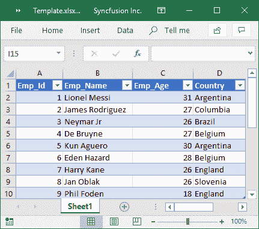
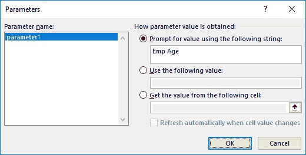
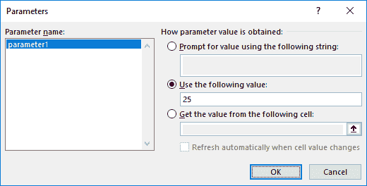
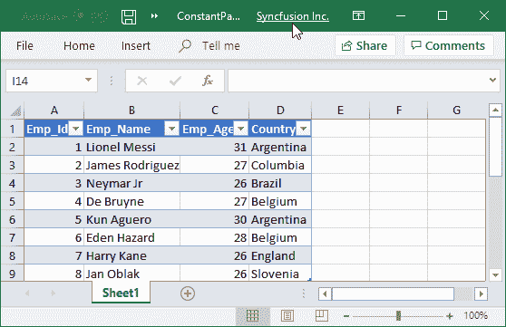
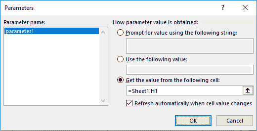

# 如何用 C#将数据从 SQL Server 导出到 Excel 表

> 原文：<https://dev.to/syncfusion/how-to-export-data-from-sql-server-to-excel-table-in-c-fo7>

微软 Excel 以存储、分析和可视化数据而闻名。[数据库](https://en.wikipedia.org/wiki/Database)非常适合存储大量数据。有时，您可能需要在 Excel 中使用或分析数据库中的数据。

在本文中，我们将了解 [Syncfusion 是如何实现的。NET Excel (XlsIO)库](https://www.syncfusion.com/excel-framework/net)帮助您通过外部数据连接将数据从 [SQL Server](https://en.wikipedia.org/wiki/Microsoft_SQL_Server) 导出到 C#中的 Excel，使用查询参数导出过滤后的数据，并在其数据库更新时以编程方式刷新 Excel 数据。

在我们了解如何将数据从 SQL Server 导出到 Excel 之前，您必须了解 Excel 表，因为 Microsoft Excel 允许将数据从 SQL Server 导出到 Excel 表。Excel 表格允许您通过执行排序、筛选、计算和格式化等操作来快速、轻松地分析数据。

## **如何将数据从 SQL Server 导出到 Excel**

在这篇博客中，我们将使用从数据库映射到 Excel 表的 **Employee_Details** 表。我们使用下面的查询从数据库中填充一个 Excel 表格:

```
select * from Employee_Details; 
```

<figure>

[](https://res.cloudinary.com/practicaldev/image/fetch/s--mU4bZGhe--/c_limit%2Cf_auto%2Cfl_progressive%2Cq_auto%2Cw_880/https://www.syncfusion.com/blogs/wp-content/uploads/2019/08/Excel-table-with-external-connection.png)

<figcaption>Data Exported from SQL Server to Excel</figcaption>

</figure>

让我们看看使用 C#将数据从 SQL Server 导出到 Excel 的步骤。在继续以下步骤之前，请参考[入门指南](https://help.syncfusion.com/file-formats/xlsio/getting-started)了解创建 Excel 文件所需的组件。

**第一步:**创建 ***ExcelEngine*** 和 ***IApplication*** 的实例。这就像打开一个 Excel 应用程序。

**步骤 2:** 用一张工作表创建一个新的工作簿实例。

**第三步:**创建一个连接字符串，建立与 SQL Server 数据库的连接，查询字符串，从类似 ADO.NET 的 SQL Server 数据库中检索数据。

**步骤 4:** 用连接字符串和查询字符串建立到工作簿的连接。

**第五步:**使用* **IWorksheet 的 AddEx 方法创建一个带有外部数据连接的 Excel 表格。ListObjects* ** 集合类。

**步骤 6:** 使用* **IListObject* ** 类的 ***Refresh()*** 方法，从数据库中提取数据并保存到 Excel 中。

**第 7 步:**保存 Excel 文件并关闭其实例。

下面的代码示例显示了如何将数据从数据库导出到 Excel 表。

```
private void btnCreateExcel_Click(object sender, EventArgs e)
{
    using (ExcelEngine excelEngine = new ExcelEngine())
    {
        IApplication application = excelEngine.Excel;
        application.DefaultVersion = ExcelVersion.Excel2016;

        //Create a new workbook 
        IWorkbook workbook = application.Workbooks.Create(1);
        IWorksheet sheet = workbook.Worksheets[0];

        if (sheet.ListObjects.Count == 0)
        {
            //Estabilishing the connection in the worksheet 
            string connectionString = "Server=myServerAddress;Database=myDataBase;User Id=myUsername;Password = myPassword";

            string query = "SELECT * FROM Employees";

            IConnection connection = workbook.Connections.Add("SQLConnection", "Sample connection with SQL Server", connectionString, query, ExcelCommandType.Sql);

            //Create Excel table from external connection. 
            sheet.ListObjects.AddEx(ExcelListObjectSourceType.SrcQuery, connection, sheet.Range["A1"]);
        }

        //Refresh Excel table to get updated values from database 
        sheet.ListObjects[0].Refresh();

        sheet.UsedRange.AutofitColumns();

        //Save the file in the given path 
        Stream excelStream = File.Create(Path.GetFullPath(@"Output.xlsx"));

        workbook.SaveAs(excelStream);
        excelStream.Dispose();
    }
} 
```

## **如何在 Excel 表中使用查询参数导出数据**

要将数据从 SQL Server 导出到 Excel 表，需要使用查询。查询总是返回相同的结果，并且它们的数据在运行时不能被过滤。因此，Microsoft Excel 提供了选项**参数**，用于获取动态值，将其应用于查询，并返回过滤后的结果。可以通过提示事件、常量或 Excel 范围来设置参数。开发人员可以编写一个查询，让最终用户自己过滤数据。作为参数输入的值在 SQL 查询的 **WHERE** 子句中使用。可用的参数类型有:

*   提示参数
*   恒定参数
*   范围参数

让我们详细看看这些参数类型以及如何实现它们。

### 提示参数

prompt 参数类型通过引发一个提示事件来帮助用户，在该事件中，可以在运行时刷新 Excel 表时输入过滤器值。当需要用不同的值过滤 Excel 表格时，这很有用。

下面的代码示例说明了如何通过外部连接访问现有的 Excel 表，通过 **prompt** 事件设置两个参数。

```
private void btnApplyPromptParameter_Click(object sender, EventArgs e)
{
    using (ExcelEngine excelEngine = new ExcelEngine())
    {
        IApplication application = excelEngine.Excel;

        //Load existing Excel template document with external connection
        IWorkbook workbook = application.Workbooks.Open(DataPathBase + "Template.xlsx");
        IWorksheet worksheet = workbook.Worksheets[0];

        //Accessing the query table from Excel table
        QueryTableImpl queryTable = worksheet.ListObjects[0].QueryTable;

        //Update Excel query to filter data from various parameter types
        string query = "select * from Employee_Details where Emp_Age = ? AND Country = ?;";
        queryTable.CommandText = query;

        //Add a parameter
        IParameter promptParam = queryTable.Parameters.Add("PromptParameter", ExcelParameterDataType.ParamTypeChar);

        //Set PROMPT parameter by raising the event SetParam
        promptParam.SetParam(ExcelParameterType.Prompt, "Emp Age");
        promptParam.Prompt += new PromptEventHandler(SetParameter1);
        promptParam.Prompt += new PromptEventHandler(SetParameter2);

        //Refresh Excel table to filter data while loading Excel document
        worksheet.ListObjects[0].Refresh();

        //Save the workbook
        workbook.SaveAs("Output.xlsx");
    }
}

private void SetParameter1(object sender, PromptEventArgs args)
{
    args.Value = 30;
}

private void SetParameter2(object sender, PromptEventArgs args) 
{ 
    args.Value = "Argentina"; 
} 
```

<figure>

[](https://res.cloudinary.com/practicaldev/image/fetch/s--Ha6BzlCX--/c_limit%2Cf_auto%2Cfl_progressive%2Cq_auto%2Cw_880/https://blog.syncfusion.com/wp-content/uploads/2019/07/2_Prompt-parameter-in-MS-Excel.png)

<figcaption>Screenshot of Applying Prompt Parameter in Microsoft Excel</figcaption>

</figure>

<figure>

[](https://res.cloudinary.com/practicaldev/image/fetch/s--BBP6Bts---/c_limit%2Cf_auto%2Cfl_progressive%2Cq_auto%2Cw_880/https://blog.syncfusion.com/wp-content/uploads/2019/07/3_Output-file-with-employee-details-filtered-by-Emp_Age.png)

<figcaption>Excel File Generated with Prompt Parameter Query</figcaption>

</figure>

### 常量参数

常量参数类型帮助用户从代码中定义一个常量，并过滤 Excel 表。在这里，如果数据库中的数据被修改，那么总是对代码中定义的常数值进行过滤。

下面的代码示例说明了如何通过外部连接访问现有的 Excel 表，通过**常量**类型设置参数。

```
private void btnApplyConstantParameter_Click(object sender, EventArgs e)
{
    using (ExcelEngine excelEngine = new ExcelEngine())
    {
        IApplication application = excelEngine.Excel;

        //Load existing Excel template document with external connection
        IWorkbook workbook = application.Workbooks.Open(DataPathBase + "Template.xlsx");
        IWorksheet worksheet = workbook.Worksheets[0];

        //Accessing the query table from Excel table
        QueryTableImpl queryTable = worksheet.ListObjects[0].QueryTable;

        //Update Excel query to filter data from various parameter types
        string query = "select * from Employee_Details where Emp_Age > ?;";
        queryTable.CommandText = query;

        //Add a parameter object
        IParameter constParam = queryTable.Parameters.Add("ConstantParameter", ExcelParameterDataType.ParamTypeChar);

        //Set CONSTANT parameter
        constParam.SetParam(ExcelParameterType.Constant, 25);

        //Refresh Excel table to filter data while loading Excel document
        worksheet.ListObjects[0].Refresh();

        //Save the workbook
        workbook.SaveAs("Output.xlsx");
    }
} 
```

<figure>

[](https://res.cloudinary.com/practicaldev/image/fetch/s--1I0A7riM--/c_limit%2Cf_auto%2Cfl_progressive%2Cq_auto%2Cw_880/https://blog.syncfusion.com/wp-content/uploads/2019/07/4_Constant-parameter-in-MS-Excel.png)

<figcaption>Screenshot of Applying Constant Parameter in Microsoft Excel</figcaption>

</figure>

<figure>

[](https://res.cloudinary.com/practicaldev/image/fetch/s--QJ4WCC6y--/c_limit%2Cf_auto%2Cfl_progressive%2Cq_auto%2Cw_880/https://blog.syncfusion.com/wp-content/uploads/2019/07/5_Output-of-Excel-document-with-constant-parameter-applied.png)

<figcaption>Excel File Generated with Constant Parameter Query</figcaption>

</figure>

### 范围参数

可能会出现需要根据 Excel 工作表中的单元格值显示数据库中的数据的情况。例如，如果一个单元格包含一个公式，并且该值在某些情况下会有所不同，则 Excel 表格会相应地反映这一点。range 参数有助于根据工作表区域中可用的单元格值来筛选数据。

下面的代码演示如何将参数类型设置为特定的范围。

```
private void btnApplyRangeParameter_Click(object sender, EventArgs e)
{
    using (ExcelEngine excelEngine = new ExcelEngine())
    {
        IApplication application = excelEngine.Excel;

        //Load existing Excel template document with external connection
        IWorkbook workbook = application.Workbooks.Open(DataPathBase + "Template.xlsx");
        IWorksheet worksheet = workbook.Worksheets[0];

        //Accessing the query table from Excel table
        QueryTableImpl queryTable = worksheet.ListObjects[0].QueryTable;

        //Update Excel query to filter data from various parameter types
        string query = "select * from Employee_Details where Emp_Age = ?;";
        queryTable.CommandText = query;

        //Add a parameter
        IParameter rangeParam = queryTable.Parameters.Add("RangeParameter", ExcelParameterDataType.ParamTypeChar);

        //Set RANGE parameter
        rangeParam.SetParam(ExcelParameterType.Range, worksheet.Range["H1"]);
        rangeParam.RefreshOnChange = true;

        //Refresh Excel table to filter data while loading Excel document
        worksheet.ListObjects[0].Refresh();

        //Save the workbook
        workbook.SaveAs("Output.xlsx");
    }
} 
```

<figure>

[](https://res.cloudinary.com/practicaldev/image/fetch/s--rySHR_W3--/c_limit%2Cf_auto%2Cfl_progressive%2Cq_auto%2Cw_880/https://blog.syncfusion.com/wp-content/uploads/2019/06/6_Range-parameter-in-MS-Excel.png)

<figcaption>Screenshot of applying Range Parameter in Microsoft Excel</figcaption>

</figure>

<figure>

[](https://res.cloudinary.com/practicaldev/image/fetch/s--yaIFcoV6--/c_limit%2Cf_auto%2Cfl_progressive%2Cq_auto%2Cw_880/https://blog.syncfusion.com/wp-content/uploads/2019/07/7_Output-of-Excel-document-with-range-parameter-applied.png)

<figcaption>Excel File Generated with Range Parameter Query</figcaption>

</figure>

## **如何刷新数据库中的 Excel 数据**

作为外部数据源连接到 SQL Server 的 Excel 工作表将为 Excel 表提取数据。如果数据库中的数据被更新，则必须刷新 Excel 表以更新其数据。Essential XlsIO 允许您通过从数据源刷新表来更新数据。当数据更新时，每次都刷新连接。

这里我们调用* **IListObject* ** 类的 ***Refresh()*** 方法，从 Excel 表格的数据库中获取更新后的数据。

下面的代码示例显示了如何将数据从数据库导出到 Excel 表。

```
private void btnCreateExcel_Click(object sender, EventArgs e) 
{ 
    using (ExcelEngine excelEngine = new ExcelEngine()) 
    { 
        IApplication application = excelEngine.Excel;  

        //Load existing Excel document with an external connection 
        IWorkbook workbook = application.Workbooks.Open(DataPathBase + "Template.xlsx"); 
        IWorksheet worksheet = workbook.Worksheets[0]; 

        //Refresh Excel table to update data after loading the Excel document. 
        worksheet.ListObjects[0].Refresh(); 

        //Save the workbook
        workbook.SaveAs("Output.xlsx"); 
    } 
} 
```

## GitHub 示例

您可以在这里下载用 C# [将数据从 SQL Server 导出到 Excel 表的示例。](https://github.com/SyncfusionExamples/import-data-from-sql-server-to-excel-table-in-c-sharp)

## 结论

简而言之，Excel 主要用于处理和可视化数据， [Syncfusion 的 Excel (XlsIO)库](https://www.syncfusion.com/excel-framework/net)提供了一种从 SQL Server 导出数据并在运行时进行过滤的简单方法。有效地使用它们来生成高性能的 Excel 报表并处理大量数据。

有关创建外部数据连接和设置参数的更多信息，请参考我们关于[外部数据连接的文档。](https://help.syncfusion.com/file-formats/xlsio/working-with-tables#create-a-table-from-external-connection)此功能在中受支持。NET 框架平台，如 Windows 窗体、ASP.NET WPF 和 ASP.NET MVC。

花点时间细读一下[文档](https://help.syncfusion.com/file-formats/xlsio/working-with-tables#adding-parameters-to-query-in-excel-table)，在那里你会找到其他选项和特性，都有附带的代码示例。使用 Excel 库，您还可以将 Excel 数据导出为 [PDF](https://help.syncfusion.com/file-formats/xlsio/excel-to-pdf-conversion) 、[图像](https://help.syncfusion.com/file-formats/xlsio/worksheet-to-image-conversion)、 [CSV](https://www.syncfusion.com/kb/9092/convert-excel-file-to-csv-in-c-vb-net) 、 [TSV](https://www.syncfusion.com/kb/8556/does-xlsio-support-tsv-files) 、 [HTML](https://help.syncfusion.com/file-formats/xlsio/working-with-excel-worksheet#save-worksheet-as-html) 、 [ODS](https://help.syncfusion.com/file-formats/xlsio/excel-to-ods-conversion) 文件格式；[数据表](https://help.syncfusion.com/file-formats/xlsio/working-with-data#exporting-from-worksheet-to-data-table)；[对象集合](https://help.syncfusion.com/file-formats/xlsio/working-with-data#exporting-from-worksheet-to-collection-objects)；还有更多。

如果您不熟悉我们的 Excel 库，强烈建议您遵循我们的[入门指南](https://help.syncfusion.com/file-formats/xlsio/getting-started)。

已经是 Syncfusion 用户？您可以从 [Essential Studio 下载页面](https://www.syncfusion.com/account/downloads/studio/)下载产品设置。如果你还不是 Syncfusion 用户，你可以从[我们的网站](https://www.syncfusion.com/downloads/fileformats/confirm)下载 30 天免费试用版。

如果您对这些功能有任何疑问或需要澄清，请在下面的评论中告诉我们。您也可以通过我们的[支持论坛](https://www.syncfusion.com/forums)、[直接跟踪](https://www.syncfusion.com/support/directtrac)或我们的[反馈门户](https://www.syncfusion.com/feedback/)联系我们。我们很乐意为您提供帮助！

## 相关博客

1.  [在 C#中将数据导出到 Excel 的 6 种简单方法](https://www.syncfusion.com/blogs/post/6-easy-ways-to-export-data-to-excel-in-c-sharp.aspx)

如何用 C# 将数据从 SQL Server 导出到 Excel 表格的帖子[最早出现在](https://www.syncfusion.com/blogs/post/export-data-from-sql-server-to-excel-in-c-sharp.aspx) [Syncfusion 博客](https://www.syncfusion.com/blogs)上。