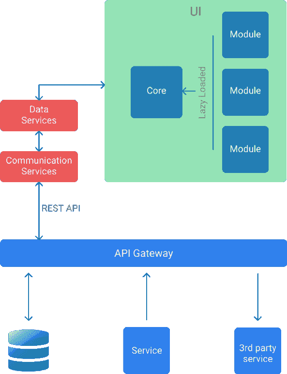
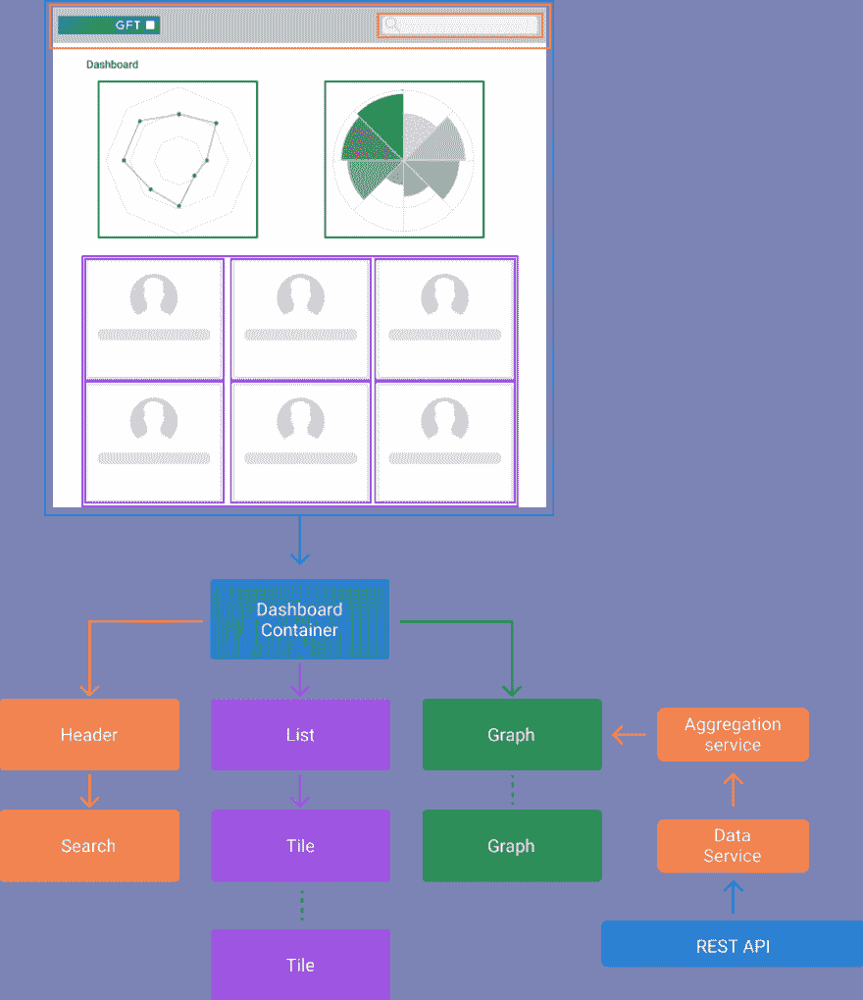

# 为金融市场开发现代应用程序——第 4 部分:架构和开发

> 原文：<https://dev.to/sosnowski/developing-modern-apps-for-financial-markets-part-4-architecture-and-development-40ka>

我前段时间写了这篇文章，作为描述 GFT 应用程序设计过程的一种方式，你可以在下面的链接中找到那些文章的完整版本。

显而易见的事实是，每个项目迟早都要离开设计阶段，进入创作过程。但我们更喜欢一种更精细的方法:在我们 GFT 的工作中，开发和架构规划不是在设计阶段之后开始的——相反，它们都是整个过程的重要部分，与所有的需求定义和讨论并行进行。要了解我们是如何成功做到这一点的，请加入我为金融市场开发现代应用程序系列的最后一部分！

## 建筑师的角色

从一开始，架构师就参与定义需求——询问应该考虑并可能影响实现的详细问题。

讨论的主题通常包括:

1.  任何**非功能性技术需求**，例如:目标平台、性能、数据集大小、可访问性等。,
2.  与* *集成* *第三方系统和数据交换相关的一切，
3.  将用于输入应用程序的**数据源**，
4.  开发团队应该使用的库、框架或任何其他工具。

基于上述信息、需求和与利益相关者的对话，架构师准备应用程序架构计划，并定义将满足客户需求的技术堆栈。

架构师在项目启动阶段的另外一个不太明显的角色是负责**“技术健全性检查”的人。**必须有人确保与 BAs 和 UX 设计师达成一致的要求实际上是可实施的，或者他们的预计实施时间在客户的预算和时间范围内。这样，架构师的反馈可以很快地被整合到设计阶段——这反过来又可以防止以后可能出现的问题。

架构师面临的另一个任务是与客户方的架构师合作并保持联系，以防项目需要与其他服务集成——或者仅仅是监督。如果我们计划在最后进行项目移交，这一点尤其重要。

## 建筑规划

首先，完成最初的客户访谈和信息收集阶段后，定义初步的高级技术需求。

*客户需要基于网络的应用程序还是本地应用程序？会在多种设备上使用吗，包括移动硬件？它必须离线工作吗？将显示什么样的数据，应用程序和其余系统之间的通信将如何工作？数据的来源是什么？*

这些问题和其他高级问题使架构师能够为应用程序的架构奠定基础。

接下来，一旦商定了更详细的项目规范，以及屏幕、应用模块、数据结构、第三方服务等元素。被定义之后，架构师就能够将它们转化为更加详细的**架构计划**。这通常包括接近最终的应用程序结构、数据结构和通信模式。

在这一点上，技术栈通常是一致的。我们通常的做法是，波兰的开发团队在架构师的帮助下，准备一套快速 POC 来测试和评估可能的工具，并选择最符合客户要求的工具。

实际的开发过程也可以从这里开始。定义好所有基础知识后，nearshore 开发团队可以开始设置开发环境和实际的实现。

架构规划的最后一部分是定义详细的应用程序结构。屏幕(或实体模型，如果最终设计还不可用的话)被划分成组件，它们之间的数据流被一致同意，并且用于通信和不同业务领域的服务被定义。

架构规划的这一部分通常以敏捷的方式完成。当添加新的屏幕或模块时，重复该过程，并将新的功能合并到现有的应用程序结构中。

在 [GFT 博客](https://blog.gft.com/blog/2018/12/12/developing-modern-apps-for-financial-markets-part-4-architecture-and-development/)上阅读文章的完整版本