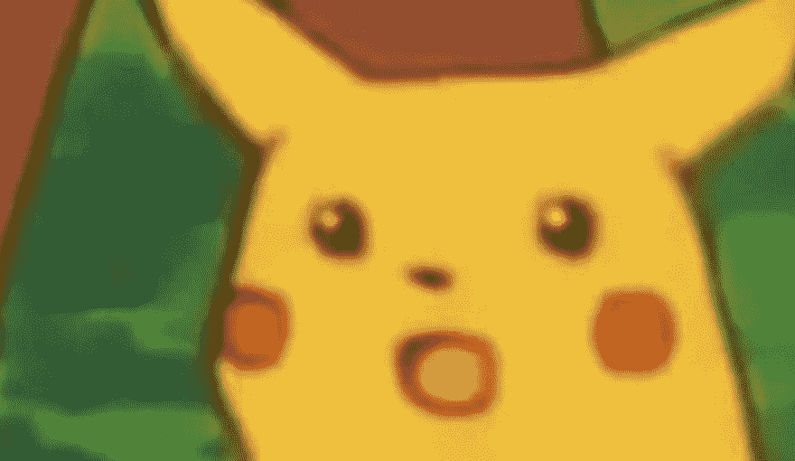

# 从轮岗软件工程师身上学到的经验——第 1 部分

> 原文：<https://dev.to/ashc0des/lessons-learned-from-a-rotational-software-engineer-part-1-2ke1>

嗨！我刚从两年的轮岗项目中毕业，现在又回到了另一个岗位上。这是我大学毕业后的第一份工作，所以时间过得太快了。🥳

现在是反思我在过去两年中学到了什么的最佳时机。我做过 4 次轮岗，2 次是软件工程师，1 次是网站可靠性工程师，1 次是平台产品经理。在第 1 部分中，我将讨论我的前两次轮换，其他两次轮换留到第 2 部分，因为它们不是严格意义上的开发角色。

作为一名每 6 个月轮换一次的软件工程师，我通常在 React & Polymer
中
🕸Coded📝使用摩卡，柴，黄瓜，&硒
🧠Received 技术&国内商业培训&国际
编写单元测试🤝与 UX 设计师、UI 开发人员、QA 测试人员、技术主管、项目经理合作
🎓自愿在 buildOn 高中学生职业准备项目中担任导师

总的来说，这是一次奇妙的经历。轮岗计划的性质使我能够快速适应不断变化的优先级，并克服摆在我面前的任何学习曲线。如果你仔细想想，这就像每个团队为期六个月的试镜，你实际上有大约三周的时间加入并成为一名有贡献的成员。

## 我学到了什么？

我想与大家分享的最重要的经验是，无论我在团队中的时间是 6 个月、1 年还是更长，理解更大的图景以及理解我正在工作的应用程序是如何架构的以及设计决策是如何考虑在内的，这一点非常重要。如果我不付出额外的努力来理解更大的图景，我的贡献或者我如何与我的朋友、同事和经理沟通，将会被孤立到我所工作的整个应用程序的一部分。

这么想吧。想象一下，如果盒子上没有拼图的图片。在不知道最终结果的情况下，你如何将这些碎片组装在一起？🤔将这一点与工程联系起来，基于我的拉取请求，我只理解了应用程序复杂性的一小部分。

## 我把这一课翻译成三个要点，总结如下:

✅ [自上而下 vs 自下而上的思考](#takeaway-1)✅[确定技术权衡&沟通它们](#takeaway-2)t5】✅[了解我个人对整个系统的影响](#takeaway-3)

## 榜首⬇️还是垫底⬆️？

是的，我从递归和动态编程中借用了这个概念。

| 学期 | 定义 | 例子 |
| --- | --- | --- |
| 颠倒 | 你从一小步开始，每一步都建立在前一步的基础上，直到你达到目标。 | 我要学习如何用 Java 编程，然后实践，然后参加编码竞赛，最终，成为一名了不起的软件工程师。 |
| 自上而下 | 你首先定义目标，然后进一步细化成更小的目标。 | 我将成为一名出色的软件工程师。怎么会？我会努力学习的。怎么会？我会做笔记并编写示例程序。靠什么？我将学习 Java 课程并使用 IDE。 |

我更喜欢自上而下的思考，因为我是一个自上而下的思考者。我很难推进一个概念，直到我理解了它在更大的图景中的重要性。当我第一次接触编程时，是通过 Java。让一个叫卡雷尔的机器人移动。这种学习方式并不成功，主要是因为我没有被编程操纵卡雷尔通过迷宫的目标所激励。

那么是什么改变了呢？

> 💡阅读乔纳森·富尔顿的网络架构 101。副标题本身“我希望当我开始成为一名 web 开发人员时就知道的基本架构概念”让我产生了很大的共鸣。

“原来这就是负载平衡器！这就是为什么 API 设计如此重要并且如此受争议的原因！缓存、cdn，所有这些提高性能和可用性的方法——哇！”-我，大约 2019 年 5 月

简而言之，我使用了上面文章中的 web 架构作为蓝图，并深入研究了它的特定组件，以进一步加深我的理解。因此是自上而下的思维。

## 这完全是关于权衡取舍的⚖️

但是知道这些术语还不够。可以说，随着你作为一名开发人员资历的提升，你在项目范围、设计建议和向你的同事证明这些设计的合理性方面承担了更多的责任。

我知道在这个领域没有什么可以真正取代实践经验，我也不是说什么都可以。我想说的是，通过了解开发人员必须做出的决策类型和他们必须提出的问题类型，我会觉得更有能力参加设计会议，尽管我是初级人员，并把这种理解应用到分配给我的工作和现有的应用程序架构中。

我可以建议一个黑客吗？

> 💡学习系统设计。即使你没有主动面试。

系统设计本身就是一头多头野兽。许多不同的潜在方法，但这是技术交流和技术深度的练习。观看 YouTube 上关于常见系统设计问题的视频，如设计 Google Maps 或 TinyURL，非常有帮助。

它帮助我制定了一个框架来处理这些类型的问题💭如何细化问题的范围-调整月活跃用户(mau)数量、要讨论的功能、特殊考虑事项
💭如何组织讨论-从数据建模、API 设计、系统组件之间的交互开始，讨论如何提高性能&确保可扩展性
💭数据库——为什么是 NoSQL vs SQL？两者的优缺点是什么？随着数据量的增加，有哪些技术可以确保数据库的可用性？
💭数据库复制与分区——两者的优缺点是什么？
💭微服务与整体服务——各自的优缺点是什么？
💭负载平衡& API 网关——微服务架构中的 API 网关可以被认为是一种负载平衡技术吗？

我可以永远继续下去。您开始发现问题经常会延伸到下一个，并且集中在一种方法相对于另一种方法的优点/缺点上。这种知识的获得帮助我反思了我作为轮岗软件工程师工作的前两个团队，也将在未来帮助我。

## 被授权💪🏼

任何贡献都是显著的，无论大小，前端还是后端，QA 等等。考虑一下——不管你在开发团队中的角色是什么，理解系统将帮助你表现得更好。至少，它会帮助你自信地谈论你过去的工作经历，或者避免草率地将你的贡献总结为“哦，我是那个团队的前端工程师”或“我主要从事后端工作”。为你的工作感到骄傲！细说！

简而言之，弄清楚你是哪种类型的学习者/思考者，理解高层次的架构和与所述架构相关的设计决策，然后将其应用到你自己的应用工作中。这真的对我有用，我希望对你也有用。