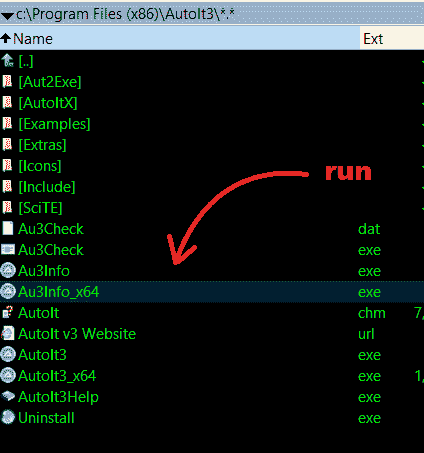
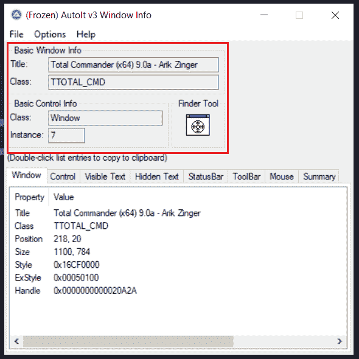
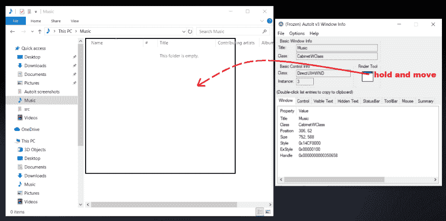
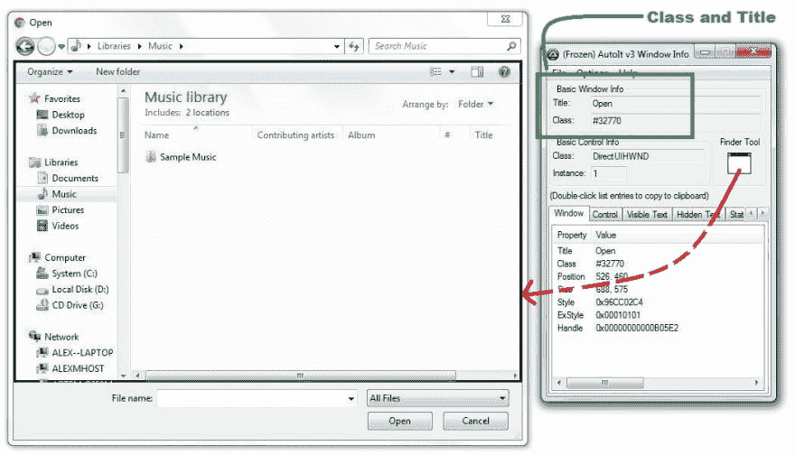
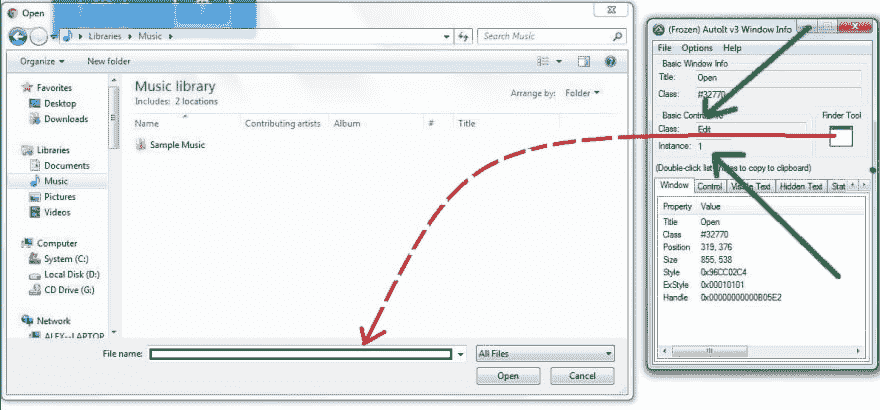
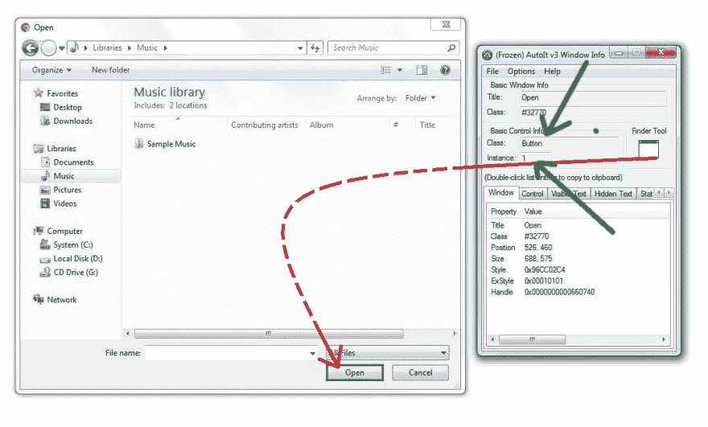
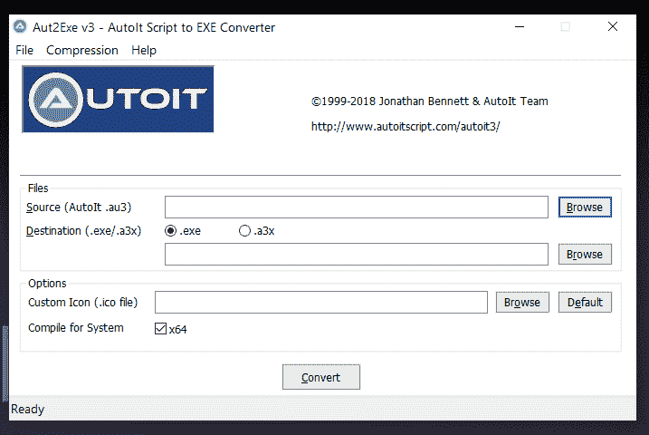
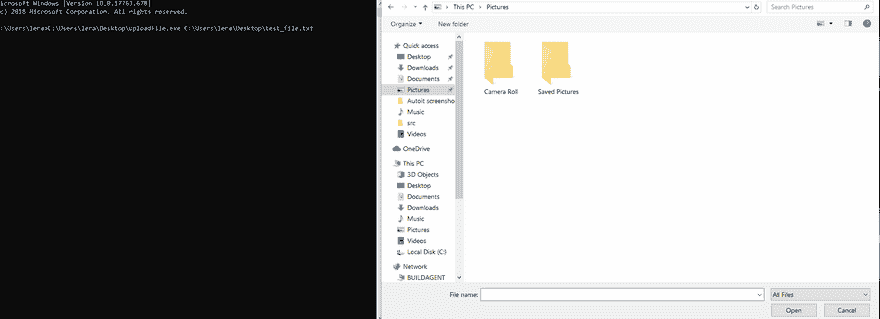

# 如何用 Autoit 和量角器自动测试文件上传

> 原文：<https://dev.to/valeria/how-to-automate-file-upload-testing-with-autoit-and-protractor-d94>

# 简介

在大多数 web 应用程序中，文件上传不仅仅是基于 web 的功能，还需要系统窗口活动，如
打开系统对话框“Open ”,您可以在其中选择要上传到网站的文件。测试自动化框架和工具不处理这种基于窗口的活动。

在我的 web 应用程序自动化测试中，可以处理 Windows 系统对话框吗？
是的。使用编译的 Autoit 脚本是可能的。

在本文中，我们将尝试自动化与 Windows 上传对话框的交互，并将了解:

*   什么是 Autoit
*   如何使用 Autoit
*   如何编写和编译 Autoit 脚本
*   如何在 E2E 测试中使用已编译的 Autoit 脚本

## 1。什么是 Autoit

Autoit 是一个免费的工具，可以用来自动与 Windows 桌面应用程序，对话框和进程，如运行，关闭，删除应用程序。一般来说，Autoit 可用于自动化 Windows GUI。

自动化 Windows GUI Autoit v3 脚本语言使用。Autoit v3 是一种类似 BASIC 的脚本语言。因此，请准备好在本教程中学习类似 BASIC 的语法。

有关 Autoit 和 Autoit v3 的更多信息，您可以在 [Autoit 官方网站](https://www.autoitscript.com/site/)上找到。

## 2。如何使用 Autoit

首先，让我们转到 [AutoIt 下载](https://www.autoitscript.com/site/autoit/downloads/)并下载 AutoIt 完整安装。

[](https://res.cloudinary.com/practicaldev/image/fetch/s---lPrEiri--/c_limit%2Cf_auto%2Cfl_progressive%2Cq_auto%2Cw_880/https://thepracticaldev.s3.amazonaws.com/i/7vrn5ss7x3f0jax1mhjs.PNG)

通过所有安装步骤，打开 Autoit3 文件夹，并运行 Au3Info.exe。这个应用程序用于获取编程中将要使用的窗口的信息。

[](https://res.cloudinary.com/practicaldev/image/fetch/s--Vt8SSC7X--/c_limit%2Cf_auto%2Cfl_progressive%2Cq_auto%2Cw_880/https://thepracticaldev.s3.amazonaws.com/i/tf4owqssgb9trvihxebp.PNG)

编程与对话框交互所需的系统对话框的基本信息是**类**、**标题**和**实例**。

[](https://res.cloudinary.com/practicaldev/image/fetch/s--ddmg_uQY--/c_limit%2Cf_auto%2Cfl_progressive%2Cq_auto%2Cw_880/https://thepracticaldev.s3.amazonaws.com/i/ymdikzrckgiffianlzte.PNG)

要获得关于元素或窗口的信息，请按住 Finder 工具并将鼠标移动到元素或窗口上。

[](https://res.cloudinary.com/practicaldev/image/fetch/s--xN9DCY9E--/c_limit%2Cf_auto%2Cfl_progressive%2Cq_auto%2Cw_880/https://thepracticaldev.s3.amazonaws.com/i/w6wnrry6h31hgwu83lgf.png)

嗯，如何使用 Autoit 工具是非常清楚的。让我们进入编程部分。

## 3。自动脚本

这篇文章是关于文件上传的自动化测试。
所以，目标是自动化与“打开”Windows 系统对话框的交互。我们分几步来做吧。

**第一步**

第一步是打开记事本或您喜欢的代码编辑器。开始编写脚本，导入必要的依赖项。

```

;Constants to be userd in an AutoIt v3 script.
#include <AutoItConstants.au3&gt

```

**第二步**

定义变量`$hWnd` -你将与之交互的窗口的句柄。

```
#include <AutoItConstants.au3>
Local $hWnd

```

**第三步**

我们需要等待系统对话框。
使用`WinWait(WINDOW_CLASS, TITLE, TIMEOUT)`功能。使用**Au3Info.exe**得到`WINDOW_CLASS`和`TITLE`(在 Autoit 安装文件夹中找到)。

[](https://res.cloudinary.com/practicaldev/image/fetch/s--KdV-GGmH--/c_limit%2Cf_auto%2Cfl_progressive%2Cq_auto%2Cw_880/https://thepracticaldev.s3.amazonaws.com/i/fbdac8k4gxum5l0w1g8x.jpg)

```
#include <AutoItConstants.au3>
Local $hWnd

;Wait 15sec for file dialog (Class #32770) with title 'Open'
$hWnd = WinWait("[CLASS:#32770]","Open",15)

```

**第四步**

我们需要一种机制来将文件路径放到系统窗口的文件路径字段中。我们来获取文件路径字段的`CLASS`和`INSTANCE`。

[](https://res.cloudinary.com/practicaldev/image/fetch/s--1NaF9TuQ--/c_limit%2Cf_auto%2Cfl_progressive%2Cq_auto%2Cw_880/https://thepracticaldev.s3.amazonaws.com/i/mh5plojdxazaznkhuw20.jpg)

将焦点设置到该字段并放置一个文件路径。

```
#include <AutoItConstants.au3>
Local $hWnd

;Wait 15sec for file dialog (Class #32770) with title 'Open'
$hWnd = WinWait("[CLASS:#32770]","Open",15)

;Second parameter can be empty string, because of you use class and instance to define the element
;More information about Autoit functions see here 
https://www.autoitscript.com/autoit3/docs/functions/

ControlFocus($hWnd, "", "[CLASS:Edit; INSTANCE:1]")
ControlSetText($hWnd, "", "[CLASS:Edit; INSTANCE:1]", $CmdLine[1])

```

`$CmdLine[1]` -该参数将作为我们要上传到网站的文件的路径传递给函数。
您可以通过绝对文件路径(例如" c:\ upload _ me . txt ")；

**第五步**

点击按**打开**按钮。
先拿到**的`CLASS`和`INSTANCE`打开**按钮。

[](https://res.cloudinary.com/practicaldev/image/fetch/s--uvLh7Ecd--/c_limit%2Cf_auto%2Cfl_progressive%2Cq_auto%2Cw_880/https://thepracticaldev.s3.amazonaws.com/i/5487yag3nteqr7mbkslx.jpg)

当我们知道**的`CLASS`和`INSTANCE`打开**按钮时，我们就准备点击它。

有两种方法可以单击元素。

*方式 1。*

就用`ControlClick()`的方法。

```
ControlClick($hWnd, "", "[CLASS:Button; INSTANCE:1])

```

我的经验表明`ControlClick()`工作不稳定。有时一个按钮由于未知的原因没有被点击。

我已经通过使用鼠标移动和鼠标点击等鼠标动作解决了这个问题。让我们编程吧。

*方式二。*

描述用于存储**打开**按钮位置的 *x* 、 *y* 坐标和大小为 2 的数组的变量。

```
Local $pos[2]
Local $x
Local $y

```

得到**打开**按钮的位置。

```
;ControlGetPosition returs x and y coordinates of high left corner of the button.
$pos = ControlGetPos($hWnd, "", "[CLASS:Button; INSTANCE:1]")

```

设置坐标在鼠标功能中的使用方式，绝对坐标或相对于当前活动窗口的坐标

```
;2 = relative coords to the client area of the active window
AutoItSetOption("MouseCoordMode", 2)

```

定义`$x`和`$y`变量。为了防止一些随机故障，将鼠标从左上角移动到另一个按钮空间，在`$x`和`$y`上增加 10px。随意摆弄坐标值！

```
$x=$pos[0] + 10
$y=$pos[1] + 10

```

最后执行鼠标左键点击动作。

```
MouseClick($MOUSE_CLICK_LEFT, $x, $y, 1);

```

不错！您已经完成了脚本编写。让我们看看整个剧本。

```
#include 

Local $hWnd
Local $pos[2]
Local $x
Local $y

$hWnd = WinWait("[CLASS:#32770]","Open",15)

ControlFocus($hWnd, "", "[CLASS:Edit; INSTANCE:1]")
ControlSetText($hWnd, "", "[CLASS:Edit; INSTANCE:1]", $CmdLine[1])

AutoItSetOption("MouseCoordMode", 2)
$pos = ControlGetPos($hWnd, "", "[CLASS:Button; INSTANCE:1]")
$x=$pos[0]+10
$y=$pos[1]+10

MouseClick($MOUSE_CLICK_LEFT, $x, $y, 1);

```

用 **.au3** 扩展名保存脚本。

# 3。编译 Autoit 脚本

要在自动化 E2E 测试中使用脚本，您需要将脚本编译成可执行文件:

1.  运行**Autoit2Exe.exe**app。
2.  导入保存的脚本，点击按**转换**按钮。

[](https://res.cloudinary.com/practicaldev/image/fetch/s--sIlo4JAc--/c_limit%2Cf_auto%2Cfl_progressive%2Cq_auto%2Cw_880/https://thepracticaldev.s3.amazonaws.com/i/9sradm0m0u9npbw5an4z.PNG)

很好，现在你有了可以在 E2E 测试中使用的可执行文件。

# 4。测试编译的 Autoit 脚本

在 E2E 测试中使用编译过的脚本之前，我们应该确保它能正常工作。

要测试它，请通过以下步骤:

*1。触发上传文件对话框。*

*2。使用文件路径参数运行编译后的脚本。*

[](https://res.cloudinary.com/practicaldev/image/fetch/s--1oXQ3UVD--/c_limit%2Cf_auto%2Cfl_progressive%2Cq_66%2Cw_880/https://thepracticaldev.s3.amazonaws.com/i/i92ki3r4k9monr54cy7m.gif)

如果你没有在脚本编写过程中出错，文件应该被上传。

# 5。在 E2E 测试中使用该脚本。

你可以非常容易地在 E2E 测试中使用编译好的脚本。

下面你可以看到量角器测试的例子。

*页面对象示例*

```
import { by, element, $ } from 'protractor';
import * as cp from 'child_process';

export class FileUploadingPage {
  uploadButton = $('.mat-raised-button');
  addFilesButton = element(by.xpath('//button[contains(@class, "add-files-btn")]'));

  uploadFile(filePath) {
    console.log('File path: ', filePath);
    //UploadFile.exe - compiled Autoit script
    cp.execSync('uploadFile.exe' + '  ' + filePath);
    return Promise.resolve();
  }
} 
```

<svg width="20px" height="20px" viewBox="0 0 24 24" class="highlight-action crayons-icon highlight-action--fullscreen-on"><title>Enter fullscreen mode</title></svg> <svg width="20px" height="20px" viewBox="0 0 24 24" class="highlight-action crayons-icon highlight-action--fullscreen-off"><title>Exit fullscreen mode</title></svg>

*E2E 测试示例*T2】

```
import { FileUploadingPage } from './file-uploading-page';
import { browser, ExpectedConditions, element, by } from 'protractor';
import { win32 } from 'path';

const path = win32;
const EC = ExpectedConditions;
const TIMEOUT = 30000;

let fileUploadingPage: FileUploadingPage;
fileUploadingPage = new FileUploadingPage();

describe('File uploading, () => {
  before((done) =>
    browser.get(browser.baseUrl)
      .then(() => done())
      .catch(done)
  );

  it('Upload file', (done) => {
    browser.wait(EC.visibilityOf(fileUploadingPage.uploadButton), TIMEOUT)
      .then(() => fileUploadingPage.uploadButton.click())
      .then(() => browser.wait(EC.visibilityOf(fileUploadingPage.addFilesButton), TIMEOUT))
      .then(() => fileUploadingPage.addFilesButton.click())
      .then(() => {
        const filePath = path.resolve(__dirname + '/test_file.txt');
        return fileUploadingPage.uploadFile(filePath);
      })
      .then(() => done())
      .catch(done);
  });
}); 
```

<svg width="20px" height="20px" viewBox="0 0 24 24" class="highlight-action crayons-icon highlight-action--fullscreen-on"><title>Enter fullscreen mode</title></svg> <svg width="20px" height="20px" viewBox="0 0 24 24" class="highlight-action crayons-icon highlight-action--fullscreen-off"><title>Exit fullscreen mode</title></svg>

# 结论

从本文中，您了解到:

1.  什么是 Autoit 以及如何使用它。
2.  如何自动化与 Windows 系统对话框的交互？
3.  如何在 E2E 测试中使用编译好的 Autoit 脚本？

感谢并享受自动化！🌈🌈🌈不要忘记轻点💗