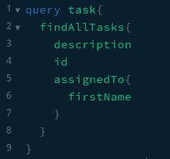

# REST、GraphQL 和 Graphback 速成班#4: Graphback

> 原文：<https://dev.to/aerogear/technologies-that-changed-my-perception-of-software-development-4817>

* * *

# 

<center>Graphback</center>

* * *

构建软件有时会让人不知所措。作为初级开发人员，我们经常在寻找一个示例应用程序，它可以指导我们完成复杂的服务器和客户端架构。然而，作为初级开发人员，我们经常面临模板过于复杂或过于简单的问题，使得学习过程更加复杂。

作为一名软件工程师，我总是希望通过构建东西来学习更多东西，同时在构建端到端解决方案时拥有某种形式的标准作为基础。

CLI 工具中的 Graphback 可以帮助在几秒钟内构建整个 GraphQL 服务器和客户机！这是一个开源项目，目前是测试版，有很多令人惊讶的功能即将推出！

Graphback 将生成模式和解析器，并生成数据库结构。它还解决了从头配置 GraphQL 服务器的困难，我知道我们的 GraphQL 服务器并不特别难设置，但是想象一下，如果我们的服务器中有更多的类型，我们会有多少工作量！graphback 需要的只是您的模式，它会为您做所有其他的事情。然而，为了充分发挥 graphback 的潜力，您还需要了解一些东西。

## 要求

我们不会深入研究 Graphback 提供的所有功能，但如果您能够熟悉以下内容，将会非常方便:

*   [码头工人](https://opensource.com/resources/what-docker)
*   [订阅量](https://www.apollographql.com/docs/apollo-server/features/subscriptions/)
*   [打字稿](https://www.typescriptlang.org/)
*   [Knex](http://knexjs.org/)

然而，如果你只是想看看创建一个 GraphQL 服务器有多简单，我将在本教程中解释你需要知道的一切。

## 开始吧！

*   我们的第一步是安装 Docker。从[到这里](https://runnable.com/docker/getting-started/)按照步骤操作即可。简单介绍一下 Docker，它是一个允许构建容器的平台，这些容器可以包含启动应用程序所需的库。例如，我们将使用 Docker 作为我们的 PostgreSQL 提供者。如果没有 Docker，您需要在本地机器上安装整个 Postgre SQL 服务器，然后进行设置。有了 docker，你所要做的就是下载一个现成的图像- Postgres！

*   完成后，要再次检查 docker 是否安装正确，请键入:

```
$ docker -v 
```

*   接下来，创建一个名为`graphback`的新文件夹
*   导航到该文件夹，在命令行中键入:

```
$ npm install -g graphback-cli 
```

*   要启动 graphback，请运行以下命令:

```
$ graphback init YOUR_PROJECT_NAME 
```

其中，您的项目名称是您自己的项目名称。

*   选择“apollo-starter-ts”。
*   “否”,例如数据库的模型和 PostgreSQL。
*   生成之后，导航到新创建的项目。它就在你的`graphback`文件夹里。

*   在新文件夹中导航到`src/resolvers/`，这里应该只有一个名为`index.ts`的文件，正如你在这个文件中看到的，还没有生成解析器。

*   现在导航到`model/Default.graphql`，删除那里的内容，粘贴我们自己熟悉的类型:

```
type User {
    id: ID!
    firstName: String!
    lastName: String!
    title: String!
    email: String
}

type Task {
    id: ID!
    title: String!
    description: String!
    status: String!
    assignedTo: [User!]!
} 
```

*   现在输入你的终端:

```
$ graphback generate 
```

*   接下来，打开你的`./src/resolvers/generated/`，见证 Graphback 的威力！

打开你的`task.ts`和`user.ts`，看看 Graphback 为你做的所有努力！我知道解析器背后的代码可能现在对你来说是不可理解的，但是我相信经过一点努力，你将能够以同样的方式编写你的解析器！

*   我们的下一步是测试它！在您的终端中键入:

```
$ docker-compose up 
```

这将启动一个 docker 映像，其中设置了 Postgre SQL 和 Redis。我们不会太担心它，但是，docker 是一个非常强大的工具，我相信理解它会给你未来带来巨大的优势。

*   在控制台中键入:

```
$ graphback db 
```

该命令将根据您的模式在 Postgre SQL 数据库中构建一个数据库结构。

*   接下来，因为 Graphback 使用的是 Typescript，所以在我们可以在我们的机器上运行它之前，需要对它进行编译。要运行，请执行以下操作:

```
$ npm run build 
```

Build 将使用 package.json 中的`build`脚本，它只是将类型脚本代码编译成 JavaScript。

*   最后，我们可以运行:

```
$ npm run start 
```

而我们的服务器在 [localhost:4000/graphql](http://localhost:4000/graphql) 准备好了！从现在开始，您可以访问所有生成的解析器。您可以通过单击操场右侧的“Schema”侧栏来查看操场中所有可用的查询和变异！

*   Graphback 还允许使用所谓的“指令”,这些指令是可以附加到类型上的扩展，可以影响查询的执行。让我们重新构建我们的 GraphQL 服务器，这样我们可以删除`Task`，但是不能删除`User`。为此，只需将`@delete`添加到我们的`Task`中，键入`model/Default.graphql`:

```
type User {
    id: ID!
    firstName: String!
    lastName: String!
    title: String!
    email: String
}

type Task @delete {
    id: ID!
    title: String!
    description: String!
    status: String!
    assignedTo: [User!]!
} 
```

*   现在，让我们用以下代码重新生成我们的解析器:

```
$ graphback generate 
```

*   再次导航到`./src/resolvers/generated`，你将在`task`中有一个新的`delete`突变，但在`user`中没有。为了测试它，重建我们的数据库:

```
$ graphback db 
```

*   重新编译我们的代码:

```
$ npm run build 
```

*   启动服务器并试一试！

```
$ npm run start 
```

*   如果您想为您的所有类型创建一个解析器“删除”,导航到`./config.json`文件并将`delete`字段值更改为`true`:

```
{
  "dbConfig": {
    "user": "postgresql",
    "password": "postgres",
    "database": "users",
    "host": "127.0.0.1",
    "port": 55432
  },
  "generation": {
    "create": true,
    "update": true,
    "findAll": true,
    "find": true,
    "delete": false, <----------------------------------------
    "subCreate": false,
    "subUpdate": false,
    "subDelete": false,
    "disableGen": false
  },
  "database": "pg"
} 
```

将此文件视为 Graphback 生成器的设置文件。默认情况下`delete`生成是禁用的，因此需要在我们的类型规范中逐个启用它。但是，您可以将`delete`的值更改为`true`，它将为您的所有类型自动生成！如果您熟悉订阅，请尝试将`subCreate`字段更改为`true`或使用`@subCreate`指令，重新生成服务器并享受为您编写的订阅解析器！

*   Graphack 还允许插入您自己的解析器！让我们试一试！转到`./model/Default.graphql`并添加我们自己的查询`userByName`:

```
type User {
    id: ID!
    firstName: String!
    lastName: String!
    title: String!
    email: String
}

type Task @delete {
    id: ID!
    title: String!
    description: String!
    status: String!
    assignedTo: [User!]!
}

type Query {
    userByName(firstName: String!): User!
} 
```

*   现在我们需要再生:

```
$ graphback generate 
```

如果你导航到`./src/resolvers/custom`，你会看到`userByName.ts`文件。因为它是自定义解析器，我们需要自己实现它。改成:

```
import { GraphQLContext } from '../../context'

export const userByName = {
  Query: {
    userByName: (_: any, args: any, context: GraphQLContext) => {
      return context.db.select().from('user').where('firstName', '=', args.firstName)
    }
  }
} 
```

Resolver 看起来与我们在以前的教程中所做的不同，因为它是用 TypeScript 编写的，并使用 knex 与数据库通信，但其思想通常与以前的 GraphQL 教程相同。

*   接下来，我们需要重复我们的 3 步流程:

```
$ graphback db
$ npm run build
$ npm run start 
```

并导航到 [localhost:4000/graphql](http://localhost:4000/graphql) 进行测试！

*   让我们测试它的功能，并执行以下查询和变化:

我们的任务查询应该返回所有任务:

[](https://res.cloudinary.com/practicaldev/image/fetch/s--zXKvyhvQ--/c_limit%2Cf_auto%2Cfl_progressive%2Cq_auto%2Cw_880/https://thepracticaldev.s3.amazonaws.com/i/cy8ssvrsbrgp0oh5bg16.png)

然而，由于我们的数据库是空的，它将简单地返回一个空数组！

*   让我们向数据库添加一些数据:

[](https://res.cloudinary.com/practicaldev/image/fetch/s--tfyN0Nf---/c_limit%2Cf_auto%2Cfl_progressive%2Cq_auto%2Cw_880/https://thepracticaldev.s3.amazonaws.com/i/z07djlgen5974ha4uwe0.png)

正如你所看到的，Grapback 生成突变的方式与我们所做的略有不同，但是如果你仔细想想，它只是接受了另一种叫做`taskInput`的类型，由`title` `description`和`status`组成，而我们的`ID`是自动生成增量的！

*   现在我们可以添加我们的第一个`user`:

[](https://res.cloudinary.com/practicaldev/image/fetch/s--FIq771Gj--/c_limit%2Cf_auto%2Cfl_progressive%2Cq_auto%2Cw_880/https://thepracticaldev.s3.amazonaws.com/i/j3faa4msdtmus5q7i1xv.png)

从现在开始，我们的数据库由单个用户和单个任务组成！

*   我们现在可以检查我们的查询是否正常工作:

[](https://res.cloudinary.com/practicaldev/image/fetch/s--S8Ft5l4_--/c_limit%2Cf_auto%2Cfl_progressive%2Cq_auto%2Cw_880/https://thepracticaldev.s3.amazonaws.com/i/y19ahvvnmlrt1besgbjo.png)

## 总结

Graphback 提供了很多现成的特性。这种易于使用、令人惊叹的技术帮助我认识到软件开发可以多么强大，改变生活。逐行编写整个 GraphQL 服务器可能非常耗时，设置订阅和使用指令可能需要几天或几周的时间！而 Graphback 可以在几秒钟内为您生成它！想象一下，在这个世界上，开发人员正在尽最大努力尽快提供应用程序的工作原型，想象一下，在填充您的`typeDefs`后输入`graphback generate`，而不是所有的规划、编码和测试后端，可以节省多少时间。您仍然需要
自己实现您的定制业务逻辑，但是核心功能将会提供，从而节省您编写大量样板文件的时间。

要了解有关 Graphback 的更多信息，请访问: [graphback.dev](https://graphback.dev/)

我希望您发现这一系列教程很有趣，并了解了一些关于 REST、GraphQL 和 Graphback 的知识。当我第一次接触这些技术时，我不得不重新思考我在做什么，并重新评估我在成为软件开发人员的旅程中接下来想学什么！