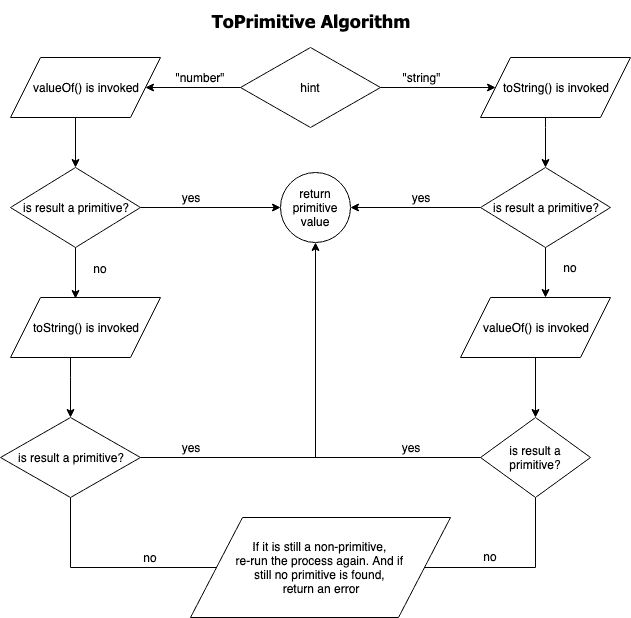

# 抽象操作——理解 JavaScript 强制的关键

> 原文：<https://dev.to/aman_singh/abstract-operations-the-key-to-understand-coercion-in-javascript-453i>

我对我的 [**文章中的一个问题很感兴趣，所以你认为你了解 JavaScript**](https://dev.to/aman_singh/so-you-think-you-know-javascript-5c26) 文章。

```
 {} + []; // returns 0 ?? 🤔 
```

Enter fullscreen mode Exit fullscreen mode

我承认当时我不知道正确答案，但我没有责备和批评 JavaScript 强制和类型系统，而是深入研究了规范，找到了 [**加法运算符**](https://www.ecma-international.org/ecma-262/#sec-addition-operator-plus) 的定义。起初，这些规格对我来说没什么意义。我觉得它冗长。可能我的大脑没有受过阅读说明书的训练。是的，说实话，当有关于 JavaScript 的问题时，我们中有多少人会去阅读规范呢？我们有我们心爱的*斯塔克韦尔弗洛*。对吗？

嗯，我很想知道答案。我不想被归入那些认为强制是某种内在魔法和危险的、应该被回避或避免的开发者的行列。

因此，这篇文章将分享我对 JavaScript 中的**强制**的理解，并说明为什么强制的坏名声被夸大了，有些不应该——翻转你的视角，这样你就可以看到它的有用性和威力。

## JavaScript 类型系统

JavaScript 是一种**动态类型化的**语言，其中变量没有类型——**值有类型**。JavaScript 类型系统并不强制变量总是保持它开始时的初始类型。

```
 // variable 'a' starts out with holding a string value type. 
  var a = 'some string'; 

  // you can change the type in the next line and it's completely valid
  // Now, the variable 'a' holds the value of type number
  a = 10; 
```

Enter fullscreen mode Exit fullscreen mode

我一直认为这是 JavaScript 类型系统的最大优点之一。但是一些来自强类型语言的开发者可能会发现这是语言中的一个缺陷，并反对使用“类型”这个词。我认为这是我们一直在探索在语言上添加一层类型系统的方法( [Flow](https://flow.org/en/) 和 [TypeScript](https://www.typescriptlang.org/) )的众多原因之一。在我看来，这就像我们把 JavaScript 照搬到一个系统中，而这个系统在语言的 DNA 中是**而不是**。

我相信我们应该一直努力学习基础知识，像 JavaScript 一样思考。与其逆流而上，不如顺流而下，看看为什么前面提到的问题不应该被过分渲染为 JavaScript 很怪异。

让我们快速回顾一下到目前为止我们所知道的关于 **JavaScript 类型**的知识，然后我们将在后面的章节中深入探讨**强制**。

JavaScript 有七种内置类型:

*   空
*   未定义。
*   线
*   数字
*   布尔型
*   目标
*   标志

除了**对象**之外，其他类型都称为‘原语’。 **[typeof](https://www.ecma-international.org/ecma-262/#sec-typeof-operator)** 操作符是一个很好的检查类型的内置工具。记住的*类型总是返回一个**字符串**类型。* 

```
typeof 'you are awesome!' // 'string'
typeof 42                 // 'number'
typeof true               // 'boolean'
typeof undefined          // 'undefined'
typeof {name: 'aman'}.    // 'object'
typeof Symbol()           // 'symbol'

------------------------
typeof function foo(){}.  // 'function'
typeof []                 // 'object' 
```

Enter fullscreen mode Exit fullscreen mode

你可能会奇怪为什么在**函数**和**数组**上调用*类型的*会分别返回“函数”和“对象”。原因是*函数*和*数组*是*对象*类型的子类型。因此，您可以向函数中添加属性，并调用对象类型所具有的一些方法，如 **[toString()](https://www.ecma-international.org/ecma-262/#sec-object.prototype.tostring)** 和 **[valueOf()](https://www.ecma-international.org/ecma-262/#sec-object.prototype.valueof)** 。

```
function foo(a,b){}

// you can add any property on foo object. 
foo.someProperty = 'I am a property on foo function'; 

// function object has 'length' property set to number of formal params it takes when declared
foo.length; // 2

// invoke 'toString()' 
foo.toString(); // "function foo(a,b){}"

// invoke 'valueOf'
foo.valueOf(); // return this -> the function itself 
```

Enter fullscreen mode Exit fullscreen mode

> **加成**:根据 [*typeof*](https://www.ecma-international.org/ecma-262/#sec-typeof-operator) 规范，如果一个对象类型实现了一个内部[[[调用]]](https://www.ecma-international.org/ecma-262/#sec-ecmascript-function-objects-call-thisargument-argumentslist) 方法，那么 *typeof* check 返回“函数”。对象文字和数组不实现它，但是函数实现它。

对于*类型的*操作符，您需要注意一些问题。你可能已经注意到，我已经从上面的列表中排除了*类型的空值*。原因是 **null** 是*类型的*运算符返回‘object’的特例。它是 JavaScript 中唯一的原语，是“falsy”并从*类型的*检查中返回“object”。

> **注意** : *null* 是 JavaScript 中唯一的原语，是' **falsy** ，从**类型的**检查中返回一个'**对象**。

```
typeof null; // 'object'; 
```

Enter fullscreen mode Exit fullscreen mode

那么，如何显式地检查空类型呢？你可能需要这样的陈述:

```
var a = null; 
!a && typeof a == 'object'; // true

// Or you can use strict equality comparison
a === null; // true 
```

Enter fullscreen mode Exit fullscreen mode

让我们考虑一个更奇怪的运算符类型:

```
var a; 
typeof a; // 'undefined'
typeof b; // 'undefined' 
```

Enter fullscreen mode Exit fullscreen mode

在 JavaScript 中， **var 声明的**变量在没有当前值时会被赋予一个**未定义的**值。这就是为什么*类型的*运算符返回“**未定义的**”。但是如果你看到我们没有在任何地方声明变量 **b** ，但是操作符的*类型仍然设法打印‘未定义’。这是因为 JavaScript 引擎很安全，它没有返回错误，而是返回了未定义的错误。*

正如我所说的，了解这些差异就像用 JavaScript 引擎调整你的思维一样。每种语言都有一些极限情况。JavaScript 也不例外。与其拿语言开玩笑，我认为理解它们是至关重要的，这样你才能在你的程序中做出更好的决定。

现在，让我们转到理解 JavaScript 中强制的下一部分。

## 威压

强制也称为“类型转换”是一种将一种类型转换为另一种类型的机制。在静态(强)类型语言中，这个过程发生在编译时，而强制是动态类型语言的运行时转换。

在 JavaScript 中，我们可以有两种类型的强制:“隐式”和“显式”。顾名思义，**隐性**胁迫是作为某种有意操作的**不太明显的**副作用而发生的。相反，从代码中可以明显看出，**显式**转换是有意进行的。

```
var a = 10; 

var b = 'programmer' + a;           // implicit coercion
var c = `you owe me ${a} dollars`.  // implicit coercion

var d = String(a);                  // explicit coercion
var e = Number('42')                // explicit coercion 
```

Enter fullscreen mode Exit fullscreen mode

你有没有想过强制在内部是如何运作的？这就是事情变得有趣的地方。但在我们探索内部过程之前，我们需要了解 ECMAScript 2020 第 7 节中定义的一些操作，称为 **[抽象操作](https://tc39.es/ecma262/#sec-abstract-operations)** 。这些操作不是语言的一部分，而是用来辅助 JavaScript 语言的语义规范。您可以将这些操作视为概念操作。

### 抽象操作

每次发生值转换时，它都由一个或多个抽象操作按照规范中定义的一些规则来处理。这里我们将研究三个抽象操作:**转换成字符串**、**转换成数字**和**转换成原语**。

> 抽象操作用于辅助 JavaScript 语言语义的规范。

#### 字符串

每当我们将一个非字符串值强制转换成一个字符串值时， **ToString** 就像规范的[章节 7.1.12](https://tc39.es/ecma262/#sec-tostring) 中那样处理转换。原始类型有自然的字符串化。这张桌子看起来像:

```
// ToString abstract operation (string conversion)
null ->            'null'
undefined ->       'undefined'
true ->            'true'
false ->           'false'
52 ->              '52' 
```

Enter fullscreen mode Exit fullscreen mode

对于常规的*对象*和*数组*，默认的 *toString()* 被调用，它定义在 [Object.prototype](https://www.ecma-international.org/ecma-262/#sec-object.prototype.tostring)
上

```
var a = {language: 'JavaScript'}; 
a.toString(); // "[object Object]"

[].toString(); // "" 
```

Enter fullscreen mode Exit fullscreen mode

您也可以指定自己的 *toString* 方法来覆盖默认返回值:

```
var a = { language: 'JavaScript', toString(){return 'I love JavaScript'} }; 

a.toString(); // "I love JavaScript" 
```

Enter fullscreen mode Exit fullscreen mode

#### 变为数字

无论何时，只要在需要数字的运算(如数学运算)中提供了非数字值，ES2020 就会在[第 7.1.3 节](https://tc39.es/ecma262/#sec-tonumber)中定义一个**到数字**的抽象运算。例如

```
// ToNumber abstract operation (number conversion)
true ->           1
false ->          0
undefined ->      NaN (not a valid number)
null ->           0 
```

Enter fullscreen mode Exit fullscreen mode

对于*对象*和*数组*，值首先被转换成它们的**原始值**(通过[到原始](#toprimitive)的操作)，然后结果值根据**到数字**的抽象操作被强制转换成数字。

#### [托布尔](#toboolean)

**ToBoolean** 比 **ToString** 和 **ToNumber** 操作简单一点，因为它不做任何内部转换。它只执行[第 7.1.2 节](https://tc39.es/ecma262/#sec-toboolean)中提到的查表。

| 参数类型 | 结果 |
| --- | --- |
| 不明确的 | **假** |
| 空 | **假** |
| 布尔型 | 返回**自变量** |
| 数字 | 如果自变量为+0、-0 或 NaN，则返回**false**；否则**真** |
| 线 | 如果参数为空字符串，则返回**false**；否则**真** |
| 标志 | **真** |
| 目标 | **真** |

#### 本原

如果我们有非原语类型(如函数、对象、数组)并且我们需要一个等价的原语，ES2020 在[第 7.1.1 节](https://tc39.es/ecma262/#sec-toprimitive)中定义了**到原语**。

操作需要两个参数:输入和**提示**(可选)。如果您正在执行数字运算，提示将是“数字”类型。而对于字符串操作(比如串联)，传递的提示将是一个字符串。注意，top primitive 是一个递归操作，这意味着如果调用 top primitive 的结果不是一个原语，它将再次调用，直到我们可以得到一个原语值，或者在某些情况下得到一个错误。

现在让我们来看看超原始运算背后的算法。

每个非原语都可以有两个可用的方法: **toString** 和 **valueOf** 。如果发送了“数字”提示，则首先调用 **valueOf()** 方法。如果我们从结果中得到一个**原始类型**，那么我们就完成了。但是如果结果还是一个非原语，就会调用 **toString()** 。同样，在“字符串”提示类型的情况下，这些操作的顺序是相反的。如果这两个操作的调用没有返回原语，通常是一个**类型错误**。

从视觉上可以看出顺序如下:

```
// ToPrimitive Abstract Operation

// hint: "number" 
valueOf()
toString()

// hint: "string"
toString()
valueOf() 
```

Enter fullscreen mode Exit fullscreen mode

为了更清楚起见，下面是我们上面讨论的算法的流程图:

[](https://res.cloudinary.com/practicaldev/image/fetch/s--xSjnUNnV--/c_limit%2Cf_auto%2Cfl_progressive%2Cq_auto%2Cw_880/https://thepracticaldev.s3.amazonaws.com/i/skc2q8wj2t4zb6hovu5r.png)

现在有了抽象运算的新知识，是时候自信地回答几个问题了。

## 考验我们的知识

```
// Why the following expression produces '5' as a result? 
[] + 5; // '5' 
```

Enter fullscreen mode Exit fullscreen mode

根据第节中的规范，[加法运算符](https://www.ecma-international.org/ecma-262/#sec-addition-operator-plus) '+'根据参数类型执行字符串连接或数字加法。如果任一参数是字符串，它将执行字符串连接。这叫做[操作员超载](https://en.wikipedia.org/wiki/Operator_overloading)。现在让我们来看看我们是如何得到字符串**“5”**？

我们期待一个原始类型的**，但是最终得到一个*数组*作为参数之一。因此，**本原**抽象操作以**【数字】**作为提示进行。参考上面的图，我们可以断言下面的步骤将会得到结果。**

*   [].**value of()**//returns[]；
*   由于，[]是**而不是**原语，引擎将调用[]。 **toString()** 导致一个**空**字符串。
*   现在表达式简化为**“+5**。
*   正如我们提到的，当任何一个**参数**是**字符串类型**时，*加法运算符执行字符串连接*。
*   于是，5 将通过 **ToString** 抽象操作传递**‘string’**作为提示，隐式强制为**“5”**。
*   最后，表达式简化为**“+”5”**，得到值**“5”**。

```
[] + 5;               // ToPrimitive is invoked on []
// "" + 5; 
// "" + "5"; 
// "5" 
```

Enter fullscreen mode Exit fullscreen mode

现在，那是内心满足的时刻。不是吗？我不知道你是怎么想的，但是当我发现这一点时，我很高兴💡😀。

在我们结束之前，让我们快速地揭开下面一些表达的神秘面纱，以加强我们的理解。我将从上到下简化表达式(通过抽象操作)以得出结果。

```
[] + [];            // ToPrimitive is invoked on both operands
// "" + "";
"" 
----------
[] + {};              // ToPrimitive is invoked on both operands
// "" + "[object Object]";
"[object Object]"

----------
'' - true; 
// There's no operator overloading for subtract operator. 
//ToNumber is invoked on both the operands (already primitive)
// 0 - 1; 
-1

-----------
1 < 2 < 3; 
// (1 < 2) < 3; 
// true < 3;              // ToNumber is invoked on true -> 1
// 1 < 3;
true; 

-----------
3 < 2 < 1; // true ooops! 
// (3 < 2) < 1; 
// false < 1;             // ToNumber is invoked on false -> 0
// 0 < 1; 
true 
```

Enter fullscreen mode Exit fullscreen mode

现在是回答这个问题的时候了，这个问题基本上引导我写这篇文章。

```
{} + []; // 0 🤔?? 
```

Enter fullscreen mode Exit fullscreen mode

这里的' {} '是**不是空对象**而只是一个空块{}。所以，JavaScript 引擎忽略了它，留下了`+ []`语句来执行。这是一个*数值运算*，因此将传递一个*‘number’*提示将这个空数组转换成一个*原语*值，这是一个*空字符串*。最后，空字符串通过**到数字**操作再次被强制，导致值为 **0** 。😀

```
{} + [];                 // empty block is ignored
// + [];
// + '';
// + 0 ;
0 
```

Enter fullscreen mode Exit fullscreen mode

## 总结:

*   JavaScript 是一种动态类型的语言，其中**值具有类型**——而不是变量。
*   **[强制](#coercion)** 又名“类型转换”是将一种值类型转换为另一种值类型的过程；对于 JavaScript，这发生在编译时。
*   强制可以有两种类型:**隐性**和**显性**。
*   **[抽象操作](#abstract-operations)** 是理解强制的关键。它们不是语言中的实际操作，而是用来帮助规范 JavaScript 语言的语义。
*   每当我们收到一个操作的非原语值，而该操作需要一个原语类型时，就会调用 **[ToPrimitive](#toprimitive)** 抽象操作。
*   对于任何非原语，ToPrimitive 调用两个方法: **valueOf()** 和 **toString()** 。根据传递的**提示**，对于“数字”提示，调用 **valueOf()** ，然后是 **toString()** ，反之亦然。

## 结论:

JavaScript 的动态特性是其核心特性之一。理解强制在内部如何工作可以帮助我们编写健壮的代码。每种语言都有一些怪癖，作为开发人员，我们有责任留意这些警告。我们需要努力学习语言的语义，并朝着这个方向努力，而不是寻找缺陷。

希望你喜欢这篇文章，如果那是一篇*布尔*T2】真实的文章，一些❤️会让我微笑😍。