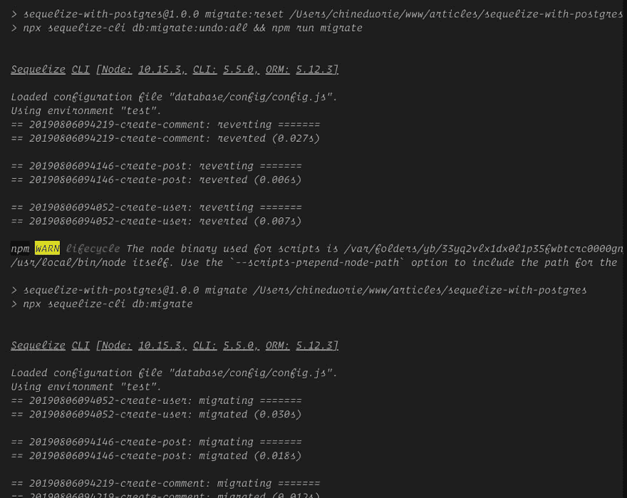

# Supertest Jest 使用 Jest 和 Supertest 测试节点 Js/Express API

> 原文：<https://dev.to/nedsoft/testing-nodejs-express-api-with-jest-and-supertest-1km6>

这是使用 Express、Sequelize 和 Postgres 构建 API 的第三部分。在[第二部分](https://www.oriechinedu.com/posts/performing-crud-with-sequelize/)中，我们构建了简单的 API 端点来演示 Sequelize 中的 CRUD 操作。在本文中，我们将重点关注为第二部分中创建的 API 端点编写端到端测试。

### 术语解释

*   端到端测试(End-to-End testing)-一种测试类型，测试应用程序从开始到结束的流程是否如预期的那样工作。这也被称为功能测试。这类测试的一个例子是测试端点或路由，这涉及测试端点工作所需的一切，如数据库连接、依赖性等。

*   **Test Runner** -一个库或工具，它在给定的目录或文件中获取源代码(测试)，执行测试并将结果写入控制台或任何指定的位置，例如 Jest、Mocha。

*   **Jest** - [Jest](https://jestjs.io/) 是由脸书开发的 JavaScript 测试框架。它开箱即用，只需很少的配置，并且内置了测试运行器、断言库和嘲讽支持。

*   [**super test**](https://www.npmjs.com/package/supertest)——用于测试 Node.js HTTP 服务器的库。它使我们能够以编程方式将 GET、POST、PATCH、PUT、DELETE 等 HTTP 请求发送到 HTTP 服务器并获得结果。

既然我们已经解释了基本术语，让我们深入主要业务。
如果你已经阅读了之前的[篇文章](https://www.oriechinedu.com/posts/performing-crud-with-sequelize/)，那么在你最喜欢的文本编辑器中打开它，否则在这里克隆所用的[库。](https://github.com/oriechinedu/sequelize-with-postgres-tutorial)

**步骤 1 -安装 Jest 和 supertest**

打开您的终端并`cd`到项目根目录并运行下面的命令:

```
npm install --save-dev jest supertest 
```

<svg viewBox="0 0 448 512" class="highlight-action highlight-action--fullscreen-on"><title>Enter fullscreen mode</title></svg> <svg viewBox="0 0 448 512" class="highlight-action highlight-action--fullscreen-off"><title>Exit fullscreen mode</title></svg>

**步骤 2 -配置 Jest**

打开`package.json`并将下面的代码添加到其中。

```
 "jest":  {  "testEnvironment":  "node",  "coveragePathIgnorePatterns":  [  "/node_modules/"  ]  }, 
```

<svg viewBox="0 0 448 512" class="highlight-action highlight-action--fullscreen-on"><title>Enter fullscreen mode</title></svg> <svg viewBox="0 0 448 512" class="highlight-action highlight-action--fullscreen-off"><title>Exit fullscreen mode</title></svg>

这是我们测试 API 所需的 jest 集的基本配置。您希望`jest`忽略的任何文件都放在`"coveragePathIgnorePatterns"`中。`"coveragePathIgnorePatterns"`指定一个匹配要排除的目录的正则表达式，在我们的例子中，我们希望它忽略`node_modules`目录。

接下来我们添加`test`脚本。在`package.json`的`scripts`部分，添加下面的脚本:

```
"test":  "jest" 
```

<svg viewBox="0 0 448 512" class="highlight-action highlight-action--fullscreen-on"><title>Enter fullscreen mode</title></svg> <svg viewBox="0 0 448 512" class="highlight-action highlight-action--fullscreen-off"><title>Exit fullscreen mode</title></svg>

**步骤 3 -测试 Jest 配置**

现在，让我们确认`jest`已经准备好运行我们的测试。在终端运行`npm test`。您会注意到控制台上打印出如下所示的错误，这表明`jest`已设置好。

[](https://res.cloudinary.com/practicaldev/image/fetch/s--DiTpv637--/c_limit%2Cf_auto%2Cfl_progressive%2Cq_auto%2Cw_880/https://thepracticaldev.s3.amazonaws.com/i/sftb9nkpi1jk076d09xy.png)

让我们添加一个简单的测试来验证配置。创建一个名为`tests`的新目录并添加一个新文件`sample.test.js`。在`sample.test.js`中，添加下面的代码:

```
describe('Sample Test', () => {
  it('should test that true === true', () => {
    expect(true).toBe(true)
  })
}) 
```

<svg viewBox="0 0 448 512" class="highlight-action highlight-action--fullscreen-on"><title>Enter fullscreen mode</title></svg> <svg viewBox="0 0 448 512" class="highlight-action highlight-action--fullscreen-off"><title>Exit fullscreen mode</title></svg>

现在，运行`npm test`，你会得到如下所示的输出:
[](https://res.cloudinary.com/practicaldev/image/fetch/s--2EIyD87V--/c_limit%2Cf_auto%2Cfl_progressive%2Cq_auto%2Cw_880/https://thepracticaldev.s3.amazonaws.com/i/4zmad3nkc8stnfyescvi.png)

##### Jest 如何识别一个测试文件？

Jest 以三种方式识别测试文件:

*   扩展名为`.test.js`的文件
*   扩展名为`.spec.js`的文件
*   `__tests__`文件夹或目录中的所有文件。

## 测试 API 端点

现在我们已经建立了测试环境，是时候开始测试 API 端点了。因为我们的端点需要向数据库发出请求，所以我们需要建立一个测试数据库。建立测试数据库的原因是我们每次运行测试时都会删除数据库。每次运行测试时删除数据库可以确保测试的完整性。也就是说，如果一个测试是关于在数据库中创建一个`post`记录，我们希望确保在测试运行之前数据库中没有`post`记录，这样，我们就可以确定从测试中得到的结果。

**步骤 4 -创建测试数据库**
在本文的第一部分的[中，我们创建了两个数据库，一个用于开发，另一个用于测试。如果您还没有创建测试数据库，请按照](https://www.oriechinedu.com/posts/getting-started-with-sequelize-and-postgres/)[链接](https://www.oriechinedu.com/posts/getting-started-with-sequelize-and-postgres/)创建测试数据库。

**步骤 5 -配置测试脚本**

我们需要以下脚本:

*   `pretest`-`pretest`是一个 npm 脚本，当调用`npm test`命令时，它会自动被调用。在每次测试运行之前，我们将挂接命令来更改测试环境并刷新数据库。

*   `migrate:reset`:该命令将负责在每次测试运行之前刷新数据库。

现在编辑`package.json`的`scripts`，如下图:

```
"scripts":  {  "start-dev":  "nodemon index.js",  "migrate":  "npx sequelize-cli db:migrate",  "migrate:reset":  "npx sequelize-cli db:migrate:undo:all && npm run migrate",  "test":  "cross-env NODE_ENV=test jest --testTimeout=10000",  "pretest":  "cross-env NODE_ENV=test npm run migrate:reset"  } 
```

<svg viewBox="0 0 448 512" class="highlight-action highlight-action--fullscreen-on"><title>Enter fullscreen mode</title></svg> <svg viewBox="0 0 448 512" class="highlight-action highlight-action--fullscreen-off"><title>Exit fullscreen mode</title></svg>

脚本修改需要注意什么:

*   [`cross-env`](https://www.npmjs.com/package/cross-env) -一个与操作系统无关的用于设置环境变量的包。我们用它将`NODE_ENV`设置为`test`，这样我们的测试就可以使用测试数据库。运行下面的命令来安装 cross-env。

```
npm i -D cross-env 
```

<svg viewBox="0 0 448 512" class="highlight-action highlight-action--fullscreen-on"><title>Enter fullscreen mode</title></svg> <svg viewBox="0 0 448 512" class="highlight-action highlight-action--fullscreen-off"><title>Exit fullscreen mode</title></svg>

*   标志-这增加了 Jest 的默认超时值 5000 毫秒。这很重要，因为测试运行者需要在运行测试之前刷新数据库。

**步骤 6 -测试脚本**

```
npm test 
```

<svg viewBox="0 0 448 512" class="highlight-action highlight-action--fullscreen-on"><title>Enter fullscreen mode</title></svg> <svg viewBox="0 0 448 512" class="highlight-action highlight-action--fullscreen-off"><title>Exit fullscreen mode</title></svg>

如果一切正常，您应该会在终端上看到下面的输出:

[](https://res.cloudinary.com/practicaldev/image/fetch/s--rwV4vv_Y--/c_limit%2Cf_auto%2Cfl_progressive%2Cq_auto%2Cw_880/https://thepracticaldev.s3.amazonaws.com/i/2panajlcgx7dg0d2oe88.png) 
仔细看上面的截图，你会注意到一行 *`using environment "test"`* 显示`cross-env`改变了`NODE_ENV`。

**最后一步-测试路由/端点**

现在，让我们开始为端点编写测试。在测试目录
中创建一个名为 routes.test.js 的文件

```
touch tests/routes.test.js 
```

<svg viewBox="0 0 448 512" class="highlight-action highlight-action--fullscreen-on"><title>Enter fullscreen mode</title></svg> <svg viewBox="0 0 448 512" class="highlight-action highlight-action--fullscreen-off"><title>Exit fullscreen mode</title></svg>

*   **测试创建发布端点**

将以下代码复制到`tests/routes.test.js` :

```
const request = require('supertest')
const app = require('../server')
describe('Post Endpoints', () => {
  it('should create a new post', async () => {
    const res = await request(app)
      .post('/api/posts')
      .send({
        userId: 1,
        title: 'test is cool',
      })
    expect(res.statusCode).toEqual(201)
    expect(res.body).toHaveProperty('post')
  })
}) 
```

<svg viewBox="0 0 448 512" class="highlight-action highlight-action--fullscreen-on"><title>Enter fullscreen mode</title></svg> <svg viewBox="0 0 448 512" class="highlight-action highlight-action--fullscreen-off"><title>Exit fullscreen mode</title></svg>

*   `describe`功能用于将相关测试组合在一起
*   `it`是运行实际测试的`test`函数的别名。
*   `expect`函数使用一组`matcher`函数测试一个值。

有关 Jest 函数的完整列表和详细信息，请访问 [Jest 文档](https://jestjs.io/docs/en/api.html)。

现在，运行测试

```
npm test 
```

<svg viewBox="0 0 448 512" class="highlight-action highlight-action--fullscreen-on"><title>Enter fullscreen mode</title></svg> <svg viewBox="0 0 448 512" class="highlight-action highlight-action--fullscreen-off"><title>Exit fullscreen mode</title></svg>

输出如下所示:

[](https://res.cloudinary.com/practicaldev/image/fetch/s--0NCKRDDV--/c_limit%2Cf_auto%2Cfl_progressive%2Cq_auto%2Cw_880/https://thepracticaldev.s3.amazonaws.com/i/yt6o537gzw29030siy6c.png)

要获得所有端点测试的完整代码，请查看[存储库](https://github.com/oriechinedu/sequelize-with-postgres-tutorial/blob/master/tests/routes.test.js)。

### 结论

我们已经能够完成为与数据库交互的 API 端点编写测试的过程。在本文的最后一部分，我将写关于将 CI/CD 和代码覆盖工具集成到测试环境中。在那之前请继续关注。

如果你对这篇文章有任何问题或建议，请随时联系我。你也可以在下面的评论区分享你的想法。谢谢！

*本文最初发表于我的[博客](https://www.oriechinedu.com/posts/testing-nodejs-express-api-with-jest-and-supertest/)T3*