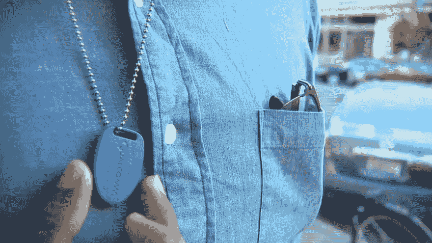
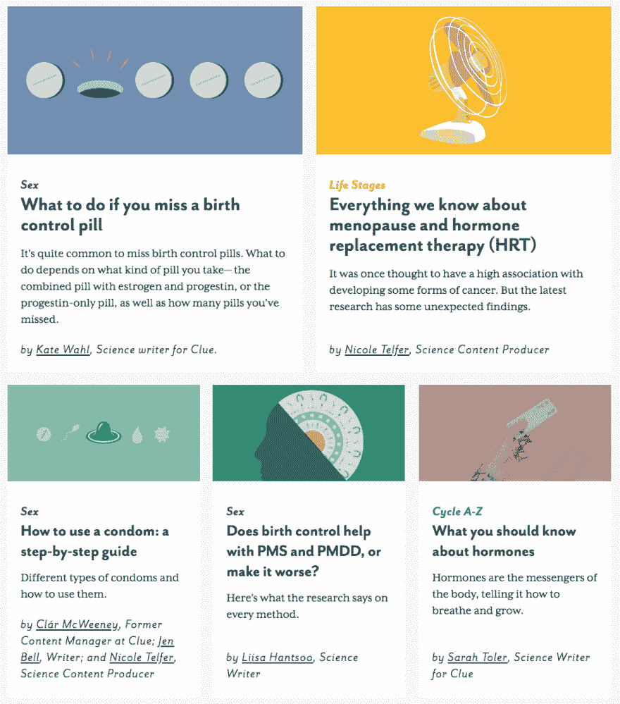
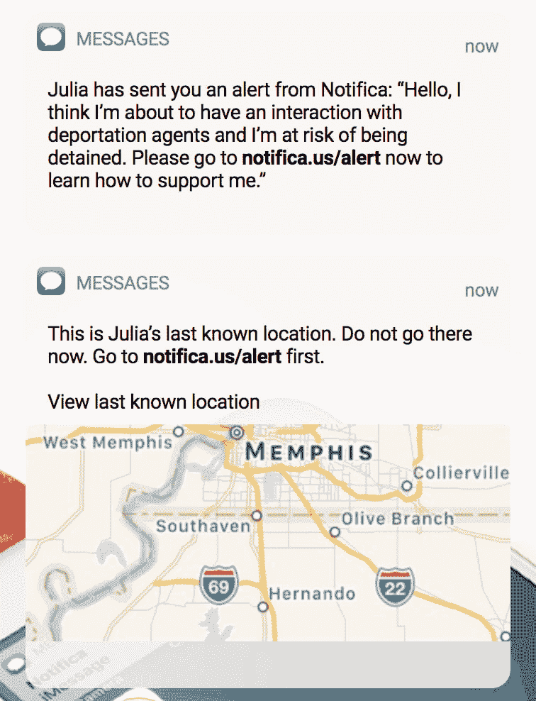

# 创造技术来继续或瓦解系统性压迫

> 原文：<https://dev.to/kjgenevieve/creating-technology-to-continue-or-disrupt-systemic-oppression-1pba>

从我大到被问到“你长大后想做什么？”，我已经用面向社区的工作回答了。我重视利用一个人的技能为大多数人做最有益的工作；这就是我从事教学的原因。我想帮助其他人成为更强的沟通者，并拥有批判性思考世界的工具。

因此，当我决定是时候辞去高中英语老师的工作时，我对社区参与的强烈信念让我犹豫了。当我选择了我的第一份职业时，我很快拒绝了一家盈利性公司的任何工作，确信这意味着出卖自己。我忽略了技术的无处不在意味着它可以被用来给受压迫的人代理。

由于我早期对技术的误解和怀疑，我将重点介绍三个加剧当前阶级、性别和种族问题的应用程序，以及三个反对系统性压迫的应用程序。

### 类

2015 年 11 月，西雅图宣布无家可归者进入紧急状态。截至 2018 年 1 月，[超过 12，000 名金县居民无家可归](https://www.theatlantic.com/technology/archive/2018/06/an-app-for-ejecting-the-homeless/563849/)。这是一个有争议的问题；关于如何处理无家可归的问题一直存在分歧，但西雅图在推广其“找到它，解决它”应用程序后，遭到了越来越多的反对。

这个应用程序本身是无害的；它为市民提供了一种便捷的方式来报告城市中的问题。[根据网站](https://www.seattle.gov/customer-service-bureau/find-it-fix-it-mobile-app)显示，你可以为涂鸦、非法倾倒或动物尸体请求服务。然而，自从在镇上张贴海报鼓励人们“看帐篷？“报告一棚，有人提交了[上百个假警报](https://www.seattletimes.com/seattle-news/homeless/city-spammed-with-fake-alerts-after-poster-campaign-to-report-homeless-campers-goes-viral/)。

有趣的是，许多警报标志着市中心 REI 的许多展示帐篷。

* * *

另一方面，当地初创公司 [Samaritan](https://www.samaritan.city/) 旨在让直接向附近无家可归的人捐款变得更容易。如果你无家可归，你可以申请一个随身携带的小表链。遥控器提醒应用程序用户附近有人需要帮助。应用程序用户可以阅读你的故事，并决定他们是否要捐款。

使用 fob 确实有局限性，这可能会使人们更有可能捐款:“为了保持他们的信标活跃，信标持有者每月会见一次顾问，以设定和跟踪目标。”此外，他们收到的钱只能用在特定的地方，如杂货店和慈善机构。

无论人们是否选择捐赠，该应用程序都是一种有趣的方式，让那些经常被鼓励隐形的人变得人性化。让应用程序用户了解无家可归者的故事可能会带来更多的同情和理解。至少，令人鼓舞的是有近 13，000 人下载了这款应用。

想了解更多关于科技对西雅图无家可归者的影响，我推荐阅读《大西洋月刊》的文章。

### 性别

技术是更大文化的一部分，所以有这么多阴险的应用程序可以帮助你 ps 自己更瘦，更白的皮肤，或者没有痤疮也就不足为奇了。但是，当技术不仅仅符合这些期望，而且实际上帮助人们更容易地控制他人时，它就特别危险。

Absher 是一个政府支持的沙特阿拉伯应用程序，允许男性轻松给予或拒绝他们监护下的人(包括成年女性)旅行许可。“具体来说，男性用户可以注册女性的姓名和护照号码，选择她可以进行多少次旅行以及可以旅行多长时间”( [Time](https://time.com/5532221/absher-saudi-arabia-what-to-know/) )。该应用程序还会在用户的受抚养人出国时提醒用户，让他们进一步接触和控制。

有些人用[的例子来解释为什么这款应用实际上是一种改进](https://www.theguardian.com/world/commentisfree/2019/feb/16/saudi-arabia-wife-tracking-app-absher-politicans-complicit)。举一个例子，一个在澳大利亚留学的大学生；该应用程序允许她的父亲在不在同一城市的情况下签署她的旅行。显然，问题不在于应用程序，而在于潜在的限制性、性别歧视的法律。不管怎样，这个应用程序含蓄地侵犯了人权。

* * *

虽然我不再是一名教师，但我仍然相信教育是赋予人们权力的最佳方式之一。让人们获得力量的一个简单方法是让他们了解自己的身体。然而，2010 年的一项小型研究显示，在图表上“74%的男性和 46%的女性无法识别子宫颈”。当我们等待公立学校提供全面的性教育时，我们可以向 T2 求助。

从表面上看，Clue 是一个月经跟踪应用程序，可以让人们确定他们什么时候可能来月经，什么时候有经前综合症的症状，或者什么时候最容易生育。虽然这些都是很棒的功能，但最让我印象深刻的是 Clue 致力于提供关于经常被污名化的主题的研究和文章。通过将它们与功能性应用程序和流畅的界面包装在一起，更多的女性可以获得关于她们身体的信息。

### 种族

在过去的几年中，许多明显带有种族歧视的应用程序成为了头条新闻，但我想强调一下众包信息可能导致技术滥用的方式。

RedZone 为去一个新城市旅行的人提供了一些有用的功能。导航应用程序使用犯罪报告来绘制他们的路线，并带用户通过统计上更安全的区域。

客观数据是有用的，但是，众包功能是问题可以发挥作用的地方。正如 Nextdoor 揭示了你的哪些邻居是种族主义者一样，RedZone 允许人们在不同的位置评论他们所感知的安全性。虽然这似乎很合理，但我们需要记住，我们生活在一个因为有色人种在宿舍公共区域打盹而报警的国家。

由于美国压迫有色人种的悠久历史，很难想象 RedZone 的收视率会是种族主义的 Yelp 评论。

* * *

技术也被用来积极应对移民面临的一些问题。Notifica 允许用户“如果你有被驱逐代理人拘留的风险，可以计划、学习和行动。”除了提供有关移民权利的资源和信息，Notifica 应用程序还允许用户预编电话号码和信息。如果用户即将被拘留，他们只需按下一个按钮，将消息和他们的位置发送给他们的联系人。

当孩子们从学校的第一天回来发现 [ICE 突袭了](https://www.cnn.com/2019/08/08/us/mississippi-immigration-raids-children/index.html)并且他们的父母被拘留的时候，这项技术可以帮助家庭保持相互联系以及与法律代表的联系。

* * *

从坏到好，我们创造的技术来源于我们所持有的价值观。虽然我们可以创建将食物送上门的应用程序，但我们也可以利用技术为遭受压迫的人提供教育、资源和代理。