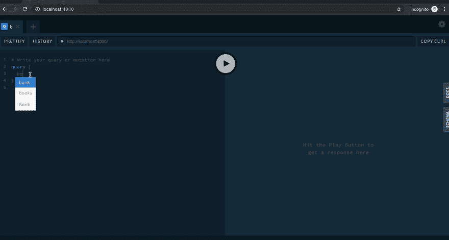
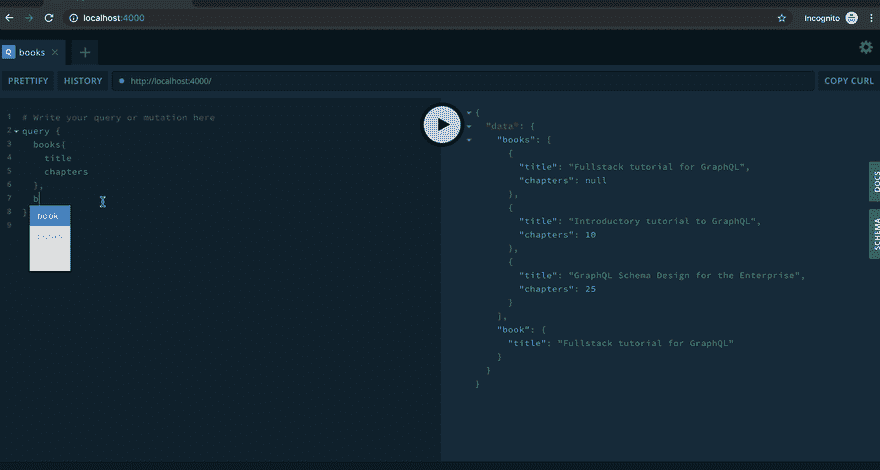

# GraphQL:模式、解析器、类型系统、模式语言和查询语言

> 原文：<https://dev.to/pmbanugo/graphql-schema-resolvers-type-system-schema-language-and-query-language-5c0i>

GraphQL 作为一种构建和使用 Web APIs 的方式已经被广泛采用。GraphQL 是一个[规范](https://graphql.github.io/graphql-spec/June2018/)，它定义了 Web API 的类型系统、查询语言和模式语言，以及 GraphQL 服务(或引擎)应该如何验证和执行针对 GraphQL 模式的查询的执行算法。构建 GraphQL 应用程序的工具和库就是基于这个规范构建的。

在这篇文章中，我将向您介绍一些 GraphQL 概念，重点是 GraphQL 模式、解析器和查询语言。如果您想继续学习，您需要对 JavaScript(尤其是 ES6 中的 arrow 函数)和 Node.js 有一些基本的了解。

## 创建项目

我们将构建一个 GraphQL 服务器，它将响应在 GraphQL 中执行不同操作类型的请求。打开您的终端，导航到您选择的目录，并运行下面的命令:

```
mkdir graphql-intro && cd graphql-intro
npm init -y
npm install graphql-yoga 
```

<svg width="20px" height="20px" viewBox="0 0 24 24" class="highlight-action crayons-icon highlight-action--fullscreen-on"><title>Enter fullscreen mode</title></svg> <svg width="20px" height="20px" viewBox="0 0 24 24" class="highlight-action crayons-icon highlight-action--fullscreen-off"><title>Exit fullscreen mode</title></svg>

这些指令用于为项目创建一个文件夹，初始化一个新的 Node.js 项目，并将`graphql-yoga`依赖项添加到项目中。`graphql-yoga`是一个库，它通过提供合理的默认值来帮助您轻松构建 GraphQL 服务器应用程序，它还包括其他 GraphQL 库，如`subscriptions-transport-ws`，它是一个用于 GraphQL 订阅的 WebSocket 服务器，`apollo-server`，它是一个 web 服务器框架，`graphql-playground`，它是一个交互式 GraphQL IDE，您可以使用它来测试您的服务器。安装完依赖项后，我们现在将继续定义我们的 GraphQL 模式。

## graph QL 模式

GraphQL 模式是每个 GraphQL 服务器的中心。它定义了服务器的 API，允许客户端知道服务器可以执行哪些操作。模式是使用 GraphQL 模式语言(也称为模式定义语言，SDL)编写的。使用它，您可以定义对象类型和字段来表示可以从 API 检索的数据，以及定义 API 允许的操作组的根类型。根类型是**查询**类型、**变异**类型和**订阅**类型，这是您可以从 GraphQL 服务器运行请求的三种类型的操作。对于任何 GraphQL 模式，查询类型都是必需的，而其他两个是可选的。虽然我们可以在模式中定义自定义类型，但 GraphQL 规范也定义了一组内置的标量类型。分别是 **Int** 、 **Float** 、 **Boolean** 、 **String** 和 **ID** 。

让我们继续创建一个模式。添加一个新文件`src/index.js`，内容如下:

```
const typeDefs = `
type Book {
    id: Int!
    title: String!
    pages: Int
    chapters: Int
}

type Query {
  books: [Book!]
  book(id: Int!): Book
}
`; 
```

<svg width="20px" height="20px" viewBox="0 0 24 24" class="highlight-action crayons-icon highlight-action--fullscreen-on"><title>Enter fullscreen mode</title></svg> <svg width="20px" height="20px" viewBox="0 0 24 24" class="highlight-action crayons-icon highlight-action--fullscreen-off"><title>Exit fullscreen mode</title></svg>

上面是 GraphQL 模式。在其中，我们定义了一个有四个字段的 *Book* 类型和一个有两个字段的根 *Query* 类型。根查询类型中的两个字段定义了服务器可以执行的查询/操作。`books`字段返回一列*图书*类型，而*图书*字段将基于作为参数传递给*图书*查询的`id`返回一个*图书*类型。GraphQL 类型中的每个字段可以有零个或多个参数。分配给某些字段的标量类型后面有一个感叹号。这意味着该字段或参数不可为空。

## 实现解析器

我们的 API 能够运行两个查询操作——一个检索书籍数组，另一个检索基于其 id 的书籍。我们的下一步是定义如何解析这些查询，以便将正确的字段返回给客户端。方法是为模式中的每个字段定义一个解析器函数。还记得我提过 GraphQL 有一个执行算法吗？通过遍历模式中的每个字段，并执行它们的“解析器”函数来确定结果，这个执行算法的实现将来自客户端的查询转换为实际结果。

将下面的代码添加到 index.js:

```
const books = [
  {
    id: 1,
    title: "Fullstack tutorial for GraphQL",
    pages: 356
  },
  {
    id: 2,
    title: "Introductory tutorial to GraphQL",
    chapters: 10
  },
  {
    id: 3,
    title: "GraphQL Schema Design for the Enterprise",
    pages: 550,
    chapters: 25
  }
];

const resolvers = {
  Query: {
    books: function(root, args, context, info) {
      return books;
    },
    book: (root, args, context, info) => books.find(e => e.id === args.id)
  },

  Book: {
    id: parent => parent.id,
    title: parent => parent.title,
    pages: parent => parent.pages,
    chapters: parent => parent.chapters
  }
}; 
```

<svg width="20px" height="20px" viewBox="0 0 24 24" class="highlight-action crayons-icon highlight-action--fullscreen-on"><title>Enter fullscreen mode</title></svg> <svg width="20px" height="20px" viewBox="0 0 24 24" class="highlight-action crayons-icon highlight-action--fullscreen-off"><title>Exit fullscreen mode</title></svg>

在您刚刚添加的代码中，我们定义了一个变量来将数据保存在内存中。在这篇文章中不会有数据库访问。`resolvers`变量是一个包含我们类型的解析器的对象。属性中的字段以我们模式中的类型命名，它们是带有我们在模式中为该类型定义的字段的对象。每个字段都定义了它们的解析器函数，该函数将由 GraphQL 引擎执行，并且应该解析为该字段的实际数据。您会注意到*查询*类型中的函数有这样一个声明:

```
function (root, args, context, info) { //function implementation } 
```

<svg width="20px" height="20px" viewBox="0 0 24 24" class="highlight-action crayons-icon highlight-action--fullscreen-on"><title>Enter fullscreen mode</title></svg> <svg width="20px" height="20px" viewBox="0 0 24 24" class="highlight-action crayons-icon highlight-action--fullscreen-off"><title>Exit fullscreen mode</title></svg>

> 请注意，我在 ES6 中使用了 arrow 函数语法来声明代码中的一些解析器函数。

这是每个解析器函数接收的四个参数。它们被描述为:

1.  *根*:这个论点有时被称为**母**。它包含调用链中先前执行的解析程序的结果。例如，如果我们调用 *book* 查询，它将从查询根类型中的根字段 *book* 开始执行。之后，它将执行 *Book* 类型中的解析器来获取这些字段的值。在上面的代码中，我将*书*中字段的解析器的第一个参数命名为`parent`。该参数的值将是从父解析器接收的 Book 对象。例如，这就是为什么我们调用`parent.title`来返回该字段的值。

2.  args:这些是在 GraphQL 查询中提供给字段的参数。按照我们的例子，这将是*图书*查询`book(id: Int!): Book`的 *id* 参数。

3.  上下文:这是每个解析器都可以读取或写入的对象。您可以将允许访问数据库或包含 HTTP 请求头信息的对象保留在这里。与 root 和 args 参数不同，它们的值根据调用解析器的执行链中的级别而变化。上下文对象在各个解析器中是相同的，您可以根据需要向其中写入上下文信息。我们将在下一篇文章中使用这一论点，敬请关注！

4.  info:从这里的[获取定义，它保存与当前查询相关的特定于字段的信息以及模式细节。要了解更多，你可以在上面阅读这篇优秀的](https://graphql.org/learn/execution/)[帖子](https://www.prisma.io/blog/graphql-server-basics-demystifying-the-info-argument-in-graphql-resolvers-6f26249f613a)。

## 设置服务器

定义了模式和解析器之后，我们将继续设置 GraphQL 服务器。仍然打开 index.js，用下面的代码更新它:

```
const { GraphQLServer } = require("graphql-yoga");

const typeDefs = ...// the schema definition from a previous section

const books = [
  ...//array of books object from previous section
];

const resolvers = { ... };

const server = new GraphQLServer({
  typeDefs,
  resolvers
});
server.start(() => console.log(`Server is running on http://localhost:4000`)); 
```

<svg width="20px" height="20px" viewBox="0 0 24 24" class="highlight-action crayons-icon highlight-action--fullscreen-on"><title>Enter fullscreen mode</title></svg> <svg width="20px" height="20px" viewBox="0 0 24 24" class="highlight-action crayons-icon highlight-action--fullscreen-off"><title>Exit fullscreen mode</title></svg>

这里，我们从`graphql-yoga`库导入了`GraphQLServer`,并用它来创建一个带有我们的模式定义和解析器的服务器对象。这样，我们的服务器就完成了。它知道要处理哪个 API 操作，以及如何处理。让我们继续测试服务器。

## GraphQL 查询语言

打开命令行，运行命令`node src/index.js`启动服务器。您应该看到控制台中记录了`Server is running on http://localhost:4000`。打开浏览器找到该 URL。它将显示一个好看的界面。这是 [GraphQL 游乐场](https://github.com/prisma/graphql-playground)。它允许您测试服务器操作。如果您已经构建了 REST APIs，那么可以将其视为 GraphQL 的邮差替代品。

现在让我们要求服务器给我们它所有的书。我们如何做到这一点？我们使用 GraphQL 查询语言来实现这一点，这是 GraphQL 的另一个概念，它使不同的设备可以轻松地从同一个 GraphQL API 查询所需的数据。

转到 GraphQL playground 并运行以下查询:

```
query {
  books{
    id
    title
    chapters
  }
} 
```

<svg width="20px" height="20px" viewBox="0 0 24 24" class="highlight-action crayons-icon highlight-action--fullscreen-on"><title>Enter fullscreen mode</title></svg> <svg width="20px" height="20px" viewBox="0 0 24 24" class="highlight-action crayons-icon highlight-action--fullscreen-off"><title>Exit fullscreen mode</title></svg>

您应该会得到如下相同的结果

[](https://res.cloudinary.com/practicaldev/image/fetch/s--goqIIjCX--/c_limit%2Cf_auto%2Cfl_progressive%2Cq_auto%2Cw_880/https://cdn.filestackcontent.com/9Lfi1GwTqGu4oZ0YPTgB)

您会注意到查询的结构类似于模式语言。`books`字段是查询类型中定义的根字段之一。在花括号内，我们有图书字段的选择集。因为这个字段将返回一个图书类型的列表，所以我们指定我们想要检索的图书类型的字段。我们省略了`pages`字段，因此查询不会返回它。

我们可以测试一下`book(id)`查询，看看它给出了什么。

[](https://res.cloudinary.com/practicaldev/image/fetch/s--9bnkBYgI--/c_limit%2Cf_auto%2Cfl_progressive%2Cq_auto%2Cw_880/https://cdn.filestackcontent.com/SNQUX1WCSiOl6DIB29wz)

在这个查询中，我们将 id 参数的值设置为 3，它返回了我们所需要的结果。您会注意到我有两个查询， *books* 和 *book(id: 3)* 。这是一个有效的查询。GraphQL 引擎知道如何处理它。

## 接下来是什么？

到目前为止，我已经介绍了 GraphQL 的一些基础知识。我们研究了如何使用模式定义语言定义模式、编写解析器函数以及查询 GraphQL API。我解释了每个解析器函数接收的四个参数，我们使用其中一个参数来解析图书类型的字段。我们使用`graphql-yoga`创建了我们的服务器，并使用 GraphQL playground 来测试我们的 API。我解释过在 GraphQL 中我们有三种操作类型。在这篇文章中，我们使用了查询操作，在下一篇文章中，我们将研究突变和访问数据库来存储和检索数据。我们将更新我们的模式，以便我们可以查询相关的数据，例如，作者和他们的书，或者来自特定出版商的书。敬请关注！！

如果你没有自己写代码，这里有一个到 GitHub 项目的链接。

最初发布于 [Telerik 博客](https://www.telerik.com/blogs/graphql-schema-resolvers-type-system-schema-language-query-language)