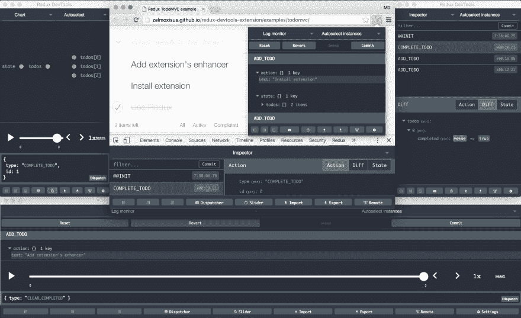
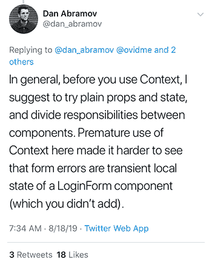

# 可以用 React 钩子代替 Redux 吗？

> 原文：<https://dev.to/chrisachard/can-you-replace-redux-with-react-hooks-20gm>

*此文最初发表于[chrisachard.com](https://chrisachard.com/replace-redux-with-react-hooks)T3】*

钩子作为向功能组件添加状态和效果的一种方式越来越受欢迎——但是它们能走得更远吗？

许多人觉得 Redux 令人困惑或冗长——所以也许钩子可以作为简单的替代品...所以我们来了解一下- *能否用钩子代替 Redux？*

**TL；DR:** Hooks 做了很多，但是代替 Redux: ⭐️⭐️⭐️只从我这里得到 3/5 星
但是！这真的取决于你如何使用 Redux

# 为什么要用 Redux？

在我们弄清楚我们是否可以取代 Redux 之前，我们首先要了解它所解决的问题。

## 1。共享状态

我在项目中使用 Redux 的首要原因是在组件树中相距甚远的组件之间共享状态。这里有一张我的意思的图片:

[](https://res.cloudinary.com/practicaldev/image/fetch/s--tW8-8zwZ--/c_limit%2Cf_auto%2Cfl_progressive%2Cq_auto%2Cw_880/https://thepracticaldev.s3.amazonaws.com/i/ige0qoqz9reb5fdwersy.png)

在这里，`Navbar`组件保存了一个叫做`username`的状态。

对于常规的状态/道具策略，如果我们想让`username`进入`Messages`组件，那么我们需要通过`App`，向下通过`Body`，进入`Messages`。在大型应用程序中，这种[的钻取](https://kentcdodds.com/blog/prop-drilling/)会变得非常麻烦和冗长——所以我们需要一种方法来跨多个组件共享某些状态。

Redux 通过保持一个全局的共享状态来解决这个问题，并允许我们通过连接任何组件来访问这个状态。

## 2。整合业务逻辑

Redux 的另一个主要方面是它允许您集中和(潜在地)重用您的业务逻辑。您可以通过几种不同的方式来实现:

*   **reducer**让你把你的状态更新逻辑移到一个地方
*   **动作**在`redux-thunk`的帮助下，允许异步数据获取和复杂逻辑，*在*将数据发送给减速器之前
*   **中间件**允许你在动作/更新周期的中间注入定制功能，并集中你的逻辑
*   **Redux Sagas** 让您以平稳、集中的方式处理长时间运行的异步操作

## 3。增强调试

Redux 有两个强大的工具可以帮助您进行调试:

#### Redux DevTools

当操作在 Redux 应用程序中运行时，它们对数据的更改可以被跟踪。该跟踪在 [Redux DevTools](https://github.com/reduxjs/redux-devtools) (和 [Redux DevTools 扩展](https://github.com/zalmoxisus/redux-devtools-extension))中可用，它让你看到在你的应用中执行的所有动作，以及它如何影响 Redux 中的状态。

[](https://res.cloudinary.com/practicaldev/image/fetch/s--SmmLz0TG--/c_limit%2Cf_auto%2Cfl_progressive%2Cq_auto%2Cw_880/https://thepracticaldev.s3.amazonaws.com/i/ud92qulm19nw98zk2pdz.png)

这让你可以跟踪应用程序中发生的所有事情——如果有些事情没有按照你认为应该的方式发生，你可以看到确切的原因。整洁！

#### 时间旅行调试

当你更进一步时，你会意识到你可以像向前播放一样简单地倒回你的动作——你就可以进行**时间旅行了！**

在“时间”上前后移动你的动作确实有助于捕捉粘性 bug——或者捕捉需要大量设置时间来捕捉的 bug。

# 钩子给了我们什么？

在`16.8`中增加了钩子来反应，特别是，有三个钩子我们可以组合起来给我们 Redux 功能:

## 使用上下文

上下文在`useContext`钩子出现之前就已经存在了，但是现在我们有了一种直接、简单的方法来从函数组件中访问上下文。

上下文允许我们将状态提升到树中更高的组件，然后允许我们与其他组件共享它。

所以如果我们定义一个共享上下文:

```
const AppContext = React.createContext({}); 
```

并通过包装整个应用程序将其提供给我们的应用程序:

```
<AppContext.Provider value={{ username: 'superawesome' }}>
  <div className="App">
    <Navbar />
    <Messages />
  </div>
</AppContext.Provider> 
```

然后我们可以在子组件中使用该上下文:

```
const Navbar = () => {
  const { username } = useContext(AppContext)

  return (
    <div className="navbar">
      <p>AwesomeSite</p>
      <p>{username}</p>
    </div>
  )
} 
```

这很有效！它让我们在整个应用程序中共享状态(如果我们愿意的话)——并在我们的任何组件中使用该状态。

## useReducer

当我们认真对待它时，**这个**就是让人们对 hooks 可能取代 Redux 感到兴奋的组件...毕竟——它的名字里有 **`reducer`** ！但是让我们先看看它实际上是做什么的。

为了使用`useReducer`，首先我们定义一个 reducer 函数——它可以看起来*完全像来自 Redux:
的*

```
const myReducer = (state, action) => {
  switch(action.type) {
    case('countUp'):
      return {
        ...state,
        count: state.count + 1
      }
    default:
      return state
  }
} 
```

然后在我们的组件中，我们使用`useReducer`钩子，传入那个 reducer 函数和一个默认状态。这将返回当前的`state`和一个`dispatch`函数(同样——就像 Redux！)

```
const [state, dispatch] = useReducer(myReducer, { count: 0 }) 
```

最后，我们可以用那个`state`来显示里面的值，我们可以用`dispatch`来改变它们:

```
<div className="App">
  <button onClick={() => dispatch({ type: 'countUp' })}>
    +1
  </button>
  <p>Count: {state.count}</p>
</div> 
```

这是所有工作的演示:

## 使用效果

好的——我们需要的最后一件事就是在我们的动作中使用可重用的逻辑。为了实现这一点，我们将看一看`useEffect`，以及我们如何编写定制钩子。

允许我们在函数组件内部运行异步动作(比如 http 请求),并且每当某些数据发生变化时，它允许我们重新运行这些动作。

我们来看一个例子:

```
useEffect(() => {
  // Async Action
}, [dependencies]) 
```

这就像一个安装了`redux-thunk`的 Redux 动作。我们可以运行一个异步操作，然后对结果做任何我们想做的事情。例如——这里我们从一个 http 请求加载，并将其设置为某个本地状态:

```
const [person, setPerson] = useState({})

useEffect(() => {
  fetch(`https://swapi.co/api/people/${personId}/`)
    .then(response => response.json())
    .then(data => setPerson(data))
}, [personId]) 
```

这里有一个演示:

所以我们现在也重新创建了动作！

# 如此！

...我们做了一个迷你 Redux！...对吗？

通过将允许我们跨多个组件共享状态的`useContext`与允许我们像 redux 一样编写和共享还原器*的`useReducer`以及允许我们编写异步动作然后分派给那些还原器的`useEffect`结合起来...这听起来很像 Redux！*

但是:当我们考虑人们实际上使用 Redux 做什么时，让我们看看我们是如何做的:

### 1。共享状态

就共享状态而言，我们做得相当好。我们可以使用上下文与多个组件共享一个全局状态(保存在一个 reducer 中)。

然而，我们应该小心地认为环境是我们所有共享状态问题的答案。这里有一条来自 Dan abro mov(Redux 的创造者)的推文，描述了一个可能的负面影响:

[](https://res.cloudinary.com/practicaldev/image/fetch/s--VgSucT9M--/c_limit%2Cf_auto%2Cfl_progressive%2Cq_auto%2Cw_880/https://thepracticaldev.s3.amazonaws.com/i/4z4m77cze1a5u0v1p93c.png)

[https://twitter.com/dan_abramov/status/1163051479000866816](https://twitter.com/dan_abramov/status/1163051479000866816)

因此，虽然 Redux 意味着将您的整个状态(或大部分状态)保持在一个全局可访问的状态中，但是单个 store - context 实际上是为了*仅*共享真正需要在组件树的多个组件之间共享的状态而设计的。

#### 共享状态分数

因为有可能(尽管可能不是你的首选)与`useContext`共享状态——我会给 hooks 一个 4/5 星的共享状态。

得分:

### 2。整合业务逻辑

在 Redux 中整合业务逻辑的主要方法是在 reduce 和 actions 中，我们可以通过`useReducer`和`useEffect`来实现...万岁。

但我们不能忘记一些人大量使用的 Redux 中间件，以及像 Redux Sagas 这样的其他解决方案，它们可以提供高级的异步工作流选项。

#### 业务逻辑得分

由于我们缺少一些人经常使用的 Redux 部分，我不得不给它一个较低的分数:3/5 颗星。

如果你真的喜欢中间件或者传奇，那么你的分数应该是 1/5 星。

得分:

### 3。增强调试

hooks *没有给我们任何东西*是任何种类的增强调试，比如 Redux DevTools 或时间旅行调试。

这是真的，有`useDebugValue`钩子，所以你可以对定制钩子进行一点调试——但是总的来说，Redux 在这方面遥遥领先。

#### 调试得分

我们几乎错过了这里的一切——所以这个分数必须很低:1/5 颗星。

得分:

# 那么，我们可以用钩子代替 Redux 吗？

**如果你只使用 Redux 在组件间共享状态**

那好吧。...大概吧。但是，您也可以考虑其他选择。有一篇著名的丹·阿布拉莫夫的帖子说[你可能不需要 Redux](https://medium.com/@dan_abramov/you-might-not-need-redux-be46360cf367)——所以在你试图用`useContext`取代 Redux 之前，你可能要考虑你所有的选择。

**如果你大量使用中间件或 sagas】**

那就不行，除非你重新设计如何处理你的应用程序逻辑。钩子只是没有 Redux 那样的控制选项，除非你定制构建它。

**如果你真的喜欢 Redux DevTools 和时光旅行调试**

那肯定不是，不是，钩子没有那个能力(还没有？！)所以你还是坚持用 Redux 比较好。

## 我应该提一下

Redux 并没有坐以待毙，只是看着钩子！在 Redux 中查看这些关于[钩子的文档，你就可以加入钩子党，即使你使用 Redux！](https://react-redux.js.org/next/api/hooks)

此外，为了更完整地比较 Redux 和其他选项，有一个帖子解释说 [Redux 还没有死](https://blog.isquaredsoftware.com/2018/03/redux-not-dead-yet/)

# 综合得分

对于我如何使用 Redux，我给钩子一个 3/5 星来代替 Redux

3/5 颗星:

至少——在跳到 Redux 之前，我会在下一个项目中首先尝试 hooks。然而，对于有多个开发人员的复杂项目，我还不排除 Redux。

**喜欢这个帖子？**
你可以通过:

*   在推特上关注我: [@chrisachard](https://twitter.com/chrisachard)
*   加盟快讯:[chrisachard.com](https://chrisachard.com/)

感谢阅读！