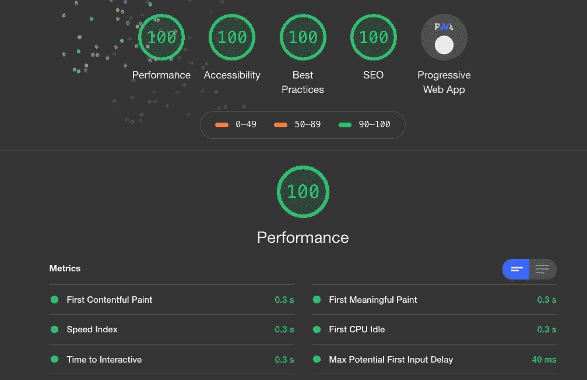
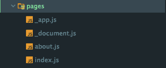
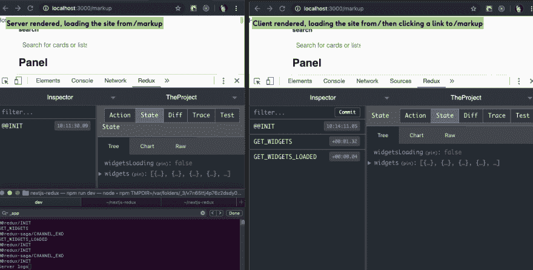
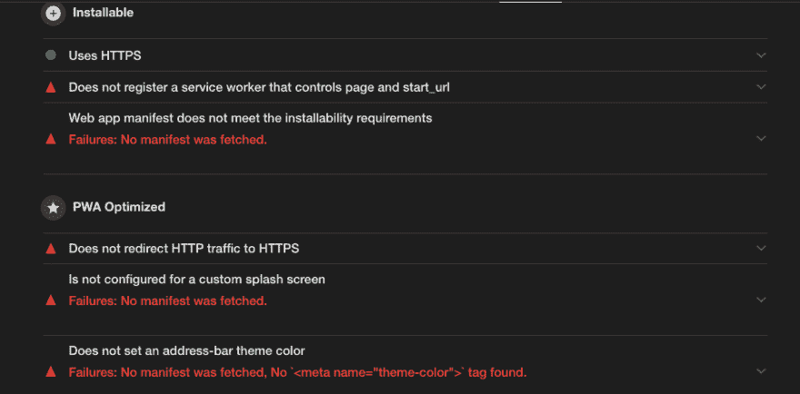

# 使用 Next 和 Redux 获得完美的 100% Google Lighthouse 审计分数

> 原文：<https://dev.to/kylessg/achieving-a-perfect-100-google-lighthouse-audit-score-with-next-js-and-redux-5p0>

[](https://camo.githubusercontent.com/60e01c505310b31551ee45c7f8a144bc4c69cfcb/687474703a2f2f672e7265636f726469742e636f2f545938776369547351482e676966)

(移至[此处](https://bullet-train.io/blog/100-percent-lighthouse-score)

这篇文章讲述了我们如何使用 Redux 构建一个 React/NextJS 应用程序，该应用程序通过服务器渲染和本地化支持获得了 100%的审核分数，并且可以作为 PWA 安装并在离线时导航。

# next.js

[next.js](https://nextjs.org) 是我的新宠。NextJS 是专门为 react 构建的，它让您可以在不影响您通常构建应用程序的情况下服务器呈现 react 应用程序。

开发一个 React 应用程序将会非常熟悉，你将不得不用他们的内置路由器来切换 react-router，并且意识到你的组件将不得不在 NodeJS 中执行(就像你正在单元测试它们一样)。

主要的区别是我们可以添加到我们的页面上的这一点魔力:

```
// Calls before the page is mounted, the call will happen on the server if it's the first page we visit
static async getInitialProps({ ctx: { store } }) {
  await store.dispatch(AppActions.getWidgets());
  return {};
} 
```

<svg width="20px" height="20px" viewBox="0 0 24 24" class="highlight-action crayons-icon highlight-action--fullscreen-on"><title>Enter fullscreen mode</title></svg> <svg width="20px" height="20px" viewBox="0 0 24 24" class="highlight-action crayons-icon highlight-action--fullscreen-off"><title>Exit fullscreen mode</title></svg>

任何异步任务或获取都可以在我们的页面上发生。

与其重复 next 的所有功能，我建议您浏览一下他们的[入门指南](https://nextjs.org/learn/basics/getting-started)。这篇文章详细介绍了我是如何添加 redux、sagas 并在 Lighthouse 上获得 100 分的。

# 我烦了，就把代码发给我。

[晴](https://github.com/kyle-ssg/nextjs-redux)。该项目也在 https://nextjs-redux.kyle-ssg.now.sh/[的](https://nextjs-redux.kyle-ssg.now.sh/)进行。但是如果你感兴趣，请继续阅读。

# 1。带有 Redux 的 next.js

[](https://res.cloudinary.com/practicaldev/image/fetch/s--OGZiKprh--/c_limit%2Cf_auto%2Cfl_progressive%2Cq_auto%2Cw_880/https://i.ibb.co/pZsxSRF/image.png)

next 中的路由基于/pages 目录中的内容，而不是在 JavaScript 中定义路由。
Next.js 定义了如何使用应用程序组件呈现页面，我们可以通过创建我们自己的 _app.js 来定制它。太好了，这意味着我们可以创建我们的商店，并像任何其他应用程序一样为它提供我们的根应用程序组件。

```
import App, { Container } from 'next/app';
import Head from 'next/head';
import React from 'react';
import { Provider } from 'react-redux';
import createStore from '../common/store';
import withRedux from 'next-redux-wrapper';
class MyApp extends App {
    static async getInitialProps({ Component, ctx }) {
        let pageProps;
        // Ensure getInitialProps gets called on our child pages
        if (Component.getInitialProps) {
            pageProps = await Component.getInitialProps({ ctx });
        }

        return { pageProps };
    }

    render() {
        const { Component, pageProps, store } = this.props;
        return (
            <Container>
                <Provider store={store}>
                    <>
                        <Head>
                            {/*...script and meta tags*/}
                            <title>TheProject</title>
                        </Head>
                        <Header/>
                        <Component {...pageProps} />
                    </>
                </Provider>
            </Container>
        );
    }
}

export default withRedux(createStore)(MyApp); 
```

<svg width="20px" height="20px" viewBox="0 0 24 24" class="highlight-action crayons-icon highlight-action--fullscreen-on"><title>Enter fullscreen mode</title></svg> <svg width="20px" height="20px" viewBox="0 0 24 24" class="highlight-action crayons-icon highlight-action--fullscreen-off"><title>Exit fullscreen mode</title></svg>

其中一些可能对您来说很熟悉，主要区别是:

*   在我们的 route 应用程序中，我们需要确保我们的页面 getInitialProps 函数在呈现之前被调用
*   Next.js 提供了一个 head 组件，让我们可以呈现 Head 中的任何标准标签，这甚至可以在每个页面上完成。这对于在每页上添加 opengraph/meta 标签/标题很有用。
*   next-redux-wrapper 是一个开箱即用的库，它允许我们使用 createStore。

**胜负**

添加一个简单的 get widgets 动作，我们可以看到以下不同之处，这取决于我们是直接登录页面还是从另一个页面导航到该页面。

[](https://res.cloudinary.com/practicaldev/image/fetch/s--yt7i5cio--/c_limit%2Cf_auto%2Cfl_progressive%2Cq_auto%2Cw_880/https://i.ibb.co/30xjFxy/image.png)

发生这种情况是因为 getInitialProps 在初始页面加载期间在服务器上被调用，它知道根据路由在哪个页面上调用它。

# 2。灯塔得分达到 100%

即使在本地，我也注意到一切都感觉很快。这让我想知道我能得到多少性能的页面。在 chrome dev tools 中，有一个很棒的工具叫做 L，它根据几个公认的最佳实践对你的网站进行评级，并且符合渐进式 web 应用标准。

## 基线得分

[](https://res.cloudinary.com/practicaldev/image/fetch/s--CDmesbNa--/c_limit%2Cf_auto%2Cfl_progressive%2Cq_auto%2Cw_880/https://i.ibb.co/10VMz8W/image.png)

基线得分不算太差，对于命中 API 的 redux 页面来说，性能不是问题。

## 可达性

这些项目中的大多数都很容易解决，并且涉及到采用最佳实践，例如图像 alt 标签、输入角色和 aria 属性。

### 适当的色彩对比

[](https://res.cloudinary.com/practicaldev/image/fetch/s--lCzAYV7w--/c_limit%2Cf_auto%2Cfl_progressive%2Cq_auto%2Cw_880/https://i.ibb.co/Y3FQhFk/image.png) 
Lighthouse 足够聪明，知道你的哪些元素没有达到 WCAG 2 AA 对比度阈值，声明你的前景和背景的对比度对于小文本应该至少为 4.5:1，对于大文本应该至少为 3:1。你可以运行像 [Web AIM 的对比度检查器](https://webaim.org/resources/contrastchecker/)这样的工具。一个快速的 CSS 改变解决了这个问题，但是很明显，这意味着内容丰富的网站需要大量的重构。

### 位置

[](https://res.cloudinary.com/practicaldev/image/fetch/s--v97C40UZ--/c_limit%2Cf_auto%2Cfl_progressive%2Cq_auto%2Cw_880/https://i.ibb.co/wpFPGtb/image.png) 
这个就有点棘手了。为了做好这一点，我希望服务器端呈现检测用户的首选语言环境，并设置 lang 属性以及提供本地化的内容。四处搜索我确实遇到了 [next-i18next](https://github.com/isaachinman/next-i18next) ，但是，我注意到它不支持无服务器，并且很难与[react-native-localization](https://www.npmjs.com/package/react-native-localization)共享区域设置字符串。

我想要一些能与[反应本地化](https://www.npmjs.com/package/react-localization)一起工作的东西，所以我的方法如下:

*   1:当文档试图在服务器上呈现时，我们希望获得首选的语言环境，并将 lang 属性设置为 HTML 标记。该信息来自服务器，或者来自我们可以设置的 cookie，或者通过解析 [Accept-Language 头](https://developer.mozilla.org/en-US/docs/Web/HTTP/Headers/Accept-Language)。我是如何做到这一点的代码片段可以在[这里](https://github.com/kyle-ssg/nextjs-redux/blob/master/project/api.js#L27)找到。

```
 // _document.js
    static async getInitialProps(ctx) {
        const initialProps = await Document.getInitialProps(ctx);
        const locale = API.getStoredLocale(ctx.req);
        return { ...initialProps, locale };
    }
    ...
    render() {
        return (
            <html lang={this.props.locale}>
                ...
            </html>
        )
    } 
```

<svg width="20px" height="20px" viewBox="0 0 24 24" class="highlight-action crayons-icon highlight-action--fullscreen-on"><title>Enter fullscreen mode</title></svg> <svg width="20px" height="20px" viewBox="0 0 24 24" class="highlight-action crayons-icon highlight-action--fullscreen-off"><title>Exit fullscreen mode</title></svg>

*   2:我定义了一些本地化字符串

```
// localization.js
import LocalizedStrings from 'react-localization';

const Strings = new LocalizedStrings({
    en: {
        title: 'Hello EN',
    },
    'en-US': {
        title: 'Hello US',
    },
});

export default Strings; 
```

<svg width="20px" height="20px" viewBox="0 0 24 24" class="highlight-action crayons-icon highlight-action--fullscreen-on"><title>Enter fullscreen mode</title></svg> <svg width="20px" height="20px" viewBox="0 0 24 24" class="highlight-action crayons-icon highlight-action--fullscreen-off"><title>Exit fullscreen mode</title></svg>

*   3:我希望我的应用程序知道商店的区域设置，以便我以后可以使用这些信息。

```
 // _app.js
    static async getInitialProps({ Component, ctx }) {
        let pageProps;
        const locale = API.getStoredLocale(ctx.req); // Retrieve the locale from cookie or headers
        await ctx.store.dispatch(AppActions.startup({ locale })); // Post startup action with token and locale
        ...
    } 
```

<svg width="20px" height="20px" viewBox="0 0 24 24" class="highlight-action crayons-icon highlight-action--fullscreen-on"><title>Enter fullscreen mode</title></svg> <svg width="20px" height="20px" viewBox="0 0 24 24" class="highlight-action crayons-icon highlight-action--fullscreen-off"><title>Exit fullscreen mode</title></svg>

*   4:我在初始客户端**和**服务器渲染的应用程序中设置了一次语言。

```
// _app.js
render(){
        if (!initialRender) {
            initialRender = true;
            const locale = store.getState().locale;
            if (locale) {
                Strings.setLanguage(locale);
            }
        }
    ...
} 
```

<svg width="20px" height="20px" viewBox="0 0 24 24" class="highlight-action crayons-icon highlight-action--fullscreen-on"><title>Enter fullscreen mode</title></svg> <svg width="20px" height="20px" viewBox="0 0 24 24" class="highlight-action crayons-icon highlight-action--fullscreen-off"><title>Exit fullscreen mode</title></svg>

*   5:在我的页面中，我现在可以自由使用本地化字符串。

```
 // pages/index.js
     render() {
            return (
                <div className="container">
                    <h1>Home</h1>
                    {Strings.title}
                </div>
            );
      } 
```

<svg width="20px" height="20px" viewBox="0 0 24 24" class="highlight-action crayons-icon highlight-action--fullscreen-on"><title>Enter fullscreen mode</title></svg> <svg width="20px" height="20px" viewBox="0 0 24 24" class="highlight-action crayons-icon highlight-action--fullscreen-off"><title>Exit fullscreen mode</title></svg>

### 最佳实践

由于该项目有相当最新的库，并且没有做任何不守规矩的事情，这已经是一个好成绩了。我们唯一要做的事情是使用 http2 和 SSL，这更多地取决于您如何托管应用程序。使用 [Zeit](https://zeit.co/) 涵盖了这两个方面。

### SEO

有了 nextJS，您可以轻松地在每页的基础上添加 meta 标记，甚至可以使用 getInitialProps 中的动态数据。

### 渐进式网络应用

[](https://res.cloudinary.com/practicaldev/image/fetch/s--EY6JyxC_--/c_limit%2Cf_auto%2Cfl_progressive%2Cq_auto%2Cw_880/https://i.ibb.co/WkBg4yK/image.png)

PWAs 使我们的 web 应用程序可以安装，结合服务人员，我们可以在用户离线时提供内容。

第一步是添加一个简单的清单，这让我们可以配置它在安装时的行为。

```
/static/manifest.json
{
  "short_name": "Project Name",
  "name": "Project Name",
  "icons": [
    {
      "src": "/statimg/icons-192.png",
      "type": "image/png",
      "sizes": "192x192"
    },
    {
      "src": "/statimg/icons-512.png",
      "type": "image/png",
      "sizes": "512x512"
    }
  ],
  "start_url": "/?source=pwa",
  "background_color": "#3367D6",
  "display": "standalone",
  "scope": "/",
  "theme_color": "#3367D6"
} 
```

<svg width="20px" height="20px" viewBox="0 0 24 24" class="highlight-action crayons-icon highlight-action--fullscreen-on"><title>Enter fullscreen mode</title></svg> <svg width="20px" height="20px" viewBox="0 0 24 24" class="highlight-action crayons-icon highlight-action--fullscreen-off"><title>Exit fullscreen mode</title></svg>

```
//_app.js
<link rel="manifest" href="/static/manifest.json"/> 
```

<svg width="20px" height="20px" viewBox="0 0 24 24" class="highlight-action crayons-icon highlight-action--fullscreen-on"><title>Enter fullscreen mode</title></svg> <svg width="20px" height="20px" viewBox="0 0 24 24" class="highlight-action crayons-icon highlight-action--fullscreen-off"><title>Exit fullscreen mode</title></svg>

***离线支持与服务人员***

多亏了 [next-offline](https://github.com/hanford/next-offline#readme) ，增加服务人员支持变得很简单。然而，让服务人员使用无服务器并托管在 Zeit 上有点复杂，我们必须为我们的服务器添加一个路由来提供正确的内容头。

```
// now.json
{
  "version": 2,
  "routes": [
    {
      "src": "^/service-worker.js$",
      "dest": "/_next/static/service-worker.js",
      "headers": {
        "Service-Worker-Allowed": "/"
      }
    }
    ...
  ]
} 
```

<svg width="20px" height="20px" viewBox="0 0 24 24" class="highlight-action crayons-icon highlight-action--fullscreen-on"><title>Enter fullscreen mode</title></svg> <svg width="20px" height="20px" viewBox="0 0 24 24" class="highlight-action crayons-icon highlight-action--fullscreen-off"><title>Exit fullscreen mode</title></svg>

然后配置 next-offline 从静态为服务人员提供服务。

```
next.config.js
{
    target: 'serverless',
    // next-offline options
    workboxOpts: {
        swDest: 'static/service-worker.js', 
```

<svg width="20px" height="20px" viewBox="0 0 24 24" class="highlight-action crayons-icon highlight-action--fullscreen-on"><title>Enter fullscreen mode</title></svg> <svg width="20px" height="20px" viewBox="0 0 24 24" class="highlight-action crayons-icon highlight-action--fullscreen-off"><title>Exit fullscreen mode</title></svg>

# 结果

因此，我们现在有了一个 100%审计得分的坚实基础项目，服务器渲染，本地化，可以离线安装和导航。你可以随意克隆它，然后绕过 T1！