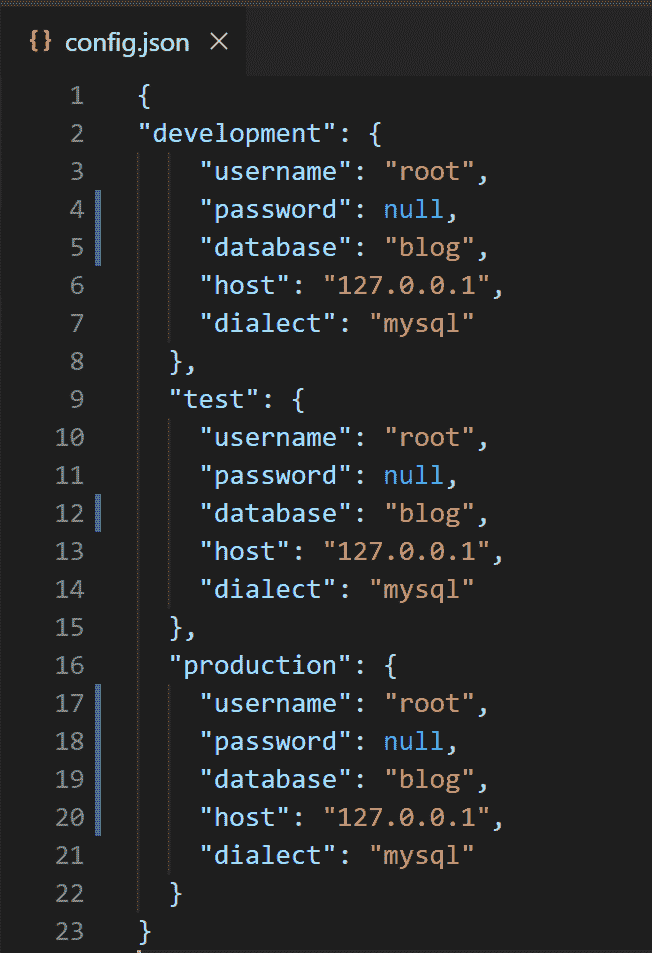

# 初学者的顺序基础

> 原文：<https://dev.to/ceceliacreates/sequelize-basics-for-beginners-part-one-2lc6>

对于那些不熟悉我的编码之旅的人，我于 2019 年 7 月从佐治亚理工学院的全栈软件工程训练营毕业。我在关于初学者的博客文章[Express Basics](https://dev.to/ceceliacreates/express-basics-for-beginners-3e00)中写了一点我深入后端开发的经历，但实际上当时我发现自己对项目中重叠的 Node、Express 和 Sequelize 函数感到困惑，并希望更深入地了解这些程序如何协同工作。

在我的第一篇文章中，我写了如何用 Express 和 write routes 设置一个服务器来处理 REST API 进程。这里我将遵循相同的格式——首先我将介绍如何设置 Sequelize 并将其连接到您的 SQL 数据库。在本系列的第二部分中，我将介绍如何编写 CRUD(创建、读取、更新和删除)查询。

您应该已经了解了如何创建 SQL 数据库以及表是如何工作的，但是您肯定不需要成为专家(我肯定不是！).

Sequelize 是一个 ORM(对象关系映射)工具，它允许您使用面向对象的方法查询数据库，因此对于那些已经熟悉像 JavaScript 这样的面向对象语言的人来说，它是一个很好的工具。它是基于承诺的，所以您还应该对 JavaScript 中的承诺如何工作有所了解，并了解 Node。它适用于多种风格的 SQL，包括 MySQL 和 Postgres。我使用的是 MySQL，所以检查一下 [Sequelize 文档](http://docs.sequelizejs.com/)以确保您计划使用的特定查询能够与您的数据库设置一起工作。

## 搭设和安装

唯一需要在 Sequelize 之外进行的操作是实际创建数据库。您不需要创建任何表，但是您将需要使用您的 shell 或 GUI 来创建数据库，所以确保您首先这样做。

SQL 相当符合语法，这很好。如果你需要常用命令的参考，我推荐 W3 Schools 的资源[。它也是与系统无关的，所以无论你使用 Postgres，MySQL，SQL Server 等等，它都是有效的。](https://www.w3schools.com/sql/sql_ref_keywords.asp)

下面是我的代码:

```
CREATE DATABASE blog 
```

<svg width="20px" height="20px" viewBox="0 0 24 24" class="highlight-action crayons-icon highlight-action--fullscreen-on"><title>Enter fullscreen mode</title></svg> <svg width="20px" height="20px" viewBox="0 0 24 24" class="highlight-action crayons-icon highlight-action--fullscreen-off"><title>Exit fullscreen mode</title></svg>

就像我说的，这很符合语法。

下一步是在 Node 中安装 Sequelize 和附带的包。我建议全局安装 Sequelize-CLI，这样您就可以使用它来配置您的所有项目。您还需要在本地安装 Sequelize，以及您的数据库系统(我使用的是 mysql2)。

```
npm install -g sequelize-cli
npm install sequelize mysql 
```

<svg width="20px" height="20px" viewBox="0 0 24 24" class="highlight-action crayons-icon highlight-action--fullscreen-on"><title>Enter fullscreen mode</title></svg> <svg width="20px" height="20px" viewBox="0 0 24 24" class="highlight-action crayons-icon highlight-action--fullscreen-off"><title>Exit fullscreen mode</title></svg>

安装 Sequelize-CLI 后，在项目文件夹中运行以下命令，创建 config.json 文件和 models 文件夹。我们将在下一节讨论如何使用它们。

```
sequelize init:config & sequelize init:models 
```

<svg width="20px" height="20px" viewBox="0 0 24 24" class="highlight-action crayons-icon highlight-action--fullscreen-on"><title>Enter fullscreen mode</title></svg> <svg width="20px" height="20px" viewBox="0 0 24 24" class="highlight-action crayons-icon highlight-action--fullscreen-off"><title>Exit fullscreen mode</title></svg>

您应该在控制台中看到一条消息输出，表明已经创建了一个 models 文件夹和 config.json 文件。您也可以通过检查项目文件夹中的文件夹/文件来确认它是否成功。models 文件夹中还应该有一个 index.js 文件。

[](https://res.cloudinary.com/practicaldev/image/fetch/s--xXRpxQfl--/c_limit%2Cf_auto%2Cfl_progressive%2Cq_auto%2Cw_880/https://thepracticaldev.s3.amazonaws.com/i/g2rn733zyih4hvlkkjc8.PNG)

## 连接数据库

在刚刚创建的 config 文件夹中，打开 config.json 文件。这是您设置变量以访问您创建的数据库的地方。对于本地项目或实践项目来说，这很好，但是如果您不想公开您的数据库访问信息，可以考虑像 dotenv 这样的包，它允许您为本地开发设置环境变量。

[](https://res.cloudinary.com/practicaldev/image/fetch/s--sE-OBZ9D--/c_limit%2Cf_auto%2Cfl_progressive%2Cq_auto%2Cw_880/https://thepracticaldev.s3.amazonaws.com/i/jmzsmcaicu56clyfy2ct.PNG)

## 创建模型

在第一步中创建的 models 文件夹中，您会看到一个 index.js 文件。对于我所做的设置，我不去管它，除非我使用环境变量，而是使用 config.js 文件。在这种情况下，您需要更新 index.js 文件中的文件名和可能的位置。

models 文件夹的用途是存储与 SQL 数据库中的表相关的各个模型文件。您将使用 Sequelize 语法来定义列名和数据类型，以及任何验证或限制。对于这个例子，我们的博客数据库中有一个“帖子”模型。同样，您不需要在 MySQL 中创建这些表，Sequelize 会根据这些模型为您创建这些表。

在一个名为 post.js 的文件中，我将键入以下代码:

```
module.exports = function(sequelize, DataTypes) {
  var Post = sequelize.define("Post", {
    title: DataTypes.STRING,
    author: DataTypes.STRING,
    content: DataTypes.TEXT,
    pubdate: DataTypes.DATE
  });
  return Post;
}; 
```

<svg width="20px" height="20px" viewBox="0 0 24 24" class="highlight-action crayons-icon highlight-action--fullscreen-on"><title>Enter fullscreen mode</title></svg> <svg width="20px" height="20px" viewBox="0 0 24 24" class="highlight-action crayons-icon highlight-action--fullscreen-off"><title>Exit fullscreen mode</title></svg>

这些是 Sequelize 的主要内容，所以我想分解一下这里正在发生的事情。

如果您熟悉 SQL，您可能会认为这种格式是一种模式。模式用于在 SQL 中创建表，设置列名和数据类型。Sequelize 所做的是使用面向对象的方法，使用类似 Javascript 的语法来创建这些模式。

在这个文件中，我们将导出一个函数，该函数使用 Sequelize 库中的方法和数据类型创建一个“Post”对象，Sequelize 将使用这些方法和数据类型在数据库中创建表，并确保任何新的“Post”对象都与此处设置的模型相匹配。

我建议看一下关于数据类型的[Sequelize 文档，以及哪些数据类型适用于您的 SQL 版本(Postgres、mySQL 等)。)](https://sequelize.org/master/manual/data-types.html)

在 models 文件夹中，您需要对数据库中的每个表执行相同的过程。index.js 文件将自动提取该文件夹中的任何文件来构建表。

## 创建表格

设置 Sequelize 的最后一步是将刚刚创建的模型推送到或同步到数据库中，以创建表。

Sequelize 对此有一个内置的方法，叫做 sync()。我之前提到过顺序是基于承诺的，这是其中一个例子。同步数据库模型是一个异步过程，在数据库同步之前，您不希望服务器启动。

因此，您需要确保 sync()创建的承诺在启动服务器之前得到解析。如果您的服务器使用 Express，那么您的 server.js 文件应该是这样的:

```
var db = require("./models");

var PORT = 3000;
var app = express();

db.sequelize.sync().then(function() {
  app.listen(PORT, function() {
    console.log("Express is running on port" + PORT);
  });
}); 
```

<svg width="20px" height="20px" viewBox="0 0 24 24" class="highlight-action crayons-icon highlight-action--fullscreen-on"><title>Enter fullscreen mode</title></svg> <svg width="20px" height="20px" viewBox="0 0 24 24" class="highlight-action crayons-icon highlight-action--fullscreen-off"><title>Exit fullscreen mode</title></svg>

在这段代码中，您将 models 文件夹作为变量“db”放入。然后使用内置的 sequelize.sync()方法，后跟一个包含 Express 函数的. then()来启动服务器。这可确保服务器在同步解决后启动。

确保您需要模型文件夹。

## 处理对模型的更改

如果您遇到添加新模型或修改现有模型的需要，您将需要重新同步您的数据库。在开发时，您可以将“force:true”作为参数添加到 sync()方法中，以指示数据库需要重新构建。

```
 db.sequelize.sync({force: true}).then(function() {
    app.listen(PORT, function() {
        console.log("Express is running on port" + PORT);
    }); 
```

<svg width="20px" height="20px" viewBox="0 0 24 24" class="highlight-action crayons-icon highlight-action--fullscreen-on"><title>Enter fullscreen mode</title></svg> <svg width="20px" height="20px" viewBox="0 0 24 24" class="highlight-action crayons-icon highlight-action--fullscreen-off"><title>Exit fullscreen mode</title></svg>

这将重建您的数据库。您需要确保在再次启动服务器之前删除它，否则数据库将不断重建(如果您不需要持久数据来开发，这很好)。您还需要将正在使用的任何开发数据重新植入到数据库中。

您的数据库现在使用 Sequelize 连接到您的应用程序！如果您有任何建议或问题，请告诉我！我一直在学习，欢迎反馈。感谢阅读！