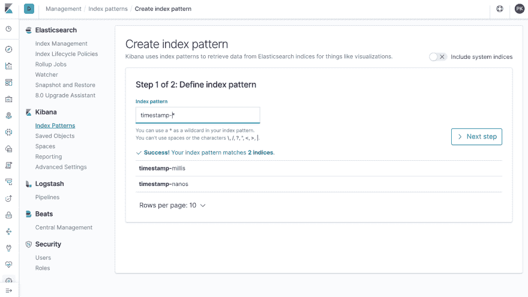
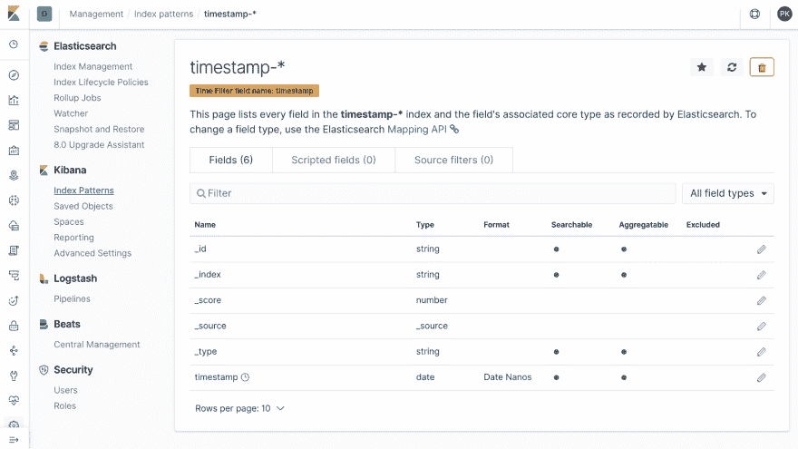
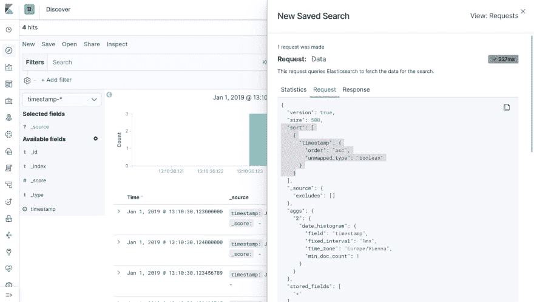
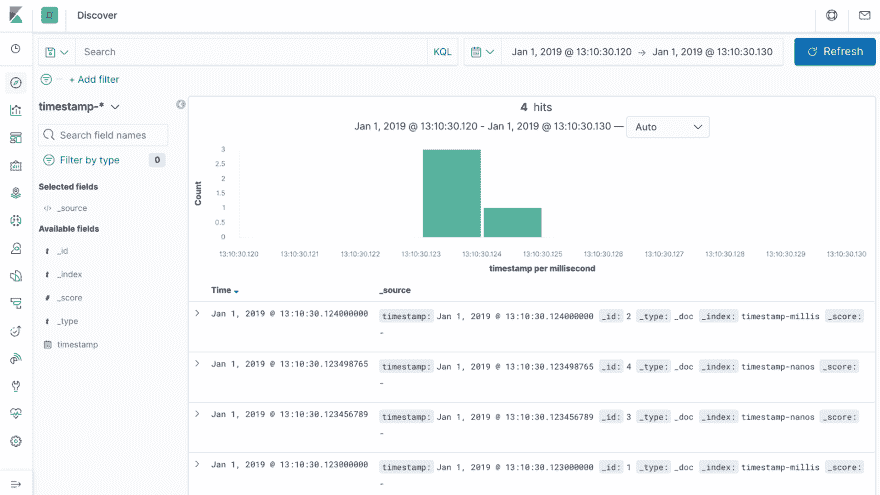

# 在 Elasticsearch 和 Kibana 中组合使用 date 和 date_nanos

> 原文：<https://dev.to/xeraa/combining-date-and-datenanos-in-elasticsearch-and-kibana-27o6>

Elasticsearch 7.0 版本增加了对[纳秒时间戳](https://www.elastic.co/blog/journey-support-nanosecond-timestamps-elasticsearch)的支持。所以除了 [`date`数据类型](https://www.elastic.co/guide/en/elasticsearch/reference/current/date.html)现在还有 [`date_nanos`](https://www.elastic.co/guide/en/elasticsearch/reference/7.0/date_nanos.html) 。更令人困惑的事情之一是当你组合两种数据类型时，这是本文所探讨的。

## `date_nanos`的映射

在开始组合数据类型之前，还有一个令人困惑的原因:`date_nanos`不会被[动态映射](https://www.elastic.co/guide/en/elasticsearch/reference/7.0/dynamic-mapping.html)自动选取——当您不提供映射，而 Elasticsearch 试图根据您索引的第一个文档的值猜测每个字段的数据类型时。

举例来说，使用动态映射创建两个新的索引并检索它们:

```
PUT timestamp-millis/_doc/1
{
  "timestamp": "2019-01-01T12:10:30.124Z"
}
PUT timestamp-nanos/_doc/1
{
  "timestamp": "2019-01-01T12:10:30.124456789Z"
}
GET timestamp-*/_mapping 
```

Enter fullscreen mode Exit fullscreen mode

两者具有相同的映射，这可能不是您想要的:

```
{
  "timestamp-nanos" : {
    "mappings" : {
      "properties" : {
        "timestamp" : {
          "type" : "date"
        }
      }
    }
  },
  "timestamp-millis" : {
    "mappings" : {
      "properties" : {
        "timestamp" : {
          "type" : "date"
        }
      }
    }
  }
} 
```

Enter fullscreen mode Exit fullscreen mode

## 结合`date`和`date_nanos`进行弹性搜索

现在来看数据类型的组合。删除现有索引并重新开始显式映射:

```
DELETE timestamp-*
PUT timestamp-millis
{
  "mappings": {
    "properties": {
      "timestamp": {
        "type": "date"
      }
    }
  }
}
PUT timestamp-nanos
{
  "mappings": {
    "properties": {
      "timestamp": {
        "type": "date_nanos"
      }
    }
  }
} 
```

Enter fullscreen mode Exit fullscreen mode

另外，添加四个彼此靠近的样本文档:

```
PUT timestamp-millis/_doc/1
{
  "timestamp": "2019-01-01T12:10:30.123Z"
}
PUT timestamp-millis/_doc/2
{
  "timestamp": "2019-01-01T12:10:30.124Z"
}
PUT timestamp-nanos/_doc/3
{
  "timestamp": "2019-01-01T12:10:30.123456789Z"
}
PUT timestamp-nanos/_doc/4
{
  "timestamp": "2019-01-01T12:10:30.123498765Z"
} 
```

Enter fullscreen mode Exit fullscreen mode

当您搜索两个索引并希望对字段`timestamp`进行排序时，会出现什么情况？

```
GET timestamp-*/_search {
  "sort": "timestamp"
} 
```

Enter fullscreen mode Exit fullscreen mode

可能不是你所期望的方式(仅包括`hits`的相关字段):

```
{
  "_index" : "timestamp-millis",
  "_id" : "1",
  "_source" : {
    "timestamp" : "2019-01-01T12:10:30.123Z"
  },
  "sort" : [1546344630123]
},
{
  "_index" : "timestamp-millis",
  "_id" : "2",
  "_source" : {
    "timestamp" : "2019-01-01T12:10:30.124Z"
  },
  "sort" : [1546344630124]
},
{
  "_index" : "timestamp-nanos",
  "_id" : "3",
  "_source" : {
    "timestamp" : "2019-01-01T12:10:30.123456789Z"
  },
  "sort" : [1546344630123456789]
},
{
  "_index" : "timestamp-nanos",
  "_id" : "4",
  "_source" : {
    "timestamp" : "2019-01-01T12:10:30.123498765Z"
  },
  "sort" : [1546344630123498765]
} 
```

Enter fullscreen mode Exit fullscreen mode

或者实际上，如果你查看`sort`字段并阅读[文档](https://www.elastic.co/guide/en/elasticsearch/reference/7.0/date_nanos.html)，它确实有意义:

> [date_nanos]仍以 long 形式存储，表示自纪元以来的纳秒数。

但这仍然不是你想要的。幸运的是，在 7.2 中添加了特性[:“将日期和日期纳米转换添加到数字类型排序选项中。”](https://github.com/elastic/elasticsearch/pull/40199)

所以你想用的[查询是:](https://www.elastic.co/guide/en/elasticsearch/reference/7.3/search-request-body.html#_sorting_numeric_fields) 

```
GET timestamp-*/_search {
  "sort": {
    "timestamp": {
      "numeric_type": "date_nanos"
    }
  }
} 
```

Enter fullscreen mode Exit fullscreen mode

它的工作方式是将所有的`timestamp`字段转换为纳秒精度:

```
{
  "_index" : "timestamp-millis",
  "_id" : "1",
  "_source" : {
    "timestamp" : "2019-01-01T12:10:30.123Z"
  },
  "sort" : [1546344630123000000]
},
{
  "_index" : "timestamp-nanos",
  "_id" : "3",
  "_source" : {
    "timestamp" : "2019-01-01T12:10:30.123456789Z"
  },
  "sort" : [1546344630123456789]
},
{
  "_index" : "timestamp-nanos",
  "_id" : "4",
  "_source" : {
    "timestamp" : "2019-01-01T12:10:30.123498765Z"
  },
  "sort" : [1546344630123498765]
},
{
  "_index" : "timestamp-millis",
  "_id" : "2",
  "_source" : {
    "timestamp" : "2019-01-01T12:10:30.124Z"
  },
  "sort" : [1546344630124000000]
} 
```

Enter fullscreen mode Exit fullscreen mode

## 这对基巴纳有用吗？

Kibana 7.3 增加了一般的`date_nanos`支持，尽管有一些限制，这些限制在该特性的 [Github 问题中有所描述:](https://github.com/elastic/kibana/issues/31424)

> 由于 JavaScript 的技术限制，我们不能完全支持 Kibana 中的`date_nanos`。JavaScript 将所有数值存储在 64 位浮点数中。因此，我们只能表示精度为 52 位的整数(非十进制数)(浮点数中的尾数)。

要尝试混合数据类型，您需要首先创建索引模式，并在下面的屏幕上选择字段`timestamp`作为*时间过滤器字段名称*:[](https://res.cloudinary.com/practicaldev/image/fetch/s--n-kl5IS4--/c_limit%2Cf_auto%2Cfl_progressive%2Cq_auto%2Cw_880/https://xeraa.net/blog/2019_date-nano-elasticsearch-kibana/create-index-pattern.png)

而且几乎成功了。显示作品—这显示了一个 10ms 的时间窗口—但是排序顺序不正确: [](https://res.cloudinary.com/practicaldev/image/fetch/s--pFinA62S--/c_limit%2Cf_auto%2Cfl_progressive%2Cq_auto%2Cw_880/https://xeraa.net/blog/2019_date-nano-elasticsearch-kibana/discover-millis.png)

当您编辑索引模式并将*格式*改为*日期纳米* : [](https://res.cloudinary.com/practicaldev/image/fetch/s--SqLRiZpX--/c_limit%2Cf_auto%2Cfl_progressive%2Cq_auto%2Cw_880/https://xeraa.net/blog/2019_date-nano-elasticsearch-kibana/index-pattern.png)

然后 *Discover* 显示了时间戳的纳秒精度，但是仍然没有解决排序问题: [](https://res.cloudinary.com/practicaldev/image/fetch/s--gmdhT2AC--/c_limit%2Cf_auto%2Cfl_progressive%2Cq_auto%2Cw_880/https://xeraa.net/blog/2019_date-nano-elasticsearch-kibana/discover-nanos.png)

为什么排序不能正常工作？因为底层查询没有使用`"numeric_type": "date_nanos"`。您可以通过 *Inspect* 按钮查看请求和响应: [](https://res.cloudinary.com/practicaldev/image/fetch/s--RaLWnRYK--/c_limit%2Cf_auto%2Cfl_progressive%2Cq_auto%2Cw_880/https://xeraa.net/blog/2019_date-nano-elasticsearch-kibana/inspect.png)

我已经[在基巴纳提出了一个问题来解决](https://github.com/elastic/kibana/issues/43939)。

## 7.5 中更新

Kibana 7.5.0 的发布修复了剩下的问题。你不必再改变字段的*格式*，但现在它只是工作: [](https://res.cloudinary.com/practicaldev/image/fetch/s--HfiyI68g--/c_limit%2Cf_auto%2Cfl_progressive%2Cq_auto%2Cw_880/https://xeraa.net/blog/2019_date-nano-elasticsearch-kibana/kibana-fixed.png)

# 结论

一旦你避开了像动态映射这样的陷阱，就要小心`"numeric_type": "date_nanos"`，在 Elasticsearch 中结合`date`和`date_nanos`进行排序工作，在 Kibana 中结合~~。~~

**PS:** 感谢[栈溢出问题](https://stackoverflow.com/questions/57630528/bulk-inject-doc-to-elastic-search-with-nanoseconds-timestamp)让我下了这个兔子洞。