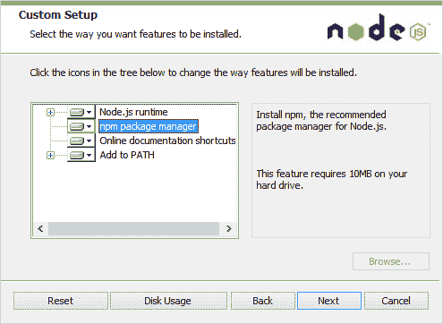
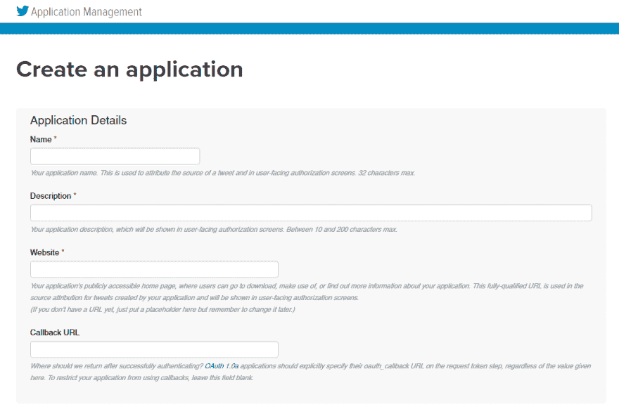

# 用 Node.js 创建 Twitter bot

> 原文：<https://dev.to/sharpacex/creating-a-twitter-bot-with-node-js-3lda>

*本教程最初发布于[sabe . io](https://sabe.io/)T3。*

在本教程中，我们将学习如何创建一个简单的 Twitter 机器人，当用户关注帐户时，它会自动向用户发送回应。我们将使用 Node.js 用 [JavaScript](https://sabe.io/classes/javascript) 编写这个机器人，它将会非常棒！

这里有一个看起来已经完成的机器人:

[](https://res.cloudinary.com/practicaldev/image/fetch/s--HCjrGL77--/c_limit%2Cf_auto%2Cfl_progressive%2Cq_auto%2Cw_880/https://sabe.io/tutorials/creating-twitter-bot-node-js/bot.png)

看看我们将建立的 Twitter 机器人。

在我们开始之前，让我们确保您满足本教程的先决条件。

## 先决条件

1.  因为这个机器人是用 JavaScript 写的，所以关于 JavaScript 的基础知识会很有帮助
2.  一个推特账户
3.  您可以通过短信验证的有效电话号码

如果你有你需要的一切，让我们开始表演。

## 安装节点和 NPM

为了安装我们的 bot 所需的 npm 模块，我们首先需要一个 JavaScript 运行时 **Node.js** 。

1.  访问官方 [Node.js 网站](https://nodejs.org/en/download/)获取安装程序。
2.  下载后，运行安装程序，直到结束。
3.  重新启动计算机以确保更改生效。

[](https://res.cloudinary.com/practicaldev/image/fetch/s--neoIBPiJ--/c_limit%2Cf_auto%2Cfl_progressive%2Cq_auto%2Cw_880/https://sabe.io/tutorials/creating-twitter-bot-node-js/node-installer.png)

Node.js 安装程序。

Node.js 安装程序应该已经为你安装了 [NPM](https://www.npmjs.com/get-npm) 。为了确认你已经正确安装了这两个软件，如果你在 Windows 上，你需要打开 **Windows 命令提示符**，如果你在 Mac 或 Linux 上，你需要打开**终端**。

要检查是否安装了节点:

```
node -v 
```

要检查您是否安装了 NPM:

```
npm -v 
```

如果这两个命令都返回一个**版本号**，那么就可以开始了。

## 初始化我们的项目并安装 twit

创建一个文件夹作为你的机器人的家。在该文件夹中，通过运行以下命令初始化一个新项目:

```
npm init 
```

你可以随意输入任何你喜欢的东西，也可以什么都不输入。一旦完成，您应该会看到一个名为`package.json`的文件。为了简化我们与强大的 Twitter API 的交互，我们将使用一个名为 [twit](https://www.npmjs.com/package/twit) 的 npm 模块。Twit 将作为我们的 Twitter API 客户端，您可以通过在与您的文件相同的文件夹中运行以下命令来安装它:

```
npm install twit --save 
```

完成之后，我们就可以在代码中使用 twit 了。让我们跳上推特吧！

## 创建新的 Twitter 应用程序

在你登录到你的 Twitter 账户后，确保你有一个[验证过的电话号码](https://twitter.com/settings/add_phone)绑定到你的账户。Twitter 要求注册任何新的应用程序。在你的 Twitter 账户有了一个验证过的电话号码后，前往 [Twitter 应用页面](https://apps.twitter.com/app/new)开始创建一个新的 Twitter 应用。

[](https://res.cloudinary.com/practicaldev/image/fetch/s--jXUpiJEK--/c_limit%2Cf_auto%2Cfl_progressive%2Cq_auto%2Cw_880/https://sabe.io/tutorials/creating-twitter-bot-node-js/create-new-twitter-application.png)

您可以在此页面创建新的 Twitter 应用程序。

给你的应用一个名字，描述，网站(可以是任何东西)，勾选复选框，点击“创建你的 Twitter 应用”。创建完成后，从这个页面进入你的机器人[，然后点击“密钥和访问令牌”标签。在这个页面上，你可以找到你的机器人需要的四样东西:](https://apps.twitter.com)

*   消费者密钥
*   消费者秘密
*   访问令牌
*   访问令牌秘密

[](https://res.cloudinary.com/practicaldev/image/fetch/s--ZStIaZM9--/c_limit%2Cf_auto%2Cfl_progressive%2Cq_auto%2Cw_880/https://sabe.io/tutorials/creating-twitter-bot-node-js/credentials.png)

可以获取您的密钥和访问令牌的页面。

手头上有了你需要的来自 Twitter 的所有信息，我们就可以开始编码了！

## 启动 Bot

在与您的`package.json`相同的文件夹中，创建一个名为`index.js`的文件，让我们设置身份验证:

```
var Twit = require('twit')

var T = new Twit({
    consumer_key: '',
    consumer_secret: '',
    access_token: '',
    access_token_secret: ''
}) 
```

将 twit 模块作为变量`Twit`导入，然后通过调用它的构造函数并传入您之前获得的凭证来初始化它的实例。让我们测试一下，看看 Twitter 是否通过尝试认证来识别这些信息:

```
T.get('account/verify_credentials', {
    include_entities: false,
    skip_status: true,
    include_email: false
}, onAuthenticated)

function onAuthenticated(err, res) {
    if (err) {
        throw err
    }

    console.log('Authentication successful. Running bot...\r\n')
} 
```

这段代码的作用是获取我们的 twit 实例，并尝试使用它进行身份验证。我们传递一个回调函数，在得到 Twitter 的响应后调用这个函数。如果 Twitter 返回一个错误，我们会立即抛出。如果没有，并且我们的凭证有效，我们应该看到一个成功的消息打印出来。

要启动 bot，请运行以下命令:

```
npm start 
```

如果您看到:

```
Authentication successful. Running bot... 
```

然后凭证有效，我们现在可以授权诸如推文、赞和转发之类的事情。

## 溪流

我们可以通过使用 twit 创建一个**流**来建立与 Twitter 的[流 API](https://developer.twitter.com/en/docs/tweets/filter-realtime/guides/connecting) 的长期连接。有了 streams，我们可以让 Twitter 为我们过滤事件，然后只在我们关心的事件发生时做一些事情，比如说，关注我们的帐户。

创建流很简单，我们应该在成功进行身份认证后立即进行:

```
function onAuthenticated(err, res) {
    if (err) {
        throw err
    }

    console.log('Authentication successful. Running bot...\r\n')

    var stream = T.stream('user')
} 
```

这就是创建流所需的全部内容。我们正在连接到`user`端点，因为我们在本教程中关心的事件只会影响作为用户的我们。以下是您可以连接到的所有端点:

*   `statuses/filter`
*   `statuses/sample`
*   `statuses/firehose`
*   `user`
*   `site`

它们每个都提供不同的功能，所以如果你想扩展你的机器人的功能，一定要仔细阅读 Twitter 文档。

## 倾听事件

出于本教程的目的，我们想要监听的唯一事件是`follow`事件。请记住，我们希望自动回复用户，感谢他们关注我们的帐户。让我们附加监听器:

```
function onAuthenticated(err, res) {
    if (err) {
        throw err
    }

    console.log('Authentication successful. Running bot...\r\n')

    var stream = T.stream('user')

    stream.on('follow', onFollowed)
    stream.on('error', onError)
} 
```

在传入您想要监听的事件的名称后，还传入一个回调函数，当事件发生时调用该函数。我们还添加了一个关于错误的监听器，这样我们就可以在错误发生时处理它们。

现在让我们定义这两个回调函数:

```
function onFollowed(event) {
    var name = event.source.name
    var screenName = event.source.screen_name
    var response = '@' + screenName + ' Thank you for following, ' + name + '!'

    // tweet response to user here

    console.log('I was followed by: ' + name + ' @' + screenName)
}

function onError(error) {
    throw error
} 
```

当 follow 事件发生时，它触发`onFollowed`回调函数。在里面，我们提取我们知道我们将需要的信息，即用户名和屏幕名称，或 Twitter 句柄。在那里，我们构造我们的响应消息，这只是一个普通的感谢消息，其中嵌入了他们的屏幕名称和名字。

如果在任何一点发生错误，我们简单地立即抛出错误。然而，如果你愿意，你完全可以用另一种方式来处理。

最后，我们做了一个简单的`console.log`操作，这样我们就可以实时看到在机器人运行期间我们是否被跟踪了。您也许可以通过在日志中添加时间戳来改进这一点，这样您也可以准确地知道您何时获得了一个新的追随者，但这完全是可选的！

现在，为了完成这个机器人，我们必须在推特上回复随后的用户。

## 自动用 Twit 发微博

使用 twit 发微博非常简单。我们只需在 twit 实例上调用`post`方法，告诉它我们想要发布的内容(在本例中，是 tweet/status)，传入我们想要发布的内容(我们的响应文本)，最后传入一个回调函数。

这看起来像这样:

```
T.post('statuses/update', {
    status: response
}, onTweeted) 
```

如果你想知道`statuses/update`是从哪里来的，那么[的 Twitter 文档](https://developer.twitter.com/en/docs/tweets/post-and-engage/api-reference/post-statuses-update)会很好地解释它。例如，如果你想发送一个**直接消息**给用户，你可以使用`direct_messages/new`。

既然我们已经告诉 twit 发布我们的响应，我们只需要定义`onTweeted`回调函数，我们的机器人就完成了:

```
function onTweeted(err, reply) {
    if (err !== undefined) {
        console.log(err)
    } else {
        console.log('Tweeted: ' + reply.text)
    }
} 
```

如果出现错误，我们会将其记录到我们的控制台，否则我们会记录我们发布的确切内容。如果你想从静态的感谢信息变成动态的感谢信息，这是很有用的。通过记录你的推文，你可以确保你的机器人正在发送你想要它发送的信息，因为响应直接来自 Twitter 本身。

## 运行你的推特机器人

保存所有文件后，运行以下命令启动 bot:

```
npm start 
```

如前所述，如果成功，您应该会看到:

```
Authentication successful. Running bot... 
```

[](https://res.cloudinary.com/practicaldev/image/fetch/s--HCjrGL77--/c_limit%2Cf_auto%2Cfl_progressive%2Cq_auto%2Cw_880/https://sabe.io/tutorials/creating-twitter-bot-node-js/bot.png)

我们的推特机器人在行动。

这是我们 twit 驱动的 Twitter 机器人的完整文件:

```
var Twit = require('twit')

var T = new Twit({
    consumer_key: '',
    consumer_secret: '',
    access_token: '',
    access_token_secret: ''
})

T.get('account/verify_credentials', {
    include_entities: false,
    skip_status: true,
    include_email: false
}, onAuthenticated)

function onAuthenticated(err, res) {
    if (err) {
        throw err
    }
    console.log('Authentication successful. Running bot...\r\n')
    var stream = T.stream('user')
    stream.on('follow', onFollowed)
    stream.on('error', onError)
}

function onFollowed(event) {
    var name = event.source.name
    var screenName = event.source.screen_name
    var response = '@' + screenName + ' Thank you for following, ' + name + '!'
    T.post('statuses/update', {
        status: response
    }, onTweeted)
    console.log('I was followed by: ' + name + ' @' + screenName)
}

function onError(error) {
    throw error
}

function onTweeted(err, reply) {
    if (err !== undefined) {
        console.log(err)
    } else {
        console.log('Tweeted: ' + reply.text)
    }
} 
```

在那里！

## 结论

在本教程中，我们看到了如何使用 Node.js 和 twit npm 模块来创建一个简单的 Twitter bot，它可以自动响应关注某个帐户的用户。Twit 功能强大，可以做的不仅仅是简单地发布推文，还包括转发和喜欢其他推文。要了解更多信息，请查阅他们的文档，看看如何利用这个简单的机器人来制作更高级、更复杂的东西。

我们希望本教程对你有所帮助。感谢阅读！

*本教程最初发布于[sabe . io](https://sabe.io/)T3。*