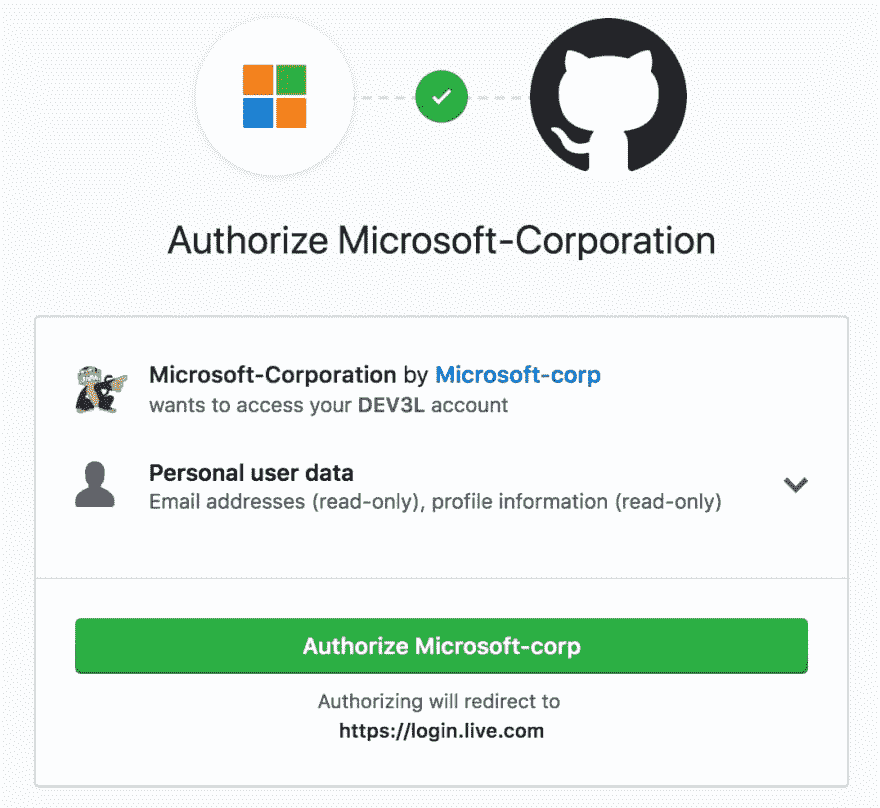
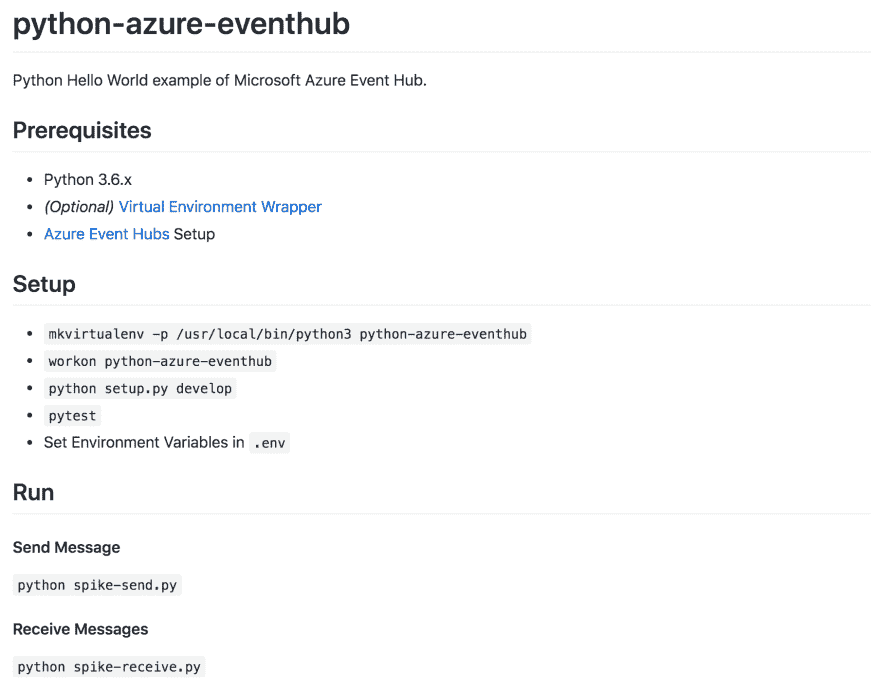

# 使用 Python 的 Azure 事件中心的数据摄取

> 原文：<https://dev.to/dev3l/data-ingestion-with-azure-event-hubs-using-python-2dda>

[提取转换负载(ETL)](https://www.webopedia.com/TERM/E/ETL.html) 是我在职业生涯中一直使用的一种数据集成模式。使用 Microsoft Azure，每个步骤的分离比以往任何时候都更容易。使用 [Azure Event Hubs](https://azure.microsoft.com/en-us/services/event-hubs/) ，我们应该能够通过创建一种机制来摄取数据，无论它是如何提取的，从而开始搭建一个短暂的管道。

在我的职业生涯中，我接触过许多种 ETL 模式。从通过复杂的雪花消息队列架构(RabbitMQ + Workers)手动插入数据(通常在出现问题时)。安逸从来不是目标。我们相信现在需要解决的问题*(手动)it*永远不会失败*(最终一致性)。*

 *微软已经用“任何开发者、任何应用、任何平台”扭转了局面。支持和减少复杂性是生态系统的标志，约定胜于配置。在敏捷软件开发宣言的 12 条原则中，我最喜欢的是 T2 简单 T3；Azure 已经搞定了。

```
Simplicity--the art of maximizing the amount of work not done--is essential. 
```

Enter fullscreen mode Exit fullscreen mode

# 1。在 Azure 中设置

首先，我们需要一个[微软 Azure 账户](https://azure.microsoft.com/en-us/free/)。我不费吹灰之力就能把我的 GitHub 账户连接到他们的免费层。

[](https://res.cloudinary.com/practicaldev/image/fetch/s--egEpBOnv--/c_limit%2Cf_auto%2Cfl_progressive%2Cq_auto%2Cw_880/https://thepracticaldev.s3.amazonaws.com/i/qu5f8a7tjptjnebs07f6.png)

# 2。创建事件中心名称空间和主题

[](https://res.cloudinary.com/practicaldev/image/fetch/s--RkaybIS1--/c_limit%2Cf_auto%2Cfl_progressive%2Cq_auto%2Cw_880/https://thepracticaldev.s3.amazonaws.com/i/bj5vjs7f1lw5natn3fr8.png)

遵循[快速入门:使用 Azure portal](https://docs.microsoft.com/en-us/azure/event-hubs/event-hubs-create) 创建一个活动中心。遵循指南后，请确保复制您的事件中心名称和主连接字符串。我们一会儿需要这些！

# 3。用 Python 发送和接收事件

现在我们有了 Azure 事件中心，让我们发送一些消息。作为一个起点，我在这里做了如下工作:[使用 Python](https://docs.microsoft.com/en-us/azure/event-hubs/event-hubs-python-get-started-send) 向事件中心发送事件或从事件中心接收事件

### 举例

可以随意使用 GitHub 中的 [python-azure-eventhub](https://github.com/DEV3L/python-azure-eventhub) 作为起始模板！

[](https://res.cloudinary.com/practicaldev/image/fetch/s--aF24_nmf--/c_limit%2Cf_auto%2Cfl_progressive%2Cq_auto%2Cw_880/https://thepracticaldev.s3.amazonaws.com/i/xfrfuym1c1k3km6l1xiq.png)

### 输出

[](https://res.cloudinary.com/practicaldev/image/fetch/s--zjUojcIX--/c_limit%2Cf_auto%2Cfl_progressive%2Cq_auto%2Cw_880/https://thepracticaldev.s3.amazonaws.com/i/ij8fiorscqlmmvfxd43a.png)

# 结论

云架构让我们专注于我们的应用，而不是机器的管理。我们利用 Microsoft Azure 平台的健壮性，总拥有成本比内部管理的基础架构低得多。有了 Event Hub 的框架，我们实现健壮的 ETL 管道的第一步就完成了。接下来的步骤是使用发布-订阅设计模式连接到 Azure 事件网格来链接发送到我们队列的消息。*