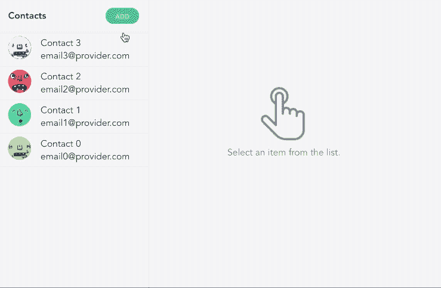
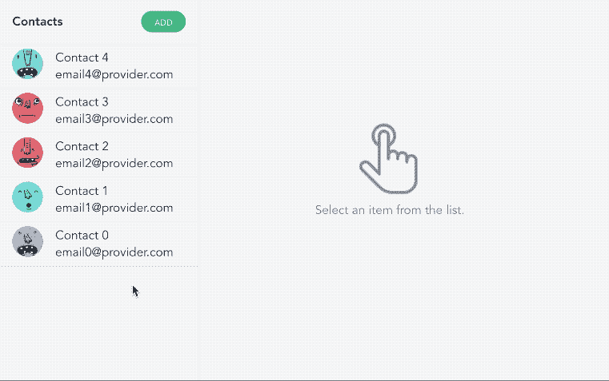
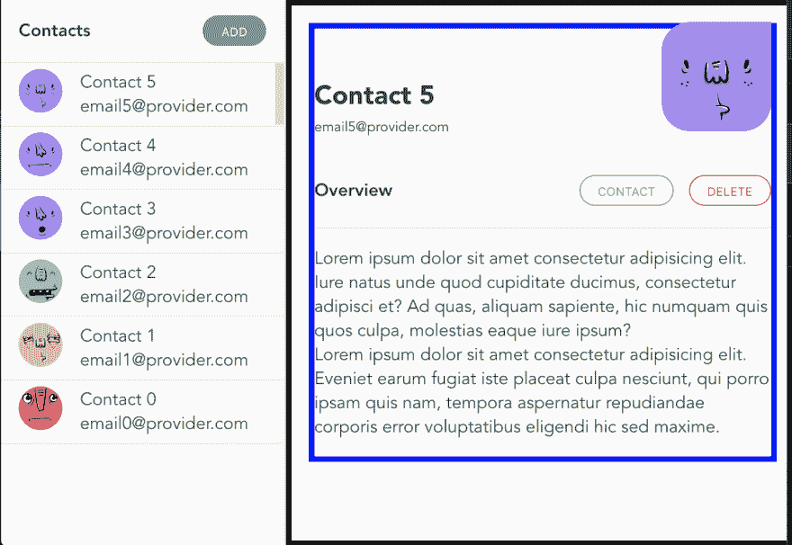

# 所有你需要知道的关于角度动画

> 原文：<https://dev.to/mustapha/all-you-need-to-know-about-angular-animations-1c09>

动画是一种设计工具，我们可以通过让抽象的数字作品变得更加熟悉和友好，来赋予它们实体性和可触摸性。许多组件库充分利用动画来使它们的组件与观众更相关。好消息是，作为一个 Angular 开发者，我们可以拥有几乎开箱即用的优秀组件。坏消息是，我们几乎完全依赖这些库来制作动画。角度动画 API 是使用最少的角度 API 之一，如果不是最少的话。

为了改变这一点，我会尽我所能，在这篇文章中，向你展示所有你需要知道的关于角度动画的知识。为此，我们将一起构建这个[令人惊叹的组件](https://theangularguy.github.io/angularAnimationTutorial/):

[](https://res.cloudinary.com/practicaldev/image/fetch/s--iJlBySU9--/c_limit%2Cf_auto%2Cfl_progressive%2Cq_66%2Cw_880/https://i.ibb.co/0ctcQXw/final.gif)

正如他们所说的，熟能生巧，所以如果你喜欢，你可以继续克隆这个库并开始运行(本文的每一部分都代表了库的一个 git 分支)。

**注- >** 如果你对跟随不感兴趣，你可以直接跳到第 3 部分，在那里你会发现角度动画 API 提供给你的超能力。

# 1。创建主要组件📦

我们开始吧。在确保您的机器上安装了[节点](https://nodejs.org/en/)、 [NPM](https://docs.npmjs.com/about-npm-versions) 和 [Angular CLI](https://cli.angular.io/) 之后，创建一个新项目，并将其命名为“awesomeContacts”或您想到的任何其他聪明的名称，然后创建一个“列表”组件:

```
ng new awesomeContacts --minimal=true --style=scss --routing=false --skip-install
cd awesomeContacts && yarn # or npm i
# wait for the install to finish, then create the 'list' component
ng g c components/list --spec=false && ng serve -o 
```

Enter fullscreen mode Exit fullscreen mode

完成后，删除 AppComponent 模板中的所有内容，并替换为我们的 ListComponent ( `<app-list></app-list>`)。

还有一件事在我们跳到下一部分之前，我们还有最后一件事要做。为了让动画工作，我们需要在 AppModule 导入中导入`BrowserAnimationModule`。所以你应该有这样的:

```
import { BrowserAnimationsModule } from '@angular/platform-browser/animations';
//...

@NgModule({
  declarations: [AppComponent, ListComponent],
  imports: [BrowserModule, BrowserAnimationsModule],
  providers: [],
  bootstrap: [AppComponent],
})
export class AppModule {} 
```

Enter fullscreen mode Exit fullscreen mode

# 2。实现列表组件(暂时没有动画)

现在我们已经有了应用程序和列表组件，让我们快速实现组件。因为这篇文章是关于动画的，所以我们不会过多关注这个实现。

首先，我们创建一个联系人对象的接口，然后我们创建一组联系人来玩:

```
interface Contact {
  id: number;
  name: string;
  email: string;
  avatarUrl: string;
}

const CONTACTS_MOCK: Contact[] = new Array(5)
  .fill({})
  .map(
    (c: Contact, i: number) =>
      ({
        id: i,
        name: `Contact ${i}`,
        email: `email${i}@provider.com`,
        avatarUrl: `https://api.adorable.io/avatars/100/${~~(Math.random() * 100)}`,
      } as Contact),
  )
  .reverse(); // * to have them sorted in DESC order 
```

Enter fullscreen mode Exit fullscreen mode

ℹ️ [可爱的 io](http://avatars.adorable.io/) 是一个伟大的公共 API，为占位符头像服务。
ℹ️ `~~`(两个按位非运算符)等价于 Math.floor:)

一旦完成，对于`list.component.ts`的实现应该看起来像这样:

```
@Component({
  selector: 'app-list',
  templateUrl: './list.component.html',
  styleUrls: ['./list.component.scss'],
})
export class ListComponent {
  contactList: Contact[] = CONTACTS_MOCK;
  selectedContact: Contact;

  onSelectItem(contact: Contact) {
    // * selecting a contact to focus on
    this.selectedContact = contact ? { ...contact } : null;
  }

  onAddItem() {
    const rndNum = Date.now();
    const newContact: Contact = {
      id: this.contactList.length * rndNum,
      name: `Contact ${this.contactList.length}`,
      email: `email${this.contactList.length}@provider.com`,
      avatarUrl: `https://api.adorable.io/avatars/285/${rndNum}`,
    };
    // * adding a new contact to the list
    this.contactList = [newContact, ...this.contactList];
    // * selecting the newly created contact
    this.onSelectItem(newContact);
  }

  onDeleteItem(contact: Contact) {
    // * removing a contact from the list
    this.contactList = this.contactList.filter(c => c.id != contact.id);
    if (this.selectedContact && this.selectedContact.id == contact.id) {
      // * if the removed contact is beaing focused on, then we remove the focus
      this.onSelectItem(null);
    }
  }
} 
```

Enter fullscreen mode Exit fullscreen mode

HTML 文件:

```
<!-- * side list -->
<aside class="side-list">
  <!-- * side list toolbar -->
  <div class="side-list-toolbar">
    <span class="title">Contacts</span>
    <button class="btn" (click)="onAddItem()">Add</button>
  </div>
  <!-- * side list items-->
  <div class="side-list-items">
    <div
      class="side-list-item"
      *ngFor="let contact of contactList; trackBy: contact?.id"
      [ngClass]="{ 'side-list-item-selected': contact.id == selectedContact?.id }"
      (click)="onSelectItem(contact)"
    >
      <div class="side-list-item-avatar">
        
      </div>
      <div class="side-list-item-info">
        <p class="side-list-item-info-name">{{ contact.name }}</p>
        <p class="side-list-item-info-email">{{ contact.email }}</p>
      </div>
    </div>
  </div>
</aside>
<!-- * content wrapper -->
<section class="side-list-content">
  <!-- * content -->
  <div class="side-list-content-data" *ngIf="!!selectedContact">
    <div class="side-list-content-data-inner">
      <div class="side-list-content-data-overview">
        <div class="side-list-content-data-overview-info">
          <h3>{{ selectedContact.name }}</h3>
          <span>{{ selectedContact.email }}</span>
        </div>
        <div class="side-list-content-data-overview-avatar">
          
        </div>
      </div>
      <div class="side-list-content-data-separator">
        <h4>Overview</h4>
        <div>
          <button class="btn danger outline" (click)="onDeleteItem(selectedContact)">
            Delete
          </button>
        </div>
      </div>
      <p>Lorem</p>
    </div>
  </div>
  <!-- * empty selection -->
  <div class="side-list-content-empty" *ngIf="!selectedContact">
    <div>
      
      <p>Select an item from the list.</p>
    </div>
  </div>
</section> 
```

Enter fullscreen mode Exit fullscreen mode

现在，让我们快速复制一些 CSS，使我们的组件看起来很漂亮:

*   在`list.component.scss`复制[这个](https://github.com/TheAngularGuy/angularAnimationTutorial/blob/step-2/src/app/components/list/list.component.scss)。
*   在`styles.scss`复制[这个](https://github.com/TheAngularGuy/angularAnimationTutorial/blob/step-2/src/styles.scss)。

太好了，我们已经准备好处理动画了！

# 3。动画🧙‍♂️

## 列表中的动画元素

首先，我们将开始动画列表元素的添加和取消。现在我们有这个:

[](https://res.cloudinary.com/practicaldev/image/fetch/s--8DNHqxsx--/c_limit%2Cf_auto%2Cfl_progressive%2Cq_66%2Cw_880/https://i.ibb.co/L51vrj7/item-list.gif)

我们想要这个(关注左边的列表):

[](https://res.cloudinary.com/practicaldev/image/fetch/s--I6wzEJ3l--/c_limit%2Cf_auto%2Cfl_progressive%2Cq_66%2Cw_880/https://i.ibb.co/3dv019M/anime-item-list.gif)

在组件文件中，我们需要导入动画函数，并在`@Component()`装饰器:
中添加一个名为 animations:的元数据属性

```
import { animate, style, group, query, transition, trigger } from '@angular/animations';

@Component({
  selector: 'app-root',
  templateUrl: 'app.component.html',
  styleUrls: ['app.component.css'],
  animations: [
    // we will implement the animations here
  ]
}) 
```

Enter fullscreen mode Exit fullscreen mode

让我们看看我们将在这里使用的动画 API:

| 功能 | 它是做什么的？ |
| --- | --- |
| 触发器() | 启动动画，并作为所有其他动画函数调用的容器。HTML 模板绑定到 triggerName。使用第一个参数声明唯一的触发器名称。 |
| 过渡() | 定义两个命名状态之间的动画序列。特殊值`:enter`和`:leave`启动进入和退出状态的转换 |
| 样式() | 定义一个或多个在动画中使用的 CSS 样式。控制动画中 HTML 元素的视觉外观。 |
| 动画() | 指定过渡的计时信息。延迟和缓动的可选值。可以在中包含 style()调用。 |
| 群组() | 指定一组要并行运行的动画步骤(内部动画)。只有在所有内部动画步骤完成后，动画才会继续。 |

我们将使用`trigger()`将我们的动画绑定到一个动画名称，我们将称之为“listItemAnimation”。然后我们将使用`transition(':enter')`和`transition(':leave')`定义动画序列的添加和抑制。之后，我们将使用`style()`定义开始样式，最后 wi 将使用`animate()`制作高度动画。

应该是这样的:

```
animations: [
   trigger('listItemAnimation', [
      transition(':enter', [
        style({ height: '0px', overflow: 'hidden' }),
        group([animate('250ms ease-out', style({ height: '!' }))]),
// although group is useless here (since we have only one animation)
// i like to leave it anyway just in case i want to add another 
// parallel animation in the future
      ]),
      transition(':leave', [
        style({ height: '!', overflow: 'hidden' }),
        group([animate('250ms ease-out', style({ height: '0px' }))]),
      ]),
    ]),
] 
```

Enter fullscreen mode Exit fullscreen mode

ℹ️ `'!'`是一个用于使用自动样式的特殊标记，其中样式是从被动画化的元素中派生出来的，并在动画开始时应用到动画中。简单来说，就是应用动画之前的状态。

现在我们已经实现了动画，让我们将它绑定到 HTML 元素。将`@listItemAnimation`添加到“侧列表项”元素:

```
 <div
      class="side-list-item"
      @listItemAnimation
      ...
    >
...
</div> 
```

Enter fullscreen mode Exit fullscreen mode

很好，我们就要完成了，我们的联系人列表已经动画化了💪！

**PS:** 如果你想在第一次打印时禁用这个动画，你需要在父元素(列表元素)中添加一个类似于`trigger('noEnterAnimation', [transition(':enter', [])])`的空的`:enter`动画。当你把一个`:enter`动画放在一个组件上，当它被触发时，它将禁用它所有的子`:enter`动画。

## 制作内容动画

内容动画有点复杂。如果我们将内容容器从左到右动画化，我们有两个选择:要么动画化宽度，要么平移元素。遗憾的是，这些解决方案都不起作用。如果我们控制宽度，我们会得到这个:

[](https://res.cloudinary.com/practicaldev/image/fetch/s--hrytOgq0--/c_limit%2Cf_auto%2Cfl_progressive%2Cq_66%2Cw_880/https://i.ibb.co/FgS816w/width.gif)

内容随着宽度的增长而出现，但感觉不对，因为内容不是从左向右滑动的。为了解决这个问题，我们可以尝试从左向右翻译内容，但是看看会发生什么:

[](https://res.cloudinary.com/practicaldev/image/fetch/s--j_zroLq---/c_limit%2Cf_auto%2Cfl_progressive%2Cq_66%2Cw_880/https://i.ibb.co/GTF3CJx/translate.gif)

它创建了一个 flash 效果(空选择组件),因为当我们翻译内容元素时，我们没有动画显示它的宽度，所以它会在一眨眼的时间内从当前值变为 0。解决方案是我们必须在动画宽度的同时翻译内容。

在下图中，我们有一个黑色的外部容器和一个蓝色的内部容器:

[](https://res.cloudinary.com/practicaldev/image/fetch/s--83N2lFFN--/c_limit%2Cf_auto%2Cfl_progressive%2Cq_auto%2Cw_880/https://i.ibb.co/tm36YjH/inner-outer.png)

因此，我们将在平移蓝色容器的同时制作黑色容器宽度的动画。应该是这样的:

[](https://res.cloudinary.com/practicaldev/image/fetch/s--HizNjIk1--/c_limit%2Cf_auto%2Cfl_progressive%2Cq_66%2Cw_880/https://i.ibb.co/RDsrBKy/widthandtranslate.gif)

为此，我们需要将内容元素(黑色容器:“侧边-列表-内容-数据”)及其子元素(蓝色容器:“侧边-列表-内容-数据-内部”)动画化。为此，我们需要使用另一个角度动画 API:

| 功能 | 它是做什么的？ |
| --- | --- |
| 查询() | 用于在当前元素中查找一个或多个内部 HTML 元素。 |

在这个 API 的帮助下，实现应该是这样的:

```
 trigger('sideContentAnimation', [
      transition(':enter', [
        // we set the width of the outer container to 0, and hide the
        // overflow (so the inner container won't be visible)
        style({ width: '0px', overflow: 'hidden' }),
        group([
          // we animate the outer container width to it's original value
          animate('250ms ease-out', style({ width: '!' })),
          // in the same time we translate the inner element all the
          // way from left to right
          query('.side-list-content-data-inner', [
            style({ transform: 'translateX(-110%)' }),
            group([animate('250ms ease-out', style({ transform: 'translateX(-0%)' }))]),
          ]),
        ]),
      ]),
      transition(':leave', [
        style({ overflow: 'hidden' }),
        group([
          animate('250ms ease-out', style({ width: '0' })),
          query('.side-list-content-data-inner', [
            style({ transform: 'translateX(-0%)' }),
            group([animate('250ms ease-out', style({ transform: 'translateX(-110%)' }))]),
          ]),
        ]),
      ]),
    ]) 
```

Enter fullscreen mode Exit fullscreen mode

你可以在这里找到完整的源文件[。](https://github.com/TheAngularGuy/angularAnimationTutorial/blob/step-3/src/app/components/list/list.component.ts)

用`sideContentAnimation`动画更新的 HTML 文件:

```
 <!-- * content -->
  <div 
      class="side-list-content-data" 
      *ngIf="!!selectedContact" 
      @sideContentAnimation
  >
  ...
  </div> 
```

Enter fullscreen mode Exit fullscreen mode

就这样，我们已经完成了想要的行为，我们学会了如何使用 Angular animation API 来做这些相当复杂的动画。

# 结论

最后，我们学习了如何使用`trigger()`来定义动画名称，然后我们使用`transition()`来定义不同状态之间的动画(例如`:enter`和`:leave`)。之后，我们用`style()`来定义动画开始时的风格，我们用`animate()`来改变那个风格，我们也看到了用`group()`可以同时做多个动画。最后，我们使用`query()`将一个动画附加到我们正在制作动画的子元素上。

我希望你喜欢这篇文章，下一篇再见。
编码快乐！

* * *

这个帖子到此为止。我希望你喜欢它。如果你有，请与你的朋友和同事分享。你也可以在 twitter 上关注我，地址是 [@theAngularGuy](https://twitter.com/TheAngularGuy) ，这对我帮助很大。

祝你今天开心！玩的开心！

* * *

### 接下来读什么？

[](/mustapha) [## 角度单位测试 101(带示例)

### 穆斯塔法·奥瓦斯 8 月 29 日 198 分钟阅读

#angular #testing #javascript #webdev](/mustapha/angular-unit-testing-101-with-examples-6mc)