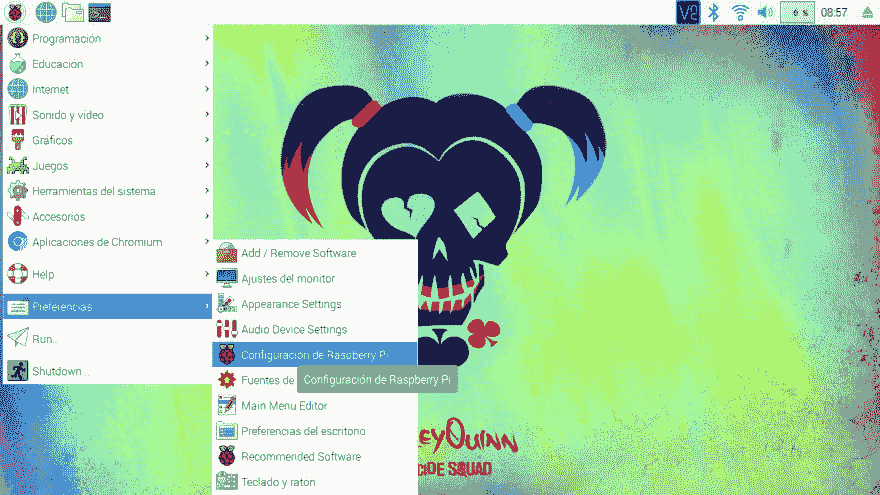
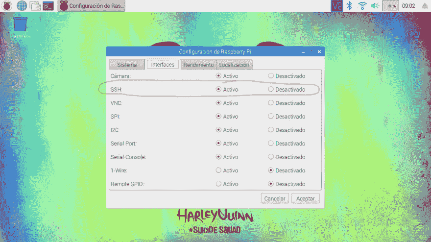
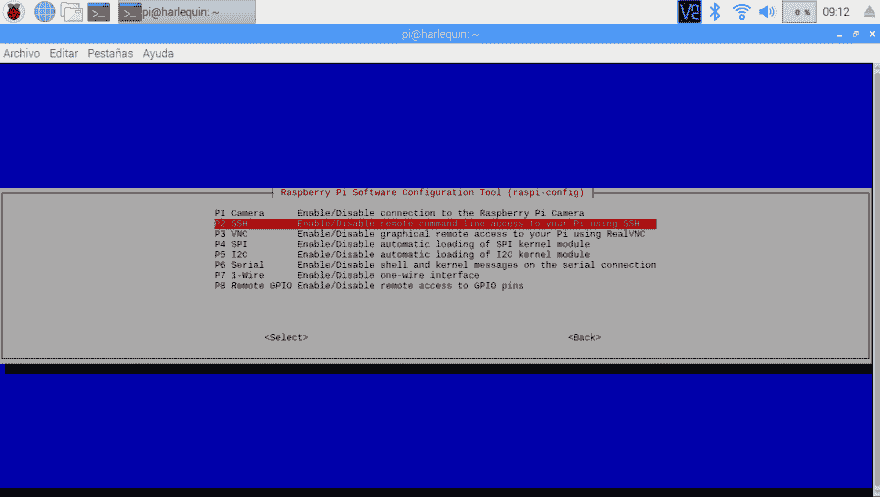
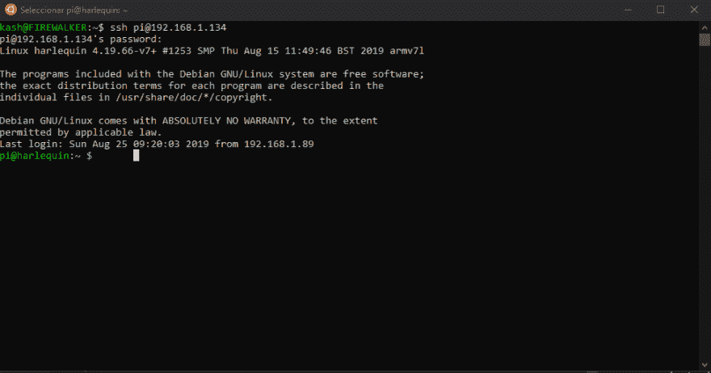
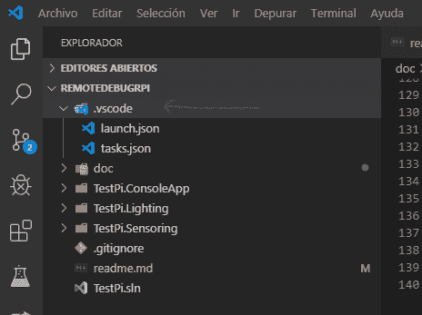
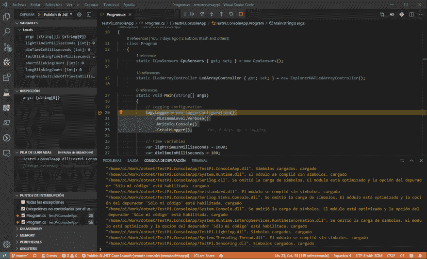
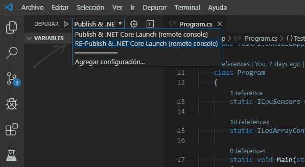

# 使用 Visual Studio 代码对使用. NET 核心的 Raspberry Pi (ARM)进行远程调试(第 2 部分)

> [https://dev . to/kash/remote debug-with-visual-studio-code-contra-una-raspberry-pi-arm-using-net-core-part-2-4l 4d](https://dev.to/kash/depuracion-remota-con-visual-studio-code-contra-una-raspberry-pi-arm-usando-net-core-parte-2-4l4d)

# 导言

在先前的系列帖子中，我们在 Raspberry Pi 上安装了. net core SDK，使其能够运行基于该生态系统的应用程序。

在本文中，我们将配置整个开发环境，以便在运行 Windows 或 Linux 的计算机上运行(我尚未测试，但我认为它也可以在 MacOS 上运行)，并配置 VS Code，以便调试运行在具有不同体系结构和操作系统的设备上的应用程序 Raspberry Pi，其功能比简单多了

启动远程调试的步骤是我从 Scott Hanselman 的另一个重要职位开始跟踪他们的，所以这个职位的优点再次是翻译他们，给他们一点细节，让他们自己检查并说明-我...。是的，如果你坚持到最后，我会建议你优化工作周期，让你的生活更轻松一点-我...。

在开始之前，本文中提到的所有代码和配置文件都位于我的 GitHub 存储库中:

[https://github.com/Kash0321/remotedebugrpi](https://github.com/Kash0321/remotedebugrpi)

## 恩拉树莓派

我们将通过 SSH 连接到 Raspberry，如果尚未启用，则必须启用此功能:

*   通过将 raspberry 连接到键盘、鼠标和显示器，最直观、最方便的方法是访问系统首选项并打开配置应用程序:

    [](https://res.cloudinary.com/practicaldev/image/fetch/s--cBl9lWMR--/c_limit%2Cf_auto%2Cfl_progressive%2Cq_auto%2Cw_880/https://user-images.githubusercontent.com/10654401/63646717-7275aa80-c717-11e9-9e61-4c6dfcec3cac.png)

    [](https://res.cloudinary.com/practicaldev/image/fetch/s--vwbRktWH--/c_limit%2Cf_auto%2Cfl_progressive%2Cq_auto%2Cw_880/https://user-images.githubusercontent.com/10654401/63646718-75709b00-c717-11e9-8c95-79a5b92663fc.png)

*   我们有一个更简单的替代方法，从终端运行以下命令，并使用相应的应用程序:

    ```
    sudo raspi-config 
    ```

    [](https://res.cloudinary.com/practicaldev/image/fetch/s--au6JQiEc--/c_limit%2Cf_auto%2Cfl_progressive%2Cq_auto%2Cw_880/https://user-images.githubusercontent.com/10654401/63646795-a7cec800-c718-11e9-9dd0-657270b4ef06.png)

    [](https://res.cloudinary.com/practicaldev/image/fetch/s--CFC6sKe0--/c_limit%2Cf_auto%2Cfl_progressive%2Cq_auto%2Cw_880/https://user-images.githubusercontent.com/10654401/63646796-aac9b880-c718-11e9-956f-a4bcfdc7f66e.png)

完成此操作后，我们不再需要将 raspberry 连接到显示器和其他输入/输出设备，我们可以通过 SSH 从任何其他计算机连接到显示器，方法有多种:

*   侧窗

    *   Windows 10 包括默认 SSH 客户端(最近)，因此只需打开命令行控制台并键入即可

    ```
    ssh [usuario en la raspberry]@[IP o nombre del equipo] 
    ```

    例如，在我的情况下，从我的本地网络:

    ```
    C:\ssh pi@harlequin Linux harlequin 4.19.66-v7+ #1253 SMP Thu Aug 15 11:49:46 BST 2019 armv7l
      The programs included with the Debian GNU/Linux system are free software;  the exact distribution terms for each program are described in the
    individual files in /usr/share/doc/*/copyright.

    Debian GNU/Linux comes with ABSOLUTELY NO WARRANTY, to the extent
    permitted by applicable law.
    Last login: Sun Aug 18 15:17:44 2019 from 192.168.1.89 Linux harlequin 4.19.66-v7+ #1253 SMP Thu Aug 15 11:49:46 BST 2019 armv7l
      The programs included with the Debian GNU/Linux system are free software;  the exact distribution terms for each program are described in the
    individual files in /usr/share/doc/*/copyright.

    Debian GNU/Linux comes with ABSOLUTELY NO WARRANTY, to the extent
    permitted by applicable law.
    Last login: Sun Aug 18 15:17:44 2019 from 192.168.1.89 pi@harlequin:~ $ 
    ```

    *   轨道推力。注意，稍后我们将使用 PuTTy 标准安装通常提供的其中一个二进制文件来执行其他任务。
*   从 Linux 来看，几乎所有的发行版都有 SSH 客户端软件包，默认情况下我使用 Ubuntu 并安装它，特别是也可以使用 windows 10

    [](https://res.cloudinary.com/practicaldev/image/fetch/s--JuVFmWZp--/c_limit%2Cf_auto%2Cfl_progressive%2Cq_auto%2Cw_880/https://user-images.githubusercontent.com/10654401/63646889-eb760180-c719-11e9-89ba-0b3a4e08347a.png)

请联系:

1.  我们要离开了

    ```
    curl -sSL https://aka.ms/getvsdbgsh | /bin/sh /dev/stdin -v latest -l ~/vsdbg 
    ```

    VSDbg 的安装有这支笔，我在我的 raspberry pi:t0 上运行时

    ```
    pi@harlequin:~ $  curl -sSL https://aka.ms/getvsdbgsh | /bin/sh /dev/stdin -v latest -l ~/vsdbg
    Info: Creating install directory
    Using arguments
        Version                    : 'latest'
        Location                   : '/home/pi/vsdbg'
        SkipDownloads              : 'false'
        LaunchVsDbgAfter           : 'false'
        RemoveExistingOnUpgrade    : 'false'
    Info: Using vsdbg version '16.2.10709.2'
    Info: Previous installation at '/home/pi/vsdbg' not found
    Info: Using Runtime ID 'linux-arm'
    Downloading https://vsdebugger.azureedge.net/vsdbg-16-0-11220-2/vsdbg-linux-arm.zip
    Info: Successfully installed vsdbg at '/home/pi/vsdbg' 
    ```

    以后要更新远程调试器版本，只需再次运行该命令，检查是否存在新版本，然后进行更新。例如，如果我们现在再次运行它，它会告诉我们我们已经安装了最新版本:

    ```
    pi@harlequin:~ $  curl -sSL https://aka.ms/getvsdbgsh | /bin/sh /dev/stdin -v latest -l ~/vsdbg
    Info: Last installed version of vsdbg is '16.2.10709.2'
    Info: VsDbg is up-to-date
    Info: Using vsdbg version '16.2.10709.2'
    Using arguments
        Version                    : 'latest'
        Location                   : '/home/pi/vsdbg'
        SkipDownloads              : 'true'
        LaunchVsDbgAfter           : 'false'
        RemoveExistingOnUpgrade    : 'false'
    Info: Skipping downloads 
    ```

2.  为了能够进行远程调试，我们需要使用 raspbian 上的 root 权限运行此调试器(VSDbg)，为此，我们需要使用以下命令确保为 root 用户分配了密码。

    ```
    sudo passwd root 
    ```

    在运行时，系统会提示您输入新密码以设置 root 用户。为了便于稍后解释某些步骤，我已为您分配了一个密码`raspberry`，让我们记住它，因为我们将在一段时间内使用它。

    ```
    pi@harlequin:~ $  sudo passwd root
    Introduzca la nueva contraseña de UNIX:
    Vuelva a escribir la nueva contraseña de UNIX:
    passwd: contraseña actualizada correctamente pi@harlequin:~ $ 
    ```

3.  我们还必须为 root 用户启用 SSH 连接。我们使用 nano(例如，
    )编辑 sshd_config 文件

    ```
    sudo nano /etc/ssh/sshd_config 
    ```

    并加入一行如下:

    ```
    PermitRootLogin yes 
    ```

4.  最后重新启动 Raspberry Pi

    ```
    sudo reboot 
    ```

## 在安装了 Visual Studio 代码的计算机上

我们已经准备好了 Raspberry Pi，现在让我们和我们将要工作的团队一起，它将提供:

*   [Visual Studio 程式码](https://code.visualstudio.com)，安装了[c #](https://marketplace.visualstudio.com/items?itemName=ms-vscode.csharp)副档名

*   安装了与 Raspberry Pi 相同版本的“[”SDK . net core](https://dotnet.microsoft.com/download)

Visual Studio 代码是一个由 Microsoft 创建的跨平台代码编辑器(Windows Linux 和 MacOS)，具有大量扩展，使其能够成为功能强大的开发环境，尤其是. NET Core，但不限于此生态系统，并支持来自任何 PC/Mac 的大量语言和框架。

请记住，我们的目标是调试我们开发的应用程序，这些应用程序旨在运行在一个不同的设备(Raspberry Pi)上，其硬件与我们所使用的系统非常不同。

为了说明剩下的步骤，在这个存储库中，我们将在下面讨论配置文件，以及将在 Raspberry Pi 上运行的示例代码。现在，让我们集中讨论远程调试，我们将在接下来的文章中查看代码。

为了能够调试代码，我们需要做的第一件事是将其发布到 Raspberry Pi。为此，我们需要:

1.  为特定的运行时(运行时)环境(在本例中为 Raspberry Pi 的运行环境)发出命令，我们可以设置更多的选项，但如果我们在开发团队和之间同步默认框架-我...。页:1。此指令会编译应用程式、读取其在专案档中指定的相依性，并将产生的档案集发布至目录。

    ```
    dotnet publish -r linux-arm 
    ```

2.  通过备份将以前发布的结果发送到运行该发布的设备上的目录。这里有很多选项，其中最简单的选项之一是使用 pushd/pop 来管理工作目录，并在运行我们想要的内容后将其恢复到以前的状态，以及使用与 PuTTy 一起部署的二进制文件(我们前面已经提到 pscp.exe)来发送内容。因为这一切都要运行 n 次(每次我们修改代码并想调试它)，所以我们把它全部放入一个文件

    ```
    dotnet publish -r linux-arm pushd .\bin\Debug\netcoreapp2.2\linux-arm\publish
    c:\work\putty\pscp -pw harlequin -v -r .\* pi@harlequin.local:/home/pi/Work/dotnet/TestPi.ConsoleApp
    popd 
    ```

3.  现在，我们需要在项目内的“`.vscode`”文件夹中添加两件事，一个是“`launch.json`”文件，用于配置调试准备，另一个是“`tasks.json`”文件中的某些任务，用于处理所有内容(VSCode 通常会在您尝试调试-F5-一个应用程序时自动生成)

    [](https://res.cloudinary.com/practicaldev/image/fetch/s--4xHl4U3i--/c_limit%2Cf_auto%2Cfl_progressive%2Cq_auto%2Cw_880/https://user-images.githubusercontent.com/10654401/63650065-a3210880-c746-11e9-815e-dc6347388c47.png)

    [](https://res.cloudinary.com/practicaldev/image/fetch/s--pnUwgpFD--/c_limit%2Cf_auto%2Cfl_progressive%2Cq_auto%2Cw_880/https://user-images.githubusercontent.com/10654401/63650080-da8fb500-c746-11e9-8883-02fa3d0ebb2a.png)

    **launch.json:** 请注意，因为我们在 Raspberry Pi 中将本地目录与开发团队和远程目录混合在一起。此外，请注意，我们使用 PuTTy 安装的 plink.exe 二进制文件与 Pi 通信，并设置执行远程调试的通道。

    ```
    {  "version":  "0.2.0",  "configurations":  [  {  "name":  "Publish & .NET Core Launch (remote console)",  "type":  "coreclr",  "request":  "launch",  "preLaunchTask":  "publish",  "program":  "/home/pi/dotnet/dotnet",  "args":  ["/home/pi/Work/dotnet/TestPi.ConsoleApp/TestPi.ConsoleApp.dll"],  //Ruta  remota  a  la  dll  que  arranca  el  código  que  vamos  a  depurar  "cwd":  "/home/pi/Work/dotnet/TestPi.ConsoleApp",  //Ruta  en  la  Raspberry  Pi  al  directorio  de  ejecución  "stopAtEntry":  false,  "console":  "internalConsole",  "pipeTransport":  {  "pipeCwd":  "${workspaceFolder}",  "pipeProgram":  "C:\\work\\putty\\plink.exe",  //Ruta  local  hasta  la  línea  de  comandos  de  putty  (en  el  equipo  de  desarrollo)  "pipeArgs":  [  "-pw",  "raspberry",  //Contraseña  para  el  usuario  root  en  la  Raspberry  Pi  "root@harlequin.local"  //Usuario  (debe  ser  root)  y  nombre  de  host  (o  IP)  de  la  Raspberry  Pi  ],  "debuggerPath":  "/home/pi/vsdbg/vsdbg"  //Ruta  al  visual  studio  debugger  que  hemos  instalado  en  la  Raspberry  Pi  }  }  ]  } 
    ```

    **tasks.json:**

    ```
    {  "version":  "2.0.0",  "tasks":  [  {  "label":  "build",  "command":  "dotnet",  "type":  "process",  "args":  [  "build",  "${workspaceFolder}\\TestPi.ConsoleApp\\TestPi.ConsoleApp.csproj"  ],  "problemMatcher":  "$msCompile"  },  {  "label":  "publish",  "type":  "shell",  "dependsOn":  "build",  "presentation":  {  "reveal":  "always",  "panel":  "new"  },  "options":  {  "cwd":  "${workspaceFolder}\\TestPi.ConsoleApp"  },  "windows":  {  "command":  "${cwd}\\TestPi.ConsoleApp\\publish.bat"  },  "problemMatcher":  []  }  ]  } 
    ```

## Resultado final！！

最终效果是，当我们要调试代码时，按 F5 键，代码会被编译、发布、发送到 Raspberry Pi，然后开始远程调试，就像魔术一样-我...。

[](https://res.cloudinary.com/practicaldev/image/fetch/s--LcmAKGzm--/c_limit%2Cf_auto%2Cfl_progressive%2Cq_auto%2Cw_880/https://user-images.githubusercontent.com/10654401/63650685-aa97e000-c74d-11e9-9e3e-fe922af7fc69.png)

## 与礼物优化

几乎所有这些都在 Scott Hanselman 的岗位上，我只是放大了它，更详细地说明了一些情况，但我很快意识到需要进行调整以优化工作:

每次按 F5 键时，我们都会将相当于项目依赖项的大量文件复制到 Raspberry 中，这需要很长时间，而且在开发-编译-部署-调试循环中有点绝望，因此我进行了细微的更改，而不是创建了一个. bat 部署文件

*   [`publish.bat`](https://github.com/Kash0321/remotedebugrpi/blob/master/TestPi.ConsoleApp/publish.bat) 与原来相比有所变化，与其用`.\*`复制文件，不如用`.\TestPi*`复制文件(这当然要在每个项目中修改)，这样就只复制对应于我们编码
    的 dll

    ```
    dotnet publish -r linux-arm /p:ShowLinkerSizeComparison=true 
    pushd .\bin\Debug\netcoreapp2.2\linux-arm\publish
    c:\work\putty\pscp -pw harlequin -v -r .\TestPi* pi@harlequin.local:/home/pi/Work/dotnet/TestPi.ConsoleApp
    popd 
    ```

*   [`republish.bat`](https://github.com/Kash0321/remotedebugrpi/blob/master/TestPi.ConsoleApp/republish.bat):se corresponde con El`publish.bat`原文

    ```
    dotnet publish -r linux-arm /p:ShowLinkerSizeComparison=true 
    pushd .\bin\Debug\netcoreapp2.2\linux-arm\publish
    c:\work\putty\pscp -pw harlequin -v -r .\* pi@harlequin.local:/home/pi/Work/dotnet/TestPi.ConsoleApp
    popd 
    ```

*   `tasks.json`有管理共和的额外任务:

    ```
    {  "version":  "2.0.0",  "tasks":  [  {  "label":  "build",  "command":  "dotnet",  "type":  "process",  "args":  [  "build",  "${workspaceFolder}\\TestPi.ConsoleApp\\TestPi.ConsoleApp.csproj"  ],  "problemMatcher":  "$msCompile"  },  {  "label":  "publish",  "type":  "shell",  "dependsOn":  "build",  "presentation":  {  "reveal":  "always",  "panel":  "new"  },  "options":  {  "cwd":  "${workspaceFolder}\\TestPi.ConsoleApp"  },  "windows":  {  "command":  "${cwd}\\TestPi.ConsoleApp\\publish.bat"  },  "problemMatcher":  []  },  {  "label":  "republish",  "type":  "shell",  "dependsOn":  "build",  "presentation":  {  "reveal":  "always",  "panel":  "new"  },  "options":  {  "cwd":  "${workspaceFolder}\\TestPi.ConsoleApp"  },  "windows":  {  "command":  "${cwd}\\TestPi.ConsoleApp\\republish.bat"  },  "problemMatcher":  []  }  ]  } 
    ```

*   `launch.json`有管理共和国的额外准备

    ```
    {  "version":  "0.2.0",  "configurations":  [  {  "name":  "Publish & .NET Core Launch (remote console)",  "type":  "coreclr",  "request":  "launch",  "preLaunchTask":  "publish",  "program":  "/home/pi/dotnet/dotnet",  "args":  ["/home/pi/Work/dotnet/TestPi.ConsoleApp/TestPi.ConsoleApp.dll"],  //Ruta  remota  a  la  dll  que  arranca  el  código  que  vamos  a  depurar  "cwd":  "/home/pi/Work/dotnet/TestPi.ConsoleApp",  //Ruta  en  la  Raspberry  Pi  al  deirectorio  de  ejecución  "stopAtEntry":  false,  "console":  "internalConsole",  "pipeTransport":  {  "pipeCwd":  "${workspaceFolder}",  "pipeProgram":  "C:\\work\\putty\\plink.exe",  //Ruta  local  hasta  la  línea  de  comandos  de  putty  (en  el  equipo  de  desarrollo)  "pipeArgs":  [  "-pw",  "raspberry",  //Contraseña  para  el  usuario  root  en  la  Raspberry  Pi  "root@harlequin.local"  //Usuario  (debe  ser  root)  y  nombre  de  host  (o  IP)  de  la  Raspberry  Pi  ],  "debuggerPath":  "/home/pi/vsdbg/vsdbg"  //Ruta  al  visual  studio  debugger  que  hemos  instalado  en  la  Raspberry  Pi  }  },  {  "name":  "RE-Publish & .NET Core Launch (remote console)",  "type":  "coreclr",  "request":  "launch",  "preLaunchTask":  "republish",  "program":  "/home/pi/dotnet/dotnet",  "args":  ["/home/pi/Work/dotnet/TestPi.ConsoleApp/TestPi.ConsoleApp.dll"],  "cwd":  "/home/pi/Work/dotnet/TestPi.ConsoleApp",  "stopAtEntry":  false,  "console":  "internalConsole",  "pipeTransport":  {  "pipeCwd":  "${workspaceFolder}",  "pipeProgram":  "C:\\work\\putty\\plink.exe",  "pipeArgs":  [  "-pw",  "raspberry",  "root@harlequin.local"  ],  "debuggerPath":  "/home/pi/vsdbg/vsdbg"  }  }  ]  } 
    ```

现在，从 VS Code 调试选项卡中，我们可以选择发布或重新发布模式，使用第一种模式，我们可以避免在开发-编译-部署-调试循环的每个迭代中花费大量时间:

[](https://res.cloudinary.com/practicaldev/image/fetch/s--ynRbpyZV--/c_limit%2Cf_auto%2Cfl_progressive%2Cq_auto%2Cw_880/https://user-images.githubusercontent.com/10654401/63650948-8d184580-c750-11e9-801e-c8c7d41cac03.png)

## 直到下周

不是吗？如果你喜欢的话，下周我将解释这个帖子的示例代码，它正在 Raspberry Pi 上运行，使用书店[【dot net/IOT】](https://github.com/dotnet/iot)，打开 led，读取传感器，移动引擎等-我...。已连接到此设备-我...。