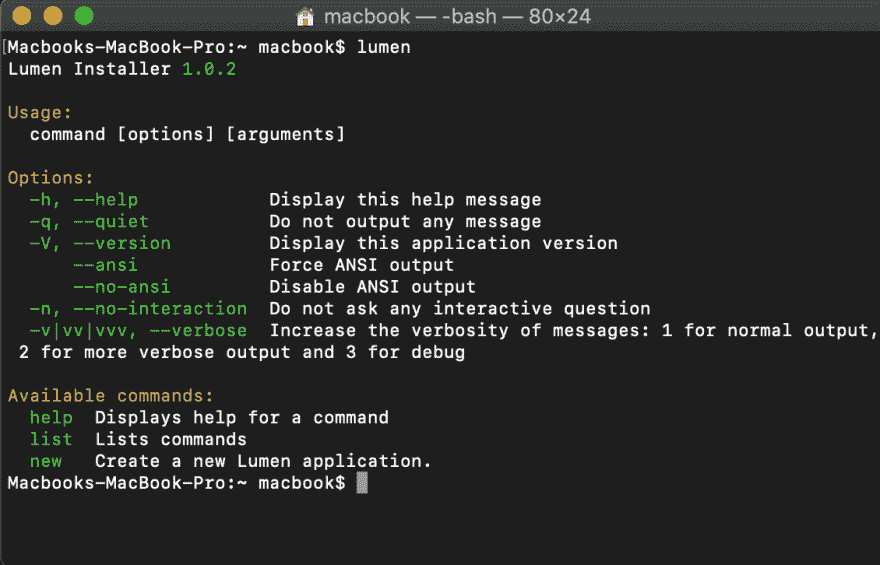
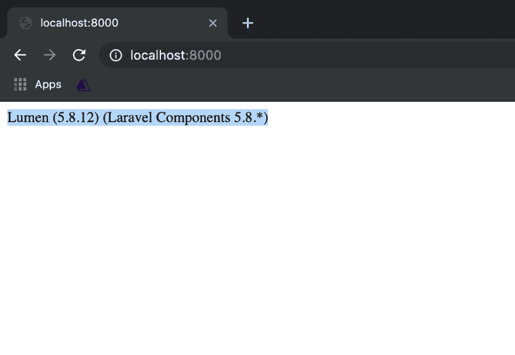
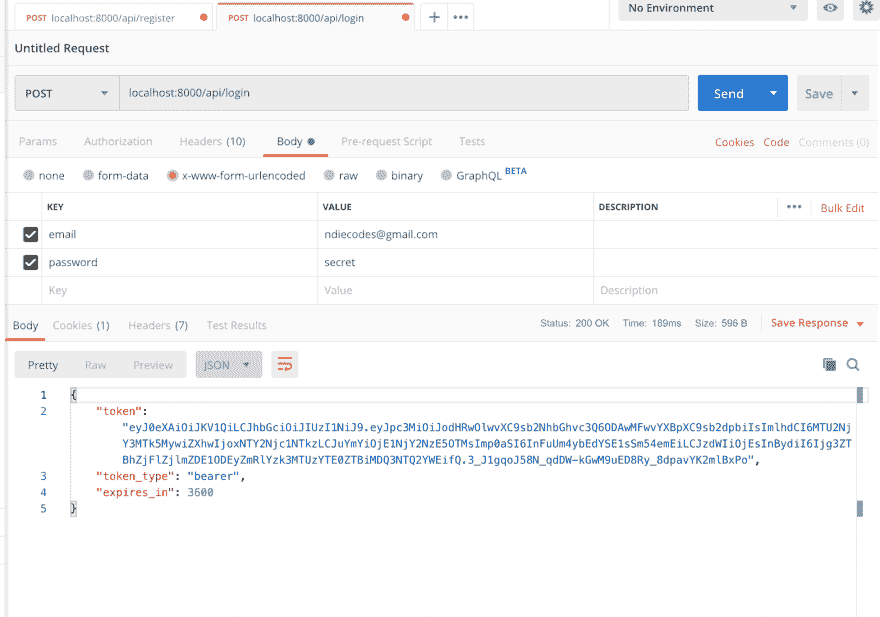
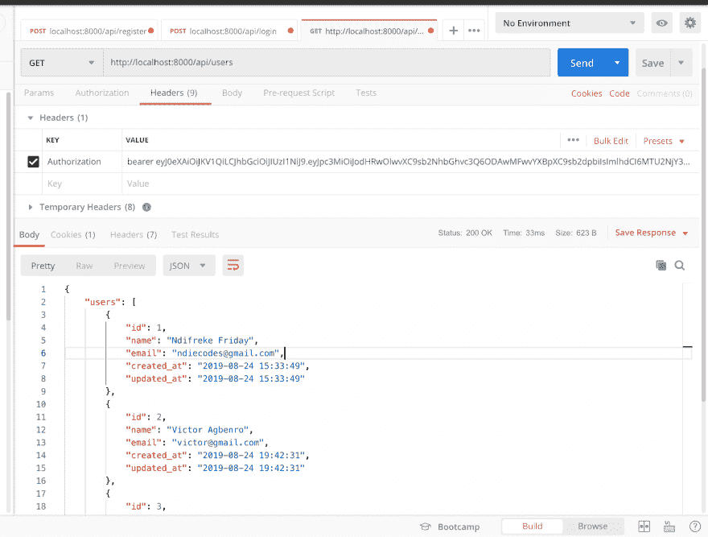

# 用 Lumen(v5.8)构建一个 JWT 认证的 API

> 原文：<https://dev.to/ndiecodes/build-a-jwt-authenticated-api-with-lumen-2afm>

在本教程中，我们将使用流明；laravel 的超快速微框架，用于构建简单安全的 REST API。在本教程结束时，您应该能够构建生产就绪的 API。我们开始吧！

## 先决条件

我求你了，一定要带好必需品。

*   PHP >= 7.1.3
*   OpenSSL PHP 扩展
*   PDO PHP 扩展
*   Mbstring PHP 扩展
*   Mysql >= 5.7
*   composer(PHP 依赖管理器)
*   邮递员(测试您的端点)

## 安装

首先，你需要得到 lumen 的命令行界面。

```
$ composer global require "laravel/lumen-installer" 
```

<svg width="20px" height="20px" viewBox="0 0 24 24" class="highlight-action crayons-icon highlight-action--fullscreen-on"><title>Enter fullscreen mode</title></svg> <svg width="20px" height="20px" viewBox="0 0 24 24" class="highlight-action crayons-icon highlight-action--fullscreen-off"><title>Exit fullscreen mode</title></svg>

如果下载成功，运行下面的命令来确认你已经安装了 lumen。

```
$ lumen 
```

<svg width="20px" height="20px" viewBox="0 0 24 24" class="highlight-action crayons-icon highlight-action--fullscreen-on"><title>Enter fullscreen mode</title></svg> <svg width="20px" height="20px" viewBox="0 0 24 24" class="highlight-action crayons-icon highlight-action--fullscreen-off"><title>Exit fullscreen mode</title></svg>

如果你遇到类似`-bash: lumen: command not found`的错误，你需要[将作曲家的供应商 bin 添加到你的路径](https://stackoverflow.com/questions/25373188/laravel-installation-how-to-place-the-composer-vendor-bin-directory-in-your)。

如果一切正常，您应该看到类似这样的内容。

[](https://res.cloudinary.com/practicaldev/image/fetch/s--JhJrzhFs--/c_limit%2Cf_auto%2Cfl_progressive%2Cq_auto%2Cw_880/https://res.cloudinary.com/iamndie/image/upload/v1566656870/Screen_Shot_2019-08-24_at_3.16.08_PM_mqbqso.png)

现在运行这个命令来创建 lumen 项目

```
$ lumen new auth-app 
```

<svg width="20px" height="20px" viewBox="0 0 24 24" class="highlight-action crayons-icon highlight-action--fullscreen-on"><title>Enter fullscreen mode</title></svg> <svg width="20px" height="20px" viewBox="0 0 24 24" class="highlight-action crayons-icon highlight-action--fullscreen-off"><title>Exit fullscreen mode</title></svg>

进入项目文件夹

```
$ cd auth-app 
```

<svg width="20px" height="20px" viewBox="0 0 24 24" class="highlight-action crayons-icon highlight-action--fullscreen-on"><title>Enter fullscreen mode</title></svg> <svg width="20px" height="20px" viewBox="0 0 24 24" class="highlight-action crayons-icon highlight-action--fullscreen-off"><title>Exit fullscreen mode</title></svg>

运行应用程序

```
$ php -S localhost:8000 -t public 
```

<svg width="20px" height="20px" viewBox="0 0 24 24" class="highlight-action crayons-icon highlight-action--fullscreen-on"><title>Enter fullscreen mode</title></svg> <svg width="20px" height="20px" viewBox="0 0 24 24" class="highlight-action crayons-icon highlight-action--fullscreen-off"><title>Exit fullscreen mode</title></svg>

在你的浏览器地址栏加载`localhost:8000`,它应该会呈现如下所示的结果。

[](https://res.cloudinary.com/practicaldev/image/fetch/s--FAeRmkKx--/c_limit%2Cf_auto%2Cfl_progressive%2Cq_auto%2Cw_880/https://res.cloudinary.com/iamndie/image/upload/v1566658430/Screen_Shot_2019-08-24_at_3.53.20_PM_ivhqpc.png)

在您喜欢的编辑器中打开项目(auth-app)。

创建一个. env 文件，将. env.example 中的所有内容复制到。env 文件并添加您的数据库配置。

在`boostrap/app.php`中，取消正面和雄辩方法
的注释

```
//before

// $app->withFacades();

// $app->withEloquent();

//after

$app->withFacades();

$app->withEloquent(); 
```

<svg width="20px" height="20px" viewBox="0 0 24 24" class="highlight-action crayons-icon highlight-action--fullscreen-on"><title>Enter fullscreen mode</title></svg> <svg width="20px" height="20px" viewBox="0 0 24 24" class="highlight-action crayons-icon highlight-action--fullscreen-off"><title>Exit fullscreen mode</title></svg>

打开 withFacades 注入应用程序 IoC 来照亮\Support\Facades\Facade。如果不这样做，即使您正在导入 Illuminate \ Support \ Facades \ File，它也不会工作。[信用](https://github.com/laravel/lumen-framework/issues/143)

$ app-> witheloquint()方法实际上也启用了查询构建器。它正在注册 DatabaseServiceProvider，这是使用查询构建器所必需的。[信用](https://github.com/laravel/lumen-framework/issues/584)。

## 创建用户

进行用户数据库迁移

```
$ php artisan make:migration create_users_table --create=users 
```

<svg width="20px" height="20px" viewBox="0 0 24 24" class="highlight-action crayons-icon highlight-action--fullscreen-on"><title>Enter fullscreen mode</title></svg> <svg width="20px" height="20px" viewBox="0 0 24 24" class="highlight-action crayons-icon highlight-action--fullscreen-off"><title>Exit fullscreen mode</title></svg>

找到迁移文件`database/migrations/*_create_users_table.php`并添加所需的表列(名称、电子邮件、密码)；参见下面的代码:

```
...
    public function up()
    {
        Schema::create('users', function (Blueprint $table) {
            $table->bigIncrements('id');
            $table->string('name');
            $table->string('email')->unique()->notNullable();
            $table->string('password');
            $table->timestamps();
        });
    }
... 
```

<svg width="20px" height="20px" viewBox="0 0 24 24" class="highlight-action crayons-icon highlight-action--fullscreen-on"><title>Enter fullscreen mode</title></svg> <svg width="20px" height="20px" viewBox="0 0 24 24" class="highlight-action crayons-icon highlight-action--fullscreen-off"><title>Exit fullscreen mode</title></svg>

迁移您的数据库

```
$ php artisan migrate 
```

<svg width="20px" height="20px" viewBox="0 0 24 24" class="highlight-action crayons-icon highlight-action--fullscreen-on"><title>Enter fullscreen mode</title></svg> <svg width="20px" height="20px" viewBox="0 0 24 24" class="highlight-action crayons-icon highlight-action--fullscreen-off"><title>Exit fullscreen mode</title></svg>

顾名思义添加注册路由；注册用户。找到`routes/web.php`并插入所需代码，如下图所示

```
// API route group
$router->group(['prefix' => 'api'], function () use ($router) {
   // Matches "/api/register
   $router->post('register', 'AuthController@register');

}); 
```

<svg width="20px" height="20px" viewBox="0 0 24 24" class="highlight-action crayons-icon highlight-action--fullscreen-on"><title>Enter fullscreen mode</title></svg> <svg width="20px" height="20px" viewBox="0 0 24 24" class="highlight-action crayons-icon highlight-action--fullscreen-off"><title>Exit fullscreen mode</title></svg>

由于我们将在所有端点中添加前缀`api`，为了减少重复，我们将使用路由分组来实现这一点。

这个方法(`$router->post($uri, $callback);`接受一个$url 和一个$callback 参数。在`$callback`中，`AuthController`是我们的控制器类(我们稍后会创建这个类)，而`register`是这个类中的一个方法。

让我们创建我们的 AuthControler。

创建文件`app/Http/Controllers/AuthController.php`并用代码填充它，如下所示。

```
 <?php

namespace App\Http\Controllers;

use Illuminate\Http\Request;
use  App\User;

class AuthController extends Controller
{
    /**
     * Store a new user.
     *
     * @param  Request  $request
     * @return Response
     */
    public function register(Request $request)
    {
        //validate incoming request 
        $this->validate($request, [
            'name' => 'required|string',
            'email' => 'required|email|unique:users',
            'password' => 'required|confirmed',
        ]);

        try {

            $user = new User;
            $user->name = $request->input('name');
            $user->email = $request->input('email');
            $plainPassword = $request->input('password');
            $user->password = app('hash')->make($plainPassword);

            $user->save();

            //return successful response
            return response()->json(['user' => $user, 'message' => 'CREATED'], 201);

        } catch (\Exception $e) {
            //return error message
            return response()->json(['message' => 'User Registration Failed!'], 409);
        }

    }

} 
```

<svg width="20px" height="20px" viewBox="0 0 24 24" class="highlight-action crayons-icon highlight-action--fullscreen-on"><title>Enter fullscreen mode</title></svg> <svg width="20px" height="20px" viewBox="0 0 24 24" class="highlight-action crayons-icon highlight-action--fullscreen-off"><title>Exit fullscreen mode</title></svg>

用 route `localhost:8000/api/register`注册一个用户(使用 POSTMAN ),应该会得到如下成功响应

[](https://res.cloudinary.com/practicaldev/image/fetch/s--bDSm0Stf--/c_limit%2Cf_auto%2Cfl_progressive%2Cq_auto%2Cw_880/https://res.cloudinary.com/iamndie/image/upload/v1566663229/Screen_Shot_2019-08-24_at_4.34.01_PM_vnm7zv.png)

## 用户登录

引入 JWT 认证包。

```
$ composer require tymon/jwt-auth:dev-develop 
```

<svg width="20px" height="20px" viewBox="0 0 24 24" class="highlight-action crayons-icon highlight-action--fullscreen-on"><title>Enter fullscreen mode</title></svg> <svg width="20px" height="20px" viewBox="0 0 24 24" class="highlight-action crayons-icon highlight-action--fullscreen-off"><title>Exit fullscreen mode</title></svg>

生成您的 API 秘密

```
$ php artisan jwt:secret 
```

<svg width="20px" height="20px" viewBox="0 0 24 24" class="highlight-action crayons-icon highlight-action--fullscreen-on"><title>Enter fullscreen mode</title></svg> <svg width="20px" height="20px" viewBox="0 0 24 24" class="highlight-action crayons-icon highlight-action--fullscreen-off"><title>Exit fullscreen mode</title></svg>

使用下面的配置
创建文件`config/auth.php`

```
//config.auth.php

<?php

return [
    'defaults' => [
        'guard' => 'api',
        'passwords' => 'users',
    ],

    'guards' => [
        'api' => [
            'driver' => 'jwt',
            'provider' => 'users',
        ],
    ],

    'providers' => [
        'users' => [
            'driver' => 'eloquent',
            'model' => \App\User::class
        ]
    ]
]; 
```

<svg width="20px" height="20px" viewBox="0 0 24 24" class="highlight-action crayons-icon highlight-action--fullscreen-on"><title>Enter fullscreen mode</title></svg> <svg width="20px" height="20px" viewBox="0 0 24 24" class="highlight-action crayons-icon highlight-action--fullscreen-off"><title>Exit fullscreen mode</title></svg>

对你的`User`模型(`app/User.php`)做一些修改，以适应 **tymon/jwt-auth 的**需求。留意包括“JWT”在内的一切。

```
<?php

namespace App;

use Illuminate\Auth\Authenticatable;
use Laravel\Lumen\Auth\Authorizable;
use Illuminate\Database\Eloquent\Model;
use Illuminate\Contracts\Auth\Authenticatable as AuthenticatableContract;
use Illuminate\Contracts\Auth\Access\Authorizable as AuthorizableContract;

use Tymon\JWTAuth\Contracts\JWTSubject;

class User extends Model implements AuthenticatableContract, AuthorizableContract, JWTSubject
{
    use Authenticatable, Authorizable;

    /**
     * The attributes that are mass assignable.
     *
     * @var array
     */
    protected $fillable = [
        'name', 'email'
    ];

    /**
     * The attributes excluded from the model's JSON form.
     *
     * @var array
     */
    protected $hidden = [
        'password',
    ];

    /**
     * Get the identifier that will be stored in the subject claim of the JWT.
     *
     * @return mixed
     */
    public function getJWTIdentifier()
    {
        return $this->getKey();
    }

    /**
     * Return a key value array, containing any custom claims to be added to the JWT.
     *
     * @return array
     */
    public function getJWTCustomClaims()
    {
        return [];
    }
} 
```

<svg width="20px" height="20px" viewBox="0 0 24 24" class="highlight-action crayons-icon highlight-action--fullscreen-on"><title>Enter fullscreen mode</title></svg> <svg width="20px" height="20px" viewBox="0 0 24 24" class="highlight-action crayons-icon highlight-action--fullscreen-off"><title>Exit fullscreen mode</title></svg>

对`bootstrap/app.php`
做一些修改

```
//before
// $app->routeMiddleware([
//     'auth' => App\Http\Middleware\Authenticate::class,
// ]);

//After
$app->routeMiddleware([
    'auth' => App\Http\Middleware\Authenticate::class,
]); 
```

<svg width="20px" height="20px" viewBox="0 0 24 24" class="highlight-action crayons-icon highlight-action--fullscreen-on"><title>Enter fullscreen mode</title></svg> <svg width="20px" height="20px" viewBox="0 0 24 24" class="highlight-action crayons-icon highlight-action--fullscreen-off"><title>Exit fullscreen mode</title></svg>

```
//before
 // $app->register(App\Providers\AppServiceProvider::class);
 // $app->register(App\Providers\AuthServiceProvider::class);
 // $app->register(App\Providers\EventServiceProvider::class);

//After
 // $app->register(App\Providers\AppServiceProvider::class);
 $app->register(App\Providers\AuthServiceProvider::class);
 // $app->register(App\Providers\EventServiceProvider::class);

 // Add this line
 $app->register(Tymon\JWTAuth\Providers\LumenServiceProvider::class); 
```

<svg width="20px" height="20px" viewBox="0 0 24 24" class="highlight-action crayons-icon highlight-action--fullscreen-on"><title>Enter fullscreen mode</title></svg> <svg width="20px" height="20px" viewBox="0 0 24 24" class="highlight-action crayons-icon highlight-action--fullscreen-off"><title>Exit fullscreen mode</title></svg>

在`routes/web.php`中添加登录路线

```
// API route group
$router->group(['prefix' => 'api'], function () use ($router) {
     // Matches "/api/register
    $router->post('register', 'AuthController@register');

      // Matches "/api/login
     $router->post('login', 'AuthController@login');
}); 
```

<svg width="20px" height="20px" viewBox="0 0 24 24" class="highlight-action crayons-icon highlight-action--fullscreen-on"><title>Enter fullscreen mode</title></svg> <svg width="20px" height="20px" viewBox="0 0 24 24" class="highlight-action crayons-icon highlight-action--fullscreen-off"><title>Exit fullscreen mode</title></svg>

向`app/Http/Controllers/Controller.php`中的控制器类添加一个全局 respondWithToken 方法。这是为了让我们可以从任何其他控制器访问它。

```
 ...
  //import auth facades
  use Illuminate\Support\Facades\Auth;

  //Add this method to the Controller class
  protected function respondWithToken($token)
    {
        return response()->json([
            'token' => $token,
            'token_type' => 'bearer',
            'expires_in' => Auth::factory()->getTTL() * 60
        ], 200);
    } 
```

<svg width="20px" height="20px" viewBox="0 0 24 24" class="highlight-action crayons-icon highlight-action--fullscreen-on"><title>Enter fullscreen mode</title></svg> <svg width="20px" height="20px" viewBox="0 0 24 24" class="highlight-action crayons-icon highlight-action--fullscreen-off"><title>Exit fullscreen mode</title></svg>

在`app/Http/Controllers/AuthController.php`
中为您的 AuthController 类添加一个登录方法

```
 ...

   //import auth facades
   use Illuminate\Support\Facades\Auth;

   ...

     /**
     * Get a JWT via given credentials.
     *
     * @param  Request  $request
     * @return Response
     */
    public function login(Request $request)
    {
          //validate incoming request 
        $this->validate($request, [
            'email' => 'required|string',
            'password' => 'required|string',
        ]);

        $credentials = $request->only(['email', 'password']);

        if (! $token = Auth::attempt($credentials)) {
            return response()->json(['message' => 'Unauthorized'], 401);
        }

        return $this->respondWithToken($token);
    } 
```

<svg width="20px" height="20px" viewBox="0 0 24 24" class="highlight-action crayons-icon highlight-action--fullscreen-on"><title>Enter fullscreen mode</title></svg> <svg width="20px" height="20px" viewBox="0 0 24 24" class="highlight-action crayons-icon highlight-action--fullscreen-off"><title>Exit fullscreen mode</title></svg>

使用 route `localhost:8000/api/login`登录一个用户，您应该会得到如下成功响应:

[](https://res.cloudinary.com/practicaldev/image/fetch/s--rNSeRinR--/c_limit%2Cf_auto%2Cfl_progressive%2Cq_auto%2Cw_880/https://res.cloudinary.com/iamndie/image/upload/v1566672721/Screen_Shot_2019-08-24_at_7.51.18_PM_srhwrs.png)

## 认证路线

在我们的压轴戏中，我们将制作一些经过认证的路线。

向`routes/web.php`
添加几条路线

```
...
// API route group
$router->group(['prefix' => 'api'], function () use ($router) {
    // Matches "/api/register
   $router->post('register', 'AuthController@register');
     // Matches "/api/login
    $router->post('login', 'AuthController@login');

    // Matches "/api/profile
    $router->get('profile', 'UserController@profile');

    // Matches "/api/users/1 
    //get one user by id
    $router->get('users/{id}', 'UserController@singleUser');

    // Matches "/api/users
    $router->get('users', 'UserController@allUsers');
});

... 
```

<svg width="20px" height="20px" viewBox="0 0 24 24" class="highlight-action crayons-icon highlight-action--fullscreen-on"><title>Enter fullscreen mode</title></svg> <svg width="20px" height="20px" viewBox="0 0 24 24" class="highlight-action crayons-icon highlight-action--fullscreen-off"><title>Exit fullscreen mode</title></svg>

创建一个文件`app/Http/Controllers/UserController.php`,并用这个看起来优雅的代码填充它。

```
<?php

namespace App\Http\Controllers;

use Illuminate\Support\Facades\Auth;
use  App\User;

class UserController extends Controller
{
     /**
     * Instantiate a new UserController instance.
     *
     * @return void
     */
    public function __construct()
    {
        $this->middleware('auth');
    }

    /**
     * Get the authenticated User.
     *
     * @return Response
     */
    public function profile()
    {
        return response()->json(['user' => Auth::user()], 200);
    }

    /**
     * Get all User.
     *
     * @return Response
     */
    public function allUsers()
    {
         return response()->json(['users' =>  User::all()], 200);
    }

    /**
     * Get one user.
     *
     * @return Response
     */
    public function singleUser($id)
    {
        try {
            $user = User::findOrFail($id);

            return response()->json(['user' => $user], 200);

        } catch (\Exception $e) {

            return response()->json(['message' => 'user not found!'], 404);
        }

    }

} 
```

<svg width="20px" height="20px" viewBox="0 0 24 24" class="highlight-action crayons-icon highlight-action--fullscreen-on"><title>Enter fullscreen mode</title></svg> <svg width="20px" height="20px" viewBox="0 0 24 24" class="highlight-action crayons-icon highlight-action--fullscreen-off"><title>Exit fullscreen mode</title></svg>

下面是对三个新添加的端点之一的调用示例

[](https://res.cloudinary.com/practicaldev/image/fetch/s--Y5N256_j--/c_limit%2Cf_auto%2Cfl_progressive%2Cq_auto%2Cw_880/https://res.cloudinary.com/iamndie/image/upload/v1566677009/Screen_Shot_2019-08-24_at_8.54.39_PM_vqr7bx.png)

这里有一个 github 上完整代码的[链接。](https://github.com/ndiecodes/lumen-auth-example)

结束了！

我希望这篇文章在某种程度上帮助了你，并且希望你在不久的将来基于这些知识来部署令人敬畏的 API。我也希望在评论中看到你的贡献。

-再见-再见。