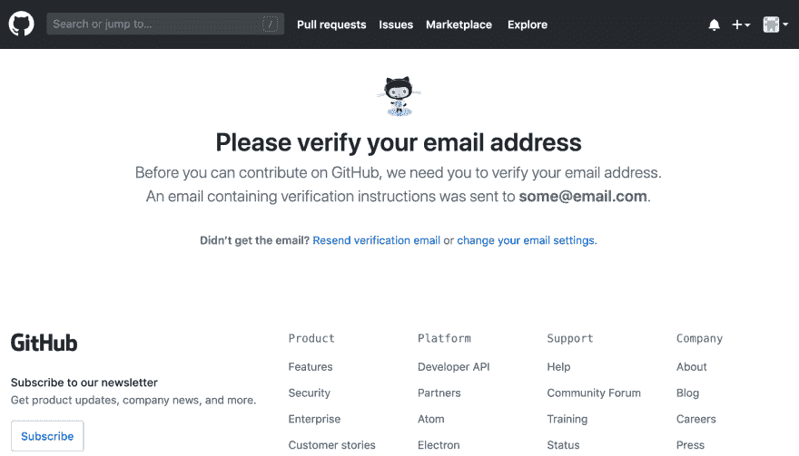

# 用 Github 和 Gatsby 创建作品集网站的初学者指南

> 原文：<https://dev.to/geocine/a-beginner-s-guide-on-creating-a-portfolio-website-with-github-and-gatsby-lmc>

作为一个试图在网上建立形象的人，拥有一个网站应该是你的首要任务。这也是一次有趣的学习经历，可以帮助你发掘你内在的创造力。

这个指南将帮助你建立一个作品集网站，并把它放在网上让每个人都能看到。为了能够坚持到底，你必须至少有一些关于 HTML、CSS 和 JavaScript 的工作知识。

## 设置您的电脑

我们将建立我们的 JavaScript 开发环境。需要在您的计算机上安装和设置以下软件。

### 节点

NodeJS 将用于构建我们网站的源代码和下载我们需要的包。注意 **npm** 将与 **NodeJS** 一起安装。

1.  下载 [NodeJS](https://nodejs.org/en/) 。在撰写本文时，这是最新的版本。如果您使用的是 Windows，此页面将显示 Windows 下载。
2.  一旦你下载了安装程序，继续按照提示安装到你的电脑上。
3.  如果您已经成功安装了 NodeJS，您应该能够通过打开终端/命令提示符并键入以下命令来验证它。

```
node -v     # will show currently installed version of NodeJS
npm -v      # will show currently installed version of npm 
```

<svg width="20px" height="20px" viewBox="0 0 24 24" class="highlight-action crayons-icon highlight-action--fullscreen-on"><title>Enter fullscreen mode</title></svg> <svg width="20px" height="20px" viewBox="0 0 24 24" class="highlight-action crayons-icon highlight-action--fullscreen-off"><title>Exit fullscreen mode</title></svg>

### VS 代码

VS Code 是一个源代码编辑器。它包括对嵌入式 Git 控件和 GitHub 的支持。

1.  下载 [VS 代码](https://code.visualstudio.com/)。如果您使用的是 Windows，此页面将显示 Windows 下载。
2.  一旦你下载了安装程序，继续按照提示安装到你的电脑上。

### Git 和 Github

Git 将帮助我们将源代码版本保存到 GitHub。您必须创建一个 [GitHub](https://github.com) 帐户，然后按照下面的说明设置 Git:

#### 创建 Github 账户

1.  去 https://github.com。输入一个**用户名**、**邮箱**和**密码**。
2.  将有三(3)个步骤，直到你到达这一页。

#### 创建知识库

一旦您验证了您的电子邮件，您将被重定向到此页面。在这里，我们将创建一个名为 **username.github.io** 的存储库，因此在我的例子中，它将是 **geocine.github.io**

[](https://res.cloudinary.com/practicaldev/image/fetch/s--9o8dfGX_--/c_limit%2Cf_auto%2Cfl_progressive%2Cq_auto%2Cw_880/https://thepracticaldev.s3.amazonaws.com/i/03y5arto1ajerpeq55n9.png)

### 设置您的 SSH 密钥

为了能够将文件从我们的电脑上传到 GitHub，我们需要创建一个 SSH 密钥并在 GitHub 上设置它。

#### 生成新的 SSH 密钥

1.  打开你的终端/Git Bash
2.  在下面输入文本，用您的电子邮件