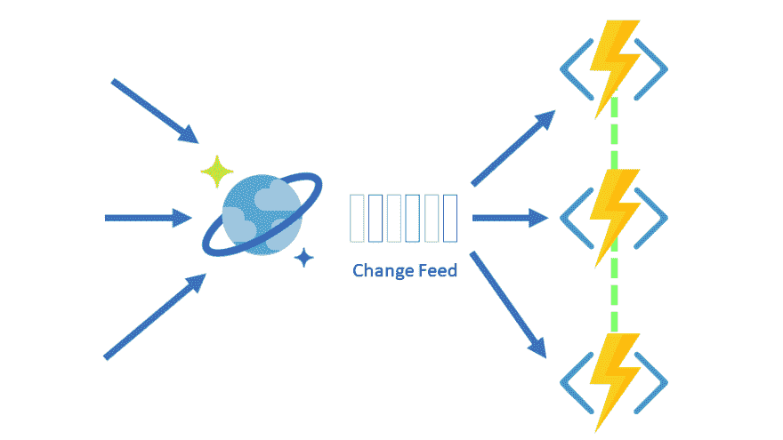

# 使用 C#中的 Azure 函数实现 Cosmos DB 变更提要

> 原文：<https://dev.to/willvelida/implementing-cosmos-db-change-feed-using-azure-functions-in-c-2e1>

Azure Cosmos DB 有一个很酷的特性叫做 [Change Feed](https://docs.microsoft.com/en-us/azure/cosmos-db/change-feed) ，它允许我们通过监听容器中发生的任何变化来对我们的容器进行实时分析。

然后，这些更改被生成为文档的排序列表，这些列表按照它们被修改的顺序进行了更改。这些是持久的，可以增量处理。然后，输出可以由多个使用者进行并行处理。

这个特性在一个项目的变化可能触发另一个事件或附加动作的情况下非常有用。一个例子可能是一个项目被插入到我们的容器中，我们用它来触发一个网站警报，告诉它在我们的容器中有一个新的项目。

**默认情况下，所有 Cosmos DB 帐户都启用更改订阅源功能**。您不需要做任何特殊的事情来设置它，并且您可以使用您在您的 Cosmos 帐户上提供的吞吐量来读取更改提要，就像任何常规的 Cosmos DB 操作一样。

目前，变更提要包括对容器中的项目进行插入和更新操作(这是我们在本教程中要关注的)。如果您想要捕获容器中项目的删除，您可以使用一个标记来捕获软删除，或者在项目上设置一个 [**生存时间(TTL)**](https://docs.microsoft.com/en-us/azure/cosmos-db/time-to-live) 周期，并使用该属性来捕获更改提要。请记住，更改馈送需要在比 TTL 间隔更短的时间内处理。

更改在更改提要中只出现一次。管理您可能需要的任何检查点逻辑需要由您的应用程序来完成。 [Change Feed Processor 库](https://docs.microsoft.com/en-us/azure/cosmos-db/change-feed-processor)很适合这种情况，因为它提供了自动检查点。对于这个简单的例子，现在不用担心这个。

更改可以从任何时间点同步，并且在每个逻辑分区键值内，它按修改的顺序排序。如果您有一个大型容器，那么变更提要可以由多个使用者处理，我们可以在同一容器上同时运行多个变更提要。

在这篇博文发表的时候，只有 SQL API 和 Gremlin API 支持变更提要。NET、Java、Python 和 Node.js 应用 。

我们可以通过三种方式使用变更馈送:

1.  [使用 Azure Cosmos DB SQL API SDK](https://docs.microsoft.com/en-us/azure/cosmos-db/read-change-feed#using-the-azure-cosmos-db-sql-api-sdk)
2.  [使用更换进给处理器库](https://docs.microsoft.com/en-us/azure/cosmos-db/read-change-feed#using-the-change-feed-processor-library)
3.  [使用 Azure 功能](https://docs.microsoft.com/en-us/azure/cosmos-db/read-change-feed#using-azure-functions)

使用 Azure 函数是迄今为止开始使用 Cosmos DB change feed 最简单的方法。我们实际上创建了在容器的变更提要中的每个新事件上触发的函数。 [CosmosDB 触发器](https://docs.microsoft.com/en-us/azure/azure-functions/functions-create-cosmos-db-triggered-function#prerequisites)允许我们使用来改变提要功能，而不用担心任何基础设施。

出于我们的目的，我将创建两个函数:

1.  一个 [HTTP 触发器](https://docs.microsoft.com/en-us/azure/azure-functions/functions-bindings-http-webhook)函数，允许我们插入和更新新的条目。
2.  一个 [CosmosDB Trigger](https://docs.microsoft.com/en-us/azure/azure-functions/functions-bindings-cosmosdb-v2) 函数，它使用变更提要来跟踪我们的容器上的变更和插入，然后将这些持久化到一个租用容器中。

我使用 2.x 运行时来运行我们的函数。

现在，即使更改提要支持 Gremlin API 和 SQL API Cosmos DB 帐户，【Azure 函数的 Cosmos DB 触发器只支持 SQL API ，所以这就是我们将在本演示中使用的。

你可以在这里查看整个代码库。这包括我在这个项目中使用的相关模型和助手类。我只是使用 [Azure Cosmos DB 本地模拟器](https://docs.microsoft.com/en-us/azure/cosmos-db/local-emulator)作为我的 Cosmos 帐户。本地仿真器对于在 Azure 中进行本地开发而言非常酷，无需在实际的数据库上花钱。

让我们首先创建 HTTP 触发器函数来创建和更新我们的项目: