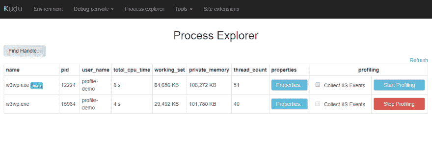
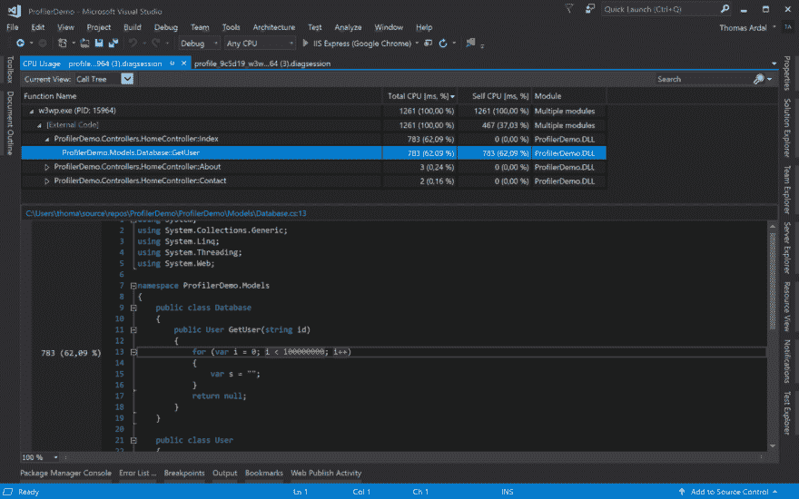

# 使用远程分析调整 Azure 网站的性能

> 原文：<https://dev.to/thomasardal/tuning-performance-on-azure-websites-using-remote-profiling-4nii>

当运行像 [elmah.io](https://elmah.io) 这样的服务时，性能就是一切。我们每天都会收到很多请求，几个 ms 实际上对客户等待回复的时间以及我们的云支出都有影响。我们正在使用微软 Azure 上的独立网站运行一系列不同的性能和负载测试。通常，预测用户如何使用你的系统是很困难的，你最终会花费大量的时间来创造与现实不符的场景。

我想看看我们的生产网站和 API 的实际性能。我们已经在使用 New Relic，但是，我们错过了过去的日子，在那里你可以简单地附加一个调试器并在 10 分钟内创建一个样本来查看。我可能是宇宙中最后一个发现它的人，但事实证明 Azure 提供了一个内置的分析器，可通过 Visual Studio 和 Kudu 获得。

要创建一个样本，请访问您的 Kudu 站点(位于`https://yourwebsite.scm.azurewebsites.net/`)。单击“流程浏览器”菜单，找到 w3wp.exe 流程。这是承载您的 web 应用程序的实际进程。要开始分析，请单击堆栈分析按钮:

让你的网站在你选择的时间段内保持运行。如果你的网站一次又一次地执行相同的任务(像一个 API)，你可能需要更少的时间，而不是在一个有很多功能的网站上。最后，您希望分析器运行多长时间是您自己需要弄清楚的事情。

当您满意时，单击 Stop Profiling 按钮，浏览器会将结果下载为. diagsession 文件。Diagsession 文件是包含跟踪文件(*。etl)以及一些元数据。查看 diagsession 文件的最佳方式是直接在 Visual Studio 中打开它们。由于 etl 包含对已分析网站的引用，请确保在加载了已分析项目的 Visual Studio 实例中打开 diagsession 文件。

稍加处理后，您将看到示例:

在顶部，您将看到在分析的时间段内 CPU 的使用情况。您可以通过单击图表并左右拖动鼠标来突出显示特定区域。

在底部，有一个所有被调用的 C#方法的列表。总 CPU [ms %]列显示哪些方法占用了最多的 CPU 时间(包括方法本身调用的方法所花费的时间)。要了解导致 CPU 使用率最高的端点，请按此列排序。Self CPU [ms %]列显示每种方法花费的时间。要查看哪些具体方法实际上占用了 CPU，请按此列排序。

要开始探究一个方法使用 CPU 周期的原因，双击一行。这将打开细节视图，在我看来这是一个奇怪的用户界面。我喜欢使用树形结构深入调用栈，而不是默认打开的调用者/被调用者 UI。幸运的是，使用顶部的下拉菜单很容易切换:

UI 现在像一个经典的 CPU 分析器一样工作。扩展树中的一个节点可以揭示扩展方法正在调用哪些其他方法，以及每个方法花费了多少时间。通过向下扩展该树，您很可能会到达使用 CPU 时间的点。

能够用真实的数据和真实的用户访问你的系统来分析一个正在运行的 Azure web 应用程序是一个找到运行缓慢的代码的好方法。你可能会对你的发现感到惊讶。至少我们在分析 API 时做到了。我们在 elmah.io 中创建错误的端点使用正则表达式来标识详细信息字段中的堆栈跟踪。那个特定的正则表达式占用了我们的 API(！idspnonenote)的大部分 CPU 周期。).

## 你的用户会喜欢更少的错误吗？

elmah.io 是一个简单的错误记录和正常运行时间监控服务。NET web 和日志框架。

➡️ [错误监控。NET 网络应用](https://elmah.io/?utm_source=devto&utm_medium=social&utm_campaign=devtoposts) ⬅️

本文首次出现在 elmah.io 博客上，网址为[https://blog . elmah . io/tuning-performance-on-azure-websites-using-remote-profiling/](https://blog.elmah.io/tuning-performance-on-azure-websites-using-remote-profiling/)