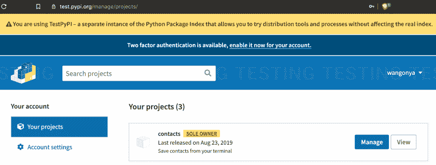

# 在 PyPi 上发布之前，在 TestPyPi 上发布您的 Python 包

> 原文：<https://dev.to/wangonya/publishing-your-python-packages-on-testpypi-before-publishing-on-pypi-2gb2>

如果你只是为了学习而创建一个包，没有必要(IMO)用它来污染官方的 PyPi 索引。此外，您可能希望在正式发布软件包之前，将它发布给选定数量的用户进行测试。出于这些目的，您最好使用 [TestPyPi](https://test.pypi.org/) :

> Python 包索引的独立实例，允许您尝试分发工具和过程，而不会影响真正的索引。

## 上传到 TestPyPi

对于本系列的最后一部分，我将上传我们在 TestPyPi 上创建的应用程序。以下是要遵循的步骤:

#### 1。在 TestPyPi 上创建一个帐户

你需要一个帐户才能继续，因此请前往[https://test.pypi.org/](https://test.pypi.org/)创建一个帐户。

#### 2。更新`setup.py`

在开发过程中，我们保持`setup.py`文件非常简单。现在我们需要添加一些细节来准备发布。

```
from setuptools import setup, find_packages

with open("README.md", "r") as fh:
    long_description = fh.read()

setup(
        name="contacts",
        version="0.1.0",
        packages=find_packages(),
        description="Save contacts from your terminal",
        long_description=long_description,
        long_description_content_type="text/markdown",
        url="https://github.com/wangonya/contacts-cli",
        author="Kinyanjui Wangonya",
        author_email="kwangonya@gmail.com",
        license="MIT",
        classifiers=[
            "License :: OSI Approved :: MIT License",
            "Programming Language :: Python :: 3",
            "Programming Language :: Python :: 3.7",
        ],
        install_requires=[
            "Click",
            "requests",
            ],
        entry_points="""
        [console_scripts]
        contacts=app:cli
        """,
        ) 
```

<svg width="20px" height="20px" viewBox="0 0 24 24" class="highlight-action crayons-icon highlight-action--fullscreen-on"><title>Enter fullscreen mode</title></svg> <svg width="20px" height="20px" viewBox="0 0 24 24" class="highlight-action crayons-icon highlight-action--fullscreen-off"><title>Exit fullscreen mode</title></svg>

大多数选项都是不言自明的，但是您可以在[设置文档](https://setuptools.readthedocs.io/en/latest/setuptools.html#new-and-changed-setup-keywords)中查看它们的含义。

#### 3。构建您的包

在根目录下，运行:

```
(env) $ python setup.py sdist bdist_wheel 
```

<svg width="20px" height="20px" viewBox="0 0 24 24" class="highlight-action crayons-icon highlight-action--fullscreen-on"><title>Enter fullscreen mode</title></svg> <svg width="20px" height="20px" viewBox="0 0 24 24" class="highlight-action crayons-icon highlight-action--fullscreen-off"><title>Exit fullscreen mode</title></svg>

这将生成一个包含分发包
的`dist`文件夹

```
dist/
├── contacts-0.1.0-py3-none-any.whl
└── contacts-0.1.0.tar.gz 
```

<svg width="20px" height="20px" viewBox="0 0 24 24" class="highlight-action crayons-icon highlight-action--fullscreen-on"><title>Enter fullscreen mode</title></svg> <svg width="20px" height="20px" viewBox="0 0 24 24" class="highlight-action crayons-icon highlight-action--fullscreen-off"><title>Exit fullscreen mode</title></svg>

#### 4。使用 twine 上传您的包

安装捆绳:

```
$ pip install twine 
```

<svg width="20px" height="20px" viewBox="0 0 24 24" class="highlight-action crayons-icon highlight-action--fullscreen-on"><title>Enter fullscreen mode</title></svg> <svg width="20px" height="20px" viewBox="0 0 24 24" class="highlight-action crayons-icon highlight-action--fullscreen-off"><title>Exit fullscreen mode</title></svg>

上传您的包:

```
$ twine upload --repository-url https://test.pypi.org/legacy/ dist/*
Enter your username:
Enter your password:
Uploading distributions to https://test.pypi.org/legacy/
Uploading contacts-0.1.0-py3-none-any.whl
100%|███████████████████████████████████████████████████████████|
Uploading contacts-0.1.0.tar.gz
100%|███████████████████████████████████████████████████████████| 
```

<svg width="20px" height="20px" viewBox="0 0 24 24" class="highlight-action crayons-icon highlight-action--fullscreen-on"><title>Enter fullscreen mode</title></svg> <svg width="20px" height="20px" viewBox="0 0 24 24" class="highlight-action crayons-icon highlight-action--fullscreen-off"><title>Exit fullscreen mode</title></svg>

该软件包现在应该上传到您的帐户上:

[](https://res.cloudinary.com/practicaldev/image/fetch/s--M8tsJ6Vs--/c_limit%2Cf_auto%2Cfl_progressive%2Cq_auto%2Cw_880/https://thepracticaldev.s3.amazonaws.com/i/3bbqvlhff7zvj4nxae3j.png)

要从 TestPyPi 本地安装这个包，运行:

```
$ pip install --index-url https://test.pypi.org/simple/ --extra-index-url https://pypi.org/simple your-package 
```

<svg width="20px" height="20px" viewBox="0 0 24 24" class="highlight-action crayons-icon highlight-action--fullscreen-on"><title>Enter fullscreen mode</title></svg> <svg width="20px" height="20px" viewBox="0 0 24 24" class="highlight-action crayons-icon highlight-action--fullscreen-off"><title>Exit fullscreen mode</title></svg>

告诉 pip 从 TestPyPi 获取包。如果包需要其他依赖项来运行，那么必须包含`--extra-index-url`，这样就可以从 PyPi 中获取依赖项。