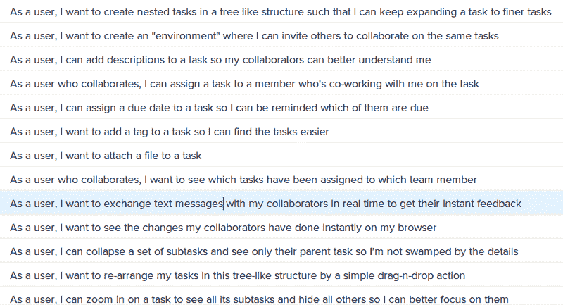
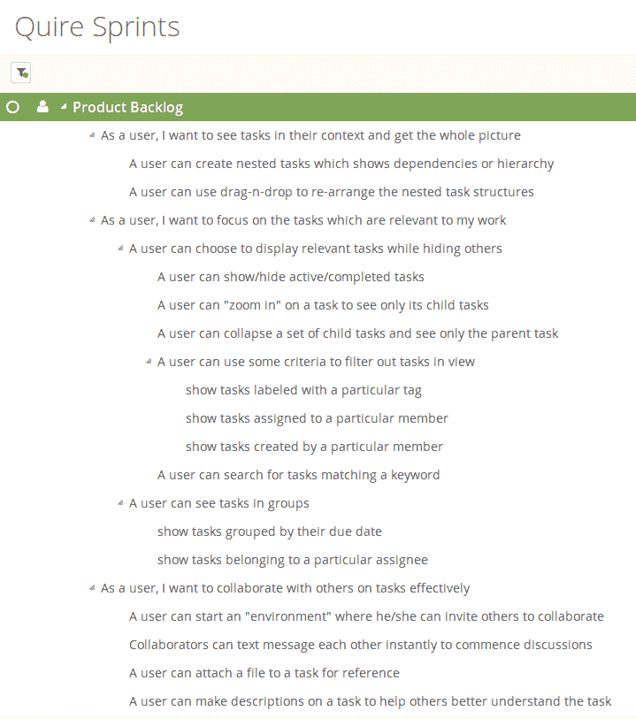
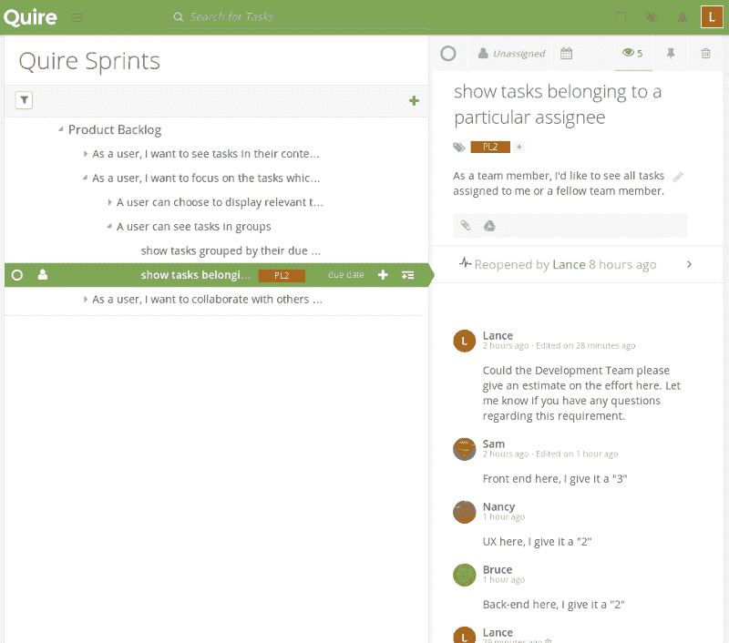

# 让你的产品清单讲述整个故事

> 原文：<https://dev.to/olivier32621338/make-your-product-backlog-speak-the-whole-story-in5>

### 常规产品积压

包含通常以用户故事形式编写的需求的有序列表。这些支离破碎的“故事”并没有让我们清楚地了解产品是什么，或者它们作为一个整体带来了什么价值。
*产品负责人*、*开发团队*和*利益相关者*都依赖这个 backlog 来填充他们在 Scrum 中的角色，然而他们所依赖的这个骨干并没有呈现出产品的精神形象，而这是团队展现产品的价值或优势所需要的。

### 假设你是我们最新[任务管理软件](https://quire.io/compare/best-task-management-software-for-creative-teams) — [Quire](https://quire.io/) 的利益相关者

您将可以访问*产品积压*
，按照惯例，它看起来类似于下面的列表:

这些*用户故事*中的每一个都足以描述一个需求；然而，通过根据投资回报对它们进行排序，我们已经将每一项从它们的上下文中分离出来，即它们对产品的核心价值。

### 相反，让我们尝试一种不同的方法，用 [Quire](https://quire.io/) 为 Quire 创建产品 Backlog

> **我们首先写下推动我们产品发展的核心价值观:**

！产品积压]([https://thepractical dev . S3 . Amazon AWS . com/I/AQ 2 i8 n 55 ggh 4 sosmy 9 e 7 . png](https://thepracticaldev.s3.amazonaws.com/i/aq2i8n55ggh4sosmy9e7.png))

虽然这些“史诗”太大了，无法以任何可靠的准确性进行估计，但它们确实更好地描绘了这种产品将带来什么价值。

> **然后我们对每部史诗进行扩展，指定更多的故事，甚至更多的史诗，在这些基础上构建我们的产品:**

请注意，这种树状结构很自然地符合我们发展想法的方式。如果我们把产品比作一棵树，那么史诗就是这棵树的主枝。**在传统的*产品积压*中，我们在末端各处拾起一片叶子，将它们堆积起来，却看不到整棵树的样子。**

借助 Quire 的树形结构，我们可以将故事嵌套在其他故事(或史诗)中，这样我们就可以始终了解它们的背景，而不会忽略我们希望在产品中带来的价值。

> 但是我们应该优先处理产品待办事项？

约定指示我们将具有最高优先级的产品待办事项放在列表的顶部；但是，除了排序列表之外，还有其他方法可以突出我们当前关注的问题。

我们可以定义优先级标签，如 PL1、PL2 等等；产品负责人获得所有必要的信息以确定任务的优先级后，他或她可以将这些标签分配给即将到来的*冲刺*中考虑的任务:

#### 虽然最好是在会议室里作为一个小组来评估工作，但是团队成员经常居住在不同的大陆，Quire 的实时聊天功能是一个很好的选择

在*春季计划会议*期间，当需要挑选提交给下一个 Sprint 的项目时，团队可以使用 [Quire](https://quire.io/) 的过滤功能来只显示那些直接关注的项目:

### 一个产品 Backlog 不应该只包含零散的用户故事

相反，它应该表达你的团队对产品的整体愿景。粗略的需求更好地描述了价值，当我们将它们开发成更精细的项目时，它们会分支成更有形的项目，这样我们就可以更准确地评估它们的成本。

树形结构自然地捕捉这种分支，并保留编码在两者中信息，并作为一个整体。

我们只是探讨了 Quire 如何帮助我们重塑产品积压。我们将在后续文章中探讨如何使用 Quire 处理 Scrum 的其他方面。