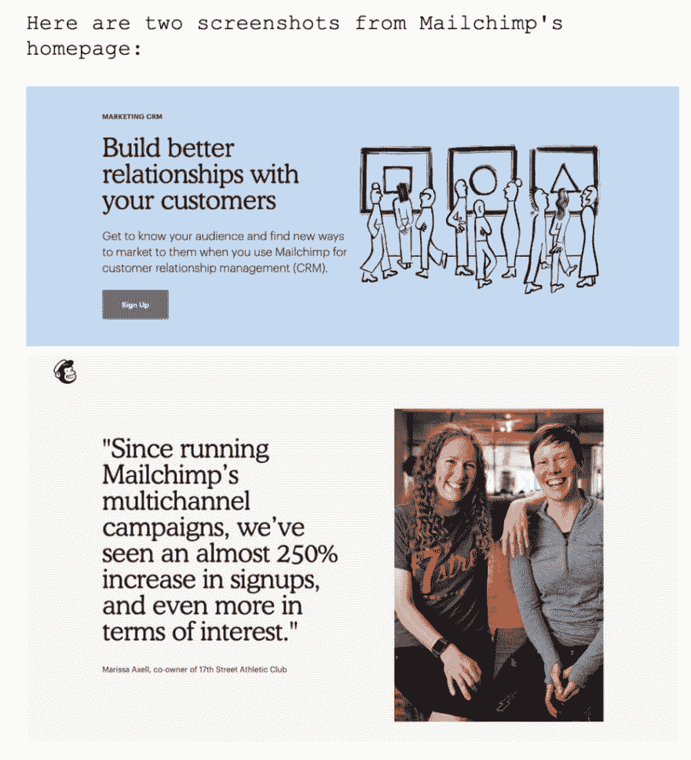

# 分享成果和结果，而不是特性

> 原文：<https://dev.to/maxkatz/share-outcomes-and-results-not-features-75d>

我最近订阅了 [#saashackers 每日简讯](https://saashacker.co/)。每天早上，你都会在收件箱里收到一份简短的 SaaS 增长案例研究。这是一个 3-4 分钟的快速阅读，我建议你试试。

今天的邮件谈到了 Mailchimp 以及他们如何从仅仅 550 名员工中获得 4 亿美元的收入。

吸引我眼球的是这张图片和随后的文字:

<figure> 

<figcaption id="caption-attachment-10693">来源:#沙克快讯</figcaption>

</figure>

图片后的文字:

> 他们卖的是结果，而不是功能。
> 
> 他们卖的是人们真正想要的东西，而不是他们的软件。
> 
> 无论您是拥有 50，000 名客户的直销品牌，还是拥有 1，000 名订户的妈咪博客，您都希望:
> 
> *   与客户建立关系
> *   增加注册人数(250%)
> 
> 你(不一定)想要:
> 
> *   电子邮件模板
> *   CMS 集成
> 
> *来源:[https://saashacker.co](https://saashacker.co)T3】*

而这和开发者关系(或者说开发者营销)有着非常紧密的联系。

我们应该分享成果和结果，而不是特性。我们应该向人们展示如何解决问题，而不是我们的软件。

我相信你们大多数人都知道这一点，但我认为它值得一提。我个人倾向于忘记这一点(有时),而且谈论特性比谈论好处要容易得多。

你们大多数人可能也会说:“等等..这一点都不新鲜”🤦‍♀️ 🤦‍♂️

你完全正确🤩

[Adam DuVander](https://twitter.com/adamd) 创建并分享了这个精彩的页面:[分享知识，而不是特性:对开发者来说，营销的秘诀就是不要使用营销](http://www.shareknowledgenotfeatures.com/)。这是开发者关系的经典，也是我最喜欢的开发者关系资源。我强烈推荐你阅读并收藏这个页面。亚当解释说，我们应该共享知识，而不是功能。

所以，让我们试着分享成果、结果、解决问题和知识，而不是特性🤞