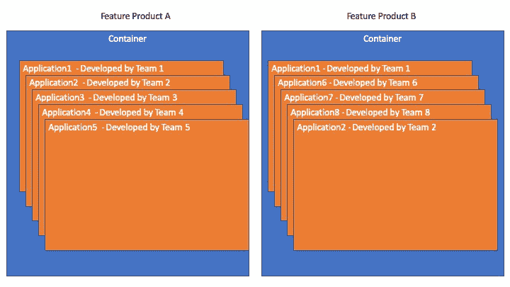

# 使用角度的微应用架构

> 原文：<https://dev.to/pranesh229/micro-app-architecture-using-angular-577f>

基于需求和设计，由独立的团队开发多种功能的应用程序，我称之为微应用程序。这些微型应用程序放在一个父应用程序中，我称之为容器应用程序。这个容器 app 决定需要展示哪个微 app，什么时候展示。容器将是一个带有空主体的模板，其中将包含一些基本功能，如整个站点通用的页眉和页脚。基于该特征，微型应用将被插入到这个空身体中。这种架构可以用在企业应用程序中。

[](https://res.cloudinary.com/practicaldev/image/fetch/s--AXUII0Ac--/c_limit%2Cf_auto%2Cfl_progressive%2Cq_auto%2Cw_880/https://thepracticaldev.s3.amazonaws.com/i/igdjw8oy49aswgvhmqbk.jpg)

在这里，我将使用 Angular-Cli 来实现这个用例。

## 打造微 app

为了使用 Angular-Cli 构建微型应用程序，我将使用 **custom-webpack** 插件来覆盖捆绑配置。我还将使用角度元素在页面上加载多个角度应用程序。

#### 角元素应用

1.  创建一个新的有角度的微 app。比如，我在这里用的名字是 *`testOne`* 。

    ```
    ng new testOne 
    ```

2.  现在我要将@angular/element 添加到工作区中。

    ```
    cd testOne
    ng add @angular/elements 
    ```

3.  用`app-test-one`选择器生成一个新组件。

    ```
    ng g c test-one 
    ```

4.  在应用程序模块中覆盖 AppComponent 的引导。在`ngDoBootstrap`方法中，创建一个自定义元素。

    ```
    // app.module.ts
    import { BrowserModule } from '@angular/platform-browser';  
    import { NgModule, Injector } from '@angular/core';  
    import { AppRoutingModule } from './app-routing.module';  
    import { TestOneComponent } from './test-one/test-one.component';  
    import { createCustomElement } from '@angular/elements';  
    @NgModule({  
        declarations: [TestOneComponent],  
        imports: [BrowserModule, AppRoutingModule],  
        entryComponents: [TestOneComponent],  
        providers: [],  
        bootstrap: []  
    })  
    export class AppModule {  
        constructor(private injector: Injector) {}  
        ngDoBootstrap() {  
            const TestOneElement = createCustomElement(TestOneComponent, {  
                injector: this.injector  
            });  
            if (!customElements.get('app-test-one')) {  
                customElements.define('app-test-one', TestOneElement);  
            }  
        }  
    } 
    ```

5.  将 index.html 的`<app-root></app-root>`替换为`<app-test-one></app-test-one>`。

#### 覆盖 WebPack 配置

当 Angular-Cli 使用`ng build --prod`构建生产版本时，它不会为应用程序提供唯一的全局变量。由于这个原因，多个角度元素的应用会相互冲突，你会看到一个类似 *`Failed to execute 'define' on 'CustomElementRegistry'`* 的错误。为了避免这种情况，您需要为生成的构建分配一个变量名。我们可以使用`@angular-builders/custom-webpack:browser`并提供 webPack 属性来覆盖它。

1.  添加`@angular-builders/custom-webpack`插件。`npm i -D @angular-builders/custom-webpack`
2.  angular.json
    中要做的几处修改——将构建器属性改为***@ angular-builders/custom-web pack:browser***。
    -添加 ***`customWebpackConfig`*** 属性如下。

    ```
     "architect": {
        "build": {
            "builder": "@angular-builders/custom-webpack:browser",
            "options": {
                "customWebpackConfig": {
                    "path": "./extra-webpack.config.js",
                    "mergeStrategies": { "externals": "replace" }
                },
            "outputPath": "dist", 
    ```

    1.  创建配置文件 **`extra-webpack.config.js`** ，为生成的包提供一个唯一的变量名。

    ```
    module.exports  = {
        output: {
            jsonpFunction:  'webpackJsonpAPPNAME',
            library:  'APPNAME'
        }
    }; 
    ```

    所以当你运行`ng build --prod`时，它会生成`main.js`，内容如下图

    ```
     // considering APPNAME as testOne
        var testOne=(window.webpackJsonptestOne=window.webpackJsonptestOne||[]). 
    ```

#### 捆绑脚本

有多种方法可以将脚本文件合并成一个文件。我在这里使用吞咽。

1.  安装 gulp 和 gulp-concat，这是一个连接文件的插件。

    ```
    npm i -D gulp gulp-concat 
    ```

2.  创建一个 gulpfile.js 并添加下面的代码。

    ```
    const gulp = require('gulp');  
    const concat = require('gulp-concat');  

    gulp.task('concat', function() {  
        return gulp  
        .src([  
            './dist/runtime-es2015.js',  
            './dist/polyfills-es2015.js',  
            './dist/main-es2015.js'  
        ])  
        .pipe(concat('APPNAME.js'))  
        .pipe(gulp.dest('./dist'));  
    }); 
    ```

3.  执行 gulp 命令来执行合并文件的过程。

    ```
    gulp concat 
    ```

**模板示例回购-[https://github.com/pranesh229/micro-apps-template](https://github.com/pranesh229/micro-apps-template)T3】**

## 构建容器 app

容器是一个常规的 Angular 应用程序，它将被托管在服务器中并为站点服务。微应用程序脚本文件需要作为插件包含在内。下面是需要遵循的步骤。

1.  将微应用程序脚本复制到资产文件夹。例如，可以将 test-one.js 添加到 assets 文件夹中。
2.  在页面中需要包含元素的地方，用下面的方法调用元素。对于 eg - page1.component.ts 内部需要 test-one 元素，需要在`ngOnInit()`方法中添加以下脚本。

    ```
    export class Page1Component implements OnInit {  
        constructor(  
            private renderer: Renderer2,  
            private el: ElementRef,  
            @Inject(DOCUMENT) private document: Document  
        ) {}  
        ngOnInit() {  
            // APP 1 
            const appTestOne = this.renderer.createElement('app-test-one');  
            this.renderer.appendChild(this.el.nativeElement, appTestOne);  
            const s = this.renderer.createElement('script');  
            s.type = 'text/javascript';  
            s.src = './assets/test-one.js';  
            this.renderer.appendChild(this.document.body, s);  
        }  
    } 
    ```

现在，当我为站点提供服务时，它将追加脚本并在页面中显示组件。

**集装箱示例回购-[https://github.com/pranesh229/micro-app-container](https://github.com/pranesh229/micro-app-container)T3】**

* * *

感谢您的阅读。