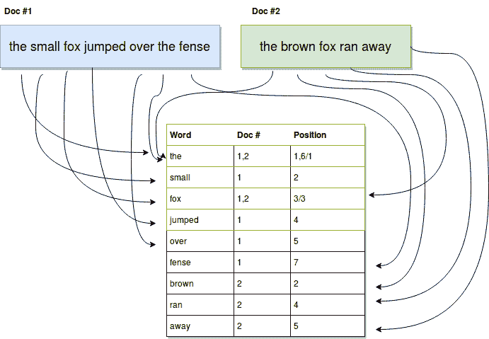

# 如何使用 Node.js 和 Elastic 编写自己的搜索引擎

> 原文：<https://dev.to/bnevilleoneill/how-to-write-your-own-search-engine-using-node-js-and-elastic-10b8>

**作者:[费尔南多·多利奥](https://blog.logrocket.com/author/fernandodoglio/)** ✏️

许多人倾向于给谷歌的搜索算法(也称为[页面排名](https://en.wikipedia.org/wiki/PageRank))添加许多神秘色彩，因为它总是设法在前几页向我们展示我们正在寻找的结果(即使在有数百个结果页面的情况下)。

它是如何工作的？为什么这么准？这些问题没有真正的答案，当然，除非你是谷歌内部维护它的团队的一员。

我们不需要侵入谷歌的服务器，窃取他们的算法，就可以开发出一种非常强大的搜索功能，你可以轻松地将它集成到你的网站/网络应用中，同时获得出色的用户体验。

我实际上指的是通常所说的“全文搜索”。如果你来自传统的 web 开发世界，你可能习惯于使用 SQL 数据库，比如 [MySQL](https://www.mysql.com/) 或 [PostgreSQL](https://www.postgresql.org/) ，它们默认允许你在字符串字段中执行基于通配符的搜索，比如:

```
SELECT * FROM Cities WHERE name like 'new%'; 
```

<svg width="20px" height="20px" viewBox="0 0 24 24" class="highlight-action crayons-icon highlight-action--fullscreen-on"><title>Enter fullscreen mode</title></svg> <svg width="20px" height="20px" viewBox="0 0 24 24" class="highlight-action crayons-icon highlight-action--fullscreen-off"><title>Exit fullscreen mode</title></svg>

使用上面的查询，您通常会得到匹配的结果，例如:

*   纽约
*   新德里
*   新奥尔良

您得到了模式，如果您的数据库中有更复杂的对象，比如带有标题和正文的博客文章，您可能还想对它们进行更“有趣”的搜索，比如:

```
SELECT * FROM BLOG_POSTS WHERE title like '%2019%' OR body like '%2019%'; 
```

<svg width="20px" height="20px" viewBox="0 0 24 24" class="highlight-action crayons-icon highlight-action--fullscreen-on"><title>Enter fullscreen mode</title></svg> <svg width="20px" height="20px" viewBox="0 0 24 24" class="highlight-action crayons-icon highlight-action--fullscreen-off"><title>Exit fullscreen mode</title></svg>

现在上面的查询也会产生一些结果，但是这些结果的最佳顺序是什么呢？因为电话号码 *444220192* 在它的体内而匹配的博客帖子会在标题为*“2019 年最佳足球队”*的博客帖子之前被返回，这有意义吗？后一种匹配肯定更相关，但是简单的通配符匹配无法做到这一点。

正因为如此，在您的站点上添加全文搜索可能是一个很好的匹配(特别是如果您希望您的用户搜索非结构化的内容，例如 FAQ 或可下载的文档，等等)。

[](https://logrocket.com/signup/)

## 哗啦啦全文

这些是基本通配符搜索的用例。诚然，最常见的 SQL 数据库，如 MySQL 和 PostgreSQL，已经包含了某种形式的基本全文功能，但如果您想充分利用这种技术，您需要一个专用的搜索引擎，如 [Elastic](https://www.elastic.co/) 。

这些引擎的工作方式是通过创建所谓的“倒排索引”。在我们示例的上下文中，我们试图索引文本文档，它们从每个文档中提取每个单词，并记录它们出现在文档中的引用及其在文档中的位置。因此，不必在每个文档中搜索子串(就像上面的 SQL 示例一样)，只需要在单词列表中搜索子串，那些匹配的单词就已经知道它们在索引中出现的位置。

[](https://res.cloudinary.com/practicaldev/image/fetch/s--lkT8Qpis--/c_limit%2Cf_auto%2Cfl_progressive%2Cq_auto%2Cw_880/https://i1.wp.com/blog.logrocket.com/wp-content/uploads/2019/08/pagerankalgorithm.png%3Fresize%3D691%252C479%26ssl%3D1)

上图以非常简单的方式显示了如何构建倒排索引:

1.  索引上列出了每个单词
2.  对源文档的引用存储在每个单词上(允许对不同文档的多次引用)
3.  在每个文档中，我们还记录了单词的位置(第 3 列)

有了这些信息，我们可以简单地搜索索引，并匹配您的查询和索引中的单词之间的任何重合(我们甚至可以使用子字符串进行搜索，并仍然返回有效的结果)。

这仍然没有让我们得到我们所需要的，因为我们没有任何关于相关性的信息。标题上的匹配和正文上的匹配哪个更重要？完全匹配还是部分匹配？这些是我们的引擎在搜索时需要知道的规则，幸运的是，我们今天使用的引擎( [Elastic](https://www.elastic.co/) )会处理这些规则，甚至更多。

那么让我们看看这个基本的倒排索引，看看我们如何使用弹性来利用这一技术，好吗？

## 去弹性

安装和运行一个本地版本的 Elastic 真的非常简单，特别是如果你按照官方说明去做的话。

一旦启动并运行了它，您就可以使用它的 RESTful API 和手头的任何 HTTP 客户端与它进行交互(我将使用 [curl](https://curl.haxx.se/) ，默认情况下它应该安装在大多数常见的操作系统中)。

一旦设置好了，真正的工作就可以开始了，不要担心，我将带您完成本文中的以下所有步骤:

1.  你需要创建一个索引
2.  之后，您将为索引中的文档创建一个映射
3.  一旦一切都设置好了，你就可以索引文档了
4.  最终，搜索将成为可能

为了让事情更容易理解，让我们假设我们正在构建一个图书馆的 API，它将允许你搜索不同数字书籍的内容。

出于本文的目的，我们将保持最少的元数据，但是您可以根据您的特定用例添加所需的数量。这些书将从古腾堡项目下载，并首先被手工索引。

### 如何创建你的第一个指数

根据定义，Elastic 中的每个索引文档都需要插入到索引中，这样，如果您开始索引不同的和不相关的对象，就可以很容易地在您需要的范围内进行搜索。

如果方便的话，你可以把索引想象成一个容器，一旦你决定搜索某个东西，你需要选择一个容器。

为了创建一个新的索引，你可以简单地运行这个:

```
$ curl -X PUT localhost:9200/books 
```

<svg width="20px" height="20px" viewBox="0 0 24 24" class="highlight-action crayons-icon highlight-action--fullscreen-on"><title>Enter fullscreen mode</title></svg> <svg width="20px" height="20px" viewBox="0 0 24 24" class="highlight-action crayons-icon highlight-action--fullscreen-off"><title>Exit fullscreen mode</title></svg>

通过这一行，您将您的请求发送到您的*本地主机*(当然，假设您正在进行本地测试)，并使用端口 9200，这是 Elastic 的默认端口。

路径“books”是实际创建的索引。成功执行该命令将返回类似于:
的内容

```
{
  "acknowledged" : true,
  "shards_acknowledged" : true,
  "index" : "books"
} 
```

<svg width="20px" height="20px" viewBox="0 0 24 24" class="highlight-action crayons-icon highlight-action--fullscreen-on"><title>Enter fullscreen mode</title></svg> <svg width="20px" height="20px" viewBox="0 0 24 24" class="highlight-action crayons-icon highlight-action--fullscreen-off"><title>Exit fullscreen mode</title></svg>

现在，记住这条路，让我们进入下一步，创建一个地图。

### 如何为你的文档创建地图

这一步实际上是可选的，您可以在查询执行期间定义这些参数，但是我总是发现维护外部映射比绑定到代码的业务逻辑更容易。

您可以在这里设置如下内容:

*   我们的书名和正文可以做哪些**类型的匹配**(是完全匹配吗？我们使用全文还是基本匹配？等等)
*   每场比赛的重量。或者换句话说，标题中的匹配与正文中的匹配有多相关？

为了创建特定索引的映射，您必须使用 mappings 端点并发送描述新映射的 JSON。下面是一个遵循上述数字图书索引思想的例子:

```
{
  "properties": {
    "title": {
      "type": "text",
      "analyzer": "standard",
      "boost": 2
    },
    "body": {
      "type": "text",
      "analyzer": "english"
    }
  }   
} 
```

<svg width="20px" height="20px" viewBox="0 0 24 24" class="highlight-action crayons-icon highlight-action--fullscreen-on"><title>Enter fullscreen mode</title></svg> <svg width="20px" height="20px" viewBox="0 0 24 24" class="highlight-action crayons-icon highlight-action--fullscreen-off"><title>Exit fullscreen mode</title></svg>

这个映射定义了两个字段，标题和正文，标题需要用标准分析器进行分析，正文考虑到这些都是英语书，将使用英语语言分析器。我还增加了标题上的匹配，这使得它们中的任何一个都比书的正文上的匹配相关两倍。

为了在我们的索引上设置它，我们需要做的就是使用下面的请求:

```
$ curl -X PUT "localhost:9200/books?pretty" -H 'Content-Type: application/json' -d' { 
  "properties": {
    "title": {
      "type": "text",
      "analyzer": "standard",
      "boost": 2
    },
    "body": {
      "type": "text",
      "analyzer": "english"
    }
  }
} ' 
```

<svg width="20px" height="20px" viewBox="0 0 24 24" class="highlight-action crayons-icon highlight-action--fullscreen-on"><title>Enter fullscreen mode</title></svg> <svg width="20px" height="20px" viewBox="0 0 24 24" class="highlight-action crayons-icon highlight-action--fullscreen-off"><title>Exit fullscreen mode</title></svg>

一次成功的执行将产生如下结果:

```
{
  "acknowledged" : true
} 
```

<svg width="20px" height="20px" viewBox="0 0 24 24" class="highlight-action crayons-icon highlight-action--fullscreen-on"><title>Enter fullscreen mode</title></svg> <svg width="20px" height="20px" viewBox="0 0 24 24" class="highlight-action crayons-icon highlight-action--fullscreen-off"><title>Exit fullscreen mode</title></svg>

现在我们的索引和映射已经准备好了，我们要做的就是开始索引，然后执行搜索。

### 如何将内容索引成弹性

尽管从技术上来说，我们不需要编码就可以做到这一点，但我将在 Node.js 中创建一个快速脚本来加速将书籍发送到 Elastic 的过程。

这个脚本很简单，它将从一个特定的目录中读取文件的内容，抓取第一行并将其作为标题，然后其他所有内容将作为正文的一部分进行索引。

下面是简单代码:

```
const fs = require("fs")
const request = require("request-promise-native")
const util = require("util")

let files = ["60052-0.txt", "60062-0.txt", "60063-0.txt", "pg60060.txt"]
const readFile = util.promisify(fs.readFile)

async function indexBook(fid, title, body) {
    let url = "http://localhost:9200/books/_doc/" + fid
    let payload = {
        url: url, 
        body: {
            title: title, 
            body: body.join("\n")
        },
        json: true
    }
    return request.put(payload)
}
( _ => {
    files.forEach( async f => {
        let book = await readFile("./books/" + f);
        [title, ...body] = book.toString().split("\n");
        try {
            let result = await indexBook(f, title, body);
            console.log("Indexing result: ", result);
        } catch (err) {
            console.log("ERROR: ", err)
        }
    })
})(); 
```

<svg width="20px" height="20px" viewBox="0 0 24 24" class="highlight-action crayons-icon highlight-action--fullscreen-on"><title>Enter fullscreen mode</title></svg> <svg width="20px" height="20px" viewBox="0 0 24 24" class="highlight-action crayons-icon highlight-action--fullscreen-off"><title>Exit fullscreen mode</title></svg>

我所做的就是浏览我的数组中的图书列表，并将它们的内容发送给 Elastic。用来索引的方法是 PUT，路径是`your-host:your-port/index-name/_doc/a-doc-ID`。

*   我使用默认的主机和端口( *localhost* 和 *9200*
*   我的索引是我之前创建的:*书籍*
*   我使用的索引是文件名，我知道它对于每本书都是唯一的

这实质上留给我们一件事去做，查询我们的数据。

### 如何查询弹性中的指标

为了查询索引，我们可以像目前为止一样使用 Elastic 的 REST API，或者我们可以继续使用 [Elastic 的官方 Node.js 库](https://www.npmjs.com/package/elasticsearch)。

为了展示一些不同的东西，我将向您展示如何使用 Elastic 的 NPM 模块执行搜索查询，如果您想开始使用它，请随时查看他们的文档。

一个简单的例子应该足以将我到目前为止讨论的所有内容付诸实践，它将对索引文档执行全文搜索，并根据相关性(这是 Elastic 使用的默认标准)返回结果的排序列表。

下面的代码就是这么做的，让我给你演示一下:

```
var elasticsearch = require('elasticsearch');
var client = new elasticsearch.Client({
  host: 'localhost:9200/books'
});

let q = process.argv[2];

( async query => {
    try {
        const response = await client.search({
            q: query
        });
        console.log("Results found:", response.hits.hits.length)
        response.hits.hits.forEach( h => {
            let {_source, ...params } = h;
            console.log("Result found in file: ", params._id, " with score: ", params._score)
        })
    } catch (error) {
        console.trace(error.message)
    }
})(q) 
```

<svg width="20px" height="20px" viewBox="0 0 24 24" class="highlight-action crayons-icon highlight-action--fullscreen-on"><title>Enter fullscreen mode</title></svg> <svg width="20px" height="20px" viewBox="0 0 24 24" class="highlight-action crayons-icon highlight-action--fullscreen-off"><title>Exit fullscreen mode</title></svg>

上面的代码将您在执行脚本时使用的第一个单词作为 CLI 参数，并将其用作查询的一部分。

如果您继续学习，您应该能够下载 Guterberng 项目中的一些书籍并建立索引，然后编辑其中的两本。在其中一行中，在第一行中添加单词“testing ”,在另一行中，添加相同的单词，但是在文本的中间。这样，您可以看到基于我们设置的映射，相关性是如何工作的。

在我的例子中，这些是我得到的结果:

```
Results found: 2
    Result found in file:  60052-0.txt  with score:  2.365865
    Result found in file:  pg60060.txt  with score:  1.7539438 
```

<svg width="20px" height="20px" viewBox="0 0 24 24" class="highlight-action crayons-icon highlight-action--fullscreen-on"><title>Enter fullscreen mode</title></svg> <svg width="20px" height="20px" viewBox="0 0 24 24" class="highlight-action crayons-icon highlight-action--fullscreen-off"><title>Exit fullscreen mode</title></svg>

由于我使用文件名作为文档索引，我可以重用这段信息来显示相关的结果。

本质上，你现在可以下载任意多的书，并使用之前的代码对它们进行索引。你有自己的搜索引擎，能够快速搜索并返回相关的文件名供你打开。这里的速度是我之前提到的使用倒排索引的好处之一，因为它不需要每次都遍历每个文档的整个主体，它只会搜索您在内部索引中输入的单词，并返回它在索引过程中引用的列表。

由此得出的一个直接结论是，你可以有把握地说，索引一个文档比搜索要昂贵得多(从计算角度来说)。由于通常情况下，大多数搜索引擎花费大部分时间搜索而不是索引，这是一个完全好的权衡。

## 结论

这就是我对弹性的介绍，我希望你和我一样觉得有趣。就我个人而言，这个 NoSQL 数据库(它也是众所周知的)是我最喜欢的数据库之一，这要感谢你用很少的代码获得的强大功能。

通过对书籍进行分类并将这些信息保存为索引元数据的一部分，您可以轻松地扩展上面的代码。之后，您可以记录用户搜索的书籍类型，然后根据他们的偏好用不同的提升值调整单个映射(例如，一些用户喜欢科幻书籍，而另一些用户喜欢基于历史的书籍)。这会给你一个更接近谷歌的行为。想象力是极限！

请在评论中告诉我你过去是否使用过 Elastic，以及你使用过什么样的疯狂搜索引擎！

否则，*下一场见！*

* * *

**编者按:**看到这个帖子有问题？你可以在这里找到正确的版本。

## Plug: [LogRocket](https://logrocket.com/signup/) ，一款适用于网络应用的 DVR

[](https://res.cloudinary.com/practicaldev/image/fetch/s--6FG5kvEL--/c_limit%2Cf_auto%2Cfl_progressive%2Cq_auto%2Cw_880/https://i2.wp.com/blog.logrocket.com/wp-content/uploads/2017/03/1d0cd-1s_rmyo6nbrasp-xtvbaxfg.png%3Fresize%3D1200%252C677%26ssl%3D1)

[log rocket](https://logrocket.com/signup/)是一个前端日志工具，让你重放问题，就像它们发生在你自己的浏览器中一样。LogRocket 不需要猜测错误发生的原因，也不需要向用户询问截图和日志转储，而是让您重放会话以快速了解哪里出错了。它可以与任何应用程序完美配合，不管是什么框架，并且有插件可以记录来自 Redux、Vuex 和@ngrx/store 的额外上下文。

除了记录 Redux 动作和状态，LogRocket 还记录控制台日志、JavaScript 错误、stacktraces、带有头+体的网络请求/响应、浏览器元数据、自定义日志。它还使用 DOM 来记录页面上的 HTML 和 CSS，甚至为最复杂的单页面应用程序重新创建像素级完美视频。

[免费试用](https://logrocket.com/signup/)。

* * *

帖子[如何使用 Node.js 和 Elastic](https://blog.logrocket.com/write-your-own-search-engine-using-node-js-and-elastic/) 编写自己的搜索引擎最先出现在[博客](https://blog.logrocket.com)上。