# 最终完美的分布式系统的故事

> 原文：<https://dev.to/lenadroid/story-of-eventually-perfect-distributed-systems-209a>

*本文基于 [@lenadroid](//twitter.com/lenadroid) 的 O'Reilly Velocity 2019 主题演讲。*

这是关于我们工作的影响、我们面临的复杂性和障碍，以及对于构建更好的分布式系统来说什么是重要的，尤其是当其他生命攸关的领域依赖并建立在我们所创造的基础上时。

今天可用的系统已经提供了许多解决方案，封装了许多分布式算法，实现了自动化，并抽象掉了一些复杂性。使用它们的工程师不一定需要拥有开发它们所需要的大量知识。尽管新工程师学习这些系统所基于的基础知识的必要性越来越小，但在某些情况下，了解幕后的情况对于做出正确的决策和解决当事情不按预期运行时出现的困难问题是至关重要的。

基本面还重要吗？

为什么从我们现在所处的位置回到基本面很重要？我们正处于分布式系统在医疗领域、自主设备、运输自动化和其他生命攸关的场景中被越来越多的采用的时刻，在这个时刻，错误的成本正在增加，正确性变得非常重要。

错误的代价不是你的系统今天有多少秒不可用。它是关于你的系统的不作为或失败对你的用户和他们的用户的代价。我们应该负起责任，永远记住我们为什么要这样做，我们要解决的真正问题是什么。

[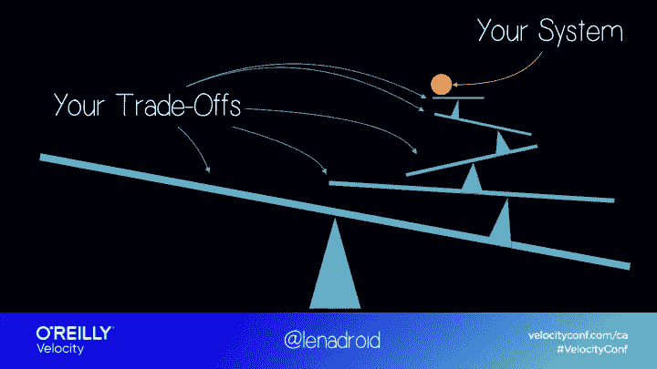](https://res.cloudinary.com/practicaldev/image/fetch/s--pZ-BgimG--/c_limit%2Cf_auto%2Cfl_progressive%2Cq_auto%2Cw_880/https://thepracticaldev.s3.amazonaws.com/i/mgn3nsx2e9zdoc3a18ar.jpeg)

每个行业都希望通过结合他们和我们的研究和解决方案来取得更大的进步。我们的工作帮助其他领域更好地实现他们的目标。理解如何放松某些限制或微调某些权衡对我们来说非常有用。

了解什么是核心是一个强大的工具，可以导航不断变化的选项和工具的复杂性，并帮助我们构建正确的解决方案来改进我们现有的选项。

事实证明这并不容易，我们的道路上有一些障碍！

**理论与实践差距很大**

理解“正确”对我们的系统意味着什么是具有挑战性的。大多数理论材料不够平易近人，是出了名的难以掌握。它通常不包括将这一理论成功付诸实践所必需的信息。生产系统必须修改理论算法，并调整它们以在真实环境中工作。他们中的许多人没有揭示对实际解决方案重要的具体细节。甚至对协议细节的一点误解都会破坏它的正确性。所以我们需要做额外的工作来保证实现仍然是正确的。

[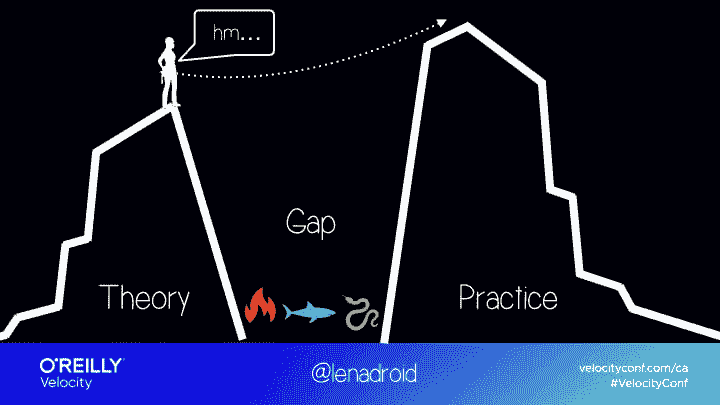](https://res.cloudinary.com/practicaldev/image/fetch/s--LsyHLN1R--/c_limit%2Cf_auto%2Cfl_progressive%2Cq_auto%2Cw_880/https://thepracticaldev.s3.amazonaws.com/i/o5dbb0x775ibcbm2isry.jpeg)

**难以验证和维护正确性**

在现实环境中验证和维护分布式系统的正确性是一项挑战。这在理论上可能听起来很完美，但在实践中可能效率低下或很难实现。这在理论上听起来不现实，但在实践中完全可以接受。无论是算法逻辑还是算法实现，都有很多地方可能出错，而且很难检测到。

**正确性并不总是优先考虑的事情**

另一方面，正确性并不总是优先考虑的事情。有截止日期、竞争和需要更快解决方案的客户。可能发生的情况是，终端系统将被加速并且不能正确地校正。这意味着团队可能没有时间来适当地讨论和系统地解决罕见的“间歇性”错误背后的真正原因，这些错误将在未来再次发生，导致更多的错误。

我们如何改进？

我们可以在许多方面进行改进。其中之一是强调并投入更多的精力来提高正确性，以确保我们能够构建并维护系统，使其准确地做我们期望他们做的事情。

另一个是提高对它们如何工作的理解，因为这有助于我们减少复杂性和可能的错误，并使我们更好地面对即将到来的挑战。

当我们不直接实现分布式算法和概念时，我们肯定会依赖于这样做的系统。在我们构建的东西与其他领域和领域相交的地方，理解基础概念和权衡变得极其重要。

如果你被许诺一些性能和一致性，你如何实际上确保这些保证是在你需要的确切水平上提供的？

**简单的问题变得很难**

当几台计算机在相互对话时，琐碎的问题就变成了棘手的问题，它们不断积累。分布式系统很难理解，很难实现，并且很难在实践中保持正确。

我想有很多方法可以说明为什么。最近，我有机会向生物信息学领域的人解释这个问题，他想知道为什么他们需要在分布式环境中的重要属性之间进行权衡。

**订购**

我首先想到的是安排活动。在单台机器上订购很容易，但当消息通过网络发送时，就很难了！我们不能依赖物理时间戳，因为不同机器上的物理时钟容易漂移。对于分布式系统中的排序，我们通常使用逻辑时钟，或者简单地说，在节点之间传递的计数器。

由于分布式系统的异步特性，我们不能轻易地为所有事件建立完整的顺序，因为有些事件是并发的！我们能做的是找出哪些事件是同时发生的，哪些事件是先后发生的。即使是这么简单的任务，我们也已经需要做出一些决定了。

例如，如果系统告诉我们事件是有序的，但实际上它们是并发的，我们会没事吗？

[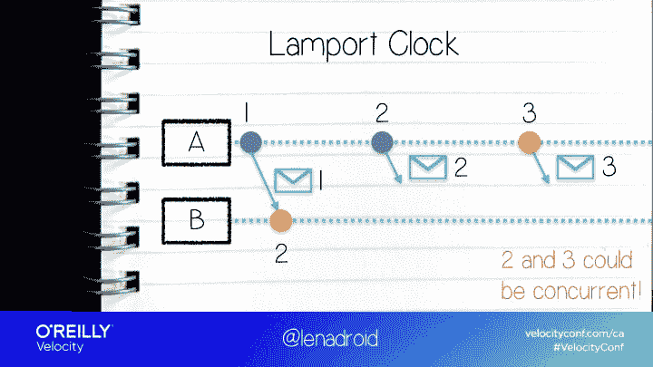](https://res.cloudinary.com/practicaldev/image/fetch/s--LyJvRDHX--/c_limit%2Cf_auto%2Cfl_progressive%2Cq_auto%2Cw_880/https://thepracticaldev.s3.amazonaws.com/i/y07tx43s7rdwsg2853a0.jpeg)

或者，当我们可以对事件进行排序时，我们是否需要确定事件确实不是并发的？

[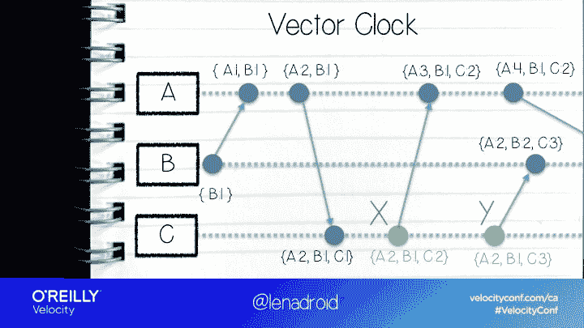](https://res.cloudinary.com/practicaldev/image/fetch/s--OWvYTJfl--/c_limit%2Cf_auto%2Cfl_progressive%2Cq_auto%2Cw_880/https://thepracticaldev.s3.amazonaws.com/i/7ljktcv5gb2yyhyzag0d.jpeg)

**协议**

我们不能简单地对并发事件进行排序，有时，我们仍然需要决定操作的顺序，决定一个值，一个值序列，或者其他任何东西。

事实证明，让几台机器选择同样的东西是另一种情况，我们必须问自己问题，并确定什么对我们来说是正确的。

[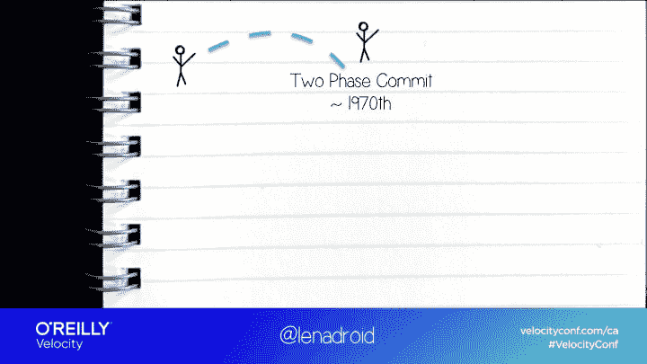](https://res.cloudinary.com/practicaldev/image/fetch/s--F-64FNqY--/c_limit%2Cf_auto%2Cfl_progressive%2Cq_auto%2Cw_880/https://thepracticaldev.s3.amazonaws.com/i/sbgnu9mmh0qezmimcg70.jpeg)

例如，两阶段提交是一种解决方案，其中我们的节点可以就某些事情达成一致。

[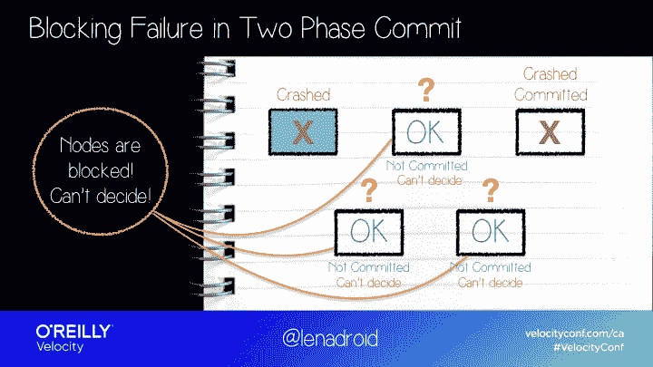](https://res.cloudinary.com/practicaldev/image/fetch/s--q7LCUj_5--/c_limit%2Cf_auto%2Cfl_progressive%2Cq_auto%2Cw_880/https://thepracticaldev.s3.amazonaws.com/i/d2lm0ojv3hotqo9148mf.jpeg)

这是可行的，只要我们的节点不出故障。

如果一些节点崩溃，为了防止任何不一致数据的可能性，系统只是阻塞，直到崩溃的节点恢复，这可能永远不会发生或需要非常非常长的时间。

所以算法是安全的，但不是实时的。

如果这不是我们能接受的，我们真的需要一个系统来回应，那怎么办？

[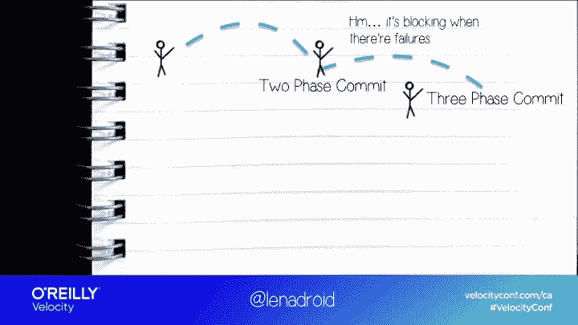](https://res.cloudinary.com/practicaldev/image/fetch/s--E5cBJBxF--/c_limit%2Cf_auto%2Cfl_progressive%2Cq_auto%2Cw_880/https://thepracticaldev.s3.amazonaws.com/i/1oprcqp5qcd36wzcfubp.jpeg)

在这种情况下，我们可能有另一种可能的解决方案——三阶段提交。出现故障时不会阻塞。

[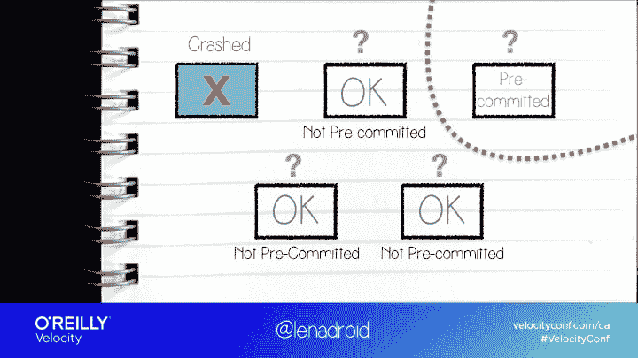](https://res.cloudinary.com/practicaldev/image/fetch/s--WmVfcstu--/c_limit%2Cf_auto%2Cfl_progressive%2Cq_auto%2Cw_880/https://thepracticaldev.s3.amazonaws.com/i/9a8rxwxbvk4of3h0ruhm.jpeg)

但是当有网络分区时...

网络的两个隔离端在超时后可能会做出两个不同的决定，系统最终会处于不一致的状态。

所以这里我们有相反的情况:系统是响应性的和活跃的，但是它是不安全的，因为不同的节点可以决定不同的值。

[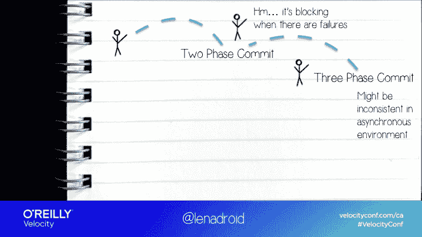](https://res.cloudinary.com/practicaldev/image/fetch/s--E_Mc-3oC--/c_limit%2Cf_auto%2Cfl_progressive%2Cq_auto%2Cw_880/https://thepracticaldev.s3.amazonaws.com/i/k0q433gybhxesdldzaop.jpeg)

如果我们同意这两个选项中的任何一个，那就太好了！

如果我们希望数据始终一致，系统响应迅速，我们应该怎么做？

**不可能结果**

[不可能性结果](https://groups.csail.mit.edu/tds/papers/Lynch/jacm85.pdf)证明，实际上，在完全异步的环境中，即使有一个可能的失败，也没有一个确定性的算法会一直终止并做出决定。

[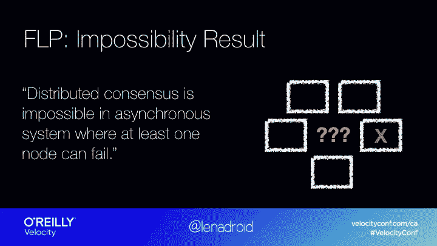](https://res.cloudinary.com/practicaldev/image/fetch/s--3Vn0Mghp--/c_limit%2Cf_auto%2Cfl_progressive%2Cq_auto%2Cw_880/https://lenadroid.github.io/posts/OReillyVelociimg/Velocity-Keynote-Lena-Hall.019.jpeg)

从这个结果中我们可以学到的主要东西是:如果我们想在实践中达成一致，我们将不得不重新思考我们的假设，以反映更现实的期望！例如，我们可以设定最大消息延迟的上限，并确定我们的系统可以接受的失败次数。

如果我们改变我们的假设，我们可以用多种方法解决分布式协议！

[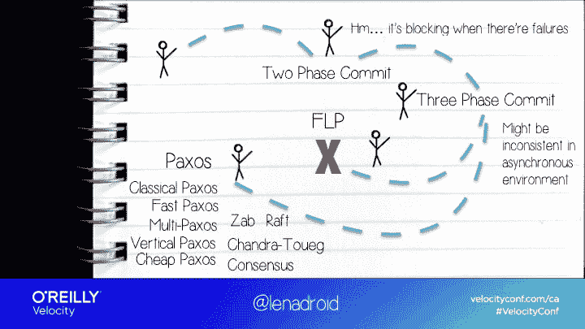](https://res.cloudinary.com/practicaldev/image/fetch/s--1yybcgyt--/c_limit%2Cf_auto%2Cfl_progressive%2Cq_auto%2Cw_880/https://lenadroid.github.io/posts/OReillyVelociimg/Velocity-Keynote-Lena-Hall.020.jpeg)

**Paxos**

最著名的解决方案是 [Paxos](https://lamport.azurewebsites.net/pubs/paxos-simple.pdf) 算法，它以难以理解和难以正确实现而闻名。

它实际上是可行的，但是只有在大多数节点都必须运行，并且最大消息延迟有限的情况下才可行。

在 Paxos 中，任何节点都可以提议一个值，在经历“准备”和“提议”阶段后，所有节点都应该同意相同的值。

大多数节点需要启动，因为如果在每个阶段定额相交，总会有至少一个节点记得最近的提议是什么，这阻止了就旧值达成一致。

[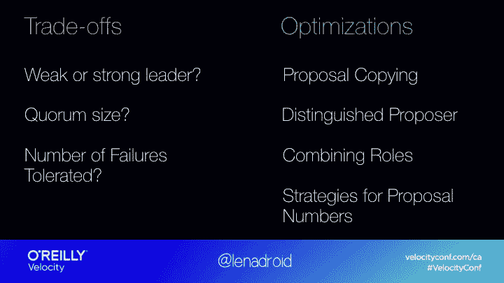](https://res.cloudinary.com/practicaldev/image/fetch/s--e3fsZzxx--/c_limit%2Cf_auto%2Cfl_progressive%2Cq_auto%2Cw_880/https://lenadroid.github.io/posts/OReillyVelociimg/Velocity-Keynote-Lena-Hall.022.jpeg)

在实践中对初始算法进行了许多优化，以使其更有效。基于他们选择的权衡，共识算法也有许多可能的变化。

比如领导做了多少工作。有一个强有力的领导人可能是好的也可能是坏的，这取决于他失败的频率和连任的难度。另一个权衡是我们可以原谅多少个节点故障，法定人数应该有多大。

有些被低估的标准是算法在实践中的可理解性和可实现性。Raft 之所以受欢迎，是因为它更容易理解，现在被应用于许多广泛使用的项目中。

**仍在发现新的取舍**

但更有趣的是，即使共识和协议这个话题并不新鲜，我们仍然会发现许多新的优化和权衡。

在经典的 Paxos 中，大多数人需要站起来以确保所有法定人数相交。但事实证明，我们可以重新思考并简化多数法定人数的要求。事实证明，只需要准备和提议阶段的法定人数相交就足够了，这给了我们更多的灵活性来试验每个阶段的法定人数大小和性能！

主要的一点是，揭示迄今为止新的性能和可用性权衡，有助于我们在实践中扩大选择范围。Consensus 只是一个构建块，但是它可以用来解决许多常见的问题，比如原子广播、分布式锁、强一致性复制等等！

请查看海蒂·霍华德博士的[论文《分布式共识修订版》](https://www.cl.cam.ac.uk/techreports/UCAM-CL-TR-935.pdf)。这是关于这个题目的最好的论文之一。

**一致复制？**

复制是当今任何分布式系统的重要组成部分。

我们实际上可以使用共识来实现强一致性复制，但它的一个缺点是性能。另一方面当然是最终一致复制，这非常快，但客户端可能会看到不一致的数据。在实践中，我们经常想要更好的性能，同时仍然保持更强的一致性，这可能很棘手。

因此，在某些情况下，我们可以想出比达成共识更快的解决方案，并且比最终的一致性更一致。

其中一个有趣的例子是 Aurora，在那里他们[避免 I/O 和其他一些操作的一致性](https://dl.acm.org/citation.cfm?id=3183713.3196937)。他们使用 quorums 进行写入，但不使用它们进行读取。实际上，副本可能存储不同的值，但是当客户端执行读取时，因为数据库维护一致性点，所以它可以直接查看已知数据一致的节点，并将正确的数据返回给客户端。

[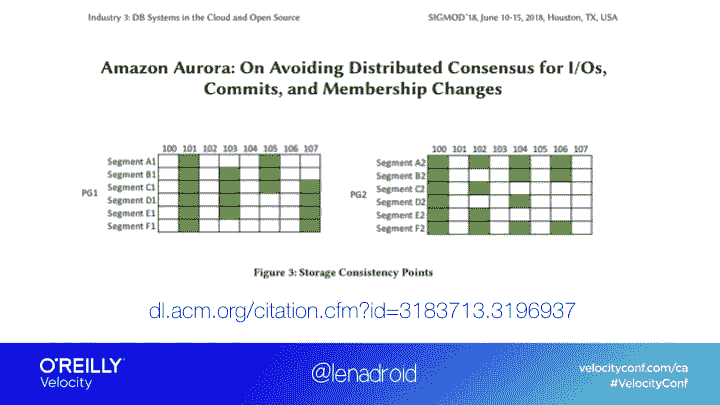](https://res.cloudinary.com/practicaldev/image/fetch/s--uRzvy9KJ--/c_limit%2Cf_auto%2Cfl_progressive%2Cq_auto%2Cw_880/https://lenadroid.github.io/posts/OReillyVelociimg/Velocity-Keynote-Lena-Hall.025.jpeg)

**无冲突复制数据类型(crdt)**

另一个有趣的例子是[无冲突复制数据类型](https://en.wikipedia.org/wiki/Conflict-free_replicated_data_type)。它们可以提供强大的最终一致性，快速读取和写入，即使在网络分区期间也保持可用，而无需使用一致或同步。然而，只有当我们有解决任何并发冲突的规则时，这才是可能的。

换句话说，我们只能使用这种技术，如果有可能使用一些函数来合并并发更新，这些函数可以以任何顺序应用它们，并且可以根据我们的需要多次应用，而不会破坏结果。

这是一个完全可以接受的例子，其中所有的更新都是相加的，所以它们完全满足这个要求。

[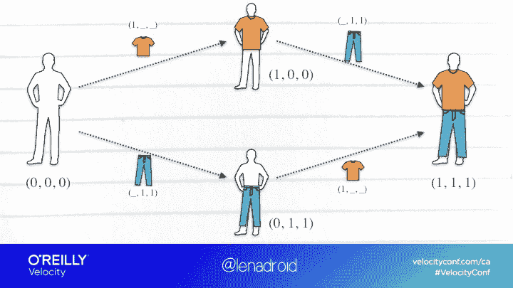](https://res.cloudinary.com/practicaldev/image/fetch/s--2ivRawJf--/c_limit%2Cf_auto%2Cfl_progressive%2Cq_auto%2Cw_880/https://lenadroid.github.io/posts/OReillyVelociimg/Velocity-Keynote-Lena-Hall.027.jpeg)

另一方面，这一点并不明显，因为我们没有明确的规则来解决这种同时更新的冲突。

[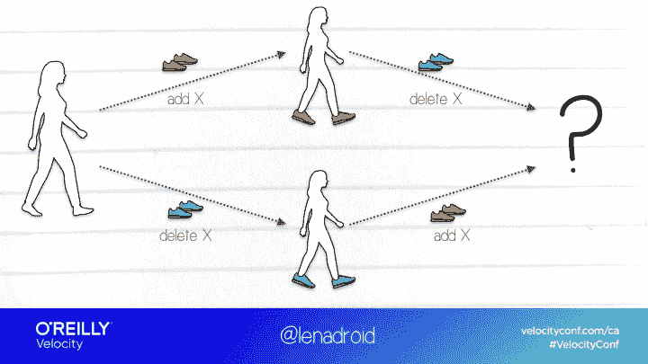](https://res.cloudinary.com/practicaldev/image/fetch/s--C0VB5rvo--/c_limit%2Cf_auto%2Cfl_progressive%2Cq_auto%2Cw_880/https://lenadroid.github.io/posts/OReillyVelociimg/Velocity-Keynote-Lena-Hall.028.jpeg)

[Azure Cosmos DB](https://azure.microsoft.com/en-us/services/cosmos-db?WT.mc_id=keynote-blog-alehall) 使用 CRDTs 在并发多主机多区域写入的幕后解决冲突。Redis 和 Riak 也使用 CRDTs。

[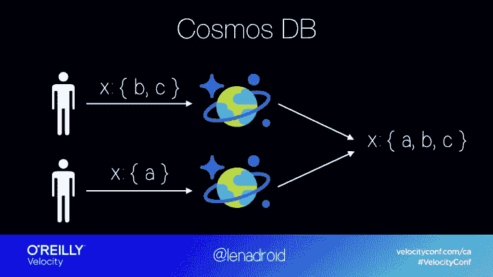](https://res.cloudinary.com/practicaldev/image/fetch/s--BfNMV7Vr--/c_limit%2Cf_auto%2Cfl_progressive%2Cq_auto%2Cw_880/https://lenadroid.github.io/posts/OReillyVelociimg/Velocity-Keynote-Lena-Hall.029.jpeg)

**故障检测**

如果我们转移到分布式系统中的另一个主题，我们总是会发现更多的权衡。

[故障检测器](https://github.com/natadzen/failure-detectors-and-consensus-fsharp)是发现分布式系统中节点崩溃的关键技术之一。它们可以应用于协议问题、领导者选举、群组成员协议以及其他领域。

我们可以通过故障检测器的“完整性”和“准确性”来衡量它们的效率。

*完备性*表示系统中的部分或全部节点是否发现了所有故障。*准确性*衡量故障检测器在怀疑另一个节点故障时可能犯的错误级别。

事实证明，即使是不可靠的故障检测器在实际系统中也非常有用，因为我们可以通过添加一个将故障知识传播到所有节点的闲聊机制来提高它们的完整性。

为什么所有这些都很重要？

权衡可能有不同的形状和形式，如果我们知道如何使用它们以及在哪里寻找，我们就可以非常灵活。

许多产品都是围绕算法和权衡来构建的。这些产品为我们做出某些选择，我们通过使用某些产品做出选择。无知的选择会导致延迟和数据丢失。对于一些系统来说，这可能会导致失去客户和大量的金钱。对于其他系统，它可能导致反应缓慢，或错误的行动顺序，这构成了实际的生命威胁。理解您的权衡对于做出正确的选择、了解正确的含义以及在现实中验证我们系统的正确性非常重要。

**验证并维护现实中的正确性**

在我们清楚了我们的决策和权衡之后，我们如何在真实的系统中保持正确性？

验证分布式逻辑的安全性和活性，尤其是安全性的一个常用选项是系统模型检查。模型检查是有用的，因为它探索了系统最终可能处于的所有状态。外面有相当多的工具。TLA+ 非常有名，还有更多新兴技术，如[语义感知模型检查](https://www.usenix.org/system/files/conference/osdi14/osdi14-paper-leesatapornwongsa.pdf)。

要验证分布式系统的真实运行实现的正确性，仅仅进行模型检查是不够的。

没有多少项目发布关于他们如何维护系统的正确性并验证它的信息。但有些人会。

例如，针对 Kafka 的各种系统测试每天都在运行，世界上的任何人都可以[检查和查看](http://testing.confluent.io/confluent-kafka-system-test-results/)哪些按预期工作，哪些没有。

[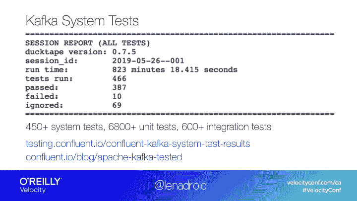](https://res.cloudinary.com/practicaldev/image/fetch/s--OaB9IwwW--/c_limit%2Cf_auto%2Cfl_progressive%2Cq_auto%2Cw_880/https://lenadroid.github.io/posts/OReillyVelociimg/Velocity-Keynote-Lena-Hall.036.jpeg)

卡珊德拉写了一篇非常棒的文章，讲述了他们对 T2 全面测试的方法。

[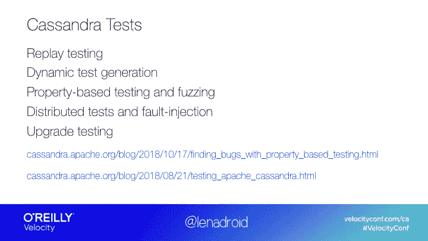](https://res.cloudinary.com/practicaldev/image/fetch/s--Hg1fvXsM--/c_limit%2Cf_auto%2Cfl_progressive%2Cq_auto%2Cw_880/https://lenadroid.github.io/posts/OReillyVelociimg/Velocity-Keynote-Lena-Hall.037.jpeg)

我真的希望更多的产品、项目和系统能够更加开放地投入到测试和正确性验证中。

如果我们看看运行生产级分布式系统需要做哪些准备，那就有很多了。

当然，对于小范围的场景，为了确保多个服务能够很好地协同工作，单元测试和集成测试是必不可少的。但是还不够！我们可以使用更多的技术。模糊测试和基于属性的测试向您的系统提供随机生成的输入，以确保其基本属性基于其规范是正确的。我实际上在微软研究院做了一个模糊的项目，总的来说这是一个非常有趣的话题。性能测试有助于收集各种组件的延迟和吞吐量数据。故障注入有助于检查系统在故障情况下是否可用，以及预期的系统属性是否正确。

尽管如此，大多数关键错误背后的疯狂的原因是在异常处理逻辑中。

有些事情我们无法完全解决。我们需要接受这样一个事实，在我们写完所有的测试和检查之后，事实上还是会有错误。我们是人，有上下文切换，不可能知道每一件事，有太多移动的部分。我们永远不会探索新的领域，如果我们害怕离开我们熟悉的领域，我们永远不会取得进展。然而，我们肯定可以为处理意外错误做更好的准备，找到模式，并尝试解决导致错误的原因。这就是为什么检测代码很重要，可观察性也很重要。当我们意识到这种可能性并为解决生产错误打下基础时，就不那么可怕了。

**外卖**

产品变化很快，描述其一致性、弹性和性能的术语非常多。基本面概念和权衡停留和积累。它们在孤立的情况下是没有用的，但是了解它们对于在实践中做出正确的选择和保持正确性是必不可少的。当我们的系统在特定级别的响应性和安全性是强烈要求的场景中被信任时，正确性尤其重要。

如果你在建造什么东西，问自己一个问题:这会被误解吗？复杂性就像一堵巨大的防弹墙围绕着你的项目，它使你难以解释、构建、使用和改进。试着让你构建的系统对其他人来说是可理解的，因为理解有助于正确性。

正确是不容易的，也不是免费的。你必须努力，并把它作为一个优先事项。不仅仅是在一个工程师愿意做的层面上，而是在整个组织的层面上。不要相信你的系统只是工作:测试它，验证它，并准备当事情失败。向您的用户和客户展示您在验证您的系统时所使用的技术和付出的努力。

[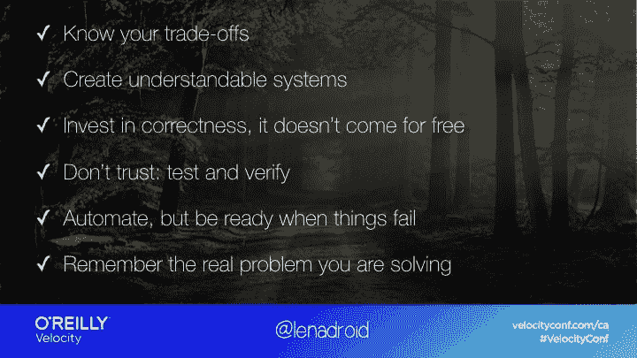](https://res.cloudinary.com/practicaldev/image/fetch/s--z1TpHcDe--/c_limit%2Cf_auto%2Cfl_progressive%2Cq_auto%2Cw_880/https://lenadroid.github.io/posts/OReillyVelociimg/Velocity-Keynote-Lena-Hall.040.jpeg)

想想那些与你的工作相关但没有得到足够重视的重要领域。如果你有机会和在另一个领域工作的不同于你的人聊天，那就去做吧，去更多地了解他们在工作中面临的挑战和他们做出的取舍。提问。与他们分享你的工作。它会帮助你成为一名更好的工程师。

