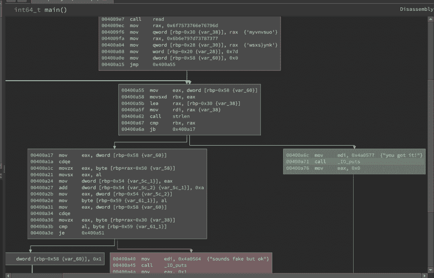

# 愤怒入门

> 原文：<https://dev.to/nuculabs_dev/introduction-to-angr-kf8>

我一直想尝试二进制分析框架，但是大多数时候我对安装和使用它的困难感到厌烦。就在最近，我想尝试一下 angr，现在我想和你分享我的经验！我将向你展示解决两个挑战的两个脚本，如果你想深入了解 Angr，你应该访问它的官方文档。

> angr 是一个用于分析二进制文件的 python 框架。它结合了静态和动态符号(“concolic”)分析，使其适用于各种任务。

对我来说，安装 Angr 并让它第一次工作的最简单的方法是下载 Kali linux，安装在 VirtualBox 中(确保至少有 12 GB 的磁盘空间)并执行:`pip install angr`。
在这里，您可以随心所欲地在 Kali 中设置您的 Python 开发环境。

对于第一个挑战，我们有以下源代码:

```
//written by bla
#include <stdio.h>
#include <string.h>
#include <unistd.h> 

int main(int argc, char **argv)
{

        int count = atoi(argv[1]);
        int buf[10];

        if(count >= 10 ) 
                return 1;

        //printf("%lx\n", (size_t)(count * sizeof(int)));
        memcpy(buf, argv[2], count * sizeof(int));
        if(count == 0x574f4c46) {
        printf("WIN!\n");
                //execl("/bin/sh", "sh" ,NULL);
    } else
                printf("Not today son\n");

        return 0;
} 
```

<svg width="20px" height="20px" viewBox="0 0 24 24" class="highlight-action crayons-icon highlight-action--fullscreen-on"><title>Enter fullscreen mode</title></svg> <svg width="20px" height="20px" viewBox="0 0 24 24" class="highlight-action crayons-icon highlight-action--fullscreen-off"><title>Exit fullscreen mode</title></svg>

挑战来源:[https://io.netgarage.org/](https://io.netgarage.org/)level-7

目标是找到两个参数给程序，以便将 buf 溢出到 count 并显示`WIN`。我们可以尝试通过试错、调试、做一些计算来解决这个问题，或者我们可以使用下面的 Python 脚本让 Angr 为我们解决这个问题。

```
import angr
import claripy

def resolve_win(state):
    # if the bytes of "WIN" are found in stdout it returns true
    return  b"WIN" in state.posix.dumps(1)

if __name__ == '__main__':
    print("starting.")

    # Declare project, load the binary
    proj = angr.Project('./lab-13/0-tutorial/level07')

    # Create a 32-bit symbolic bitvector named "password"
    arg1 = claripy.BVS('sym_arg', 8 * 11)  # maximum 11 * 8 bits
    arg2 = claripy.BVS('sym_arg', 8 * 44)  # maximum 44 * 8 bits 
    # We construct an entry_state passing the two arguments
    st = proj.factory.entry_state(args=['./level07', arg1, arg2])
    # he st.libc.max_strtol_len tweak tells the atoi/strtol symbolic representation to
    # resolve strings that are of at most 11 bytes length (the default is 10)
    st.libc.max_strtol_len = 11

    # Now we will create what in angr terms is called a simulation manager.
    # https://docs.angr.io/core-concepts/pathgroups
    pg = proj.factory.simgr(st)

    # This can be read as: explore looking for the path p for which the current state
    # p.state contains the string "WIN" in its standard output (p.state.posix.dumps(1),
    # where 1 is the file descriptor for stdout).
    pg.explore(find=resolve_win)

    print("solution found")
    s = pg.found[0]
    print(s.posix.dumps(1)) # dump stdout 
    # Print and eval the fist argument
    print("Arg1: ", s.solver.eval(arg1, cast_to=bytes))
    # Print and eval the second argument
    print("Arg2: ", s.solver.eval(arg2, cast_to=bytes)) 
```

<svg width="20px" height="20px" viewBox="0 0 24 24" class="highlight-action crayons-icon highlight-action--fullscreen-on"><title>Enter fullscreen mode</title></svg> <svg width="20px" height="20px" viewBox="0 0 24 24" class="highlight-action crayons-icon highlight-action--fullscreen-off"><title>Exit fullscreen mode</title></svg>

运行脚本将会给出这个二进制文件的解决方案，如果这个二进制文件会稍微改变(计数)，我们仍然可以运行脚本并得到一个解决方案。

* * *

下一个挑战更简单，这个二进制文件叫做 multiple-styles，可以从这里下载:[https://github . com/trailofbits/manti core/tree/master/examples/Linux/binaries](https://github.com/trailofbits/manticore/tree/master/examples/linux/binaries)

通过查看它的反汇编输出:

[](https://res.cloudinary.com/practicaldev/image/fetch/s--eEIbd4ai--/c_limit%2Cf_auto%2Cfl_progressive%2Cq_auto%2Cw_880/https://i.imgur.com/fhAQi9A.png)

我们可以看到该程序做了以下事情:

1.  调用`read`,它将“密码”从 stdin 读入缓冲区。
2.  将字符串“myvnvsuowsxs}ynk”加载到缓冲区中。
3.  逐字节遍历缓冲区，给它加 10 `00400a27 add dword [rbp-0x54 {var_5c_2} {var_5c_1}], 0xa`,并将其与先前加载的字符串进行比较。
4.  如果它们匹配，它将跳转到 0x00400a6c 并打印“你得到了它！”

此时，我们可以谷歌在线凯撒密码，粘贴加载的字符串，用-10 的偏移量解密，但我们将让 angr `decipher`为我们提供密码。

```
import angr
import claripy

if __name__ == '__main__':
    print("starting")
    proj = angr.Project("./multiple-styles", auto_load_libs=False)

    # Create a 32-bit symbolic bitvector named "password"
    password = claripy.BVS('password', 20*8)

    # We construct a blank_state with the address of main and we pass password to stdin
    st = proj.factory.blank_state(addr=0x004009ae, stdin=password)

    # We create a simulation manager
    pg = proj.factory.simulation_manager(st)

    # We tell angr to look for 0x00400a6c which is the starting address of the green block
    # that prints "you got it!" while telling him to avoid the address 0x00400a40
    pg.explore(find=(0x00400a6c), avoid=(0x00400a40))

    print("solution found")
    # We grab the solution.
    s = pg.found[0]

    # We can print the contents of stdin - 0:
    print("Flag: ", s.posix.dumps(0))

    # We can also get the password from our symbolic bitvector
    print("Pass: ", s.solver.eval(password, cast_to=bytes)) 
```

<svg width="20px" height="20px" viewBox="0 0 24 24" class="highlight-action crayons-icon highlight-action--fullscreen-on"><title>Enter fullscreen mode</title></svg> <svg width="20px" height="20px" viewBox="0 0 24 24" class="highlight-action crayons-icon highlight-action--fullscreen-off"><title>Exit fullscreen mode</title></svg>

在写脚本的时候，我用的是`angr`版本`8.19.7.25`。如果你想了解更多，请参考 Angr 的官方文档！

感谢您的阅读！:D

参考资料:

*   https://ocw.cs.pub.ro/courses/cns/labs/lab-13(挑战 1)
*   [https://angr.io/](https://angr.io/)
*   [https://gist . github . com/ehennenfent/a5ad 9746615d 1490 c 618 a 88 b 98769 c 10](https://gist.github.com/ehennenfent/a5ad9746615d1490c618a88b98769c10)(挑战 2)