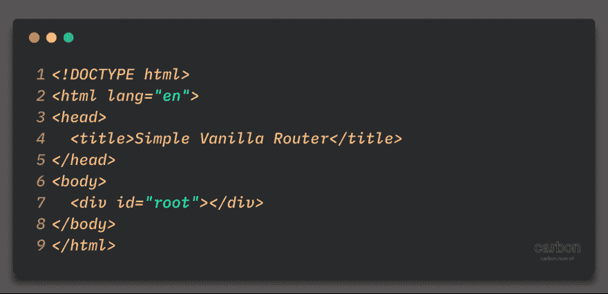
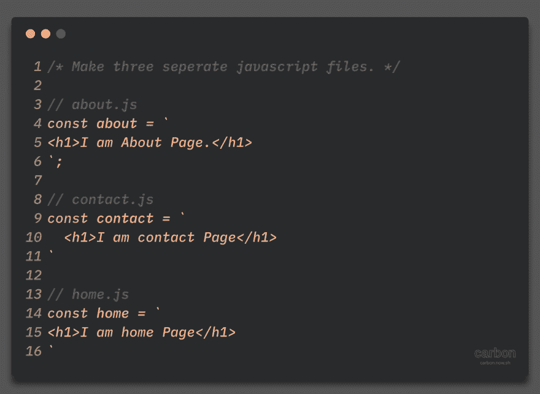
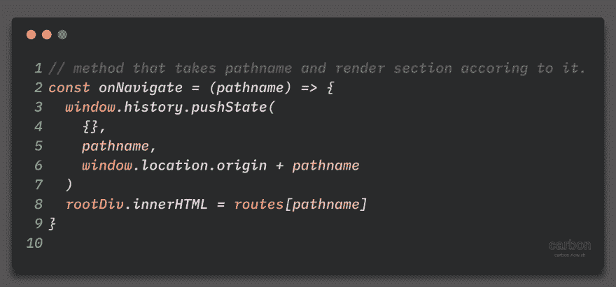

# 使用普通 JavaScript 实现简单的 SPA 路由

> 原文：<https://dev.to/am_pra_veen/implementing-simple-spa-routing-using-vanilla-javascript-25b6>

[](https://res.cloudinary.com/practicaldev/image/fetch/s--dhs9CRvy--/c_limit%2Cf_auto%2Cfl_progressive%2Cq_auto%2Cw_880/https://cdn-images-1.medium.com/max/800/1%2AmHQDsqWBWs3tBrPz2uZWtA.jpeg)

在本文中，我将使用**普通 JavaScript** 实现 **SPA** 路由。
所以，这篇文章背后的主要动机是了解 SPA 路由是如何工作的。在我们开始之前，我们需要了解路由的主要组成部分，即 Web **历史**和**位置** API。

## 历史和位置对象

先说一下 **[window.history](https://developer.mozilla.org/en-US/docs/Web/API/History)** 。历史包含所有的浏览器历史，你可以简单地通过输入*历史*来访问它，然后你会得到整个历史对象和它拥有的各种方法。

[ ](https://res.cloudinary.com/practicaldev/image/fetch/s--R6D4HxRS--/c_limit%2Cf_auto%2Cfl_progressive%2Cq_auto%2Cw_880/https://cdn-images-1.medium.com/max/2346/1%2Ao5aivA_EwWECOOZnq2GYog.png) *窗口的历史对象*

另一个我们将要使用的是 **[窗口。位置](https://developer.mozilla.org/en-US/docs/Web/API/Location)。**它包含当前位置的所有信息，如来源、路径名等。如果你在终端中输入*位置*，那么你将得到整个位置对象。

[ ](https://res.cloudinary.com/practicaldev/image/fetch/s--yJVIrARb--/c_limit%2Cf_auto%2Cfl_progressive%2Cq_auto%2Cw_880/https://cdn-images-1.medium.com/max/2254/1%2AGHosXKQnj5bwM8x3jo8wKQ.png) *窗口的位置对象*

## 我们开始路由吧

所以，首先，我们需要做一个**index.html。**它包含了我们应用程序的所有标记。对于这个权限，我们只需要做一个* *根的*id *的 div 即可。*

[](https://res.cloudinary.com/practicaldev/image/fetch/s--wr0th4Um--/c_limit%2Cf_auto%2Cfl_progressive%2Cq_auto%2Cw_880/https://cdn-images-1.medium.com/max/2840/1%2AgbW54Pe4_GxHFe4hxB0V8w.png)*index.html*

现在，我们完成了制作页面。那就是要在**根**区域进行渲染。

[ ](https://res.cloudinary.com/practicaldev/image/fetch/s--kqJHqKI1--/c_limit%2Cf_auto%2Cfl_progressive%2Cq_auto%2Cw_880/https://cdn-images-1.medium.com/max/2840/1%2AFbzwL2Qa7-_o2CXBgHmTyA.png) *我们三个不同的组件*

现在，我们制作三个不同的页面，让我们将它们导入 index.html 的**head * *部分。现在我们必须使用一个服务器来服务这些页面，所以在这里我将使用**live-server** 。如果你有 live-server，那很好，只需转到文件夹目录并运行 live-server，否则使用 npm i -g live-server 安装它。
现在，是时候制作包含所有路由逻辑的主 JavaScript 文件了。
让我们创建一个名为 app.js.
的文件，然后首先我们必须决定我们的路线和特定于该特定路线的页面，并将它们放在一个对象中。

```
 const routes = {
      '/' : home,
      '/contact': contact,
      '/about': about
    }; 
```

我们的下一步工作是在索引最初加载时呈现页面。首先，我们必须选择**根** div，然后使用 innerHTML 方法根据路径向元素添加内容。

```
 const rootDiv = document.getElementById('root');
    rootDiv.innerHTML = routes[window.location.pathname]; 
```

这里 **window.location.pathname** 将给出当前路径，当页面被加载时，当前路径将转到**/**。但是我们的工作还没有完成。现在，我们还必须为“/关于”和“/联系”页面制作路线。为此，我们将创建一个简单的导航菜单。

[ ](https://res.cloudinary.com/practicaldev/image/fetch/s---Aq7yEyy--/c_limit%2Cf_auto%2Cfl_progressive%2Cq_auto%2Cw_880/https://cdn-images-1.medium.com/max/3328/1%2AHRolE_-GnyX2C7o-ye5ZIQ.png) *简单导航用于浏览各部分。*

现在，我们将创建一个函数来帮助我们在部分中导航。它采用一个路径，然后使用 **history.pushState()** 方法，该方法采用三个参数，即状态、标题和路线，将当前路线推送到历史对象中，这样我们也可以通过浏览器的*后退*和*前进*按钮导航，然后根据当前路径呈现该部分。

[ ](https://res.cloudinary.com/practicaldev/image/fetch/s--CwYw3Oua--/c_limit%2Cf_auto%2Cfl_progressive%2Cq_auto%2Cw_880/https://cdn-images-1.medium.com/max/3160/1%2Anok3v9iCyS75U1G0dgWHow.png) *翁纳威法*

现在，只需在我们导航菜单的标签的* * onClick * *事件上调用这个* * onNavigate * *方法。我们只需要这么做。

```
 <a href="#" onclick="onNavigate('/about'); return false;">About</a>
    // repeat for other routes also. 
```

恭喜你刚刚制作了自己的路由器，当你按下浏览器的前进和后退按钮时，你会看到路由实际上发生了变化，但等待你的页面没有变化。这是因为当浏览器调用它的 **pushState()** 方法时，另一个方法也被调用，即 **window.onpopstate** 这是一个简单的函数，你可以根据自己的需要定制它。因此，无论何时调用 pushState，我们都将呈现我们的部分。为此我们需要应用这个。

```
 window.onpopstate = () => {
      rootDiv.innerHTML = routes[window.location.pathname]
    } 
```

恭喜你终于完成了。

如果你想遵守规则。点击查看[的 GitHub repo。
如果你想和我联系，看看我的](https://github.com/praveen-me/simple-vanila-router)[推特](https://twitter.com/am_pra_veen)和 [Github](https://github.com/praveen-me) 。