# AWS:cloud craft——现有基础设施的地图生成器

> 原文：<https://dev.to/setevoy/aws-cloudcraft-an-existing-infrastructure-s-map-generator-499a>

 我暂时使用了 [CloudCraft](https://cloudcraft.co/) 服务——非常方便。

几天前，我获得了其所有功能的完整订阅(顺便说一句，前两周是免费的)，其中我想尝试创建一个现有 AWS 帐户的地图及其所有资源和关系/通信的能力。

订阅费用为每月 49 美元。

一般来说，使用 CloudCraft 可以绘制类似 next 的地图(来自[AWS:миграцияrtfm 2.3—интрастттрадляrtfmисозданеcloud formationшаблона—VPC，subnets，EC2](https://rtfm.co.ua/aws-infrastruktura-dlya-rtfm-i-sozdanie-cloudformation-shablona-vpc-subnets-ec2/#i) post， *Rus* ):

[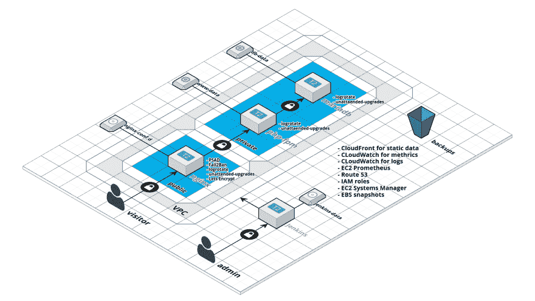](https://rtfm.co.ua/wp-content/uploads/2017/10/rtfm_migration_map_2017_0.5.png)

在本帖中，我们将把 CloudCraft 与现有的 AWS 帐户相集成，并用该帐户中已创建的资源生成一个新地图。

对 AWS 账户的访问将使用 CloudCraft 的[外部 ID](https://docs.aws.amazon.com/IAM/latest/UserGuide/id_roles_create_for-user_externalid.html) 和 AWS [交叉账户 IAM 角色](https://docs.aws.amazon.com/en_us/IAM/latest/UserGuide/tutorial_cross-account-with-roles.html)进行配置。

### CloudCraft 与 AWS 账户整合

转到[https://cloudcraft.co/app](https://cloudcraft.co/app)，选择了*直播*标签:

[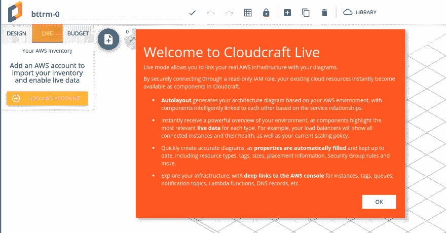](https://rtfm.co.ua/wp-content/uploads/2019/08/Screenshot_20190821_135844.png)

点击*添加 AWS 账户*:

[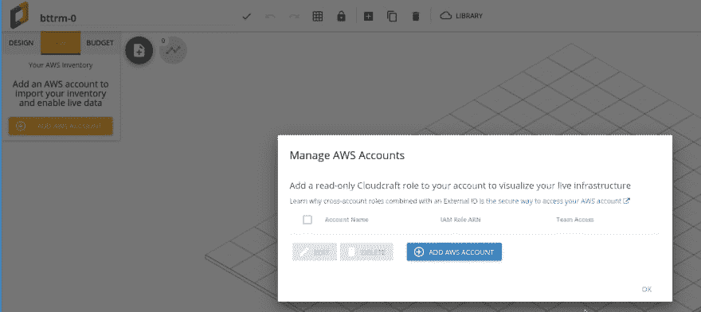](https://rtfm.co.ua/wp-content/uploads/2019/08/Screenshot_20190821_135953.png)

只需按照 CloudCraft 的指示一步一步地操作:

点击“*打开 AWS IAM 控制台，进入创建角色页面*”链接，您将被重定向至 AWS = > IAM，这里将填写所有内容:

点击*权限*——这里是已经检查过的`ReadOnlyAccess`:

跳过标签，保存角色:

[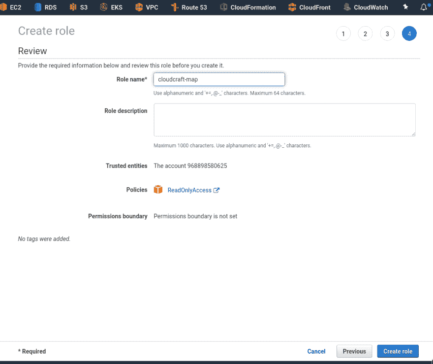](https://rtfm.co.ua/wp-content/uploads/2019/08/Screenshot_20190821_140335.png)

复制它的 ARN:

[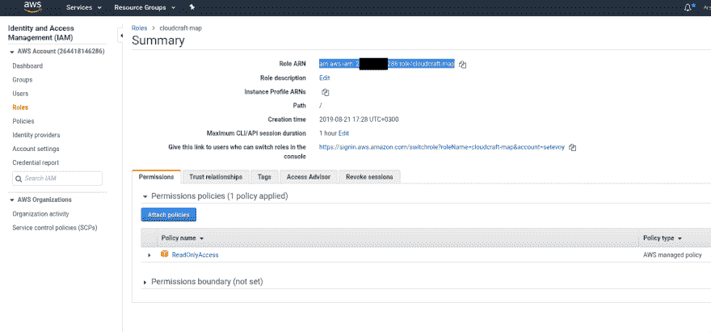](https://rtfm.co.ua/wp-content/uploads/2019/08/Screenshot_20190821_173359.png)

将它放入 CloudCraft:

[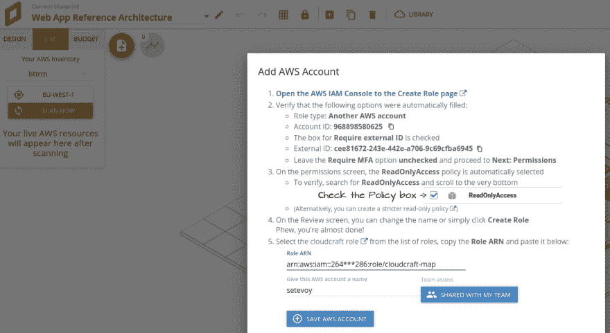](https://rtfm.co.ua/wp-content/uploads/2019/08/Screenshot_20190821_173605.png)

点击*保存 AWS 账户*。

### 生成一张地图

选择所需的区域:

[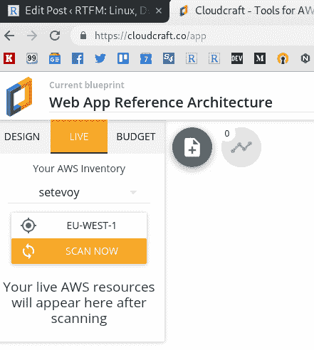](https://rtfm.co.ua/wp-content/uploads/2019/08/Screenshot_20190821_173742.png)

点击*立即扫描*:

[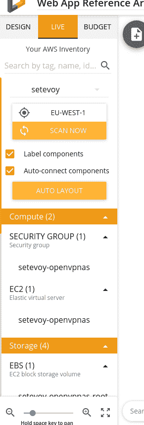](https://rtfm.co.ua/wp-content/uploads/2019/08/Screenshot_20190821_173835.png)

这里有一个我自己的个人账户的例子，RTFM 博客以前在那里(它被迁移到了 DigitalOcean)。

现在这里是 Serer 生活中唯一的 OpenVPN 接入:

当一个客户拥有大量资源时，它看起来会更有趣:

[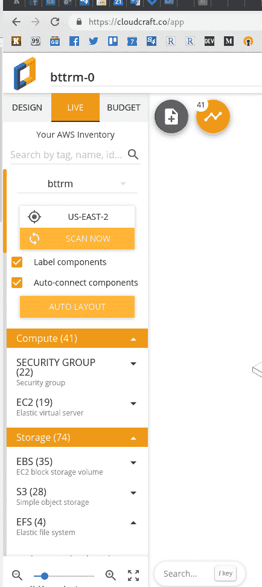](https://rtfm.co.ua/wp-content/uploads/2019/08/Screenshot_20190821_140704.png)

点击*自动布局*，选择要显示的组件:

结果是:

因为显而易见的原因–我不能展示我当前工作的客户资源图，但它看起来令人印象深刻:-)我不知道

通过点击地图上的任何对象，您将获得关于它的详细信息:

[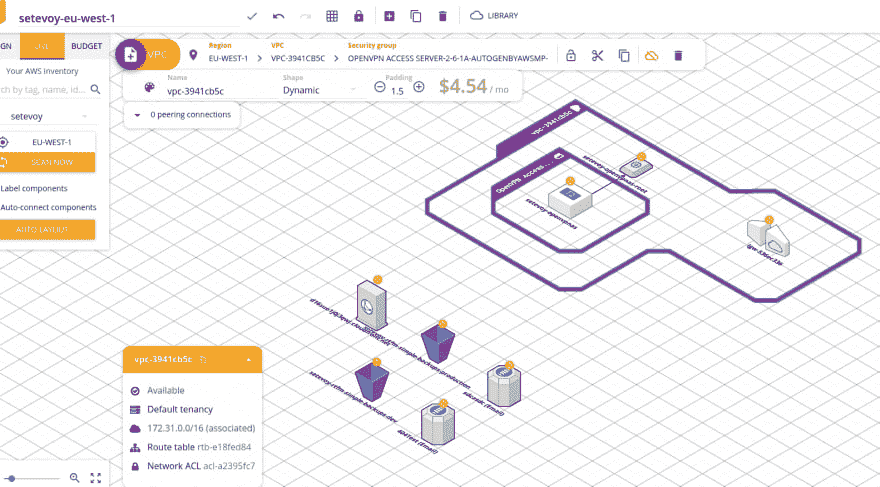](https://rtfm.co.ua/wp-content/uploads/2019/08/Screenshot_20190821_174650.png)

作为“奖励”—*预算*选项卡:

[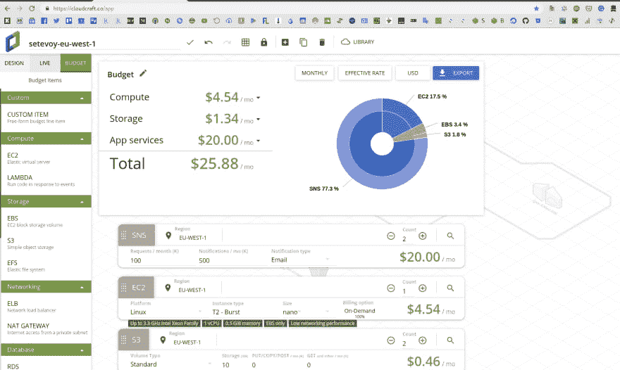](https://rtfm.co.ua/wp-content/uploads/2019/08/Screenshot_20190821_174537.png)

完成了。

### 类似的帖子

*   <small>04/17/2019</small>[Authy:Github 和 AWS 的分步多因素认证配置](https://rtfm.co.ua/en/authy-step-by-step-multi-factor-authentication-configuration-for-github-and-aws/)
*   T002/22/2017 t1t 2 AWS:将 EBS 安装到 ec2t 3
*   <small>02/21/2019</small>[OpenVPN:OpenVPN 接入服务器设置和 AWS VPC 对等配置](https://rtfm.co.ua/en/openvpn-openvpn-access-server-set-up-and-aws-vpc-peering-configuration/)
*   <small>2019 年 8 月 15 日</small> [Kubernetes:第 3 部分–AWS EKS 概述和手动 EKS 集群设置](https://rtfm.co.ua/en/kubernetes-part-3-aws-eks-overview-and-manual-eks-cluster-set-up/)