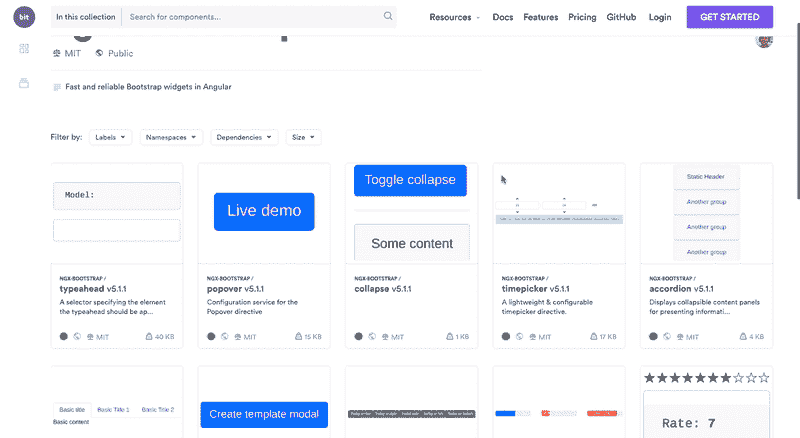
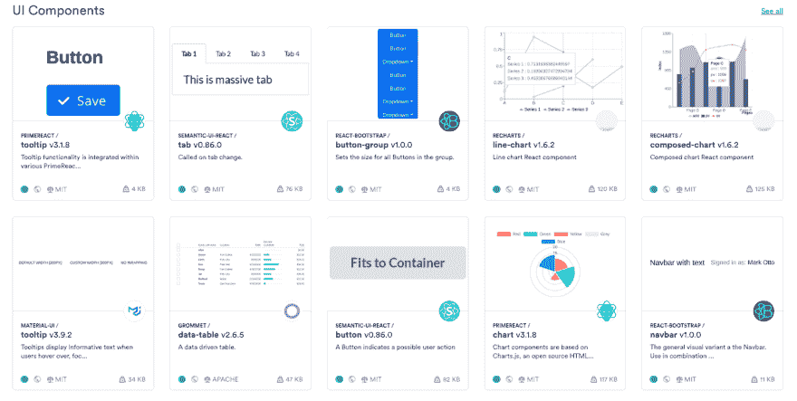
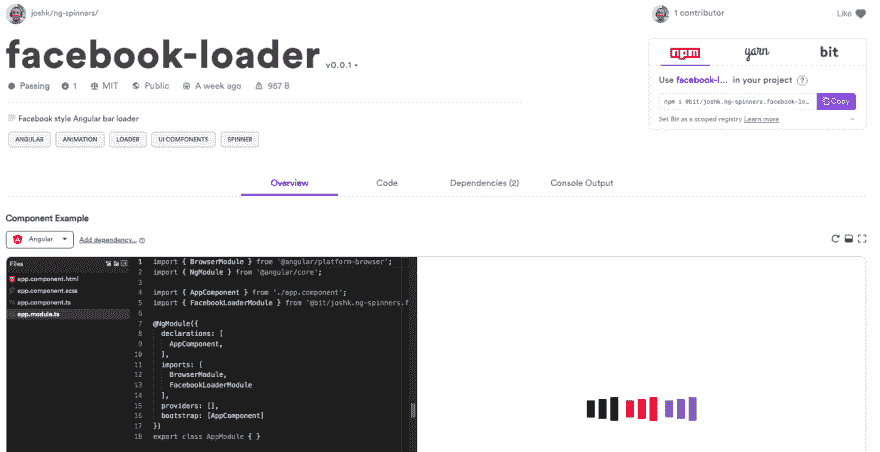
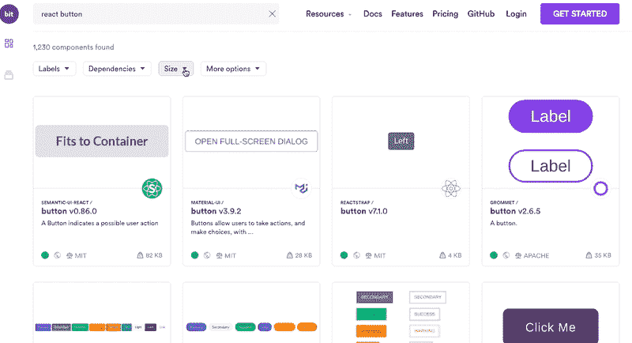
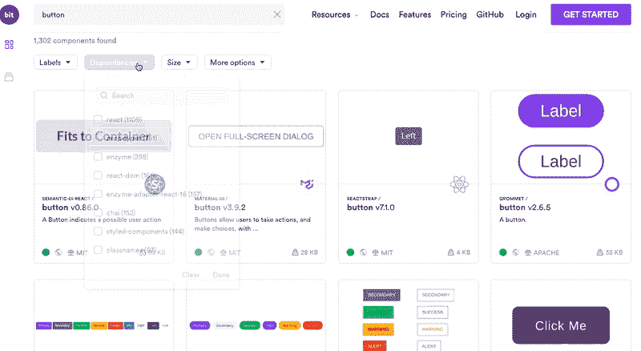

# 让你公司的每个人都能看到你的可重用组件

> 原文：<https://dev.to/giteden/let-everyone-in-your-company-see-your-reusable-components-43ma>

以可视化的方式分享你现有的技术，帮助 R&D、产品、营销和其他所有人共同建设。

最近，我和团队中的一个前端开发人员就我正在计划的一个新产品特性发生了争论。她极力避免做出一些我认为很好的改变。最后，我意识到她只是在推动重用一个现有的组件，而不是编写一个新的。为什么？因为对于我们的用户来说，构建起来会更快，也更一致。她是对的。

当 **R & D** ，**产品**，**营销人员**，**设计师**，**领导层**和其他利益相关者能够访问到你的公司拥有的可重用组件时，构建新功能和产品变得更快，更具协作性。您的用户也将获得更好的一致体验。

此外，具有不同职责的决策者可以更好地理解您的团队构建的技术资产，以便他们可以根据您的技术的真实状态做出明智的决策。

## 让大家了解你有哪些组件

通过[流行的 bit.dev 组件平台](https://bit.dev)，你可以将你所有的实码组件组织在一个 hub 中，每个人都可以用自己的眼睛查看组件，并确切地了解哪些组件可以重用。

[bit.dev platform](https://bit.dev) 于 2018 年首次推出，现已帮助超过 5 万名开发人员和团队通过组件共享和协作来构建他们的应用。 [bit.dev component hub](https://bit.dev/components) 的美妙之处在于，它不是一个组件文档网站，这些组件实际上只是在项目代码的深处。

在这里，您实际上共享了开发人员在他们不同的应用程序中构建和安装的组件。也就是说，您看到的可视化呈现是用于构建应用程序的代码的实际表示。开发人员安装的组件和其他人看到的一样。

 *查看您的组织拥有的所有可重用组件*

当组织中的所有利益相关者，从首席执行官到组织中的每个不同成员，都可以确切地了解您真正拥有哪些技术资产时，每个人都可以就构建什么以及如何构建做出更好的决策。

## 领导力:了解您现有的技术

公司的战略决策团队必须考虑上市时间、投资回报和你拥有的技术资产等因素。当他们没有所有的信息时，他们会冒险做出不明智的决定，这可能会损害公司的成功。

通过让公司领导层看到你拥有的每一个技术构件(bit.dev 不仅仅是前端),你可以最大限度地降低犯错误的风险，并帮助公司朝着正确的方向发展。

您还可以帮助决策者了解您的 R&D 团队所关注的问题和局限性，这样他们就可以更好地了解哪些新产品或新功能会花费更多时间或使开发变得复杂。这有助于减少组织中每个人的困惑或沟通不畅。

## 营销:了解你可以快速构建哪些页面

[**使用可重用组件更快地构建营销网站和页面**
*营销和研发如何使用 bit.dev.*blog.bitsrc.io](https://blog.bitsrc.io/let-marketing-and-developers-collaborate-over-components-b0e5e8c111ee) 在 UI 组件上协作以加快上市时间

营销团队和经理经常需要构建多个登录页面、网站甚至整个应用程序，而且要快。当他们可以看到你的 R&D 团队拥有的所有可重用组件时，他们可以使用它们来设计新的东西，这些东西可以用你的团队已经拥有的现有组件来构建。

这意味着你的产品会让更多的人更快地接触到它，而 R&D 团队会享受到更多的确定性和更简单的开发。此外，当你重用 UI 组件时，你为你的用户创造了更加一致的体验，这有助于全面提高转化率。

通过 bit.dev，你甚至可以根据组件添加到你的应用程序中的权重来过滤组件，以确保你的用户能够以惊人的速度加载它。这意味着更好的搜索引擎优化，更好的页面转换和更多的人与你接触。

## 产品:了解你真正的积木

产品经理必须整合其他人的需求、需要和限制。因此，让他们能够准确地了解哪些组件由团队支配，以及它们看起来如何或如何工作，这将反过来帮助他们为您的产品定义准确而有效的版本。

通过 bit.dev 产品、设计、R&D、营销和其他每个人都可以看到相同的东西，并分享相同的知识。定义新功能在某种程度上变成了规划现有部件的乐高式组合以及创建新的缺失部件。更少的错误，更少的误解，更多的共同语言，更好的协作。

## 设计师:可视化真实代码，监控变化

 *探索每个组件，看看它如何为你的用户工作*

今天，你的组件从 Sketch/other 工具中的设计到 Zeplin，再到共享 UI 组件库中的代码。在这个过程中，事物不断变化、突破和发展。

随着时间的推移，您不断更新库中的组件，以适应不同的用例以及不同应用程序的特定需求。组件不再是你描绘的图像，它们现在是活生生的代码片段。

当您将它们共享到 bit.dev 时，您可以直观地看到并跟踪这些代码组件的真实外观和真实行为。当发生更改时，您可以跟踪并确保这些更改符合您的指导原则。

此外，您可以在一个实时的可编辑游戏中使用不同组件的示例，不仅可以了解它们在静态下的样子，还可以了解它们对用户的真实行为。这意味着您可以[让用户在各种应用中保持一致的 UX/用户界面体验](https://blog.bitsrc.io/building-a-consistent-ui-design-system-4481fb37470f)，提高他们与您的产品的成功互动，以及他们安全浏览您构建的体验的能力。

使用 bit.dev，您可以获得一个 X 射线视图，了解开发人员如何实现您设计的组件，并监视随着时间的推移真实的 UX/UI 变化。

## 开发人员:跨项目共享和协作组件

Bit 是一个流行的开源工具，用于在不同的团队和项目之间共享和管理组件。

使用类似 Git 的命令，它可以让您自动隔离项目中的组件(应用程序或库)，以及它们所有的文件、依赖项和设置。然后，您可以将单个组件版本化并发布到共享集合中。

从该集合中，您可以轻松地发现组件并了解它们的所有信息:查看可视化快照、在线体验示例、查看确切的包大小和依赖关系、查看自动提取的 API 文档并独立运行测试。

 *通过捆绑包大小和依赖关系搜索组件*

然后，您可以使用 npm/yarn 单独安装每个组件，以便在另一个项目中重用它。当您需要对组件进行更改时，您只需使用 bit 将代码引入到消费项目中，进行更改，并在集合中添加版本(给定权限)。不再等待冗长的 PRs，进入共享组件的协作工作流程。

通过让每个人都可以看到你的组件，你可以帮助其他人(产品、设计)计划和设计使用你写的代码并适合你的经验的特性。少一点错误，少一点大家的误解。

请随意在 GitHub 上[访问该项目，在 bit.dev](https://github.com/teambit/bit) 中创建一个[免费帐户，](https://bit.dev)[在开放社区中探索组件](https://bit.dev/components)或[阅读文档](https://docs.bit.dev)了解更多信息。

## 结论

设计组件和构建库是很棒的。但是，当您用视觉体验整合实际的代码组件时——反映编写和更新的实际代码——您可以帮助每个人在您的组件上协作，用您已经拥有的代码更快地构建新的东西。

更重要的是，您的用户将获得统一和一致的体验，这将转化为更好的整体数字。这也是一种可靠的方法，可以确保你的设计系统能够随时跟踪变化。此外，决策者可以在构建您的下一个产品或选择您公司的正确战略路径时做出明智的选择。

你可以自由地[自己带着 bit and bit.dev 去兜风](https://bit.dev)，如果你有任何问题，不要犹豫[联系](//mailto:team@bit.dev)。感谢阅读和快乐分享🍺

